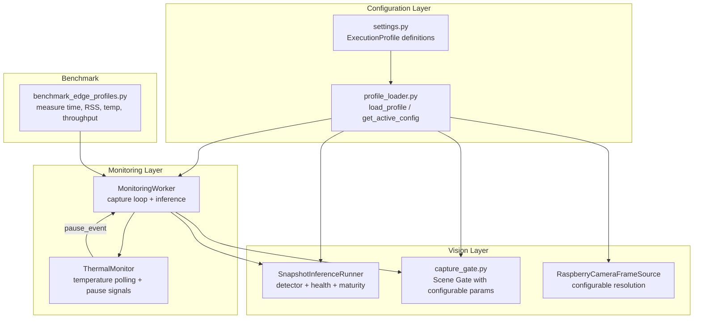

# Design — Edge Pipeline Optimization

## Overview

This design specifies the architecture for optimizing the Tomato Monitor live monitoring pipeline on Raspberry Pi 5. The system currently runs Detectron2 + ResNet-18 + maturity estimation per snapshot captured by a Scene Gate. The primary bottleneck is sustained CPU load causing thermal throttling during extended monitoring sessions.

The optimization strategy is:
1. **Profile-based configuration** — "edge" and "full" presets controlling resolution, inference stages, Scene Gate frequency, and thermal thresholds
2. **Configurable inference reduction** — skip maturity estimation, raise detection threshold, resize input before detector
3. **Thermal management** — monitor CPU temperature and auto-pause/resume the capture loop
4. **Memory discipline** — single model load per session, frame buffer release after inference

All optimizations are configurable (never hardcoded), evidence-based (benchmarked before/after), and reversible (original defaults preserved).

**Key design decisions:**
- No changes to the domain layer — all optimization lives in infrastructure/config and infrastructure/monitoring
- No Detectron2 replacement — only input reduction and stage skipping
- ThermalMonitor communicates with MonitoringWorker via existing `pause_event` / threading signals
- Profile loader is a pure function that returns a frozen dataclass — no side effects

## Architecture



The profile is loaded once at monitoring session start. Each component receives the relevant subset of parameters from the resolved profile configuration.

## Components and Interfaces

### 1. ExecutionProfile (dataclass in `src/infrastructure/config/settings.py`)

A frozen dataclass representing all tunable parameters for a profile:

```python
@dataclass(frozen=True)
class ExecutionProfile:
    name: str  # "edge" or "full"

    # Camera resolution
    camera_width: int
    camera_height: int
    camera_fps: int

    # Inference input size (independent of capture resolution)
    inference_input_width: int
    inference_input_height: int

    # Inference options
    skip_maturity: bool
    detection_score_threshold: float
    run_maturity_only_for_healthy: bool

    # Scene Gate parameters
    scene_gate_cooldown_frames: int
    scene_gate_timeout_frames: int
    scene_gate_orb_threshold: int
    scene_gate_hsv_threshold: float

    # Thermal management
    thermal_poll_interval_seconds: float
    thermal_warning_temp: float
    thermal_critical_temp: float
    thermal_resume_temp: float

    # Memory budget
    memory_warning_rss_mb: int
```

Two profile instances are defined as module-level constants: `EDGE_PROFILE` and `FULL_PROFILE`.

### 2. Profile Loader (`src/infrastructure/config/profile_loader.py`)

```python
def load_profile(profile_name: str, **overrides) -> ExecutionProfile:
    """Load a named profile, optionally overriding individual parameters.

    Args:
        profile_name: "edge" or "full"
        **overrides: keyword args matching ExecutionProfile fields

    Returns:
        ExecutionProfile instance with overrides applied.

    Raises:
        ValueError: if profile_name is not recognized.
    """
```

```python
def get_config_summary(profile: ExecutionProfile) -> dict[str, Any]:
    """Return a JSON-serializable dict of the active configuration for traceability."""
```

### 3. SnapshotInferenceRunner modifications

The constructor gains optional parameters sourced from the profile:

```python
class SnapshotInferenceRunner:
    def __init__(
        self,
        detector: Any,
        health_model: Any,
        health_transform: Any,
        *,
        skip_maturity: bool = False,
        detection_score_threshold: float = 0.80,
        inference_input_size: tuple[int, int] | None = None,
        run_maturity_only_for_healthy: bool = True,
    ) -> None:
```

Changes:
- `skip_maturity=True` → maturity estimation is entirely skipped; `maturity_stage` and `maturity_percent` are `None` in results
- `inference_input_size` → if set and differs from actual image, resize before detection with `cv2.resize(frame, inference_input_size, interpolation=cv2.INTER_LINEAR)`
- `detection_score_threshold` → used instead of the module-level constant from `thresholds.py`
- The original captured frame is **never modified** — resize creates a copy for inference only

### 4. MonitoringWorker modifications

The worker gains:
- Configurable Scene Gate parameters passed to `should_capture_new_image()`
- Integration with ThermalMonitor via the existing `pause_event`
- RSS memory check after inference (log warning if > budget)
- Frame buffer release (explicit `del frame` + reference nulling after `_process_snapshot`)

The `should_capture_new_image()` function signature is extended to accept optional threshold overrides:

```python
def should_capture_new_image(
    reference_bgr,
    current_bgr,
    frames_since_last_capture: int,
    *,
    cooldown_frames: int = MIN_FRAMES_BETWEEN_CAPTURES,
    timeout_frames: int = MAX_FRAMES_WITHOUT_CAPTURE,
    orb_threshold: int = ORB_MIN_MATCH_COUNT,
    hsv_threshold: float = HSV_HIST_DIFF_THRESHOLD,
) -> Tuple[bool, Dict[str, float]]:
```

This preserves backward compatibility — existing callers without keyword args get current defaults.

### 5. ThermalMonitor (`src/infrastructure/monitoring/thermal_monitor.py`)

```python
class ThermalMonitor:
    """Monitors CPU temperature and triggers pause/resume on MonitoringWorker.

    Reads temperature from `vcgencmd measure_temp` (Raspberry Pi specific).
    Falls back gracefully on non-RPi platforms (logs warning, does nothing).
    """

    def __init__(
        self,
        pause_event: threading.Event,
        *,
        poll_interval_seconds: float = 5.0,
        warning_temp: float = 75.0,
        critical_temp: float = 80.0,
        resume_temp: float = 70.0,
    ) -> None:
        ...

    def start(self) -> None:
        """Start the monitoring thread (daemon)."""

    def stop(self) -> None:
        """Stop the monitoring thread."""

    @property
    def peak_temperature(self) -> float: ...

    @property
    def pause_count(self) -> int: ...

    @property
    def total_pause_duration_seconds(self) -> float: ...

    def get_session_metadata(self) -> dict[str, Any]:
        """Return thermal session stats for inclusion in monitoring metadata."""
```

**Behavior:**
- Runs in a daemon thread with `poll_interval_seconds` sleep between reads
- Reads temperature via `subprocess.run(["vcgencmd", "measure_temp"])`, parses float from `temp=XX.X'C`
- If `vcgencmd` is not available (non-RPi): logs info once, thread exits cleanly — no-op mode
- When temp ≥ `critical_temp`: sets `pause_event` (MonitoringWorker spin-waits)
- When temp drops below `resume_temp` and `pause_event` is set: clears `pause_event`
- When temp ≥ `warning_temp` but < `critical_temp`: logs warning, continues
- Tracks `peak_temperature`, `pause_count`, `total_pause_duration_seconds`
- At monitoring start, if `vcgencmd` exists, checks current temp; logs warning if > `warning_temp` (proxy for "no active cooling detected")

### 6. Benchmark Script (`scripts/benchmarks/benchmark_edge_profiles.py`)

A standalone script that:
1. Loads a set of test images from `data/images/`
2. Runs inference with "edge" profile and "full" profile
3. Measures per-snapshot: inference time (wall clock), RSS via `resource.getrusage` or `psutil.Process().memory_info().rss`
4. Measures temperature at start, after each snapshot, and at end
5. Computes throughput: snapshots/minute
6. Records device info: `platform.machine()`, OS, git commit hash, datetime
7. Outputs a markdown report following `docs/benchmarks/benchmark-template.md` format
8. Writes results to `docs/benchmarks/edge-profile-comparison.md`

Usage:
```bash
python scripts/benchmarks/benchmark_edge_profiles.py --images data/images/ --output docs/benchmarks/edge-profile-comparison.md
```

### 7. Configuration Summary Function

Exposed via `profile_loader.py`:

```python
def get_config_summary(profile: ExecutionProfile) -> dict[str, Any]:
    """Return all active settings as a serializable dict.

    Includes: profile name, resolution, scene gate params,
    thermal thresholds, inference options.
    Used for monitoring session metadata and benchmark reports.
    """
```

This is called at monitoring start and included in session metadata for traceability (Requirement 8.5).

## Data Models

### ExecutionProfile Parameters (Edge vs Full)

| Parameter | Edge Default | Full Default |
|---|---|---|
| `camera_width` | 480 | 640 |
| `camera_height` | 360 | 480 |
| `camera_fps` | 5 | 5 |
| `inference_input_width` | 416 | 640 |
| `inference_input_height` | 312 | 480 |
| `skip_maturity` | True | False |
| `detection_score_threshold` | 0.85 | 0.80 |
| `run_maturity_only_for_healthy` | True | True |
| `scene_gate_cooldown_frames` | 30 | 18 |
| `scene_gate_timeout_frames` | 75 | 45 |
| `scene_gate_orb_threshold` | 35 | 35 |
| `scene_gate_hsv_threshold` | 0.38 | 0.38 |
| `thermal_poll_interval_seconds` | 5.0 | 10.0 |
| `thermal_warning_temp` | 72.0 | 78.0 |
| `thermal_critical_temp` | 78.0 | 85.0 |
| `thermal_resume_temp` | 65.0 | 72.0 |
| `memory_warning_rss_mb` | 3000 | 4000 |

### ThermalMonitor Session Metadata

```python
{
    "peak_temperature_c": float,
    "pause_count": int,
    "total_pause_duration_s": float,
    "cooling_warning_at_start": bool,
}
```

### Benchmark Result Schema

Each benchmark run produces:
```python
{
    "profile": str,
    "device": str,
    "os": str,
    "git_commit": str,
    "date": str,
    "num_images": int,
    "per_snapshot_time_ms": list[float],
    "mean_inference_time_ms": float,
    "median_inference_time_ms": float,
    "peak_rss_mb": float,
    "peak_temperature_c": float,
    "throughput_snapshots_per_min": float,
    "config_summary": dict,
}
```

