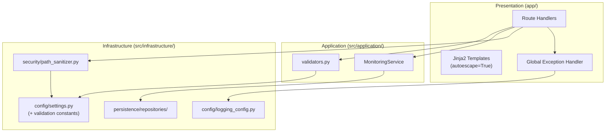

# Design — Code Quality and Security Hardening

## Overview

This spec adds a systematic input validation layer, path traversal protection, structured logging, robust error handling, Jinja2 security verification, configuration centralization, and test coverage for the Tomato Monitor codebase. All changes are additive, non-breaking, and compatible with Raspberry Pi 5 (CPU-only, Python 3.10+).

The design introduces:
- A pure-function validation module (`src/application/validators.py`)
- A path sanitizer utility (`src/infrastructure/security/path_sanitizer.py`)
- Validation constants in the existing config module
- Structured logging configuration applied at app startup
- A global exception handler for unhandled errors
- Test suites for repositories, monitoring service, and import validation

No new external dependencies are required.

## Architecture



**Layer placement rationale:**
- `validators.py` in `src/application/` — it validates application-level DTOs/form inputs before they reach the domain. It depends only on config constants.
- `path_sanitizer.py` in `src/infrastructure/security/` — it performs filesystem path resolution, which is an infrastructure concern.
- `logging_config.py` in `src/infrastructure/config/` — logging configuration is infrastructure-level.

## Components and Interfaces

### 1. Input Validation Module

**File:** `src/application/validators.py`

```python
from typing import Optional

class ValidationError(Exception):
    """Raised when input validation fails."""
    def __init__(self, field: str, message: str) -> None:
        self.field = field
        self.message = message
        super().__init__(f"{field}: {message}")


def validate_greenhouse_name(name: str) -> str:
    """Validate and sanitize a greenhouse name.

    Args:
        name: Raw form input string.

    Returns:
        Trimmed name string.

    Raises:
        ValidationError: If name is empty/whitespace-only or exceeds MAX_GREENHOUSE_NAME_LENGTH.
    """
    ...


def validate_module_name(name: str) -> str:
    """Validate and sanitize a module name. Same rules as greenhouse name."""
    ...


def validate_dimensions(width: str, length: str) -> tuple[float, float]:
    """Parse and validate module dimensions from form strings.

    Args:
        width: Raw form string for width in meters.
        length: Raw form string for length in meters.

    Returns:
        Tuple of (width_float, length_float), both > 0 and <= MAX_DIMENSION_METERS.

    Raises:
        ValidationError: If values are not parseable as finite positive numbers
            or exceed MAX_DIMENSION_METERS.
    """
    ...


def validate_notes(notes: str) -> Optional[str]:
    """Sanitize monitoring notes.

    Args:
        notes: Raw form input string.

    Returns:
        Trimmed string truncated to MAX_NOTES_LENGTH, or None if empty after trim.
    """
    ...


def parse_finite_float(value: str, field_name: str) -> float:
    """Parse a string as a finite float, rejecting NaN and Infinity.

    Args:
        value: Raw string to parse.
        field_name: Name for error messages.

    Returns:
        Parsed finite float.

    Raises:
        ValidationError: If value is not a finite number.
    """
    ...
```

**Design decisions:**
- All validators are pure functions (no side effects, no I/O) for easy testing.
- Each returns the sanitized value or raises `ValidationError` with field name and Spanish-language message.
- Route handlers call validators before invoking services, replacing ad-hoc inline checks.

### 2. Path Sanitizer

**File:** `src/infrastructure/security/path_sanitizer.py`

```python
from pathlib import Path

class PathTraversalError(Exception):
    """Raised when a path escapes the allowed base directory."""
    def __init__(self, reason: str) -> None:
        self.reason = reason
        super().__init__(f"Path traversal rejected: {reason}")


def validate_safe_path(path: str, allowed_base: Path) -> Path:
    """Validate that a path resolves within the allowed base directory.

    Algorithm:
    1. Reject if path contains null bytes.
    2. Construct candidate = allowed_base / path.
    3. Resolve candidate to absolute (follows symlinks).
    4. Verify resolved path starts with resolved allowed_base.
    5. Return resolved path if valid.

    Args:
        path: Relative path string (from user input or database).
        allowed_base: The directory that must contain the resolved path.

    Returns:
        Resolved absolute Path guaranteed to be within allowed_base.

    Raises:
        PathTraversalError: If the path escapes, contains null bytes,
            or uses absolute path prefixes.
    """
    ...
```

**Design decisions:**
- Pure function — no filesystem side effects (only resolution via `Path.resolve()`).
- Rejects null bytes as the first check (defense in depth).
- Used by snapshot-serving routes and any future file-serving endpoints.
- `allowed_base` is always passed from config (`OUTPUTS_DIR`), not hardcoded.

### 3. Global Exception Handler

**Location:** `app/main.py` (added as FastAPI exception handler)

```python
from fastapi import Request
from fastapi.responses import HTMLResponse
import logging
import traceback

logger = logging.getLogger(__name__)

@app.exception_handler(Exception)
async def global_exception_handler(request: Request, exc: Exception) -> HTMLResponse:
    """Catch unhandled exceptions, log with traceback, return generic error page."""
    logger.error(
        "Unhandled exception on %s %s: %s",
        request.method,
        request.url.path,
        str(exc),
        exc_info=True,
    )
    return templates.TemplateResponse(
        request, "error.html",
        {"message": "Ocurrió un error inesperado. Intenta de nuevo."},
        status_code=500,
    )
```

**Design decisions:**
- Logs full traceback at ERROR level for debugging on RPi.
- Returns a generic Spanish-language message — never exposes internal details.
- Does not interfere with specific exception handling in route handlers (FastAPI tries specific handlers first).
- Requires a simple `app/templates/error.html` template.

### 4. Structured Logging Configuration

**File:** `src/infrastructure/config/logging_config.py`

```python
import logging


LOG_FORMAT = "%(asctime)s [%(levelname)s] %(name)s: %(message)s"
LOG_DATE_FORMAT = "%Y-%m-%d %H:%M:%S"


def configure_logging(level: int = logging.INFO) -> None:
    """Configure Python logging with structured format.

    Applied once during app lifespan startup.
    Sets the root logger format and level.
    """
    logging.basicConfig(
        level=level,
        format=LOG_FORMAT,
        datefmt=LOG_DATE_FORMAT,
        force=True,
    )
    # Suppress noisy third-party loggers
    logging.getLogger("uvicorn.access").setLevel(logging.WARNING)
```

**Integration point:** Called in `lifespan()` in `app/main.py` before database initialization.

**Logger naming convention:** Each module uses `logger = logging.getLogger(__name__)`, producing hierarchical names like `src.application.services.monitoring_service`.

### 5. Configuration Constants

**Added to:** `src/infrastructure/config/settings.py`

```python
# --- Validation Limits ---
MAX_GREENHOUSE_NAME_LENGTH = 100
MAX_MODULE_NAME_LENGTH = 100
MAX_NOTES_LENGTH = 500
MAX_DIMENSION_METERS = 1000.0
MIN_DIMENSION_METERS = 0.0  # exclusive (must be > 0)
```

**Design decisions:**
- Constants live alongside existing config in `settings.py` for discoverability.
- Named with `MAX_` / `MIN_` prefix convention matching existing code style.
- Used by `validators.py` via import (application layer may import from infrastructure config).

### 6. Jinja2 Security

**Verification:**
- FastAPI's `Jinja2Templates` enables autoescape by default for `.html` files.
- Audit all existing templates for `|safe` filter usage.
- Any `|safe` found on user-provided variables (greenhouse name, module name, notes) must be removed.

**No code change required** unless `|safe` misuse is found during implementation.

### 7. Route Handler Refactoring Pattern

Each form submission route will follow this consistent pattern:

```python
@router.post("/invernaderos/crear", response_class=HTMLResponse)
def greenhouse_create(request: Request, name: str = Form(...), location: str = Form("")):
    # 1. Validate input (raises ValidationError on failure)
    try:
        validated_name = validate_greenhouse_name(name)
        validated_location = location.strip() or None
    except ValidationError as e:
        return templates.TemplateResponse(request, "...", {"errors": [e.message], ...})

    # 2. Call service/repository
    repo = get_greenhouse_repository(request)
    try:
        greenhouse = repo.create(Greenhouse(name=validated_name, location=validated_location))
    except IntegrityError:
        return templates.TemplateResponse(request, "...", {"errors": ["Nombre duplicado."], ...})

    # 3. Return success response
    return RedirectResponse(url=f"/invernaderos/{greenhouse.id}", status_code=303)
```

## Data Models

No new database tables or schema changes. This spec operates on the existing data model.

**Affected data flow:**
- Form inputs → Validator → Repository (cleaner, validated data)
- Database `image_path` → Path Sanitizer → File serving (safe paths only)

## Correctness Properties

*A property is a characteristic or behavior that should hold true across all valid executions of a system — essentially, a formal statement about what the system should do. Properties serve as the bridge between human-readable specifications and machine-verifiable correctness guarantees.*

### Property 1: Greenhouse name validation correctness

*For any* string `s`, `validate_greenhouse_name(s)` SHALL return a trimmed non-empty string of length ≤ 100 if and only if `s.strip()` is non-empty and `len(s.strip()) <= 100`. Otherwise it SHALL raise `ValidationError`.

**Validates: Requirements 1.1, 1.4**

### Property 2: Dimension validation correctness

*For any* pair of strings `(w, l)`, `validate_dimensions(w, l)` SHALL return `(float(w), float(l))` if and only if both parse as finite positive numbers ≤ 1000. Otherwise it SHALL raise `ValidationError`. This includes rejection of NaN, Infinity, negative values, zero, non-numeric strings, and values exceeding 1000.

**Validates: Requirements 1.2, 1.5**

### Property 3: Notes sanitization invariants

*For any* string `s`, `validate_notes(s)` SHALL return either `None` (if `s.strip()` is empty) or a string `r` such that: `r == s.strip()[:500]`, `len(r) <= 500`, and `r` has no leading or trailing whitespace.

**Validates: Requirements 1.3, 1.4**

### Property 4: Path sanitizer containment

*For any* string `p` and valid base directory `base`, `validate_safe_path(p, base)` SHALL return a resolved `Path` that starts with `base.resolve()` if and only if `(base / p).resolve()` is within `base.resolve()` and `p` contains no null bytes. Otherwise it SHALL raise `PathTraversalError`.

**Validates: Requirements 3.1, 3.2, 3.4**

### Property 5: Jinja2 autoescaping neutralizes HTML in user strings

*For any* string containing HTML special characters (`<`, `>`, `&`, `"`, `'`), when rendered through a Jinja2 template variable (not marked `|safe`), the output SHALL contain the escaped entity equivalents (`&lt;`, `&gt;`, `&amp;`, `&quot;`, `&#x27;`) and SHALL NOT contain the unescaped original characters in a context where they would be interpreted as HTML.

**Validates: Requirements 7.1, 7.2**

## Error Handling

### Error Translation Strategy

| Exception | HTTP Status | User Message |
|---|---|---|
| `ValidationError` | 400 (form re-render with errors) | Field-specific Spanish message |
| `PathTraversalError` | 403 (or redirect with error) | "Ruta de archivo no válida." |
| `ParentNotFoundError` | 404 | "Recurso no encontrado." |
| `MonitoringNotFoundError` | 404 | "Monitoreo no encontrado." |
| `InvalidTransitionError` | 409 | State + allowed transitions |
| `ActiveSessionError` | 409 | "Este módulo ya tiene un monitoreo activo." |
| `IntegrityError` (SQLAlchemy) | 400 (form re-render) | "Ya existe un registro con ese nombre." |
| Camera unavailable | 503 (form re-render) | "La cámara no está disponible. Verifica la conexión." |
| Model load failure | 503 (form re-render) | "No se pudieron cargar los modelos de inferencia." |
| Filesystem error | 500 (form re-render) | "Error de almacenamiento. Verifica el espacio disponible." |
| Unhandled `Exception` | 500 | "Ocurrió un error inesperado. Intenta de nuevo." |

### Logging on Errors

- All errors logged with contextual IDs (monitoring_id, module_id, greenhouse_id).
- Full traceback logged at ERROR level for unhandled exceptions.
- ValidationError logged at WARNING level (expected user input errors).
- PathTraversalError logged at WARNING level with the attempted path (redacted to relative).

### Session Safety

The existing `DBSessionMiddleware` already handles commit/rollback/close. The design validates this is sufficient and adds logging within the middleware's exception path.

## Testing Strategy

### Test Structure

```
tests/
├── __init__.py
├── application/
│   ├── __init__.py
│   ├── test_validators.py              # Property tests for validators
│   └── test_monitoring_service.py      # State machine unit tests
├── infrastructure/
│   ├── __init__.py
│   ├── persistence/
│   │   ├── __init__.py
│   │   └── test_repository_crud.py     # Repository CRUD tests
│   └── security/
│       ├── __init__.py
│       └── test_path_sanitizer.py      # Property tests for path sanitizer
├── test_imports.py                      # Import validation test
└── conftest.py                          # Shared fixtures (in-memory DB, etc.)
```

### Dual Testing Approach

**Property-based tests** (using `hypothesis` library):
- `test_validators.py`: Properties 1, 2, 3 — generate random strings/numbers, verify validator invariants.
- `test_path_sanitizer.py`: Property 4 — generate random paths with traversal attempts, verify containment invariant.
- Minimum 100 iterations per property test.
- Each test tagged with: `# Feature: 005-code-quality-and-security-hardening, Property N: <description>`

**Example-based unit tests:**
- `test_repository_crud.py`: CRUD operations for all repositories using in-memory SQLite.
- `test_monitoring_service.py`: State machine transitions (happy path, pause/resume, abort, invalid transitions, active session conflict).
- `test_imports.py`: Verify all modules under `app/` and `src/` import without errors and without hardware.

### Test Configuration

- **Database:** In-memory SQLite (`sqlite:///:memory:`) for isolation and speed.
- **No hardware required:** Tests mock camera, GPU, and model dependencies.
- **Property test library:** `hypothesis` (standard Python PBT library, no C extensions, ARM64 compatible).
- **Runner:** `pytest` with `pytest-hypothesis` integration.

### Property Test Tag Format

```python
@given(name=st.text(min_size=0, max_size=200))
def test_greenhouse_name_validation_property(name: str):
    """Feature: 005-code-quality-and-security-hardening, Property 1: Greenhouse name validation correctness"""
    ...
```
