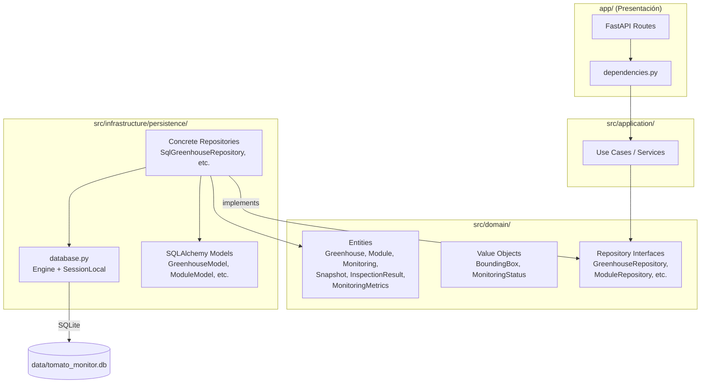
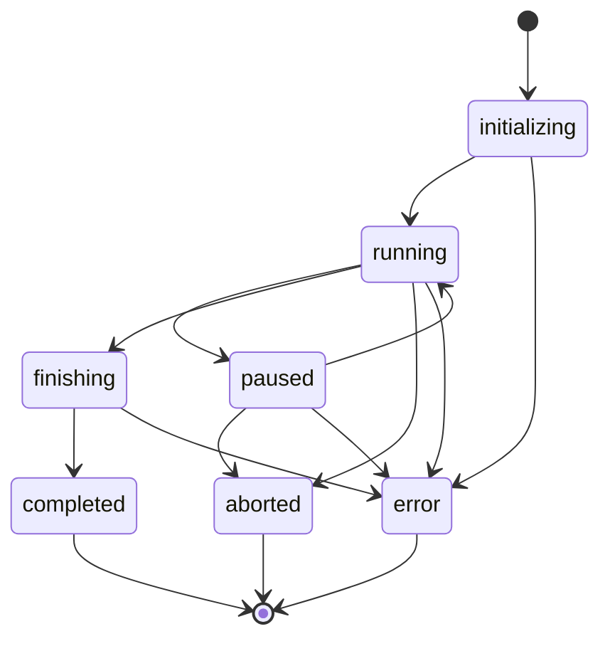

# Design Document — Agricultural Data Model

## Overview

Este diseño define la capa de persistencia SQLite con SQLAlchemy ORM para el sistema Tomato Monitor, implementando la jerarquía agrícola completa (Greenhouse → Module → Monitoring → Snapshot → InspectionResult → MonitoringMetrics). La arquitectura sigue Clean Architecture: las entidades y repositorios abstractos residen en la capa de dominio (`src/domain/`) sin dependencias externas, mientras que los modelos SQLAlchemy y las implementaciones concretas viven en la capa de infraestructura (`src/infrastructure/persistence/`).

### Design Decisions

1. **Dataclasses para entidades de dominio**: Se usan `@dataclass` del módulo estándar para mantener las entidades libres de SQLAlchemy. Los modelos ORM se definen por separado y se convierten a/desde entidades de dominio en los repositorios.
2. **Máquina de estados en dominio**: `MonitoringStatus` se implementa como value object con lógica de transiciones validadas, manteniendo la regla de negocio fuera de infraestructura.
3. **Session factory centralizada**: Un único módulo `database.py` gestiona engine, session factory y PRAGMAs de SQLite. Se inyecta en los repositorios.
4. **Conversión entity ↔ model**: Cada repositorio concreto convierte entre dataclass de dominio y modelo SQLAlchemy internamente, preservando la independencia de capas.
5. **Coexistencia con persistencia CSV**: La nueva capa SQLAlchemy coexiste con `persistence/local/` (CSV). La inyección en `app/dependencies.py` se actualizará para usar los nuevos repositorios.

## Architecture



### Layer Dependencies

```
Presentación  →  Aplicación  →  Dominio  ←  Infraestructura
     ↓                                           ↓
dependencies.py                              database.py
(wires repos)                               (SQLAlchemy engine)
```

- **Dominio** no importa nada externo (solo stdlib + dataclasses + enum + typing).
- **Infraestructura** importa SQLAlchemy y las interfaces/entidades de Dominio.
- **Aplicación** importa solo interfaces de Dominio (recibe repositorios por inyección).
- **Presentación** inyecta las implementaciones concretas.

## Components and Interfaces

### Directory Structure

```
src/
├── domain/
│   ├── entities/
│   │   ├── __init__.py
│   │   ├── greenhouse.py          # Greenhouse dataclass
│   │   ├── module.py              # Module dataclass
│   │   ├── monitoring.py          # Monitoring dataclass
│   │   ├── snapshot.py            # Snapshot dataclass
│   │   ├── inspection_result.py   # (existing, extended for new schema)
│   │   └── monitoring_metrics.py  # MonitoringMetrics dataclass
│   ├── value_objects/
│   │   ├── __init__.py
│   │   ├── bounding_box.py        # (existing)
│   │   └── monitoring_status.py   # MonitoringStatus value object + state machine
│   └── repositories/
│       ├── __init__.py
│       ├── greenhouse_repository.py
│       ├── module_repository.py
│       ├── monitoring_repository.py
│       ├── snapshot_repository.py
│       ├── inspection_result_repository.py
│       └── monitoring_metrics_repository.py
├── infrastructure/
│   └── persistence/
│       ├── __init__.py
│       ├── database.py            # Engine, SessionLocal, init_db()
│       ├── models/
│       │   ├── __init__.py
│       │   ├── base.py            # DeclarativeBase
│       │   ├── greenhouse_model.py
│       │   ├── module_model.py
│       │   ├── monitoring_model.py
│       │   ├── snapshot_model.py
│       │   ├── inspection_result_model.py
│       │   └── monitoring_metrics_model.py
│       └── repositories/
│           ├── __init__.py
│           ├── sql_greenhouse_repository.py
│           ├── sql_module_repository.py
│           ├── sql_monitoring_repository.py
│           ├── sql_snapshot_repository.py
│           ├── sql_inspection_result_repository.py
│           └── sql_monitoring_metrics_repository.py
```

### Key Interfaces

#### MonitoringStatus (Value Object)

```python
# src/domain/value_objects/monitoring_status.py
from enum import Enum

class MonitoringState(str, Enum):
    INITIALIZING = "initializing"
    RUNNING = "running"
    PAUSED = "paused"
    FINISHING = "finishing"
    COMPLETED = "completed"
    ABORTED = "aborted"
    ERROR = "error"

class MonitoringStatus:
    VALID_TRANSITIONS: dict[MonitoringState, set[MonitoringState]]
    TERMINAL_STATES: set[MonitoringState]

    def __init__(self, state: MonitoringState): ...
    def transition_to(self, target: MonitoringState) -> "MonitoringStatus": ...
    def is_terminal(self) -> bool: ...
    def allowed_transitions(self) -> set[MonitoringState]: ...
```

#### Repository Interface Example

```python
# src/domain/repositories/greenhouse_repository.py
from abc import ABC, abstractmethod
from typing import Optional

class GreenhouseRepository(ABC):
    @abstractmethod
    def create(self, greenhouse: Greenhouse) -> Greenhouse: ...

    @abstractmethod
    def get_all(self) -> list[Greenhouse]: ...

    @abstractmethod
    def get_by_id(self, id: int) -> Optional[Greenhouse]: ...

    @abstractmethod
    def update(self, id: int, name: str, location: Optional[str]) -> Greenhouse: ...

    @abstractmethod
    def delete(self, id: int) -> None: ...
```

#### Database Module

```python
# src/infrastructure/persistence/database.py
from sqlalchemy import create_engine, event
from sqlalchemy.orm import sessionmaker, Session

class DatabaseManager:
    def __init__(self, db_path: str = "data/tomato_monitor.db"): ...
    def init_db(self) -> None: ...          # create_all(checkfirst=True)
    def get_session(self) -> Session: ...   # yields session from SessionLocal
```

## Data Models

### SQLAlchemy Model Definitions

Cada modelo SQLAlchemy mapea directamente a la especificación del steering file `data-model.md`.

#### GreenhouseModel

| Column | SQLAlchemy Type | Constraints |
|--------|----------------|-------------|
| id | Integer | primary_key, autoincrement |
| name | String(100) | nullable=False, unique=True |
| location | String(200) | nullable=True |
| created_at | DateTime | nullable=False, default=utcnow |
| updated_at | DateTime | nullable=False, default=utcnow, onupdate=utcnow |

#### ModuleModel

| Column | SQLAlchemy Type | Constraints |
|--------|----------------|-------------|
| id | Integer | primary_key, autoincrement |
| greenhouse_id | Integer | ForeignKey("greenhouses.id"), nullable=False |
| name | String(100) | nullable=False |
| crop_type | String(100) | nullable=False, default="Tomate Cherry" |
| width_m | Float | nullable=True |
| length_m | Float | nullable=True |
| created_at | DateTime | nullable=False, default=utcnow |
| updated_at | DateTime | nullable=False, default=utcnow, onupdate=utcnow |

**UniqueConstraint:** (`greenhouse_id`, `name`)

#### MonitoringModel

| Column | SQLAlchemy Type | Constraints |
|--------|----------------|-------------|
| id | Integer | primary_key, autoincrement |
| module_id | Integer | ForeignKey("modules.id"), nullable=False |
| status | String(20) | nullable=False, default="initializing" |
| started_at | DateTime | nullable=False, default=utcnow |
| completed_at | DateTime | nullable=True |
| width_m | Float | nullable=False |
| length_m | Float | nullable=False |
| notes | Text | nullable=True |
| total_snapshots | Integer | nullable=False, default=0 |
| total_detections | Integer | nullable=False, default=0 |

#### SnapshotModel

| Column | SQLAlchemy Type | Constraints |
|--------|----------------|-------------|
| id | Integer | primary_key, autoincrement |
| monitoring_id | Integer | ForeignKey("monitorings.id"), nullable=False |
| captured_at | DateTime | nullable=False, default=utcnow |
| image_path | String(500) | nullable=False |
| frame_index | Integer | nullable=False |
| change_score | Float | nullable=True |
| has_detections | Boolean | nullable=False, default=False |

#### InspectionResultModel

| Column | SQLAlchemy Type | Constraints |
|--------|----------------|-------------|
| id | Integer | primary_key, autoincrement |
| snapshot_id | Integer | ForeignKey("snapshots.id"), nullable=False |
| detection_index | Integer | nullable=False |
| bbox_x1 | Integer | nullable=False |
| bbox_y1 | Integer | nullable=False |
| bbox_x2 | Integer | nullable=False |
| bbox_y2 | Integer | nullable=False |
| detection_score | Float | nullable=False |
| health_label | String(20) | nullable=False |
| health_confidence | Float | nullable=False |
| maturity_stage | String(20) | nullable=True |
| maturity_percent | Float | nullable=True |
| created_at | DateTime | nullable=False, default=utcnow |

#### MonitoringMetricsModel

| Column | SQLAlchemy Type | Constraints |
|--------|----------------|-------------|
| id | Integer | primary_key, autoincrement |
| monitoring_id | Integer | ForeignKey("monitorings.id"), nullable=False, unique=True |
| total_tomatoes | Integer | nullable=False |
| healthy_count | Integer | nullable=False |
| unhealthy_count | Integer | nullable=False |
| pct_healthy | Float | nullable=False |
| pct_unhealthy | Float | nullable=False |
| pct_green | Float | nullable=False, default=0 |
| pct_breaker | Float | nullable=False, default=0 |
| pct_turning | Float | nullable=False, default=0 |
| pct_pink | Float | nullable=False, default=0 |
| pct_light_red | Float | nullable=False, default=0 |
| pct_red | Float | nullable=False, default=0 |
| snapshots_with_detections | Integer | nullable=False |
| computed_at | DateTime | nullable=False, default=utcnow |

### Relationships (SQLAlchemy ORM)

```python
# GreenhouseModel
modules = relationship("ModuleModel", back_populates="greenhouse",
                       cascade="all, delete-orphan")

# ModuleModel
greenhouse = relationship("GreenhouseModel", back_populates="modules")
monitorings = relationship("MonitoringModel", back_populates="module",
                           cascade="all, delete-orphan")

# MonitoringModel
module = relationship("ModuleModel", back_populates="monitorings")
snapshots = relationship("SnapshotModel", back_populates="monitoring",
                         cascade="all, delete-orphan")
metrics = relationship("MonitoringMetricsModel", back_populates="monitoring",
                       uselist=False, cascade="all, delete-orphan")

# SnapshotModel
monitoring = relationship("MonitoringModel", back_populates="snapshots")
inspection_results = relationship("InspectionResultModel", back_populates="snapshot",
                                  cascade="all, delete-orphan")

# InspectionResultModel
snapshot = relationship("SnapshotModel", back_populates="inspection_results")

# MonitoringMetricsModel
monitoring = relationship("MonitoringModel", back_populates="metrics")
```

### State Machine Diagram



### Database Connection Configuration

```python
# Key PRAGMAs applied on every connection
PRAGMA foreign_keys = ON    # Enable FK enforcement
PRAGMA journal_mode = WAL   # Write-Ahead Logging for concurrent reads
```

- **Engine**: `create_engine("sqlite:///data/tomato_monitor.db")`
- **Session factory**: `sessionmaker(bind=engine, autocommit=False, autoflush=False)`
- **Schema init**: `Base.metadata.create_all(engine, checkfirst=True)` at app startup
- **Directory creation**: `data/` created with `os.makedirs(exist_ok=True)` before engine init

### Entity ↔ Model Conversion Pattern

```python
# In each concrete repository:
def _to_entity(self, model: GreenhouseModel) -> Greenhouse:
    return Greenhouse(
        id=model.id,
        name=model.name,
        location=model.location,
        created_at=model.created_at,
        updated_at=model.updated_at,
    )

def _to_model(self, entity: Greenhouse) -> GreenhouseModel:
    return GreenhouseModel(
        name=entity.name,
        location=entity.location,
    )
```

## Correctness Properties

*A property is a characteristic or behavior that should hold true across all valid executions of a system — essentially, a formal statement about what the system should do. Properties serve as the bridge between human-readable specifications and machine-verifiable correctness guarantees.*

### Property 1: State machine transition correctness

*For any* current MonitoringState and any target MonitoringState, calling `transition_to(target)` succeeds if and only if the (current, target) pair is in the defined set of valid transitions, and raises an `InvalidTransitionError` otherwise. Furthermore, for any terminal state (completed, aborted, error), all transition attempts must be rejected.

**Validates: Requirements 1.2, 1.3, 5.1, 5.2, 5.3**

### Property 2: Cascade delete removes all descendants

*For any* entity hierarchy (Greenhouse with N modules, each with M monitorings, each with K snapshots, each with J inspection results, plus metrics), deleting the top-level parent shall result in zero remaining descendant records across all child tables.

**Validates: Requirements 2.9, 3.5, 3.8, 4.3, 4.4, 4.5, 8.4**

### Property 3: Unique constraint on (greenhouse_id, name) for modules

*For any* greenhouse and any module name, if a module with that (greenhouse_id, name) pair already exists, attempting to create a second module with the same pair shall always raise an IntegrityError without modifying the database.

**Validates: Requirements 3.3, 3.7, 4.6**

### Property 4: All timestamps stored as timezone-naive UTC

*For any* entity created or updated through the persistence layer, all DateTime fields (created_at, updated_at, started_at, completed_at, captured_at, computed_at) shall have `tzinfo=None` (timezone-naive), representing UTC.

**Validates: Requirements 3.6**

### Property 5: Non-existent ID returns None

*For any* integer ID that does not correspond to an existing record, calling `get_by_id(id)` on any repository shall return `None` without raising an exception.

**Validates: Requirements 2.8, 4.8**

### Property 6: Child queries ordered by created_at descending

*For any* set of child entities (modules by greenhouse, monitorings by module, snapshots by monitoring) with distinct creation timestamps, the returned list shall be ordered by `created_at` in descending order (newest first).

**Validates: Requirements 4.9**

### Property 7: Monitoring creation assigns initializing status and started_at

*For any* valid monitoring creation input (module_id, width_m, length_m), the resulting Monitoring entity shall have `status="initializing"` and `started_at` set to a non-None UTC datetime close to the current time.

**Validates: Requirements 4.7**

### Property 8: Terminal state transition sets completed_at

*For any* Monitoring that transitions to `completed` or `aborted`, the `completed_at` field shall be set to a non-None UTC datetime. For any Monitoring in a non-terminal state, `completed_at` shall remain None.

**Validates: Requirements 5.4**

### Property 9: Metrics creation guarded by monitoring status

*For any* Monitoring with status not in {completed, aborted}, attempting to create MonitoringMetrics shall be rejected. For any Monitoring with status in {completed, aborted}, exactly one MetricsMonitoreo creation shall succeed, and subsequent attempts shall fail due to the UNIQUE constraint.

**Validates: Requirements 5.5, 5.6, 3.4**

### Property 10: Referential integrity rejects orphan creation

*For any* child entity (Module, Monitoring, Snapshot, InspectionResult, MonitoringMetrics) created with a parent ID that does not exist in the parent table, the operation shall raise an IntegrityError without modifying the database.

**Validates: Requirements 8.3, 8.5**

### Property 11: Schema creation is idempotent

*For any* database state containing existing records across all tables, calling `init_db()` (which runs `create_all(checkfirst=True)`) shall leave all existing data unchanged — same row count and same field values for every record.

**Validates: Requirements 7.2**

### Property 12: Image path validation rejects invalid paths

*For any* string that exceeds 500 characters, or contains the sequence `../`, or starts with an absolute path prefix (`/` or a drive letter like `C:\`), attempting to store it as `image_path` in a Snapshot shall raise a validation error.

**Validates: Requirements 9.1, 9.4**

### Property 13: Image path format matches expected pattern

*For any* valid monitoring_id (positive integer) and frame_index (non-negative integer), the generated image path shall match the pattern `outputs/monitorings/{monitoring_id}/snapshots/snapshot_{frame_index}.jpg`.

**Validates: Requirements 9.2**

## Error Handling

### Error Categories

| Category | Location | Behavior |
|----------|----------|----------|
| Invalid state transition | `MonitoringStatus.transition_to()` | Raises `InvalidTransitionError(current, target, allowed)` |
| Duplicate module name | `SqlModuleRepository.create()` | Catches `IntegrityError`, raises `DuplicateModuleError(greenhouse_id, name)` |
| Non-existent parent FK | All `create()` methods | Catches `IntegrityError`, raises `ParentNotFoundError(parent_type, parent_id)` |
| Invalid image path | `SqlSnapshotRepository.create()` | Validates before INSERT, raises `InvalidImagePathError(path, reason)` |
| Metrics for non-terminal monitoring | `SqlMonitoringMetricsRepository.create()` | Checks monitoring status, raises `MetricsNotAllowedError(monitoring_id, current_status)` |
| Database initialization failure | `DatabaseManager.init_db()` | Raises `DatabaseInitError(cause)` with original exception chained |
| Permission/disk errors | `DatabaseManager.__init__()` | Raises `DatabaseInitError` if directory creation or file access fails |

### Exception Hierarchy

```python
# src/domain/exceptions.py
class DomainError(Exception): ...

class InvalidTransitionError(DomainError):
    """State machine transition not allowed."""
    current_state: str
    target_state: str
    allowed_transitions: list[str]

class DuplicateModuleError(DomainError):
    """Module name already exists in greenhouse."""
    greenhouse_id: int
    module_name: str

class ParentNotFoundError(DomainError):
    """Referenced parent entity does not exist."""
    parent_type: str
    parent_id: int

class InvalidImagePathError(DomainError):
    """Image path fails validation rules."""
    path: str
    reason: str

class MetricsNotAllowedError(DomainError):
    """Cannot create metrics for monitoring in current status."""
    monitoring_id: int
    current_status: str

# src/infrastructure/persistence/exceptions.py
class DatabaseInitError(Exception):
    """Database initialization failed."""
    cause: str
```

### Error Handling Strategy

1. **Domain errors** are raised in the domain layer (state machine, validation) and propagated to the application layer.
2. **Infrastructure errors** (SQLAlchemy IntegrityError) are caught in concrete repositories and translated to domain exceptions.
3. **Database initialization errors** are fatal — the application must not start if the database cannot be initialized.
4. **Session management**: each repository operation runs within a try/except block; on exception, the session is rolled back before re-raising.

## Testing Strategy

### Unit Tests (pytest)

Focus on domain logic with no database dependency:

- **MonitoringStatus state machine**: All 7 states × 7 possible targets = 49 combinations tested for accept/reject.
- **BoundingBox immutability**: Verify assignment raises `FrozenInstanceError`.
- **Entity construction**: Verify dataclass fields, defaults, and type annotations.
- **Path validation logic**: Test the validation function with edge cases (long paths, `../`, absolute paths).
- **Exception messages**: Verify error details are descriptive and include context.

### Property-Based Tests (Hypothesis)

PBT library: **Hypothesis** (Python, well-supported on ARM64, pure Python).

Configuration:
- Minimum 100 iterations per property (`@settings(max_examples=100)`)
- Each test tagged with design property reference

Properties to implement:
1. State machine correctness (Property 1)
2. Cascade delete completeness (Property 2)
3. Unique constraint enforcement (Property 3)
4. Timestamps timezone-naive (Property 4)
5. Non-existent ID returns None (Property 5)
6. Ordering by created_at desc (Property 6)
7. Monitoring creation invariants (Property 7)
8. Terminal transition sets completed_at (Property 8)
9. Metrics status guard (Property 9)
10. Referential integrity enforcement (Property 10)
11. Schema idempotency (Property 11)
12. Path validation rejection (Property 12)
13. Path format generation (Property 13)

Tag format: `# Feature: 006-agricultural-data-model, Property {N}: {title}`

### Integration Tests

- **Database connection**: Verify PRAGMAs (foreign_keys=ON, journal_mode=WAL) are active.
- **Full CRUD cycle**: Create greenhouse → module → monitoring → snapshots → results → metrics → delete greenhouse → verify empty.
- **Performance on RPi**: Benchmark INSERT and SELECT operations (manual, not in CI).

### Test Infrastructure

- Use in-memory SQLite (`sqlite:///:memory:`) for unit and property tests (fast, no disk I/O).
- Use temporary file-based SQLite for integration tests requiring WAL mode (WAL requires file-based DB).
- Tests live in `tests/` directory following mirror structure: `tests/domain/`, `tests/infrastructure/persistence/`.
- Test fixtures provide pre-configured `DatabaseManager` and session instances.

