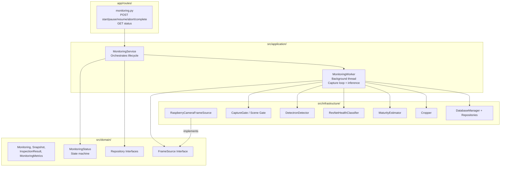
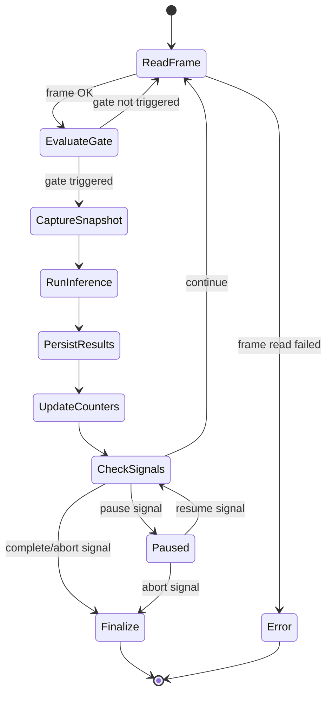

# Design Document

## Overview

This design defines the monitoring execution flow for Tomato Monitor. A `MonitoringService` in the application layer orchestrates the complete lifecycle: initialization (camera + models), capture loop (Scene Gate triggers), per-snapshot inference (detection + health + maturity), result persistence (SQLite), and session finalization (metrics computation). The capture loop runs in a background thread to avoid blocking FastAPI, with command signals for pause/resume/abort.

### Design Decisions

1. **Threading over asyncio**: The vision pipeline is CPU-bound and synchronous (PyTorch, OpenCV). A daemon thread with `threading.Event` signals is simpler and more appropriate than asyncio for this workload.
2. **Models loaded once per session**: DetectronDetector, ResNetHealthClassifier, and MaturityEstimator are instantiated during initialization and reused across all snapshots.
3. **Scene Gate reuse**: The existing `capture_gate.py` is reused with its current parameters (cooldown 18, timeout 45, ORB < 35, HSV > 0.38).
4. **Session-scoped DB session**: A single SQLAlchemy session per monitoring session, committed after each snapshot cycle.
5. **One active session per module**: Enforced at the service layer before creating a new monitoring.

## Architecture



## Components and Interfaces

### Directory Structure (new files)

```
src/application/
├── services/
│   ├── monitoring_service.py      # MonitoringService (orchestration)
│   └── monitoring_worker.py       # MonitoringWorker (background thread)
├── dtos/
│   ├── monitoring_dtos.py         # StartMonitoringRequest, MonitoringStatusResponse, etc.

app/routes/
├── monitoring.py                  # FastAPI routes for monitoring control

src/infrastructure/vision/
├── snapshot_inference_runner.py   # Runs detector+health+maturity on single image
```

### MonitoringService (Application Layer)

```python
class MonitoringService:
    """Orchestrates monitoring session lifecycle."""

    def __init__(
        self,
        monitoring_repo: MonitoringRepository,
        snapshot_repo: SnapshotRepository,
        inspection_result_repo: InspectionResultRepository,
        metrics_repo: MonitoringMetricsRepository,
        module_repo: ModuleRepository,
    ): ...

    def start_session(self, module_id: int, width_m: float, length_m: float, notes: str = None) -> Monitoring:
        """Create session, spawn background worker."""
        ...

    def pause_session(self, monitoring_id: int) -> Monitoring:
        """Signal worker to pause."""
        ...

    def resume_session(self, monitoring_id: int) -> Monitoring:
        """Signal worker to resume."""
        ...

    def abort_session(self, monitoring_id: int) -> Monitoring:
        """Signal worker to stop, compute partial metrics."""
        ...

    def complete_session(self, monitoring_id: int) -> Monitoring:
        """Signal traversal complete, trigger finalization."""
        ...

    def get_status(self, monitoring_id: int) -> Monitoring:
        """Return current session state and counters."""
        ...
```

### MonitoringWorker (Background Thread)

```python
class MonitoringWorker:
    """Runs the capture loop + inference in a background thread."""

    def __init__(
        self,
        monitoring_id: int,
        frame_source: FrameSource,
        scene_gate: CaptureGate,
        inference_runner: SnapshotInferenceRunner,
        snapshot_repo: SnapshotRepository,
        inspection_result_repo: InspectionResultRepository,
        monitoring_repo: MonitoringRepository,
        db_session: Session,
    ): ...

    # Signals (threading.Event)
    pause_event: threading.Event      # Set = paused
    abort_event: threading.Event      # Set = abort requested
    complete_event: threading.Event   # Set = traversal finished

    def run(self) -> None:
        """Main capture loop. Runs in daemon thread."""
        while not self.abort_event.is_set() and not self.complete_event.is_set():
            if self.pause_event.is_set():
                time.sleep(0.1)
                continue
            success, frame = self.frame_source.read()
            if not success:
                # Camera disconnection → error
                break
            if self.scene_gate.should_capture(frame):
                self._process_snapshot(frame)
        self._finalize()
```

### SnapshotInferenceRunner (Infrastructure)

```python
class SnapshotInferenceRunner:
    """Runs the full inference pipeline on a single snapshot image."""

    def __init__(
        self,
        detector: DetectronDetector,
        health_classifier: ResNetHealthClassifier,
        maturity_estimator: MaturityEstimator,
        cropper: Cropper,
    ): ...

    def run_inference(self, image: ndarray) -> list[DetectionInspectionResult]:
        """Detect → crop → classify health → estimate maturity."""
        ...
```

### API Routes

```python
# app/routes/monitoring.py
router = APIRouter(prefix="/monitoring", tags=["monitoring"])

@router.post("/start")
async def start_monitoring(request: StartMonitoringRequest) -> MonitoringResponse: ...

@router.post("/{monitoring_id}/pause")
async def pause_monitoring(monitoring_id: int) -> MonitoringResponse: ...

@router.post("/{monitoring_id}/resume")
async def resume_monitoring(monitoring_id: int) -> MonitoringResponse: ...

@router.post("/{monitoring_id}/abort")
async def abort_monitoring(monitoring_id: int) -> MonitoringResponse: ...

@router.post("/{monitoring_id}/complete")
async def complete_monitoring(monitoring_id: int) -> MonitoringResponse: ...

@router.get("/{monitoring_id}/status")
async def get_monitoring_status(monitoring_id: int) -> MonitoringStatusResponse: ...
```

### DTOs (Pydantic Models)

```python
class StartMonitoringRequest(BaseModel):
    module_id: int
    width_m: float = Field(gt=0, le=1000)
    length_m: float = Field(gt=0, le=1000)
    notes: Optional[str] = Field(default=None, max_length=500)

class MonitoringResponse(BaseModel):
    id: int
    module_id: int
    status: str
    started_at: Optional[datetime]
    completed_at: Optional[datetime]
    total_snapshots: int
    total_detections: int

class MonitoringStatusResponse(MonitoringResponse):
    width_m: float
    length_m: float
    notes: Optional[str]
```

## Data Models

No new database tables. This spec uses the entities and repositories from Spec 006:
- Monitoring (status transitions via MonitoringStatus)
- Snapshot (persisted per Scene Gate trigger)
- InspectionResult (persisted per detection)
- MonitoringMetrics (computed at session end)

### Snapshot Filesystem Layout

```
outputs/
└── monitorings/
    └── {monitoring_id}/
        └── snapshots/
            ├── snapshot_0.jpg
            ├── snapshot_1.jpg
            └── ...
```

### Capture Loop State Diagram



## Correctness Properties

### Property 1: Session state consistency

*For any* monitoring session, the status field in the database always reflects a valid state from the MonitoringState enum, and all transitions follow the defined state machine rules. No session can be in a state not reachable via the valid transition graph.

**Validates: Requirements 1.4, 4.1, 5.1, 6.1, 7.4**

### Property 2: One active session per module

*For any* module, at most one monitoring session with status in {initializing, running, paused, finishing} exists at any point in time. Attempting to create a second active session for the same module always fails.

**Validates: Requirement 8.5**

### Property 3: Snapshot persistence completeness

*For any* snapshot captured during a running session, a corresponding Snapshot record exists in the database with correct monitoring_id, frame_index, image_path, and captured_at. The image file exists at the specified path.

**Validates: Requirements 2.3, 2.4**

### Property 4: Inference results match snapshot detections

*For any* snapshot with `has_detections=True`, at least one InspectionResult record exists with that snapshot_id. For any snapshot with `has_detections=False`, zero InspectionResult records exist with that snapshot_id.

**Validates: Requirements 3.4, 3.5**

### Property 5: Counter consistency

*For any* monitoring session, `total_snapshots` equals the count of Snapshot records with that monitoring_id, and `total_detections` equals the count of InspectionResult records across all snapshots of that monitoring.

**Validates: Requirement 3.7**

### Property 6: Terminal state preserves results

*For any* monitoring session that reaches a terminal state (completed, aborted, error), all previously persisted Snapshots and InspectionResults remain in the database. No cascade delete occurs during state transitions.

**Validates: Requirements 5.4, 6.4, 7.1, 7.3**

### Property 7: Metrics computed on terminal states only

*For any* monitoring session, MonitoringMetrics exists only when the session status is `completed` or `aborted`. The metrics counts are consistent with the actual InspectionResult records.

**Validates: Requirements 5.3, 6.5**

### Property 8: Resource release on terminal state

*For any* monitoring session that reaches a terminal state, the FrameSource `release()` method has been called and no further reads are attempted.

**Validates: Requirements 10.1, 10.5**

## Error Handling

### Error Categories

| Category | Trigger | Action |
|----------|---------|--------|
| Camera unavailable on init | `is_available()` returns False | → error state, record reason |
| Model load failure | Exception during detector/classifier init | → error state, record which component |
| Init timeout | > 30 seconds in initializing | → error state, record timeout |
| Camera disconnect during run | `read()` returns (False, None) | → error state, persist partial results |
| Thermal threshold | CPU temp > 80°C | → auto-pause, log temperature |
| Single snapshot inference fail | Exception in detector/classifier | → skip snapshot, continue, log error |
| Filesystem full | OSError on image write | → error state, persist DB results |
| DB write failure | SQLAlchemy exception | → error state, best-effort |
| Metrics computation failure | Exception during aggregation | → error state, preserve snapshots |
| Memory exceeded | RSS > 3 GB | → auto-pause, log warning |

### Exception Flow

```
MonitoringWorker.run()
├── frame_source.read() fails → _handle_camera_error()
├── scene_gate.should_capture() → no exception expected (pure comparison)
├── _save_snapshot() → OSError → _handle_filesystem_error()
├── inference_runner.run_inference() → Exception → _handle_inference_error() (skip, continue)
├── _persist_results() → SQLAlchemy error → _handle_db_error()
└── _finalize() → _compute_metrics() fails → _handle_metrics_error()
```

## Testing Strategy

### Unit Tests

- MonitoringService: mock repositories and worker, test state transitions and validation
- MonitoringWorker: test with mock FrameSource (returns N frames then stops), verify snapshot count
- SnapshotInferenceRunner: test with mock detector/classifier, verify result assembly
- API routes: test with TestClient, mock service, verify HTTP codes and response schemas

### Integration Tests

- Full flow with in-memory SQLite: start → capture N frames → complete → verify metrics
- Pause/resume: start → pause → verify no new snapshots → resume → verify capture resumes
- Abort: start → abort → verify partial metrics computed
- Error: start with unavailable camera → verify error state

### Property-Based Tests (Hypothesis)

- Property 1: Generate random sequences of valid/invalid transitions, verify consistency
- Property 2: Generate concurrent start attempts for same module, verify only one succeeds
- Property 5: Generate random detection counts per snapshot, verify counter sum matches

### Manual Tests (on Raspberry Pi)

- Full monitoring with AI Camera connected
- Thermal auto-pause verification
- Camera disconnect simulation (unplug cable during run)
