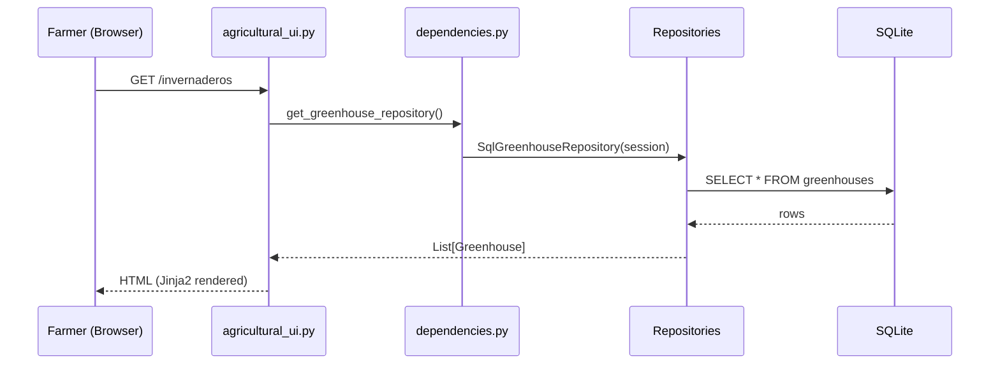
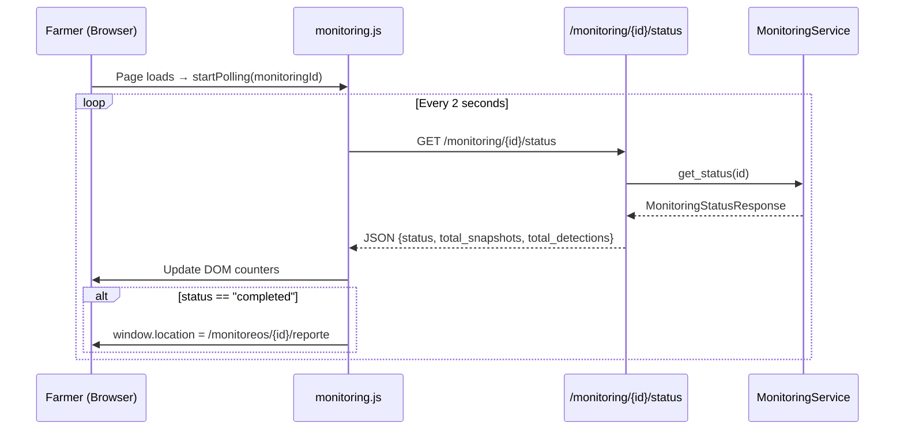

# Design Document: Agricultural UI Redesign

## Overview

This design defines the complete frontend architecture for a farmer-facing web interface rendered on a Raspberry Pi DSI 7" touchscreen (800×480, landscape). The current developer-oriented dark-themed test interface is replaced with a purpose-built agricultural UI optimized for touch interaction in greenhouse conditions.

The system uses FastAPI + Jinja2 server-side rendering with vanilla JavaScript for dynamic behaviors (polling, confirmation dialogs). All assets are served locally (offline-first). The design covers six screens that implement the complete farmer workflow: greenhouse management → module management → monitoring execution → report visualization.

### Key Design Decisions

1. **Server-side rendering with Jinja2** — No frontend framework. Pages are rendered by FastAPI and returned as complete HTML. Only the Monitoring Execution screen uses JavaScript polling for live updates.
2. **Complete CSS rewrite** — The dark developer theme is replaced with a light agricultural theme optimized for outdoor visibility and gloved touch interaction.
3. **New route module** — A dedicated `app/routes/agricultural_ui.py` router replaces the existing `ui.py` for farmer-facing screens, preserving the old routes for developer/debugging use.
4. **Template inheritance** — A new `base_agricultural.html` layout provides the shared shell (navigation bar, back button, viewport meta), with each screen as a child template.
5. **Vanilla JS module** — A single `app/static/js/monitoring.js` file handles status polling and UI updates for the execution screen. Confirmation dialogs use a lightweight inline component.

---

## Architecture

### High-Level System Diagram

```mermaid
graph TD
    subgraph Browser ["Raspberry Pi Chromium (800×480)"]
        HTML[Jinja2 HTML Pages]
        CSS[agricultural.css]
        JS[monitoring.js]
    end

    subgraph FastAPI ["FastAPI Server (localhost)"]
        AGR[agricultural_ui.py Router]
        MON[monitoring.py API Router]
        DEPS[dependencies.py]
    end

    subgraph Services ["Application Layer"]
        MS[MonitoringService]
        GR[SqlGreenhouseRepository]
        MR[SqlModuleRepository]
        MONR[SqlMonitoringRepository]
        SR[SqlSnapshotRepository]
        MTR[SqlMonitoringMetricsRepository]
    end

    subgraph DB ["Persistence"]
        SQLite[(tomato_monitor.db)]
        FS[/Filesystem: snapshot images/]
    end

    HTML --> AGR
    JS -->|fetch /monitoring/{id}/status| MON
    JS -->|fetch /monitoring/start| MON
    AGR --> DEPS
    DEPS --> GR & MR & MONR & SR & MTR & MS
    GR & MR & MONR & SR & MTR --> SQLite
    SR --> FS
    MON --> MS
    MS --> MONR & SR & MTR
```

### Request-Response Flow



### Monitoring Execution Polling Flow



---

## Components and Interfaces

### 1. Route Module: `app/routes/agricultural_ui.py`

New router providing all farmer-facing page endpoints. Registered with prefix `/` to serve as the application home.

```python
# Endpoints
GET /                          → redirect to /invernaderos
GET /invernaderos              → Greenhouse List Screen
GET /invernaderos/crear        → Greenhouse creation form
POST /invernaderos/crear       → Process greenhouse creation
GET /invernaderos/{id}         → Greenhouse Detail Screen
GET /invernaderos/{id}/editar  → Greenhouse edit form
POST /invernaderos/{id}/editar → Process greenhouse edit
POST /invernaderos/{id}/eliminar → Delete greenhouse (with confirmation)

GET /invernaderos/{gh_id}/modulos/crear        → Module creation form
POST /invernaderos/{gh_id}/modulos/crear       → Process module creation
GET /modulos/{id}                              → Module Detail Screen
GET /modulos/{id}/editar                       → Module edit form
POST /modulos/{id}/editar                      → Process module edit
POST /modulos/{id}/eliminar                    → Delete module

GET /modulos/{id}/monitoreo/nuevo              → Monitoring Setup Screen
POST /modulos/{id}/monitoreo/iniciar           → Start monitoring session
GET /monitoreos/{id}/ejecucion                 → Monitoring Execution Screen
GET /monitoreos/{id}/reporte                   → Monitoring Report Screen
POST /monitoreos/{id}/abortar                  → Abort monitoring (redirects)
```

**Interface with dependencies:**

```python
from app.dependencies import (
    get_greenhouse_repository,
    get_module_repository,
    get_monitoring_repository,
    get_snapshot_repository,
    get_monitoring_metrics_repository,
    get_monitoring_service,
)
```

### 2. Template Structure

```
app/templates/
├── base_agricultural.html          # New base layout (light theme, nav, viewport)
├── agricultural/
│   ├── greenhouse_list.html        # Screen 1
│   ├── greenhouse_detail.html      # Screen 2
│   ├── greenhouse_form.html        # Create/Edit greenhouse (shared)
│   ├── module_detail.html          # Screen 3
│   ├── module_form.html            # Create/Edit module (shared)
│   ├── monitoring_setup.html       # Screen 4
│   ├── monitoring_execution.html   # Screen 5
│   ├── monitoring_report.html      # Screen 6
│   └── partials/
│       ├── confirm_dialog.html     # Reusable confirmation dialog
│       ├── empty_state.html        # Reusable empty state component
│       ├── metric_card.html        # Reusable metric display card
│       └── maturity_bar.html       # USDA maturity distribution bar
├── base.html                       # Existing (kept for developer UI)
├── index.html                      # Existing (kept for developer UI)
└── session_detail.html             # Existing (kept for developer UI)
```

### 3. Static Assets

```
app/static/
├── css/
│   └── agricultural.css            # Complete new stylesheet (light theme)
├── js/
│   └── monitoring.js               # Polling logic + confirmation dialogs
├── styles.css                      # Existing (kept for developer UI)
└── images/
    └── placeholder-snapshot.svg    # Placeholder for missing snapshot images
```

### 4. Base Agricultural Template: `base_agricultural.html`

```html
<!DOCTYPE html>
<html lang="es">
<head>
    <meta charset="UTF-8">
    <meta name="viewport" content="width=800, initial-scale=1.0, user-scalable=no">
    <title>{{ title or "Monitor de Tomates" }}</title>
    <link rel="stylesheet" href="/static/css/agricultural.css">
</head>
<body>
    <header class="app-header">
        
        <div class="header-content">
            
            <a href="{{ back_url }}" class="back-button" aria-label="Volver">←</a>
            
            <h1 class="header-title">Monitor de Tomates</h1>
            
        </div>
        
    </header>

    <main class="main-content">
        
    </main>

    
</body>
</html>
```

### 5. JavaScript Module: `monitoring.js`

```javascript
// Public API
function startMonitoringPolling(monitoringId, options) { ... }
function stopMonitoringPolling() { ... }
function showConfirmDialog(message, onConfirm, onCancel) { ... }

// Internal
function pollStatus(monitoringId) { ... }
function updateExecutionUI(data) { ... }
function handleStateTransition(newStatus) { ... }
```

**Polling Configuration:**
- Interval: 2000ms (2 seconds)
- Endpoint: `GET /monitoring/{id}/status`
- Auto-redirect on `status === "completed"` → `/monitoreos/{id}/reporte`
- Show error banner on `status === "error"`
- Update counters on each successful poll

### 6. Image Serving

Snapshot images are stored at `outputs/monitorings/{monitoring_id}/snapshots/snapshot_{frame_index}.jpg`. The design adds a static file mount for this path:

```python
# In app/main.py
app.mount("/snapshots", StaticFiles(directory="outputs/monitorings"), name="snapshots")
```

Template usage:
```html

```

The `onerror` handler provides graceful fallback when image files have been deleted.

---

## Data Models

### Template Context Objects

Each route handler passes structured context to its template. These are not new ORM models but dictionaries/dataclasses assembled from repository data:

#### Greenhouse List Context

```python
@dataclass
class GreenhouseCardContext:
    id: int
    name: str
    module_count: int
    last_monitoring_date: Optional[str]  # Formatted: "12 Jun 2025"
```

#### Greenhouse Detail Context

```python
@dataclass
class ModuleCardContext:
    id: int
    name: str
    crop_type: str
    dimensions: Optional[str]  # "5.0 × 2.0 m" or None
    last_monitoring_date: Optional[str]
```

#### Module Detail Context

```python
@dataclass
class MonitoringHistoryItem:
    id: int
    date: str           # "12 Jun 2025"
    time: str           # "14:30"
    total_tomatoes: int
    pct_healthy: float  # 0-100
    status: str         # "completed", "aborted"
```

#### Monitoring Report Context

```python
@dataclass
class ReportMetrics:
    total_tomatoes: int
    healthy_count: int
    unhealthy_count: int
    pct_healthy: float
    pct_unhealthy: float
    maturity_stages: dict[str, float]  # stage_name → percentage
    snapshots_with_detections: int

@dataclass
class SnapshotThumbnail:
    monitoring_id: int
    frame_index: int
    image_url: str       # "/snapshots/{monitoring_id}/snapshots/snapshot_{idx}.jpg"
    has_detections: bool
```

### Existing ORM Models (unchanged)

The UI redesign does not modify the database schema. It reads from:

| Model | Table | Key Fields for UI |
|-------|-------|-------------------|
| `GreenhouseModel` | greenhouses | id, name, location |
| `ModuleModel` | modules | id, greenhouse_id, name, crop_type, width_m, length_m |
| `MonitoringModel` | monitorings | id, module_id, status, started_at, total_snapshots, total_detections |
| `SnapshotModel` | snapshots | id, monitoring_id, image_path, frame_index, has_detections |
| `MonitoringMetricsModel` | monitoring_metrics | all percentage fields, total counts |

### Data Assembly Pattern

Route handlers query repositories and assemble template contexts:

```python
@router.get("/invernaderos")
def greenhouse_list(request: Request):
    repo = get_greenhouse_repository(request)
    module_repo = get_module_repository(request)
    monitoring_repo = get_monitoring_repository(request)
    
    greenhouses = repo.get_all()
    cards = []
    for gh in greenhouses:
        modules = module_repo.get_by_greenhouse(gh.id)
        # Find latest monitoring across all modules
        last_date = _get_last_monitoring_date(monitoring_repo, modules)
        cards.append(GreenhouseCardContext(
            id=gh.id,
            name=gh.name,
            module_count=len(modules),
            last_monitoring_date=last_date,
        ))
    
    return templates.TemplateResponse(request, "agricultural/greenhouse_list.html", {
        "title": "Mis Invernaderos",
        "greenhouses": cards,
    })
```

### Form Validation Pattern

Form submissions use FastAPI Form parameters with server-side validation. On error, the form is re-rendered with error messages:

```python
@router.post("/invernaderos/crear")
def create_greenhouse(request: Request, name: str = Form(...), location: str = Form("")):
    errors = []
    if not name.strip():
        errors.append("El nombre del invernadero es obligatorio.")
    if errors:
        return templates.TemplateResponse(request, "agricultural/greenhouse_form.html", {
            "errors": errors, "name": name, "location": location, "mode": "create"
        })
    # ... create via repository
```

### CSS Architecture: `agricultural.css`

The stylesheet implements a design token system:

```css
:root {
    /* Colors */
    --color-bg: #F5F5F5;
    --color-surface: #FFFFFF;
    --color-text: #212121;
    --color-text-secondary: #616161;
    --color-primary: #4CAF50;
    --color-primary-dark: #388E3C;
    --color-danger: #F44336;
    --color-danger-dark: #D32F2F;
    --color-warning: #FFC107;
    --color-warning-dark: #FFA000;
    --color-border: #E0E0E0;
    
    /* Typography */
    --font-family: system-ui, -apple-system, Roboto, sans-serif;
    --font-size-body: 16px;
    --font-size-h1: 24px;
    --font-size-h2: 20px;
    --font-size-small: 14px;
    --line-height: 1.5;
    
    /* Touch targets */
    --touch-min: 44px;
    --touch-primary: 60px;
    --touch-list-item: 56px;
    --touch-spacing: 8px;
    
    /* Layout */
    --safe-margin: 16px;
    --content-max-width: 768px;
    --border-radius: 8px;
    --border-radius-lg: 12px;
    
    /* Maturity colors */
    --maturity-green: #4CAF50;
    --maturity-breaker: #8BC34A;
    --maturity-turning: #CDDC39;
    --maturity-pink: #FF9800;
    --maturity-light-red: #FF5722;
    --maturity-red: #F44336;
}
```

**Layout Strategy:**
- Fixed viewport: 800×480 with 16px safe margins → 768px usable width
- Single-column layout for most screens
- Cards use flexbox with vertical stacking
- Scrollable content areas use `-webkit-overflow-scrolling: touch` for momentum scrolling
- No horizontal scroll — all content fits within 768px

---

## Correctness Properties

*A property is a characteristic or behavior that should hold true across all valid executions of a system—essentially, a formal statement about what the system should do. Properties serve as the bridge between human-readable specifications and machine-verifiable correctness guarantees.*

This feature is primarily UI rendering (Jinja2 templates + CSS), which is not ideal for property-based testing. However, several **data assembly and validation functions** within the route handlers contain pure logic that benefits from PBT. The properties below target these logic functions, not the HTML rendering itself.

### Property 1: Greenhouse card assembly preserves data

*For any* list of Greenhouse entities with associated modules and monitorings, the assembled `GreenhouseCardContext` list SHALL have exactly one entry per greenhouse, and each entry SHALL contain the correct `name`, `module_count` (matching the actual number of modules for that greenhouse), and `last_monitoring_date` (matching the most recent completed monitoring across all modules, or None if no monitorings exist).

**Validates: Requirements 1.2**

### Property 2: Module card assembly preserves data

*For any* list of Module entities with associated monitorings, the assembled `ModuleCardContext` list SHALL have exactly one entry per module, and each entry SHALL contain the correct `crop_type`, a `dimensions` string formatted as "{width} × {length} m" when both dimensions are set (or None when either is null), and `last_monitoring_date` matching the most recent completed monitoring for that module.

**Validates: Requirements 2.2**

### Property 3: Monitoring history assembly preserves data

*For any* list of Monitoring entities for a module, the assembled `MonitoringHistoryItem` list SHALL contain one entry per monitoring with terminal status (completed or aborted), and each entry SHALL preserve the correct `total_tomatoes` count and `pct_healthy` value from the associated MonitoringMetrics record.

**Validates: Requirements 3.4**

### Property 4: Dimension validation correctness

*For any* pair of floats (width, length), the monitoring setup validation function SHALL return success if and only if both width > 0 and length > 0. For any pair where either value is ≤ 0, the function SHALL return a validation error and no monitoring session SHALL be created.

**Validates: Requirements 4.4, 4.5**

### Property 5: Dimension auto-save on monitoring start

*For any* valid dimension pair (width > 0, length > 0) submitted through the monitoring setup form, after successfully starting a monitoring, the parent module record SHALL have its `width_m` and `length_m` fields updated to match the submitted values.

**Validates: Requirements 4.7**

### Property 6: Report metrics assembly round-trip

*For any* MonitoringMetrics entity, the assembled `ReportMetrics` context SHALL preserve all count fields (total_tomatoes, healthy_count, unhealthy_count) and all percentage fields (pct_healthy, pct_unhealthy, and all six maturity stage percentages) with exact numeric equality to the source record.

**Validates: Requirements 6.2, 6.3**

### Property 7: Snapshot gallery filters by detection presence

*For any* list of Snapshot entities for a monitoring, the assembled `SnapshotThumbnail` list SHALL contain exactly those snapshots where `has_detections == True`, and each thumbnail SHALL have an `image_url` matching the pattern `/snapshots/{monitoring_id}/snapshots/snapshot_{frame_index}.jpg`.

**Validates: Requirements 6.4**

---

## Error Handling

### Route-Level Error Handling

Each route handler uses try/except to catch repository and service errors, mapping them to user-friendly responses:

| Error Source | Exception | User Message (Spanish) | Recovery |
|---|---|---|---|
| Greenhouse not found | `get_by_id` returns None | "Invernadero no encontrado." | Redirect to /invernaderos |
| Module not found | `get_by_id` returns None | "Módulo no encontrado." | Redirect to /invernaderos |
| Monitoring not found | `MonitoringNotFoundError` | "Monitoreo no encontrado." | Redirect to module detail |
| Duplicate greenhouse name | IntegrityError | "Ya existe un invernadero con ese nombre." | Re-render form with error |
| Duplicate module name | `DuplicateModuleError` | "Ya existe un módulo con ese nombre en este invernadero." | Re-render form with error |
| Active session exists | `ActiveSessionError` | "Este módulo ya tiene un monitoreo activo." | Redirect to execution screen |
| Invalid state transition | `InvalidTransitionError` | "Operación no permitida en el estado actual." | Redirect to execution screen |

### Template-Level Error Handling

```python
# Pattern for all page routes
@router.get("/invernaderos/{id}")
def greenhouse_detail(request: Request, id: int):
    repo = get_greenhouse_repository(request)
    greenhouse = repo.get_by_id(id)
    if greenhouse is None:
        # Redirect with flash-style error (via query param)
        return RedirectResponse(
            url="/invernaderos?error=Invernadero+no+encontrado",
            status_code=303,
        )
    # ... normal rendering
```

### JavaScript Error Handling (Polling)

```javascript
async function pollStatus(monitoringId) {
    try {
        const response = await fetch(`/monitoring/${monitoringId}/status`);
        if (!response.ok) {
            showErrorBanner("Error al consultar el estado del monitoreo.");
            return;
        }
        const data = await response.json();
        updateExecutionUI(data);
    } catch (error) {
        // Network error — system might be restarting
        showErrorBanner("Sin conexión con el servidor. Reintentando...");
    }
}
```

### Image Loading Errors

Missing snapshot images are handled client-side with an `onerror` fallback:

```html

```

---

## Testing Strategy

### Testing Approach

This feature is primarily a UI/template layer. The testing strategy combines:

1. **Property-based tests** for data assembly logic (the pure functions that transform repository data into template contexts)
2. **Example-based unit tests** for route handler behavior (correct template selection, redirects, error handling)
3. **Integration tests** for form submission flows (create/edit/delete with database)
4. **Manual tests** on the Raspberry Pi touchscreen (touch targets, scrolling, readability)

### Property-Based Tests (Hypothesis)

**Library:** `hypothesis` (Python PBT library, well-suited for this project's pytest setup)
**Minimum iterations:** 100 per property
**Tag format:** `# Feature: 008-agricultural-ui-redesign, Property {N}: {title}`

Each property test targets a data assembly function extracted from the route handlers into testable utility functions in `app/routes/agricultural_ui.py` or a dedicated `app/context_builders.py` module:

| Property | Function Under Test | Generator Strategy |
|---|---|---|
| 1 | `build_greenhouse_cards(greenhouses, modules_by_gh, monitorings_by_module)` | Lists of Greenhouse, Module, Monitoring dataclasses |
| 2 | `build_module_cards(modules, monitorings_by_module)` | Lists of Module, Monitoring dataclasses |
| 3 | `build_monitoring_history(monitorings, metrics_by_monitoring)` | Lists of Monitoring (completed/aborted), MonitoringMetrics |
| 4 | `validate_dimensions(width, length)` | Pairs of floats (positive, zero, negative) |
| 5 | Integration test with repository mock | Valid float pairs |
| 6 | `build_report_metrics(metrics)` | MonitoringMetrics dataclasses |
| 7 | `build_snapshot_gallery(snapshots, monitoring_id)` | Lists of Snapshot (mixed has_detections) |

### Example-Based Unit Tests (pytest)

- Route returns correct template for each screen
- Route handles 404 (entity not found) with redirect
- Form re-renders with errors on invalid input
- Confirmation dialog messages match requirements
- Each monitoring status renders the correct UI state indicator

### Integration Tests

- Full CRUD flow for greenhouse (create → read → update → delete)
- Full CRUD flow for module (create → read → update → delete with cascade)
- Monitoring setup → start → abort flow
- Monitoring setup → start → complete flow

### Manual Tests (Raspberry Pi)

These must be performed on the physical device and documented:

- All touch targets are easily tappable with work gloves
- Text is readable at arm's length in greenhouse lighting
- Scrolling is smooth in long lists
- Polling updates live counters during active monitoring
- Screen transitions complete within 1 second
- Confirmation dialogs are dismissible

### Test File Structure

```
tests/
├── test_agricultural_ui/
│   ├── test_context_builders.py       # Property tests for data assembly
│   ├── test_dimension_validation.py   # Property test for validation
│   ├── test_routes.py                 # Example-based route tests
│   └── test_crud_flows.py            # Integration tests
```

### Test Configuration

```python
# conftest.py additions
@pytest.fixture
def test_client():
    """FastAPI TestClient with in-memory SQLite."""
    ...

@pytest.fixture
def populated_db(test_client):
    """Database with sample greenhouses, modules, and monitorings."""
    ...
```
