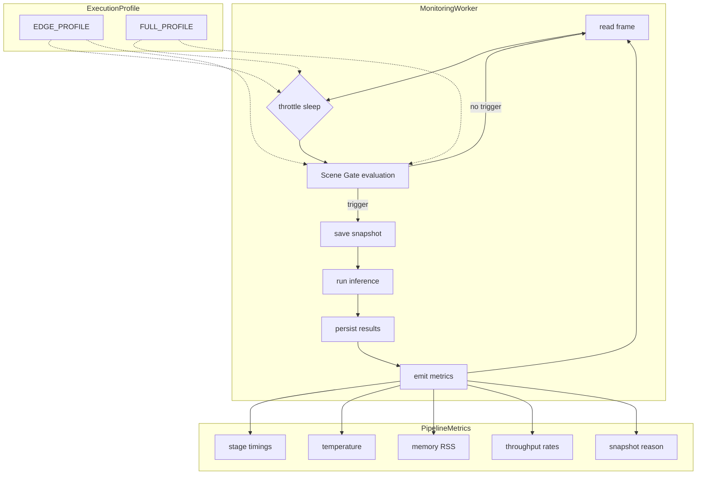
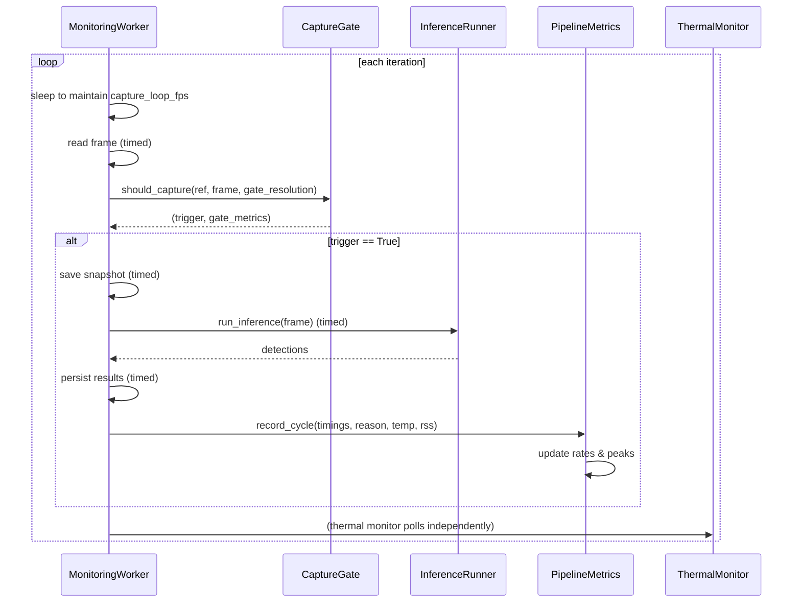

# Design — Lightweight Hybrid Monitoring Pipeline

## Overview

This design extends the existing `MonitoringWorker` with three additive capabilities:

1. **Performance Instrumentation** — A `PipelineMetrics` dataclass accumulates per-stage timing, temperature, memory, and throughput metrics during each snapshot cycle.
2. **Loop Frequency Control** — Real-time throttling via `time.sleep()` and wall-clock elapsed tracking (`time.monotonic()`) for both cooldown and timeout, with frame-based thresholds preserved as fallback.
3. **Lightweight Scene Gate** — Optional downscale (`gate_resolution`) before ORB/HSV comparison to reduce CPU cost, while preserving full-resolution frames for snapshot save and inference.

The worker loop structure remains unchanged: `read → gate → snapshot → inference → persist`. All changes are additive — wrapping existing calls with timing, adding sleep-based throttling, and routing parameters from `ACTIVE_PROFILE`.

### Design Rationale

- **Additive over restructuring**: The worker already functions correctly. We add measurement and control layers around existing code rather than rearchitecting the flow.
- **Profile-driven configuration**: All tunable parameters come from `ExecutionProfile`, making edge vs full comparison a simple profile swap with zero code changes.
- **Time-based over frame-based as primary**: Frame counts are unreliable when CPU load varies; wall-clock time provides predictable behavior regardless of actual frame rate.

## Architecture



### Component Interaction



## Components and Interfaces

### 1. PipelineMetrics (new)

**File:** `src/application/services/pipeline_metrics.py`

A dataclass that accumulates timing and resource measurements for each snapshot cycle. Not persisted to the database — emitted to the technical log and optionally included in session metadata at completion.

```python
@dataclass
class CycleMetrics:
    """Metrics for a single snapshot cycle."""
    cycle_index: int
    snapshot_reason: str  # "first_frame" | "scene_change" | "timeout"
    camera_read_ms: float
    scene_gate_ms: float
    snapshot_save_ms: float
    inference_total_ms: float
    detection_ms: float
    health_ms: float
    maturity_ms: float
    persistence_ms: float
    temperature_c: Optional[float]
    rss_mb: Optional[float]
    timestamp: float  # time.monotonic() for rate calculations


@dataclass
class PipelineMetrics:
    """Accumulates metrics across all cycles in a session."""
    cycles: list[CycleMetrics]
    session_start_time: float
    peak_temperature_c: float
    peak_rss_mb: float

    def snapshots_per_minute(self) -> float: ...
    def inferences_per_minute(self) -> float: ...
    def get_session_summary(self) -> dict: ...
```

### 2. ExecutionProfile (extended)

**File:** `src/infrastructure/config/settings.py`

Add time-based and camera parameters to the existing frozen dataclass:

| New Field | Type | EDGE | FULL | Description |
|---|---|---|---|---|
| `capture_loop_fps` | `float` | `2.0` | `5.0` | Max frames read per second |
| `min_seconds_between_snapshots` | `float` | `8.0` | `4.0` | Minimum real-time cooldown |
| `max_seconds_without_snapshot` | `float` | `30.0` | `15.0` | Force snapshot after this interval |
| `gate_resolution` | `tuple[int,int]` | `(160,160)` | `(320,320)` | Downscale resolution for gate comparison |
| `camera_width` | `int` | `480` | `640` | Camera capture width |
| `camera_height` | `int` | `360` | `480` | Camera capture height |
| `camera_fps` | `int` | `5` | `10` | Camera hardware FPS (passed to FrameSource) |

**Profile selection via environment variable:**

```python
import os

_PROFILE_NAME = os.environ.get("TOMATO_MONITOR_PROFILE", "edge").lower().strip()

if _PROFILE_NAME == "full":
    ACTIVE_PROFILE = FULL_PROFILE
elif _PROFILE_NAME == "edge":
    ACTIVE_PROFILE = EDGE_PROFILE
else:
    import logging
    logging.getLogger(__name__).warning(
        f"Invalid TOMATO_MONITOR_PROFILE='{_PROFILE_NAME}'. Using 'edge' as default."
    )
    ACTIVE_PROFILE = EDGE_PROFILE
```

### 3. MonitoringWorker (modified)

**File:** `src/application/services/monitoring_worker.py`

Modifications:

- **Constructor**: Accept new time-based params from profile. Initialize `PipelineMetrics`.
- **Loop throttle**: Add `time.sleep()` at end of each iteration to cap at `capture_loop_fps`.
- **Time tracking**: Use `time.monotonic()` to track `_last_snapshot_time` and `_session_start_time`.
- **Snapshot decision**: Combine time-based (`min_seconds_between_snapshots`, `max_seconds_without_snapshot`) with frame-based thresholds — whichever fires first wins.
- **Timing wrappers**: Wrap each stage call with `time.perf_counter()` start/end.
- **Metrics emission**: After each snapshot cycle, log all timings at DEBUG level and record in `PipelineMetrics`.
- **FPS deviation logging**: If actual FPS drops below target, log at WARNING level.

### 4. CaptureGate (modified)

**File:** `src/infrastructure/vision/capture_gate.py`

Modifications:

- **New parameter**: `gate_resolution: Optional[tuple[int, int]]` on `should_capture_new_image()`.
- **Downscale logic**: If `gate_resolution` is provided, resize `reference_bgr` and `current_bgr` to that resolution before ORB/HSV computation. The existing `preprocess_for_scene_compare` already resizes to `(320, 320)` — we replace that fixed value with the configurable `gate_resolution`.
- **Return value**: Already returns `(trigger, metrics_dict)` — no change needed. The `metrics` dict already includes `orb_matches`, `hist_diff`, `cooldown_ok`, `timeout_force`, `orb_changed`, `hist_changed`, `base_trigger`.

### 5. ThermalMonitor (unchanged constructor, wired differently)

**File:** `src/infrastructure/monitoring/thermal_monitor.py`

No code changes needed. The existing constructor already accepts `poll_interval_seconds`, `warning_temp`, `critical_temp`, `resume_temp` as keyword arguments. The change is in the **caller** — `MonitoringWorker` (or the service that creates it) will pass these from `ACTIVE_PROFILE` instead of using defaults.

### 6. SnapshotInferenceRunner (timing decomposition)

**File:** `src/infrastructure/vision/snapshot_inference_runner.py`

Modify `run_inference()` to optionally return timing breakdown alongside results. Backward-compatible approach:

```python
@dataclass
class InferenceTimings:
    """Timing breakdown for a single inference call."""
    detection_ms: float
    health_ms: float
    maturity_ms: float
    total_ms: float

def run_inference(self, image: np.ndarray) -> list[dict]:
    """Existing signature — unchanged for backward compat."""
    ...

def run_inference_timed(self, image: np.ndarray) -> tuple[list[dict], InferenceTimings]:
    """New method: returns results + measured timings."""
    ...
```

The worker calls `run_inference_timed()` to get actual per-stage measurements. Existing code calling `run_inference()` is unaffected.

### 7. Metrics JSON Output

**File:** `src/application/services/pipeline_metrics.py` (method on PipelineMetrics)

At session end (abort or complete), the worker writes `PipelineMetrics.to_json_file(path)`:

```python
def to_json_file(self, output_path: str, profile_name: str) -> None:
    """Write session metrics summary to a JSON file for thesis data."""
    summary = {
        "profile_name": profile_name,
        "total_cycles": len(self.cycles),
        "snapshots_per_minute": self.snapshots_per_minute(),
        "inferences_per_minute": self.inferences_per_minute(),
        "peak_temperature_c": self.peak_temperature_c,
        "peak_rss_mb": self.peak_rss_mb,
        "average_timings_ms": { ... },  # avg per stage
        "snapshot_reasons": { ... },    # count per reason
    }
    with open(output_path, "w") as f:
        json.dump(summary, f, indent=2)
```

Output path: `outputs/monitorings/{monitoring_id}/pipeline_metrics.json`

No database migration needed.

## Data Models

### CycleMetrics (value object, not persisted)

```python
@dataclass(frozen=True)
class CycleMetrics:
    cycle_index: int
    snapshot_reason: str          # "first_frame" | "scene_change" | "timeout"
    camera_read_ms: float
    scene_gate_ms: float
    snapshot_save_ms: float
    inference_total_ms: float
    detection_ms: float
    health_ms: float
    maturity_ms: float
    persistence_ms: float
    temperature_c: Optional[float]
    rss_mb: Optional[float]
    timestamp: float
```

### PipelineMetrics (session-scoped accumulator)

```python
@dataclass
class PipelineMetrics:
    cycles: list[CycleMetrics] = field(default_factory=list)
    session_start_time: float = 0.0
    peak_temperature_c: float = 0.0
    peak_rss_mb: float = 0.0

    def add_cycle(self, cycle: CycleMetrics) -> None: ...
    def snapshots_per_minute(self) -> float: ...
    def inferences_per_minute(self) -> float: ...
    def get_session_summary(self) -> dict: ...
```

### Extended ExecutionProfile fields

These fields are added to the existing `ExecutionProfile` frozen dataclass:

```python
# Time-based loop control
capture_loop_fps: float
min_seconds_between_snapshots: float
max_seconds_without_snapshot: float

# Scene gate resolution
gate_resolution: tuple[int, int]
```

### SnapshotReason (enum-like string)

Not a formal enum — stored as a plain string in `CycleMetrics.snapshot_reason` with values:
- `"first_frame"` — first frame of the session, always captured
- `"scene_change"` — ORB/HSV gate triggered
- `"timeout"` — `max_seconds_without_snapshot` or `scene_gate_timeout_frames` elapsed


## Correctness Properties

*A property is a characteristic or behavior that should hold true across all valid executions of a system — essentially, a formal statement about what the system should do. Properties serve as the bridge between human-readable specifications and machine-verifiable correctness guarantees.*

### Property 1: Stage timing accuracy

*For any* simulated pipeline stage with a known elapsed duration, when recorded via `PipelineMetrics.add_cycle()`, the corresponding timing field in the stored `CycleMetrics` SHALL reflect that duration in milliseconds with less than 1ms deviation from the input value.

**Validates: Requirements 1.1, 1.2, 1.3, 1.4, 1.5**

### Property 2: Peak temperature is maximum of recorded values

*For any* sequence of `CycleMetrics` with varying `temperature_c` values (including None), `PipelineMetrics.peak_temperature_c` SHALL equal the maximum non-None temperature value observed across all cycles (or 0.0 if all are None).

**Validates: Requirements 1.7**

### Property 3: Throughput rate calculation

*For any* positive elapsed time (in seconds) and positive cycle count, `PipelineMetrics.snapshots_per_minute()` SHALL equal `cycle_count / (elapsed_seconds / 60.0)`.

**Validates: Requirements 1.9**

### Property 4: Snapshot reason validity

*For any* `CycleMetrics` added to `PipelineMetrics`, the `snapshot_reason` field SHALL be one of exactly three values: `"first_frame"`, `"scene_change"`, or `"timeout"`.

**Validates: Requirements 1.10**

### Property 5: Throttle sleep duration

*For any* `capture_loop_fps > 0` and `processing_time_seconds >= 0`, the computed sleep duration SHALL equal `max(0.0, (1.0 / capture_loop_fps) - processing_time_seconds)`.

**Validates: Requirements 2.1**

### Property 6: Time-based cooldown blocks premature snapshots

*For any* `min_seconds_between_snapshots > 0` and `elapsed_since_last_snapshot < min_seconds_between_snapshots`, the time-based cooldown check SHALL return False (blocking the snapshot), regardless of scene gate signal.

**Validates: Requirements 2.2, 3.5**

### Property 7: Time-based timeout forces snapshot with correct reason

*For any* `max_seconds_without_snapshot > 0` and `elapsed_since_last_snapshot >= max_seconds_without_snapshot`, the timeout check SHALL return True (forcing snapshot) and the resulting `snapshot_reason` SHALL be `"timeout"`.

**Validates: Requirements 2.3, 3.4**

### Property 8: First-wins trigger rule

*For any* combination of `(elapsed_seconds, frame_count, min_seconds, max_seconds, cooldown_frames, timeout_frames)` where both time-based and frame-based thresholds are configured, the snapshot trigger SHALL fire if EITHER the time-based threshold OR the frame-based threshold is reached first.

**Validates: Requirements 2.5, 2.6**

### Property 9: Gate metrics contain required keys

*For any* invocation of `should_capture_new_image()` that returns `(trigger, metrics)`, the `metrics` dict SHALL contain at minimum the keys: `"orb_matches"`, `"hist_diff"`, `"cooldown_ok"`, `"timeout_force"`, `"orb_changed"`, `"hist_changed"`, `"base_trigger"`.

**Validates: Requirements 3.3**

### Property 10: Inference count equals snapshot count

*For any* monitoring session execution with N triggered snapshots (where inference did not fail), the total number of inference executions SHALL equal N.

**Validates: Requirements 6.1, 6.2**

### Property 11: Inference failure does not terminate session

*For any* snapshot cycle where `InferenceRunner.run_inference()` raises an exception, the monitoring worker SHALL continue to the next loop iteration and produce subsequent snapshots.

**Validates: Requirements 6.5**

### Property 12: Abort preserves completed cycle data

*For any* abort event occurring after N completed snapshot cycles, all N snapshots and their associated inspection results SHALL remain persisted in the database.

**Validates: Requirements 7.5**

## Error Handling

### Camera Read Failure

- **Detection**: `frame_source.read()` returns `(False, None)`.
- **Response**: Set `error_reason`, emit ERROR log, break loop. Session transitions to error state.
- **Recovery**: Partial data (all snapshots before failure) is preserved.

### Inference Failure (per snapshot)

- **Detection**: `inference_runner.run_inference()` raises any exception.
- **Response**: Log warning, persist snapshot with `has_detections=False`, continue loop.
- **Recovery**: Subsequent snapshots proceed normally. No session termination.

### Snapshot Save Failure (filesystem)

- **Detection**: `cv2.imwrite()` raises exception or returns error.
- **Response**: Log error, set `error_reason`, set abort event (disk full or permission issue).
- **Recovery**: All previously persisted data remains intact.

### Thermal Pause

- **Detection**: `ThermalMonitor` sets `pause_event` when temperature exceeds `critical_temp`.
- **Response**: Worker spin-waits with 100ms sleep. No data loss.
- **Recovery**: When temperature drops below `resume_temp`, `pause_event` is cleared and loop continues.

### Memory Warning

- **Detection**: RSS exceeds `memory_warning_rss_mb` (read via `resource.getrusage`).
- **Response**: Log WARNING. No interruption — monitoring continues.
- **Recovery**: Informational only. Operator can manually abort if desired.

### FPS Deviation

- **Detection**: `time.monotonic()` shows actual loop iteration took longer than `1/capture_loop_fps`.
- **Response**: Log WARNING with actual vs expected FPS. Sleep is clamped to 0 (no negative sleep).
- **Recovery**: System continues at reduced rate. No error state.

### Picamera2 Lock Error on Release

- **Detection**: `frame_source.release()` raises Picamera2 allocator/lock exception.
- **Response**: Catch exception, log warning, mark session as error state if not already completed.
- **Recovery**: Application continues running. Next session can start fresh.

## Testing Strategy

### Unit Tests (pytest)

Focus on pure logic components with mocked dependencies:

1. **PipelineMetrics accumulator** — Verify `add_cycle()`, `snapshots_per_minute()`, `get_session_summary()` with concrete inputs.
2. **ExecutionProfile instantiation** — Verify both profiles have all required fields with valid values, EDGE has more conservative values than FULL.
3. **Throttle calculation** — Verify sleep duration formula with edge cases (processing time > 1/fps, fps=0 guard).
4. **Snapshot decision logic** — Verify the combined time-based + frame-based "first wins" trigger logic with various input combinations.
5. **Gate metrics structure** — Verify `should_capture_new_image()` returns required keys in all scenarios.
6. **Worker abort handling** — With mocked repos and inference runner, verify partial data is preserved on abort.
7. **Worker inference failure** — Inject exception in mock inference runner, verify loop continues.

### Property-Based Tests (Hypothesis)

**Library:** `hypothesis` (already in use in this project — `.hypothesis/` directory exists).
**Configuration:** Minimum 100 examples per property.
**Tag format:** `# Feature: lightweight-hybrid-monitoring-pipeline, Property N: <title>`

Properties to implement:
- Property 1: Stage timing accuracy
- Property 2: Peak temperature max invariant
- Property 3: Throughput rate calculation
- Property 4: Snapshot reason enum membership
- Property 5: Throttle sleep formula
- Property 6: Cooldown blocking
- Property 7: Timeout forcing with reason
- Property 8: First-wins OR logic
- Property 9: Gate metrics keys invariant
- Property 10: Inference count == snapshot count
- Property 11: Inference failure resilience
- Property 12: Abort data preservation

### Integration Tests (manual on RPi 5)

These require real hardware and are documented in `docs/benchmarks/`:

- Profile comparison: EDGE vs FULL inference time
- Profile comparison: EDGE vs FULL peak temperature
- Camera lifecycle: preview → monitoring → abort → preview → monitoring
- Consecutive sessions: two full sessions without restart
- Thermal pause: induce high temperature, verify pause/resume

### Smoke Tests

Located in `scripts/`:

- `scripts/smoke_test_profiles.py` — Verify both profiles instantiate correctly with all fields
- `scripts/smoke_test_pipeline_metrics.py` — Verify PipelineMetrics can accumulate and report

