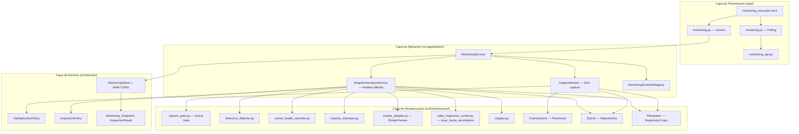
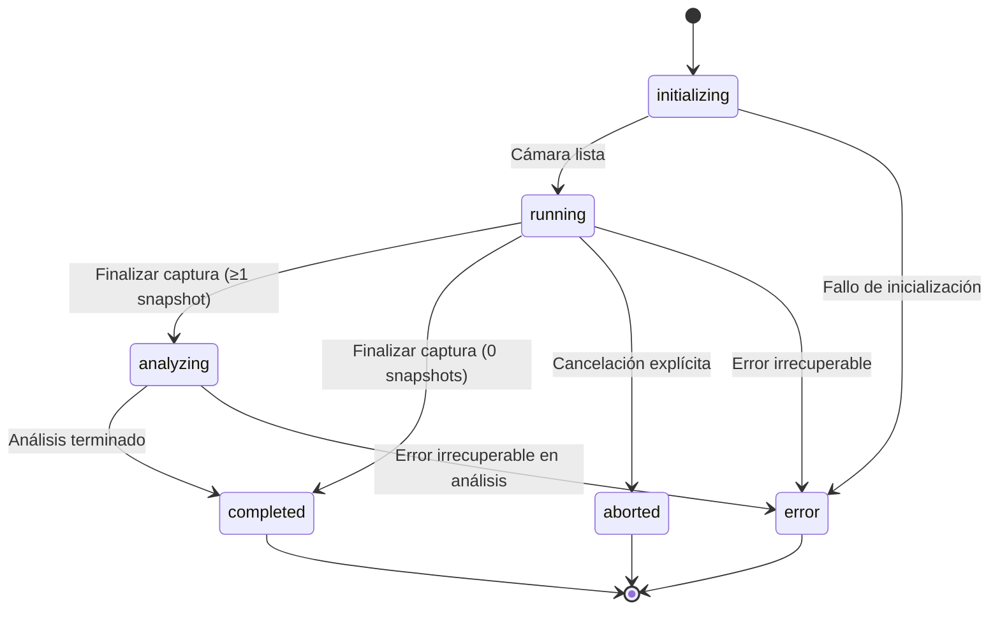
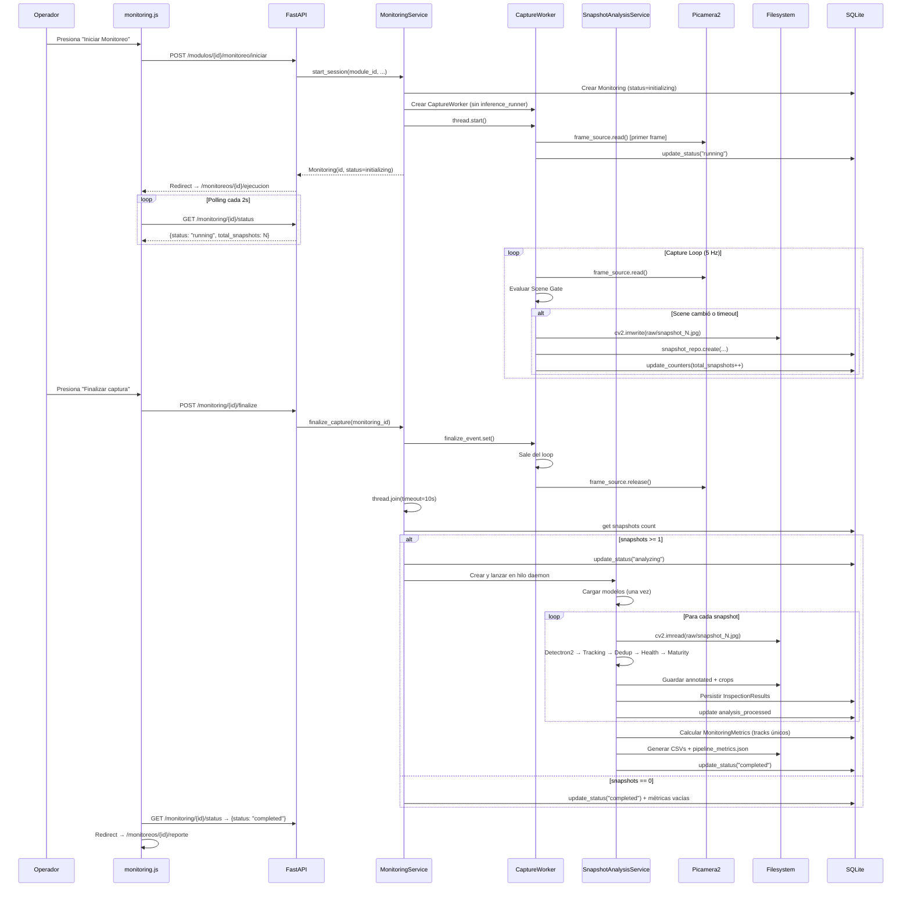
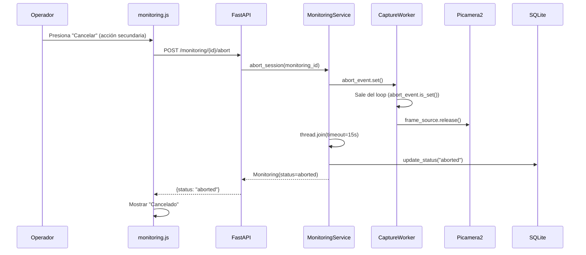

# Documento de Diseño Técnico

## Spec 009: Pipeline Captura-Primero con Análisis Final Diferido

---

## Overview

Este diseño reestructura el flujo de monitoreo live para separar la **fase de captura** (rápida, sin inferencia) de la **fase de análisis** (inferencia diferida sobre snapshots guardados). El objetivo es eliminar el bloqueo de ~7-8 segundos por snapshot causado por Detectron2 dentro del loop de captura, permitiendo capturar significativamente más imágenes durante el recorrido del operador.

### Problema Actual

El `MonitoringWorker` ejecuta `SnapshotInferenceRunner.run_inference_timed()` dentro del loop de captura. Esto bloquea la adquisición del siguiente frame durante 7-8 segundos en Raspberry Pi 5 (CPU). En un recorrido de 30 segundos, solo se capturan ~3-4 snapshots.

### Solución Propuesta

Dividir el pipeline en dos fases secuenciales:

1. **Fase de Captura** (estado `running`): El worker lee frames, evalúa Scene Gate, guarda snapshots crudos (JPEG) y persiste metadatos. Sin inferencia.
2. **Fase de Análisis** (estado `analyzing`): Un servicio dedicado carga modelos una vez, procesa todos los snapshots secuencialmente con tracking inter-snapshot y deduplicación, genera anotaciones y reportes.

### Decisión de Diseño: Estado `analyzing`

Se agrega un nuevo estado `analyzing` al enum `MonitoringState` en lugar de reusar `finishing`, por:
- **Claridad semántica**: `finishing` implica "cerrando loop", no "procesando con inferencia"
- **Menor riesgo de regresión**: aditivo, no modifica transiciones existentes
- **Trazabilidad académica**: estado explícito para métricas y documentación de tesis

---

## Architecture

### Diagrama de Arquitectura de Alto Nivel



### Diagrama de Máquina de Estados (Modificada)



**Cambios respecto al estado actual:**
- Se **mantienen** `PAUSED` y `FINISHING` en el enum y en `VALID_TRANSITIONS` para compatibilidad con endpoints, tests y registros existentes en BD.
- Se **agrega** `ANALYZING` al enum `MonitoringState`
- Se **agregan** transiciones: `running → analyzing`, `running → completed` (0 snapshots), `analyzing → completed`, `analyzing → error`
- Se **mantiene** `running → aborted` exclusivamente para cancelación explícita del operador
- Se **mantiene** `running → paused`, `running → finishing`, `paused → running` por compatibilidad (la nueva UI no las invoca)

> **Nota**: Las transiciones `running → paused` y `running → finishing` no se eliminan para no romper código previo. La pausa térmica durante análisis se maneja internamente (sleep entre snapshots) sin exponer estado `paused` al operador.

---

## Components and Interfaces

### 1. CaptureWorker (refactorización de MonitoringWorker)

**Ubicación:** `src/application/services/capture_worker.py` (nuevo archivo, renombrar conceptualmente)

**Responsabilidad:** Loop de captura sin inferencia. Lee frames, evalúa Scene Gate, guarda JPEG, persiste Snapshot en BD, actualiza contadores.

**Interfaz pública:**

```python
class CaptureWorker:
    def __init__(
        self,
        monitoring_id: int,
        frame_source: FrameSource,
        snapshot_repo: SnapshotRepository,
        monitoring_repo: MonitoringRepository,
        db_session: Session,
        *,
        capture_loop_fps: float = 5.0,
        min_seconds_between_snapshots: float = 1.0,
        max_seconds_without_snapshot: float = 3.0,
        gate_resolution: tuple[int, int] = (240, 240),
        scene_gate_orb_threshold: int = 35,
        scene_gate_hsv_threshold: float = 0.38,
        log_service: Optional[LogService] = None,
    ) -> None: ...

    # Threading signals
    abort_event: threading.Event
    finalize_event: threading.Event  # "Finalizar captura"

    # Public properties
    @property
    def snapshot_count(self) -> int: ...
    @property
    def error_reason(self) -> Optional[str]: ...

    def run(self) -> None:
        """Main capture loop. No inference."""
        ...
```

**Flujo interno del loop:**

```
while not abort_event.is_set() and not finalize_event.is_set():
    1. Throttle: sleep hasta cumplir 1/capture_loop_fps
    2. frame = frame_source.read()
    3. Si no hay reference_frame → guardar como primer snapshot
    4. Evaluar cooldown temporal (min_seconds_between_snapshots)
    5. Si cooldown no pasó → continue
    6. Evaluar timeout (max_seconds_without_snapshot) → forzar captura
    7. Evaluar Scene Gate (ORB + HSV a gate_resolution)
    8. Si trigger → save_snapshot(frame)
       a. cv2.imwrite(path, frame)
       b. snapshot_repo.create(...)
       c. monitoring_repo.update_counters(total_snapshots=+1)
       d. session.commit()
       e. Actualizar reference_frame
```

**Lo que se ELIMINA del worker actual:**
- `inference_runner` (parámetro y uso)
- `inspection_result_repo` (no persiste resultados de inferencia durante captura)
- `_process_snapshot()` con inferencia
- Toda referencia a `SnapshotInferenceRunner`

**Lo que se MANTIENE en el worker:**
- `ThermalMonitor` — sigue registrando temperatura durante captura y reportando eventos térmicos en logs y pipeline_metrics.json

---

### 2. SnapshotAnalysisService (nuevo)

**Ubicación:** `src/application/services/snapshot_analysis_service.py`

**Responsabilidad:** Procesar todos los snapshots de un monitoring con inferencia completa (detección, tracking, deduplicación, salud, madurez), generar anotaciones, crops y reportes.

**Interfaz pública:**

```python
@dataclass
class AnalysisProgress:
    processed: int
    total: int
    current_snapshot_index: int

@dataclass
class AnalysisResult:
    total_unique_tracks: int
    healthy_count: int
    unhealthy_count: int
    maturity_counts: dict[str, int]  # stage → count
    snapshots_with_detections: int
    analysis_duration_seconds: float
    errors: list[str]  # Snapshots que fallaron

class SnapshotAnalysisService:
    def __init__(
        self,
        monitoring_id: int,
        snapshot_repo: SnapshotRepository,
        inspection_result_repo: InspectionResultRepository,
        monitoring_repo: MonitoringRepository,
        db_session: Session,
        *,
        log_service: Optional[LogService] = None,
        detection_score_threshold: float = 0.80,
        skip_maturity: bool = False,
        run_maturity_only_for_healthy: bool = True,
        inference_input_size: Optional[tuple[int, int]] = None,
    ) -> None: ...

    @property
    def progress(self) -> AnalysisProgress: ...

    def run(self) -> AnalysisResult:
        """Execute full analysis pipeline on all snapshots."""
        ...
```

**Flujo interno de `run()`:**

```
1. Cargar lista de snapshots ordenados por frame_index ASC
2. Si lista vacía → return AnalysisResult con zeros
3. Cargar modelos una vez:
   - detector = build_tomato_detector(DETECTION_MODEL_PATH)
   - health_model, health_transform = build_health_model_resnet(HEALTH_MODEL_B_PATH)
4. Inicializar SimpleTracker (persiste entre snapshots)
5. Inicializar DeduplicationPolicy, InspectionPolicy
6. Para cada snapshot en orden:
   a. Leer imagen desde disco (cv2.imread)
   b. Ejecutar detección (Detectron2)
   c. Ejecutar tracking (SimpleTracker.update)
   d. Para cada detección tracked:
      - Evaluar DeduplicationPolicy
      - Si reuse → copiar resultados previos del track
      - Si no reuse → crop, health, maturity según InspectionPolicy
   e. Generar snapshot anotado (draw_frame_annotations)
   f. Guardar crops por detección
   g. Persistir InspectionResult por cada detección nueva
   h. Actualizar progress
   i. session.commit()
7. Calcular métricas finales basadas en tracks únicos
8. Generar reportes CSV (per_snapshot, per_detection, summary)
9. Generar pipeline_metrics.json (fase análisis)
10. Return AnalysisResult
```

**Protección térmica durante análisis:**
- Antes de procesar cada snapshot, verificar temperatura vía `ThermalMonitor`.
- Si temperatura > `analysis_thermal_pause_threshold`: pausar (sleep loop) hasta bajar de `analysis_thermal_resume_threshold`.
- Registrar cada evento de pausa térmica en logs y en `pipeline_metrics.json` (timestamp, temp inicio, duración).

**Tracking y persistencia — decisión para esta iteración:**
- El conteo por tracks únicos se calcula **en memoria** durante el loop de análisis.
- `SimpleTracker` asigna `track_id` a cada detección; `DeduplicationPolicy` decide si reprocesar.
- Se persiste un `DetectionInspectionResult` por cada detección final (post-deduplicación).
- Las métricas finales (`total_tomatoes`) se basan en `len(set(all_track_ids))`.
- **No se agrega columna `track_id`** al modelo SQLAlchemy `InspectionResultModel` en esta iteración.

**Progreso de análisis — runtime (sin migración BD):**
- `SnapshotAnalysisService` expone `progress` property con `(processed, total)`.
- El registry almacena referencia al servicio para consulta desde el endpoint de status.
- Al completar, métricas finales se persisten en `MonitoringMetrics`.
- Si el servidor reinicia durante `analyzing`, orphan reconciliation marca `error` y preserva snapshots raw.

**Componentes reutilizados (sin modificación):**
- `build_tomato_detector()` / `run_detection()` / `extract_detection_dicts()`
- `build_health_model_resnet()` / `predict_health()`
- `estimate_maturity_for_crop()`
- `SimpleTracker` (instancia única para todo el monitoring)
- `DeduplicationPolicy.should_reuse_result()`
- `InspectionPolicy.decide()`
- `draw_frame_annotations()` (de video_inspection_runner.py)
- `clamp_box_xyxy()`, `expand_box()`, `crop_from_box()`, `is_crop_large_enough()`

---

### 3. MonitoringService (modificaciones)

**Ubicación:** `src/application/services/monitoring_service.py` (existente)

**Cambios principales:**

| Método | Cambio |
|--------|--------|
| `start_session()` | Ya no recibe `inference_runner`. Crea `CaptureWorker` sin inferencia. |
| `complete_session()` | Renombrado a `finalize_capture()`. Señala fin de captura, espera worker, libera cámara, lanza análisis. |
| `_run_worker()` | Simplificado: solo transición `initializing→running`, luego `worker.run()`. |
| `_run_analysis()` | **Nuevo**: wrapper que ejecuta `SnapshotAnalysisService.run()` en hilo daemon. |
| `abort_session()` | Sin cambios conceptuales (solo funciona en `running`). |
| `_ACTIVE_STATUSES` | Agregar `"analyzing"` al set. |

**Nuevo flujo de `finalize_capture()`:**

```python
def finalize_capture(self, monitoring_id: int) -> Monitoring:
    """Señalar fin de captura, liberar cámara, iniciar análisis."""
    monitoring = self._get_monitoring_or_raise(monitoring_id)
    
    # Validar transición running → analyzing (o completed si 0 snapshots)
    status = MonitoringStatus(MonitoringState(monitoring.status))
    
    # Señalar al worker
    worker = self._registry.get_worker(monitoring_id)
    if worker:
        worker.finalize_event.set()
    
    # Esperar que el worker termine (max 10s)
    thread = self._registry.get_thread(monitoring_id)
    if thread and thread.is_alive():
        thread.join(timeout=10.0)
        if thread.is_alive():
            # Worker no terminó → error
            return self._monitoring_repo.update_status(monitoring_id, "error")
    
    # Verificar snapshots capturados
    snapshots = self._snapshot_repo.get_by_monitoring(monitoring_id)
    
    if len(snapshots) == 0:
        # 0 snapshots → completed directamente
        self._compute_empty_metrics(monitoring_id)
        return self._monitoring_repo.update_status(monitoring_id, "completed")
    
    # ≥1 snapshot → analyzing
    self._monitoring_repo.update_status(monitoring_id, "analyzing")
    
    # Lanzar análisis en hilo daemon
    analysis_thread = threading.Thread(
        target=self._run_analysis,
        args=(monitoring_id,),
        daemon=True,
        name=f"analysis-{monitoring_id}",
    )
    analysis_thread.start()
    # Registrar en registry para orphan detection
    
    return self._monitoring_repo.get_by_id(monitoring_id)
```

---

### 4. MonitoringStatus (modificaciones)

**Ubicación:** `src/domain/value_objects/monitoring_status.py`

**Cambios (estrictamente aditivos):**

```python
class MonitoringState(str, Enum):
    INITIALIZING = "initializing"
    RUNNING = "running"
    PAUSED = "paused"          # Se mantiene — compatibilidad
    FINISHING = "finishing"      # Se mantiene — compatibilidad
    ANALYZING = "analyzing"     # NUEVO
    COMPLETED = "completed"
    ABORTED = "aborted"
    ERROR = "error"

VALID_TRANSITIONS = {
    MonitoringState.INITIALIZING: {MonitoringState.RUNNING, MonitoringState.ERROR},
    MonitoringState.RUNNING: {
        MonitoringState.PAUSED,       # Se mantiene — compatibilidad
        MonitoringState.FINISHING,    # Se mantiene — compatibilidad
        MonitoringState.ANALYZING,    # NUEVO
        MonitoringState.COMPLETED,    # NUEVO — caso 0 snapshots
        MonitoringState.ABORTED,
        MonitoringState.ERROR,
    },
    MonitoringState.PAUSED: {         # Se mantiene — compatibilidad
        MonitoringState.RUNNING,
        MonitoringState.ABORTED,
        MonitoringState.ERROR,
    },
    MonitoringState.FINISHING: {       # Se mantiene — compatibilidad
        MonitoringState.COMPLETED,
        MonitoringState.ERROR,
    },
    MonitoringState.ANALYZING: {MonitoringState.COMPLETED, MonitoringState.ERROR},  # NUEVO
    MonitoringState.COMPLETED: set(),
    MonitoringState.ABORTED: set(),
    MonitoringState.ERROR: set(),
}
```

> **Decisión**: `PAUSED` y `FINISHING` se mantienen completamente funcionales en enum Y en transiciones. La nueva UI no los invocará, pero endpoints y tests existentes siguen operando sin cambios.

---

### 5. Interfaz de Usuario (modificaciones)

**Archivos afectados:**
- `app/static/js/monitoring.js`
- `app/templates/agricultural/monitoring_execution.html`
- `app/routes/monitoring.py` (endpoint `/complete` → `/finalize`)

**Cambios en `monitoring.js`:**

```javascript
// Agregar "analyzing" a ALL_STATUSES
var ALL_STATUSES = [
    "initializing", "running", "analyzing", 
    "completed", "aborted", "error"
];

// Agregar manejo de estado "analyzing"
function handleStateTransition(newStatus) {
    // ... toggle blocks ...
    if (newStatus === "analyzing") {
        // Mostrar bloque de progreso de análisis
        // Seguir polling para actualizar progreso
        stopElapsedTimer();
    }
    if (newStatus === "completed") {
        stopMonitoringPolling();
        window.location.href = "/monitoreos/" + currentMonitoringId + "/reporte";
    }
}

// Actualizar contadores según estado
function updateExecutionUI(data) {
    if (data.status === "running") {
        // Mostrar: "Snapshots capturados: N"
        snapshotsEl.textContent = data.total_snapshots;
    }
    if (data.status === "analyzing") {
        // Mostrar: "Analizando snapshots... (X/Y)"
        updateAnalysisProgress(data.analysis_processed, data.analysis_total);
    }
}
```

**Cambios en template HTML:**
- Botón principal: `"Detener Monitoreo"` → `"Finalizar captura"`
- Bloque `status-running`: contador "Snapshots capturados: {N}"
- Bloque `status-analyzing` (nuevo): barra de progreso + "Analizando snapshots... (X/Y)"
- Eliminar botón de acción durante `analyzing` (no cancelable en MVP)

---

### 6. Endpoint de Status (modificaciones)

**Ubicación:** `app/routes/monitoring.py` — endpoint `GET /monitoring/{id}/status`

**Cambios en la respuesta JSON:**

```python
@dataclass
class MonitoringStatusResponse:
    status: str
    total_snapshots: int
    total_detections: int  # 0 durante captura, actualizado durante análisis
    temperature: Optional[float]
    error_message: Optional[str]
    # Nuevos campos para fase de análisis
    analysis_processed: Optional[int]   # snapshots analizados hasta ahora
    analysis_total: Optional[int]       # total de snapshots a analizar
```

**Nuevo endpoint `POST /monitoring/{id}/finalize` (API):**

Endpoint API para arquitectura y posible uso futuro desde JS:

```python
@router.post("/{monitoring_id}/finalize")
async def finalize_capture(monitoring_id: int, ...):
    """Señalar fin de captura e iniciar análisis."""
    monitoring = service.finalize_capture(monitoring_id)
    return MonitoringResponse.model_validate(monitoring)
```

**Nuevo endpoint `POST /monitoreos/{id}/finalizar-captura` (agricultural_ui.py, server-rendered):**

La UI agrícola usa formularios y redirects server-side. Este es el endpoint que usa el botón "Finalizar captura":

```python
@router.post("/monitoreos/{id}/finalizar-captura")
def finalize_capture_ui(request: Request, id: int):
    """Finalizar captura y redirigir a ejecución (para mostrar analyzing) o reporte."""
    monitoring_service = get_monitoring_service(request)
    monitoring = monitoring_service.finalize_capture(id)
    # Siempre redirigir a ejecución — el JS detectará analyzing/completed
    return RedirectResponse(url=f"/monitoreos/{id}/ejecucion", status_code=303)
```

Se **mantiene** `POST /monitoreos/{id}/abortar` solo para cancelación real.

---

## Data Models

### Entidad Monitoring (cambios)

| Campo | Tipo | Cambio |
|-------|------|--------|
| `status` | String | Nuevo valor posible: `"analyzing"` |
| `total_snapshots` | Integer | Actualizado durante captura (existente) |
| `total_detections` | Integer | Actualizado al final del análisis (no durante captura) |

> **Progreso de análisis (`analysis_processed`, `analysis_total`)**: Se mantienen en runtime registry (memoria), NO como campos en BD. El endpoint de status los consulta desde el registry. Sin migración de esquema.

### Entidad Snapshot (sin cambios estructurales)

El campo `has_detections` se inicializa en `False` durante captura y se actualiza a `True` durante análisis si se encuentran detecciones.

### Snapshot gallery y ruta de servicio

La función `build_snapshot_gallery()` se actualiza para:
- Construir URLs que apunten a `annotated_snapshots/` (preferencia) cuando existen.
- Si no hay snapshot anotado, caer a `snapshots/raw/` como fallback.
- La ruta que sirve archivos al reporte se actualiza para buscar primero en `annotated_snapshots/`.

### Estructura de Salida en Disco

```
outputs/monitorings/{monitoring_id}/
├── snapshots/
│   └── raw/
│       ├── snapshot_000001.jpg
│       ├── snapshot_000002.jpg
│       └── ...
├── annotated_snapshots/
│   ├── snapshot_000001.jpg   (generado durante análisis)
│   └── ...
├── crops/
│   ├── snapshot_000001/
│   │   ├── track_001.jpg
│   │   └── track_002.jpg
│   └── snapshot_000002/
│       └── track_001.jpg
├── reports/
│   ├── per_snapshot.csv
│   ├── per_detection.csv
│   └── summary.csv
└── pipeline_metrics.json
```

### pipeline_metrics.json (estructura)

```json
{
  "monitoring_id": 42,
  "profile": "edge",
  "capture_phase": {
    "duration_seconds": 32.5,
    "total_snapshots": 12,
    "effective_fps": 4.8,
    "capture_reasons": {
      "first_frame": 1,
      "scene_change": 8,
      "timeout": 3
    },
    "avg_iteration_ms": 45.2,
    "avg_scene_gate_ms": 12.3,
    "avg_save_ms": 8.7
  },
  "analysis_phase": {
    "duration_seconds": 95.0,
    "avg_per_snapshot_seconds": 7.9,
    "total_detections_raw": 45,
    "unique_tracks": 18,
    "avg_detection_ms": 6200,
    "avg_health_ms": 120,
    "avg_maturity_ms": 85,
    "avg_tracking_ms": 2.1,
    "errors_count": 0
  }
}
```

---

## Diagramas de Secuencia

### Flujo Completo: Captura → Análisis → Reporte



### Flujo de Abort durante Captura



---

## Listado de Archivos y Clases a Modificar/Crear

### Archivos Nuevos

| Archivo | Descripción |
|---------|-------------|
| `src/application/services/capture_worker.py` | CaptureWorker — loop de captura sin inferencia |
| `src/application/services/snapshot_analysis_service.py` | SnapshotAnalysisService — análisis diferido |

### Archivos a Modificar

| Archivo | Cambios |
|---------|---------|
| `src/domain/value_objects/monitoring_status.py` | Agregar `ANALYZING` de forma aditiva. Mantener `PAUSED` y `FINISHING` en enum y transiciones existentes. Agregar únicamente: `running → analyzing`, `running → completed`, `analyzing → completed`, `analyzing → error`. No eliminar ninguna transición existente. |
| `src/application/services/monitoring_service.py` | Reemplazar `complete_session()` con `finalize_capture()`, agregar `_run_analysis()`, eliminar `inference_runner` de `start_session()`, agregar `"analyzing"` a `_ACTIVE_STATUSES` |
| `src/infrastructure/config/settings.py` | Ajustar valores por defecto del profile para captura rápida (ya tienen los campos) |
| `app/routes/monitoring.py` | Agregar endpoint `POST /{id}/finalize`, actualizar `MonitoringStatusResponse` |
| `app/routes/agricultural_ui.py` | Eliminar `_build_inference_runner()` del inicio de monitoreo, simplificar `monitoring_start()` |
| `app/static/js/monitoring.js` | Agregar `"analyzing"` a `ALL_STATUSES`, manejar progreso de análisis, cambiar labels |
| `app/templates/agricultural/monitoring_execution.html` | Nuevo bloque `status-analyzing`, cambiar botón y contadores |
| `src/application/dtos/monitoring_dtos.py` | Agregar campos `analysis_processed`, `analysis_total` a `MonitoringStatusResponse` |

### Archivos que NO se modifican

| Archivo | Razón |
|---------|-------|
| `src/infrastructure/vision/capture_gate.py` | Se reutiliza tal cual |
| `src/infrastructure/vision/pipeline_orchestrator.py` | Se reutiliza `process_frame()` conceptualmente pero desde SnapshotAnalysisService |
| `src/infrastructure/vision/tracker_adapter.py` | Se reutiliza `SimpleTracker` sin cambios |
| `src/domain/services/deduplication_policy.py` | Se reutiliza sin cambios |
| `src/domain/services/inspection_policy.py` | Se reutiliza sin cambios |
| `src/infrastructure/vision/detectron_detector.py` | Se reutiliza sin cambios |
| `src/infrastructure/vision/resnet_health_classifier.py` | Se reutiliza sin cambios |
| `src/infrastructure/vision/video_inspection_runner.py` | Se reutiliza `draw_frame_annotations()` |
| `src/infrastructure/vision/cropper.py` | Se reutiliza sin cambios |

---

## Correctness Properties

*Una propiedad es una característica o comportamiento que debe mantenerse verdadero en todas las ejecuciones válidas de un sistema — esencialmente, una declaración formal sobre lo que el sistema debe hacer. Las propiedades sirven como puente entre especificaciones legibles por humanos y garantías de correctitud verificables por máquina.*

### Property 1: Ausencia de inferencia durante captura

*Para cualquier* secuencia de frames procesados durante el estado `running`, el CaptureWorker no invocará ninguna función de inferencia (`run_detection`, `predict_health`, `estimate_maturity_for_crop`, `run_inference`, `run_inference_timed`), y el conteo de llamadas a estas funciones será exactamente cero al finalizar la fase de captura.

**Validates: Requirements 1.1, 1.3**

### Property 2: Procesamiento secuencial completo durante análisis

*Para cualquier* lista de N snapshots persistidos (N ≥ 1) asociados a un monitoring, el SnapshotAnalysisService procesará exactamente N snapshots en orden ascendente de `frame_index`, y al finalizar, `analysis_processed` será igual a N (excluyendo snapshots que fallaron con error recuperable, que se omiten pero no interrumpen el procesamiento de los restantes).

**Validates: Requirements 1.2, 7.3**

### Property 3: Persistencia correcta de snapshots durante captura

*Para cualquier* snapshot capturado durante la fase de captura, el sistema creará un registro en la base de datos con `monitoring_id` correcto, `image_path` apuntando a un archivo existente en disco, `frame_index` secuencial, `captured_at` no nulo, y `has_detections=False`. Además, el contador `total_snapshots` del Monitoring será igual al número de registros Snapshot asociados.

**Validates: Requirements 4.1, 4.2, 4.3, 1.5**

### Property 4: Decisión de captura respeta cooldown y timeout temporal

*Para cualquier* configuración de `min_seconds_between_snapshots` (M) y `max_seconds_without_snapshot` (T) donde M < T, y para cualquier secuencia de frames:
- Si el tiempo transcurrido desde el último snapshot es menor a M, no se evaluará el Scene Gate ni se capturará.
- Si el tiempo transcurrido es mayor o igual a T, se forzará la captura independientemente del Scene Gate.
- Si el tiempo está entre M y T, la captura dependerá del resultado del Scene Gate.

**Validates: Requirements 3.2, 3.3, 2.3**

### Property 5: Validez de transiciones de estado incluyendo analyzing

*Para cualquier* par (estado_actual, estado_destino), la transición se permite si y solo si el par está en el conjunto de transiciones válidas. Específicamente: `running → analyzing` es válida, `running → completed` es válida, `analyzing → completed` es válida, `analyzing → error` es válida. Cualquier transición no definida lanzará `InvalidTransitionError`.

**Validates: Requirements 6.1, 6.2, 5.3, 5.6, 13.1**

### Property 6: Conteo único de tomates por tracking y deduplicación

*Para cualquier* conjunto de snapshots procesados donde el mismo tomate aparece en K snapshots consecutivos, el SimpleTracker asignará un único track_id persistente a ese tomate, y el conteo final `total_tomatoes` será igual al número de track_ids distintos generados — no al número total de detecciones brutas.

**Validates: Requirements 7.4, 7.5, 7.6, 9.1, 9.2, 9.4**

### Property 7: Tolerancia a errores recuperables en análisis

*Para cualquier* lista de N snapshots donde K snapshots (0 ≤ K < N) producen errores recuperables durante la inferencia, el SnapshotAnalysisService procesará exitosamente los N-K snapshots restantes sin interrumpir el análisis, y el estado final del monitoring será `completed` (no `error`).

**Validates: Requirements 7.7, 15.6**

### Property 8: Estructura de artefactos de salida correcta

*Para cualquier* monitoring completado con al menos un snapshot con detecciones, el sistema generará todos los directorios y archivos requeridos: `snapshots/raw/` (con JPEG por cada snapshot), `annotated_snapshots/` (con JPEG por cada snapshot con detecciones), `crops/` (con subdirectorio por snapshot y JPEG por track), `reports/` (con 3 CSVs), y `pipeline_metrics.json` en la raíz del monitoring.

**Validates: Requirements 8.1, 8.2, 8.3, 10.1, 10.2, 10.3**

---

## Error Handling

### Errores durante Fase de Captura

| Error | Causa | Acción | Estado Final |
|-------|-------|--------|--------------|
| Frame source unavailable | Cámara desconectada, cable suelto | Worker sale del loop, libera recursos, registra motivo | `error` |
| Filesystem write failure | Disco lleno, permisos | Worker registra error, señala abort | `error` |
| DB commit failure | SQLite locked, corrupción | Worker registra error, señala abort | `error` |
| Scene Gate exception | Imagen corrupta, OOM | Worker captura excepción, salta frame, continúa | `running` (continúa) |

### Errores durante Fase de Análisis

| Error | Causa | Acción | Estado Final |
|-------|-------|--------|--------------|
| Modelo no se carga | Archivo faltante, OOM | SnapshotAnalysisService registra, transiciona a error | `error` |
| Detección falla en snapshot individual | Imagen corrupta | Registra warning, salta snapshot, continúa | `completed` (al final) |
| Health/Maturity falla en detección | Crop inválido | Registra warning, salta clasificación para esa detección | `completed` |
| Filesystem write failure (annotated) | Disco lleno | Registra error, intenta continuar sin guardar anotación | `completed` (degradado) |
| Error irrecuperable (OOM, crash) | Memoria insuficiente para modelos | Captura excepción top-level, preserva snapshots raw, transiciona a error | `error` |

### Estrategia de Preservación

- Los **snapshots crudos** siempre se preservan, incluso si el análisis falla.
- Si el análisis transiciona a `error`, los snapshots raw quedan disponibles para re-procesamiento manual o futuro.
- El `pipeline_metrics.json` se escribe al final de cada fase; si el análisis falla a mitad, las métricas de captura ya están escritas.

### Timeouts

| Operación | Timeout | Acción si excede |
|-----------|---------|------------------|
| Worker join tras finalize_event | 10 segundos | Transicionar a `error` |
| Camera release | 5 segundos (dentro del worker) | Registrar warning, continuar |
| Worker join tras abort_event | 15 segundos | Transicionar a `error`, no limpiar registro |

---

## Testing Strategy

### Enfoque Dual: Unit Tests + Property-Based Tests

El testing combina pruebas unitarias (ejemplos específicos, edge cases) con pruebas basadas en propiedades (verificación universal con inputs generados). Se utiliza **Hypothesis** como librería PBT (ya instalada en el proyecto, evidenciado por `.hypothesis/`).

### Property-Based Tests (Hypothesis)

Cada property test ejecuta mínimo **100 iteraciones** con inputs generados aleatoriamente.

| Property | Test | Tag |
|----------|------|-----|
| Property 1 | Generar N frames aleatorios, ejecutar capture loop mockeando frame_source, verificar 0 llamadas a inference | `Feature: 009-capture-first-final-analysis-pipeline, Property 1: Ausencia de inferencia durante captura` |
| Property 2 | Generar lista de N snapshots (1-50) con frame_indices aleatorios, ejecutar análisis con mocks de modelos, verificar procesamiento secuencial | `Feature: 009-capture-first-final-analysis-pipeline, Property 2: Procesamiento secuencial completo` |
| Property 3 | Generar N capturas, verificar que snapshot_count == N y cada registro tiene campos correctos | `Feature: 009-capture-first-final-analysis-pipeline, Property 3: Persistencia correcta de snapshots` |
| Property 4 | Generar configuraciones aleatorias de M y T (M < T), simular secuencia temporal, verificar decisiones | `Feature: 009-capture-first-final-analysis-pipeline, Property 4: Decisión de captura respeta cooldown y timeout` |
| Property 5 | Generar pares (source, target) aleatorios de MonitoringState, verificar que transición == (par ∈ VALID_TRANSITIONS) | `Feature: 009-capture-first-final-analysis-pipeline, Property 5: Validez de transiciones de estado` |
| Property 6 | Generar secuencia de detecciones con overlapping bboxes entre snapshots, verificar unique track count | `Feature: 009-capture-first-final-analysis-pipeline, Property 6: Conteo único por tracking y deduplicación` |
| Property 7 | Generar lista de N snapshots, marcar K como fallidos, verificar N-K procesados y estado final completed | `Feature: 009-capture-first-final-analysis-pipeline, Property 7: Tolerancia a errores recuperables` |
| Property 8 | Generar monitoring con N snapshots y D detecciones, verificar existencia de todos los artefactos | `Feature: 009-capture-first-final-analysis-pipeline, Property 8: Estructura de artefactos correcta` |

### Unit Tests (pytest)

| Categoría | Tests |
|-----------|-------|
| State Machine | Transiciones válidas e inválidas con `ANALYZING`, error en transiciones ilegales |
| CaptureWorker | First frame capturado, cooldown respetado, timeout forzado, abort rápido |
| SnapshotAnalysisService | 0 snapshots → completed, modelos cargados una vez, progreso actualizado |
| MonitoringService | `finalize_capture()` con 0 y N snapshots, camera release verificado |
| UI/API | Status endpoint retorna campos de análisis, redirect en completed |

### Edge Case Tests

| Test | Descripción |
|------|-------------|
| Zero snapshots finalization | Finalizar con 0 snapshots → completed con métricas vacías |
| Camera release timeout | Mock camera que no libera → transición a error |
| All snapshots fail | Todos los snapshots fallan durante análisis → completed con 0 detecciones |
| Analysis OOM | Modelo no carga → transición a error, snapshots preservados |
| Abort during capture | Abort señalado, worker sale, cámara liberada, estado `aborted` |

### Integration Tests

| Test | Descripción |
|------|-------------|
| Full flow with mock camera | Frame source mockeado, flujo completo capture → analyze → completed |
| Camera reuse after monitoring | Verificar que preview funciona tras finalización |
| Orphan detection with analyzing | Verificar que `analyzing` es detectado como activo en reconciliation |

### Configuración de Hypothesis

```python
from hypothesis import settings, given, strategies as st

# Profile para tests rápidos en CI
settings.register_profile("ci", max_examples=100, deadline=5000)
# Profile para tests exhaustivos
settings.register_profile("thorough", max_examples=500)
settings.load_profile("ci")
```

---

## Estrategia de Migración y Riesgos

### Plan de Migración

La refactorización se ejecuta de forma **aditiva** — los componentes nuevos se crean primero, luego se conectan, y finalmente se retira el código obsoleto.

**Orden de implementación:**

1. **Agregar `ANALYZING` a la máquina de estados** — cambio aislado en `monitoring_status.py`
2. **Crear `CaptureWorker`** — nuevo archivo basado en el worker actual pero sin inferencia
3. **Crear `SnapshotAnalysisService`** — nuevo archivo que reutiliza componentes de visión
4. **Modificar `MonitoringService`** — conectar nuevos componentes, agregar `finalize_capture()`
5. **Modificar UI** — agregar estado `analyzing` al polling y templates
6. **Modificar endpoints** — agregar `/finalize`, actualizar status response
7. **Migrar `monitoring_start()`** en agricultural_ui — eliminar carga de inference_runner al inicio
8. **Tests** — unit tests + property tests para cada componente
9. **Limpieza** — eliminar código muerto del worker original que ya no se usa

### Retrocompatibilidad con BD

- Los monitoreos existentes con estado `finishing` o `paused` seguirán existentes en BD.
- El enum `MonitoringState` mantiene estos valores para deserialización, pero no se permiten nuevas transiciones hacia ellos.
- No se requiere migración de datos — solo adición de nuevo valor posible.

### Riesgos Identificados

| Riesgo | Probabilidad | Impacto | Mitigación |
|--------|--------------|---------|------------|
| Carga de modelos en análisis consume demasiada RAM | Media | Alto | Medir RSS antes/después de carga. Si excede 3 GB, considerar carga secuencial (detector → liberar → health). |
| SimpleTracker pierde tracks entre snapshots con mucho movimiento | Alta | Medio | Aumentar `max_missed` del tracker para tolerar gaps. Ajustar `center_distance_threshold`. |
| Disco se llena durante captura (muchos snapshots JPEG) | Baja | Alto | Verificar espacio disponible al inicio. Un snapshot raw a 480×360 pesa ~30-50 KB → 100 snapshots ≈ 5 MB. |
| Analysis thread se cuelga (OOM, deadlock) | Baja | Alto | Timeout de 10 minutos en el hilo de análisis. Orphan reconciliation lo marca como error. |
| Inconsistencia si el servidor se reinicia durante `analyzing` | Media | Medio | El estado `analyzing` en BD sin hilo vivo será detectado como huérfano y marcado como `error`. Snapshots raw se preservan para reprocesamiento. |
| La UI no sabe si el análisis avanza (progreso estancado) | Media | Bajo | El polling consulta `analysis_processed/analysis_total`. Si no cambia en 60s, mostrar warning al usuario. |

### Decisiones Técnicas Clave

| Decisión | Alternativa Descartada | Razón |
|----------|----------------------|-------|
| Análisis en hilo daemon (no asyncio) | FastAPI background task con `asyncio.run_in_executor` | El análisis es CPU-bound y bloquea por ~7s/snapshot. Un hilo daemon es más simple y no bloquea el event loop de uvicorn. |
| Modelos cargados una vez antes del loop | Carga lazy por snapshot | Cargar Detectron2 toma ~10-15s. Cargarlo una vez amortiza el costo en todos los snapshots. |
| SimpleTracker persistente entre snapshots | Tracker nuevo por snapshot | La deduplicación requiere track IDs consistentes entre snapshots para contar tomates únicos. |
| Estado `analyzing` vs reuso de `finishing` | Reusar `finishing` | Ambigüedad semántica, riesgo de regresión en transiciones existentes. Ver justificación en requirements.md. |
| No cancelable durante análisis (MVP) | Permitir abort durante analyzing | Complejidad adicional (detener inferencia a mitad, liberar modelos parcialmente). Se difiere a iteración futura. |
| Path con zero-padding de 6 dígitos | Sin padding | Facilita ordenamiento lexicográfico de archivos, consistente con video_inspection_runner existente. |

---

## Apéndice: Configuración de Perfiles para Captura Rápida

Los perfiles existentes en `settings.py` ya contienen los campos necesarios. Los valores recomendados para la nueva semántica "captura-primero":

| Parámetro | Edge (RPi) | Full (PC/dev) | Significado |
|-----------|------------|---------------|-------------|
| `capture_loop_fps` | 5.0 | 10.0 | Frecuencia máxima del loop de lectura |
| `min_seconds_between_snapshots` | 1.0 | 0.5 | Cooldown mínimo entre capturas |
| `max_seconds_without_snapshot` | 3.0 | 2.0 | Timeout forzado |
| `gate_resolution` | (240, 240) | (320, 320) | Resolución para Scene Gate |
| `scene_gate_orb_threshold` | 35 | 35 | Umbral ORB |
| `scene_gate_hsv_threshold` | 0.38 | 0.38 | Umbral HSV |

> **Nota**: Los valores actuales de `EDGE_PROFILE` tienen `min_seconds_between_snapshots=8.0` y `max_seconds_without_snapshot=30.0` porque fueron diseñados para el flujo con inferencia. Deben actualizarse a 1.0 y 3.0 respectivamente para el flujo captura-primero.
