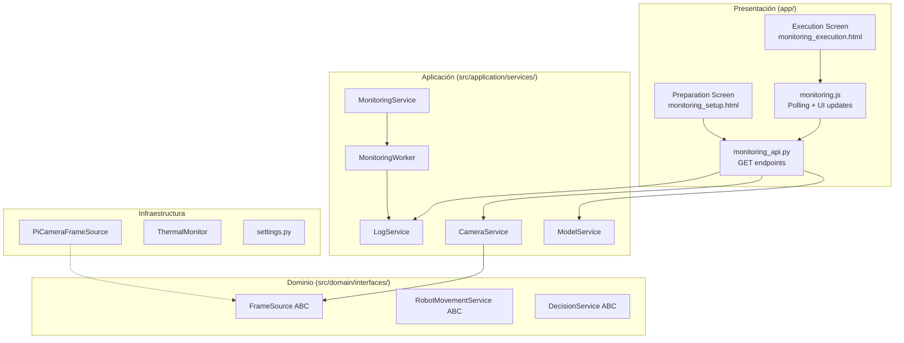

# Design Document — 010 Monitoring UX Enhancement

## Overview

Esta spec mejora la experiencia de usuario del monitoreo en Tomato Monitor mediante:

1. **LogService**: Servicio de registro de actividad en memoria, thread-safe, con cap de 200 entradas por sesión.
2. **CameraService**: Servicio de verificación y captura de un frame JPEG estático para vista previa.
3. **ModelService**: Verificación de existencia del archivo del modelo (sin cargarlo en memoria).
4. **Pantalla de Preparación** mejorada con vista previa de cámara, badges de estado, y botón condicional.
5. **Pantalla de Ejecución** mejorada con contadores en vivo, tiempo transcurrido, última imagen, panel de log, y auto-redirección.
6. **Interfaces abstractas** (RobotMovementService, DecisionService) como preparación para futura integración robótica.
7. **API endpoints** para cámara, log, y último snapshot.
8. **Integración** del LogService con MonitoringWorker existente.

El diseño prioriza rendimiento en Raspberry Pi 5: sin escrituras a DB para logs, sin streaming continuo de video, y polling limitado.

---

## Architecture



### Principios de diseño

- **Thread-safety**: LogService usa `threading.Lock` para escritura/lectura segura desde el hilo del worker y el hilo HTTP.
- **In-memory only**: Los logs NO se persisten en SQLite — están en un `dict[int, deque[LogEntry]]` keyed por `monitoring_id`.
- **Stateless preview**: Cada request a `/api/camera/preview` abre la cámara, captura un frame, cierra la cámara.
- **Sin carga de modelo**: ModelService solo verifica `Path.exists()` — no invoca `torch.load`.
- **Polling disciplinado**: Máximo 3 requests por ciclo de polling (status, log, thumbnail), cada 2 segundos.

---

## Components and Interfaces

### LogService

**Ubicación:** `src/application/services/log_service.py`

```python
from collections import deque
from dataclasses import dataclass, field
from datetime import datetime
from enum import Enum
from threading import Lock
from typing import Optional


class LogLevel(str, Enum):
    INFO = "info"
    SUCCESS = "success"
    WARNING = "warning"
    ERROR = "error"


@dataclass(frozen=True)
class LogEntry:
    """Immutable log entry for the activity panel."""
    timestamp: datetime
    level: LogLevel
    source: str
    message: str


class LogService:
    """In-memory, thread-safe log storage scoped per monitoring session.

    Stores up to MAX_ENTRIES per session. Discards oldest on overflow.
    """

    MAX_ENTRIES: int = 200

    def __init__(self) -> None:
        self._lock = Lock()
        self._sessions: dict[int, deque[LogEntry]] = {}

    def add_entry(
        self,
        monitoring_id: int,
        level: LogLevel,
        source: str,
        message: str,
    ) -> LogEntry:
        """Create and store a log entry for the given session."""
        ...

    def get_entries(
        self,
        monitoring_id: int,
        since: Optional[datetime] = None,
    ) -> list[LogEntry]:
        """Return entries for a session, optionally filtered by timestamp."""
        ...

    def clear_session(self, monitoring_id: int) -> None:
        """Remove all entries for a session (called on navigation away)."""
        ...
```

**Decisiones de diseño:**
- `deque(maxlen=200)` para eviction FIFO automática sin lógica extra.
- `threading.Lock` (no RLock) porque no hay llamadas anidadas al lock.
- `frozen=True` en `LogEntry` garantiza inmutabilidad — seguro compartir entre hilos sin copias.
- Singleton: una única instancia registrada en `app.state` al startup.

---

### CameraService

**Ubicación:** `src/application/services/camera_service.py`

```python
from enum import Enum
from dataclasses import dataclass
from typing import Optional


class CameraStatus(str, Enum):
    AVAILABLE = "available"
    NOT_DETECTED = "not_detected"
    ERROR = "error"


@dataclass
class CameraCheckResult:
    status: CameraStatus
    reason: Optional[str] = None


class CameraService:
    """Camera availability check and single-frame capture.

    Does NOT maintain a persistent connection. Each operation opens,
    acts, and releases the camera resource.
    """

    def __init__(self, camera_device_index: int = 0, timeout_seconds: float = 5.0):
        self._device_index = camera_device_index
        self._timeout = timeout_seconds

    def check_availability(self) -> CameraCheckResult:
        """Check if camera is physically connected and accessible."""
        ...

    def capture_preview_frame(self) -> Optional[bytes]:
        """Capture a single JPEG frame and release the camera.

        Returns JPEG bytes on success, None on failure.
        """
        ...
```

**Decisiones de diseño:**
- Usa `cv2.VideoCapture` internamente con timeout de 5 segundos.
- Release inmediato tras captura para no bloquear el inicio del monitoreo.
- Retorna `bytes` (JPEG encoded) en lugar de numpy array — listo para servir vía HTTP.
- No depende de `FrameSource` ABC porque la preview es un one-shot, no un stream.

---

### ModelService

**Ubicación:** `src/application/services/model_service.py`

```python
from enum import Enum
from pathlib import Path


class ModelStatus(str, Enum):
    AVAILABLE = "available"
    NOT_FOUND = "not_found"


class ModelService:
    """Lightweight model file existence check.

    Does NOT load the model into memory. Only verifies the file exists.
    """

    def __init__(self, model_path: Path):
        self._model_path = model_path

    def check_availability(self) -> ModelStatus:
        """Return AVAILABLE if model file exists, NOT_FOUND otherwise."""
        if self._model_path.exists() and self._model_path.is_file():
            return ModelStatus.AVAILABLE
        return ModelStatus.NOT_FOUND
```

**Decisiones de diseño:**
- Extremadamente simple — solo `Path.exists()`.
- No importa torch, no importa detectron2.
- Configurado con la ruta del modelo desde `settings.DETECTION_MODEL_PATH`.

---

### RobotMovementService (Abstract)

**Ubicación:** `src/domain/interfaces/robot_movement_service.py`

```python
from abc import ABC, abstractmethod
from dataclasses import dataclass
from typing import Optional


@dataclass
class RobotPosition:
    """Current position of the robot in the module coordinate system."""
    x_meters: float
    y_meters: float
    heading_degrees: float


class RobotMovementService(ABC):
    """Abstract interface for robot movement control.

    Implementations will handle specific motor controllers and
    communication protocols. No implementation is provided in this spec.
    """

    @abstractmethod
    def advance(self) -> None:
        """Command the robot to advance one step forward."""
        ...

    @abstractmethod
    def pause(self) -> None:
        """Command the robot to stop in place (resumable)."""
        ...

    @abstractmethod
    def stop(self) -> None:
        """Command the robot to perform a full stop (non-resumable)."""
        ...

    @abstractmethod
    def get_position(self) -> Optional[RobotPosition]:
        """Return current robot position, or None if unavailable."""
        ...
```

---

### DecisionService (Abstract)

**Ubicación:** `src/domain/interfaces/decision_service.py`

```python
from abc import ABC, abstractmethod
from enum import Enum
from typing import Any


class MovementDecision(str, Enum):
    ADVANCE = "advance"
    PAUSE = "pause"
    WAIT = "wait"


class DecisionService(ABC):
    """Abstract interface for frame-based movement decisions.

    Analyzes the current frame context and decides whether the robot
    should advance, pause, or wait before the next capture.
    """

    @abstractmethod
    def decide(self, frame_context: Any) -> MovementDecision:
        """Decide the next robot action based on the current frame context.

        Args:
            frame_context: Contextual data about the current frame
                (detections, change score, position, etc.)

        Returns:
            A MovementDecision indicating what the robot should do next.
        """
        ...
```

---

### API Endpoints

**Ubicación:** `app/routes/monitoring_api.py`

| Endpoint | Method | Response | Descripción |
|----------|--------|----------|-------------|
| `/api/camera/preview` | GET | `image/jpeg` (200) o JSON error (503) | Captura un frame JPEG de la cámara |
| `/api/camera/status` | GET | `{"status": "available\|not_detected\|error", "reason": "..."}` | Estado de disponibilidad de la cámara |
| `/api/monitoring/{id}/log` | GET | `[{timestamp, level, source, message}, ...]` | Log entries de la sesión, soporta `?since=ISO8601` |
| `/api/monitoring/{id}/last-snapshot` | GET | `image/jpeg` (200) o JSON (404) | Última imagen capturada de la sesión |

```python
from fastapi import APIRouter, Query, Response
from fastapi.responses import JSONResponse
from typing import Optional

router = APIRouter(prefix="/api", tags=["monitoring-api"])


@router.get("/camera/preview")
async def camera_preview(camera_service: CameraService = Depends(...)):
    """Return a single JPEG frame from the camera."""
    result = camera_service.check_availability()
    if result.status != CameraStatus.AVAILABLE:
        return JSONResponse(
            status_code=503,
            content={"error": "Cámara no disponible", "reason": result.reason},
        )
    frame_bytes = camera_service.capture_preview_frame()
    if frame_bytes is None:
        return JSONResponse(
            status_code=503,
            content={"error": "No se pudo capturar la imagen"},
        )
    return Response(content=frame_bytes, media_type="image/jpeg")


@router.get("/camera/status")
async def camera_status(camera_service: CameraService = Depends(...)):
    """Return camera availability status."""
    result = camera_service.check_availability()
    return {"status": result.status.value, "reason": result.reason}


@router.get("/monitoring/{monitoring_id}/log")
async def monitoring_log(
    monitoring_id: int,
    since: Optional[str] = Query(None),
    log_service: LogService = Depends(...),
):
    """Return log entries for a monitoring session."""
    ...


@router.get("/monitoring/{monitoring_id}/last-snapshot")
async def last_snapshot(
    monitoring_id: int,
    snapshot_repo: SnapshotRepository = Depends(...),
):
    """Return the most recent snapshot image as JPEG."""
    ...
```

---

### MonitoringWorker Integration with LogService

El `MonitoringWorker` existente recibirá una referencia a `LogService` en su constructor. En cada evento del ciclo de vida, emitirá un `LogEntry`:

```python
class MonitoringWorker:
    def __init__(self, ..., log_service: Optional[LogService] = None):
        self._log_service = log_service

    def _emit_log(self, level: LogLevel, message: str) -> None:
        if self._log_service:
            self._log_service.add_entry(
                monitoring_id=self._monitoring_id,
                level=level,
                source="worker",
                message=message,
            )
```

Puntos de emisión (Requirement 7):
- Inicio de inicialización → `info: "Inicializando cámara..."`
- Cámara OK → `success: "Cámara detectada correctamente."`
- Inicio carga modelo → `info: "Cargando modelo de detección..."`
- Modelo OK → `success: "Modelo cargado correctamente."`
- Transición a running → `info: "Monitoreo iniciado."`
- Cada snapshot → `info: "Capturando imagen... (snapshot N)"`
- Cada inferencia → `success: "Tomates detectados: X"`
- Completado → `success: "Monitoreo finalizado correctamente."`
- Error de cámara → `error: "No se pudo acceder a la cámara."`
- Error de modelo → `error: "No se pudo cargar el modelo de detección."`
- Temperatura alta → `warning: "Temperatura elevada (X°C)."`

---

## Data Models

### LogEntry (Value Object — in-memory only)

| Campo | Tipo | Descripción |
|-------|------|-------------|
| `timestamp` | `datetime` | Momento de creación (UTC) |
| `level` | `LogLevel` | Uno de: info, success, warning, error |
| `source` | `str` | Componente emisor (e.g., "worker", "camera", "model") |
| `message` | `str` | Mensaje en español para el panel de actividad |

**No se persiste en SQLite.** Reside exclusivamente en la memoria del proceso Python.

### CameraCheckResult (DTO)

| Campo | Tipo | Descripción |
|-------|------|-------------|
| `status` | `CameraStatus` | available, not_detected, error |
| `reason` | `Optional[str]` | Descripción del error (solo cuando status es error) |

### RobotPosition (Value Object — stub)

| Campo | Tipo | Descripción |
|-------|------|-------------|
| `x_meters` | `float` | Posición X en coordenadas del módulo |
| `y_meters` | `float` | Posición Y en coordenadas del módulo |
| `heading_degrees` | `float` | Orientación del robot (0-360) |

### MovementDecision (Enum — stub)

| Valor | Significado |
|-------|-------------|
| `advance` | Avanzar al siguiente punto |
| `pause` | Detenerse temporalmente |
| `wait` | Esperar sin moverse (retryable) |

---

## Correctness Properties

*A property is a characteristic or behavior that should hold true across all valid executions of a system — essentially, a formal statement about what the system should do. Properties serve as the bridge between human-readable specifications and machine-verifiable correctness guarantees.*

### Property 1: Log entry storage round-trip

*For any* valid monitoring session ID, log level, source string, and message string, adding a log entry and then retrieving entries for that session should return a list containing the added entry with all fields preserved (timestamp, level, source, message) and correctly associated with the given session ID.

**Validates: Requirements 1.1, 1.2**

### Property 2: LogService 200-entry cap with FIFO eviction

*For any* monitoring session and any sequence of N log entries where N > 200, the LogService should retain exactly 200 entries, and those entries should be the 200 most recently added (oldest discarded first).

**Validates: Requirements 1.4**

### Property 3: LogService retrieval is ordered by timestamp ascending

*For any* set of log entries added to a session (regardless of insertion order), retrieving all entries should return them sorted by timestamp in ascending order.

**Validates: Requirements 1.5**

### Property 4: Log entry timestamp filtering

*For any* set of log entries in a session and any timestamp T, calling `get_entries(monitoring_id, since=T)` should return exactly those entries whose timestamp is strictly greater than T, in ascending order.

**Validates: Requirements 9.2**

### Property 5: Elapsed time MM:SS formatting

*For any* non-negative integer of seconds, the elapsed time formatting function should produce a string matching the pattern `MM:SS` where MM equals `seconds // 60` (zero-padded to 2 digits) and SS equals `seconds % 60` (zero-padded to 2 digits).

**Validates: Requirements 6.1**

### Property 6: Start button enabled if and only if camera is available

*For any* camera status value, the "Iniciar Monitoreo" button should be enabled if and only if the status equals `available`. For all other statuses (`not_detected`, `error`), the button should be disabled.

**Validates: Requirements 4.4, 4.5**

### Property 7: Temperature warning banner threshold

*For any* numeric temperature value, the warning banner should be visible if and only if the temperature exceeds 70°C. For values ≤ 70, the banner should be hidden.

**Validates: Requirements 6.8**

### Property 8: Log entry rendering includes required components

*For any* LogEntry with a valid timestamp, level, and message, the rendered output should contain: the timestamp formatted as `HH:MM:SS`, a CSS class corresponding to the level (info→blue, success→green, warning→amber, error→red), and the full message text.

**Validates: Requirements 2.3**

---

## Error Handling

| Escenario | Capa | Respuesta |
|-----------|------|-----------|
| Cámara no conectada | CameraService | `CameraCheckResult(NOT_DETECTED, None)` |
| Error inesperado de cámara | CameraService | `CameraCheckResult(ERROR, reason_string)` |
| Timeout de cámara (>5s) | CameraService | `CameraCheckResult(NOT_DETECTED, None)` |
| Modelo no encontrado | ModelService | `ModelStatus.NOT_FOUND` |
| Preview request sin cámara | API | HTTP 503 + JSON `{"error": "Cámara no disponible"}` |
| Last-snapshot sin snapshots | API | HTTP 404 + JSON `{"error": "No hay snapshots disponibles"}` |
| Log request con session inválida | API | JSON `[]` (array vacío, no error) |
| Cámara perdida durante monitoreo | MonitoringWorker | Log error + estado → `error` |
| Modelo falla al cargar | MonitoringWorker | Log error + estado → `error` |
| Temperatura > 70°C | MonitoringWorker | Log warning + banner en UI |
| LogService overflow (>200) | LogService | Descarta entrada más antigua silenciosamente |

### Principio: Graceful Degradation

- Si CameraService falla, la Preparation Screen muestra "Imagen no disponible" y deshabilita el botón de inicio.
- Si el endpoint de log falla, el panel de actividad deja de actualizarse pero no crashea la pantalla.
- Si el endpoint de last-snapshot retorna 404, se muestra un placeholder SVG.
- Si el polling de status falla, se muestra un banner de reconexión amarillo.

---

## Testing Strategy

### Unit Tests (example-based)

- **LogService**: Crear/recuperar entries, verificar clear, verificar thread-safety con mock threading.
- **CameraService**: Mock `cv2.VideoCapture` para probar cada camino (available, not_detected, error, timeout).
- **ModelService**: Crear temp files para probar available/not_found.
- **API endpoints**: TestClient de FastAPI con servicios mockeados.
- **MonitoringWorker log emission**: Verificar que cada evento del lifecycle emite el LogEntry correcto.

### Property-Based Tests (Hypothesis)

- **Library**: [Hypothesis](https://hypothesis.readthedocs.io/) para Python.
- **Minimum iterations**: 100 por property.
- **Tag format**: `# Feature: 010-monitoring-ux-enhancement, Property N: {title}`

Properties a implementar:
1. Log entry storage round-trip (generates random levels, sources, messages)
2. 200-entry cap with FIFO eviction (generates N > 200 entries)
3. Retrieval ordered by timestamp ascending (generates entries with random timestamps)
4. Timestamp filtering with `since` parameter (generates entries + random cutoff)
5. Elapsed time MM:SS formatting (generates non-negative integers)
6. Start button enabled ↔ camera available (generates all status values)
7. Temperature banner threshold (generates float temperatures)
8. Log entry rendering includes required components (generates random LogEntry instances)

### Integration Tests

- Camera preview endpoint returns JPEG content-type
- Log endpoint returns JSON array
- Last-snapshot endpoint with/without snapshots
- Preparation screen loads with all components
- Execution screen polling cycle count ≤ 3 requests

### Smoke Tests

- Services importable from correct locations
- ABC interfaces have expected abstract methods
- LogService is singleton in app.state
- ModelService with known model path returns correct status
