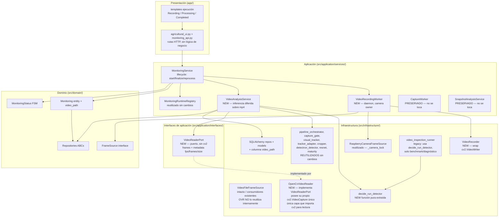
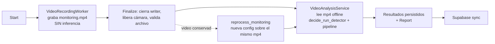
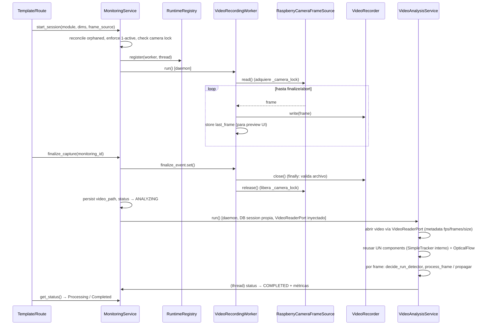
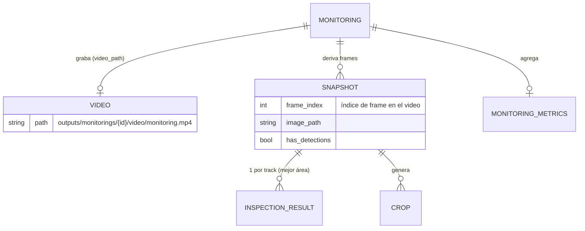
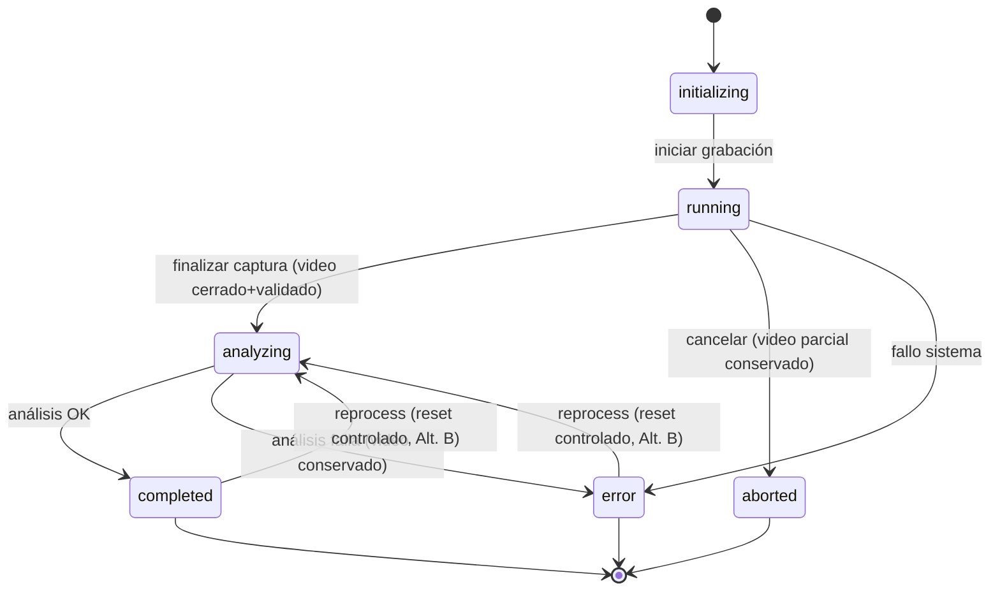

# Documento de Diseño: 019 — Video-First Monitoring

## Overview

Esta feature reemplaza la estrategia de adquisición y procesamiento del monitoreo, pasando de **capture-first** (selección de snapshots en vivo, con descarte irreversible de frames no seleccionados) a **video-first** (grabación del video completo como fuente primaria re-procesable). Al conservar el video original, la inferencia se ejecuta *offline* después de la caminata, y el mismo `monitoring.mp4` puede reprocesarse con una configuración distinta sin volver al invernadero.

### Dos problemas distintos que NO deben confundirse

La baja cobertura observada en campo (por ejemplo, del orden de ~4 de ~30 tomates en una corrida capture-first) puede provenir de **dos causas diferentes**, y esta spec no las resuelve de la misma manera:

- **(A) Problema de adquisición:** frames útiles se **descartan antes** de que RetinaNet los vea. La selección en vivo (Scene Gate + cooldown) elimina de forma irreversible los frames intermedios; el detector nunca tuvo la oportunidad de procesarlos.
- **(B) Problema de detector:** RetinaNet **recibe un buen frame pero no detecta** el tomate (falso negativo del modelo), por oclusión, escala pequeña, iluminación, umbral de score, etc.

**Spec 019 resuelve principalmente (A)** al conservar el video completo como fuente re-procesable: ningún frame se pierde antes de la inferencia. Además, **habilita diagnosticar y reprocesar (B)**, porque el mismo video puede reanalizarse con configuraciones distintas (por ejemplo, `full_detection` cuadro por cuadro, o umbrales alternativos) sin volver al invernadero.

**No se afirma que video-first garantice, por sí solo, una mejora de recall a un valor específico.** El detector, los modelos y sus umbrales permanecen sin cambios (ver *Fuera de alcance*). Lo que aporta esta feature es la capacidad de **medir sobre el video completo cuál de los dos problemas domina**: si al procesar el video íntegro con detección densa la cobertura sube, el cuello de botella era de adquisición (A); si sigue baja aun con detección densa, el cuello de botella es del detector (B) y deberá abordarse en una spec posterior de modelo.

El diseño separa de forma estricta dos fases:

1. **Captura (grabación):** el operario recorre el módulo con el dispositivo; se graba video sin inferencia pesada (`RUNNING = recording`).
2. **Análisis (inferencia diferida):** sobre el video ya cerrado, se aplica selección dispersa de frames (Scene Gate + Optical Flow + RetinaNet solo cuando se justifica) + tracking + salud + madurez (`ANALYZING = processing`).

El detector se mantiene en **Detectron2/RetinaNet R-50-FPN**; salud en **ResNet-18**; madurez en **HSV+CIELab (escala USDA de 6 etapas)**. **No se migra a YOLO.** Los snapshots pasan a ser artefactos **derivados** del video (frames donde efectivamente corrió RetinaNet), no capturas en vivo descartables. En producción **no** se genera video anotado (off por defecto); el archivo importante es el **video original**.

El diseño **reutiliza el pipeline de visión existente sin modificarlo** y **preserva los componentes capture-first actuales** (`CaptureWorker`, `SnapshotAnalysisService`) intactos para no romper regresión ni el modo benchmark/diagnóstico.

Prioridades declaradas (en este orden): **(1) integridad del video, (2) cobertura/recall de observaciones, (3) precisión/recall, (4) estabilidad, (5) rendimiento.** No se sacrifica recall por FPS: el procesamiento puede tardar tras la caminata.

---

## Architecture

### Diagrama de capas y responsabilidades



### Principios arquitectónicos aplicados

- **Clean Architecture:** las rutas FastAPI no contienen lógica de infraestructura; delegan en servicios de aplicación. El dominio permanece libre de SQLAlchemy, OpenCV, PyTorch y Detectron2. **La capa de aplicación tampoco importa `cv2`:** `VideoAnalysisService` **no** llama `cv2.VideoCapture` directamente; consume un puerto `VideoReaderPort` (interfaz de aplicación) cuya implementación OpenCV vive en infraestructura.
- **Reutilización sobre abstracción nueva:** se reusan `FrameSource`, los repositorios existentes y el pipeline de visión. La única interfaz nueva es `VideoReaderPort`, y existe por una razón concreta: `FrameSource` expone solo `read/release/is_available` y **no ofrece metadatos** (fps, número de frames, tamaño) que el análisis de video necesita. Su implementación (`OpenCvVideoReader`) **posee su propio y único `cv2.VideoCapture`** para lectura y metadatos; **no** se acopla al `_cap` privado de `VideoFileFrameSource` ni abre un segundo handle del mismo archivo. `VideoFileFrameSource` permanece intacto para sus consumidores actuales. No se crean abstracciones adicionales innecesarias.
- **Single Camera Owner:** durante la grabación, `VideoRecordingWorker` es el propietario exclusivo de la cámara vía el `_camera_lock` global de `RaspberryCameraFrameSource`. Ningún otro componente abre la cámara en paralelo.
- **Importabilidad sin Detectron2 ni OpenCV:** `VideoAnalysisService` recibe factories y el `VideoReaderPort` inyectados (igual que `SnapshotAnalysisService`), de modo que el módulo se importa sin Detectron2 y **sin importar `cv2` a nivel de módulo** (el `cv2` queda confinado a `OpenCvVideoReader` en infraestructura).
- **Sin robótica:** no hay locomoción, GPIO, motores ni navegación autónoma.

### Separación captura / análisis (clave del rediseño)



La ventaja central: como el video se conserva, el análisis es **idempotente y repetible**. Un fallo de inferencia nunca destruye evidencia; el video sigue disponible para reprocesar.

---

## Sequence Diagrams

### Flujo principal: grabación → análisis diferido



### Flujo de reprocesamiento (video-first habilita esto)

```mermaid
sequenceDiagram
    participant UI as Route
    participant MS as MonitoringService
    participant VAS as VideoAnalysisService

    UI->>MS: reprocess_monitoring(monitoring_id, config)
    MS->>MS: validar terminal (completed/error) AND video_path presente AND existe en disco
    MS->>MS: guard sync ESTRICTO: si Monitoring O algún Snapshot O algún InspectionResult O MonitoringMetrics == "synced" → BLOQUEAR (no orfandad en Supabase; sin DELETE remoto en 017/019)
    MS->>MS: limpiar resultados previos SOLO si NO sincronizados (snapshots, results, metrics, artefactos)
    MS->>MS: status → ANALYZING (transición controlada de reproceso)
    MS->>VAS: run() con config alternativa sobre el mismo mp4
    VAS->>MS: (thread) status → COMPLETED + métricas de la nueva config
```

---

## Components and Interfaces

### Componente 1: `decide_run_detector` (NUEVO — función pura extraída)

**Propósito:** encapsular la lógica de decisión "¿corre el detector en este frame?" que hoy está embebida en `video_inspection_runner.run_video_inspection`. Se extrae para reutilizarla en **ambos** consumidores (el nuevo `VideoAnalysisService` y el runner legacy) sin duplicar código.

**Ubicación:** `src/infrastructure/vision/detector_decision.py` (módulo nuevo, sin dependencias pesadas — solo lógica; el Scene Gate se inyecta o se llama por callable).

**Responsabilidades:**
- Decidir `run_detector: bool` y `reason: str` a partir del estado de muestreo disperso.
- No abrir cámara, no correr inferencia, no tocar disco. Función pura salvo la llamada opcional al Scene Gate (que también es puro sobre dos frames).

**Interface (English):**

```python
@dataclass(frozen=True)
class DetectorDecision:
    run_detector: bool
    reason: str  # first_frame | max_gap_force | scene_gate | scene_gate_blocked | min_gap_ready | cooldown | full_detection

def decide_run_detector(
    *,
    frame_idx: int,
    frames_since_last_detection: int,
    last_detection_frame: "np.ndarray | None",
    current_frame: "np.ndarray",
    enable_sparse_detection: bool,
    use_scene_gate: bool,
    min_frames_between_detections: int,
    max_frames_without_detection: int,
    force_detect_on_first_frame: bool,
    scene_gate_fn: Callable[..., tuple[bool, dict]],  # inyectado: should_run_detector_by_scene_change
) -> DetectorDecision: ...
```

### Componente 1b: `VideoReaderPort` + `OpenCvVideoReader` (NUEVO — puerto de aplicación + adaptador de infraestructura)

**Propósito:** desacoplar `VideoAnalysisService` de OpenCV. `FrameSource` solo expone `read/release/is_available` y **no** ofrece metadatos (fps, número de frames, tamaño), que el análisis de video necesita. Se introduce un puerto mínimo a nivel de aplicación que entrega frames **y** metadatos; su implementación OpenCV vive en infraestructura y **posee su propio y único `cv2.VideoCapture`**.

**Ubicación del puerto:** `src/application/interfaces/video_reader_port.py` (junto a `sync_state_port.py`). **No importa `cv2`.**
**Ubicación del adaptador:** `src/infrastructure/camera/opencv_video_reader.py` (única capa que importa `cv2` para lectura de video).

**Interface (English):**

```python
# src/application/interfaces/video_reader_port.py  — sin cv2
@dataclass(frozen=True)
class VideoMetadata:
    fps: float
    total_frames: int
    width: int
    height: int

class VideoReaderPort(ABC):
    @abstractmethod
    def open(self) -> None: ...                 # abre la fuente; lanza si ilegible
    @abstractmethod
    def is_available(self) -> bool: ...
    @abstractmethod
    def metadata(self) -> VideoMetadata: ...    # fps / total_frames / width / height
    @abstractmethod
    def read(self) -> tuple[bool, "np.ndarray | None"]: ...
    @abstractmethod
    def release(self) -> None: ...
```

```python
# src/infrastructure/camera/opencv_video_reader.py  — importa cv2 aquí (y solo aquí, para lectura)
class OpenCvVideoReader(VideoReaderPort):
    """Posee UN único cv2.VideoCapture usado para open/is_available/metadata/read/release."""
    def __init__(self, video_path: str) -> None: ...
```

**Responsabilidades:**
- **Poseer exactamente UN `cv2.VideoCapture`** para todo su ciclo de vida: `open`, `is_available`, `metadata`, `read` y `release` operan sobre ese mismo handle.
- Exponer metadatos que `FrameSource` no tiene (`CAP_PROP_FPS`, `CAP_PROP_FRAME_COUNT`, `CAP_PROP_FRAME_WIDTH/HEIGHT`), leídos del **mismo** `VideoCapture` (no abrir un segundo handle solo para metadatos).
- **No** acceder al `_cap` privado de `VideoFileFrameSource` ni forzar su reutilización: reusar `VideoFileFrameSource` **no es obligatorio** y no debe hacerse si acopla a estado privado o abre dos handles del mismo archivo. `VideoFileFrameSource` permanece **intacto** para sus consumidores actuales.
- Reportar no-disponibilidad si el archivo no abre (video corrupto), sin lanzar hacia la capa de aplicación como excepción de infraestructura cruda.

**Regla de boundary:** ni `VideoReaderPort` ni `VideoAnalysisService` importan `cv2`. El único punto de acoplamiento a OpenCV para lectura de video es `OpenCvVideoReader`, que gestiona su propio `VideoCapture` único, inyectado por factory.

### Componente 2: `VideoRecorder` (NUEVO — infraestructura)

**Propósito:** envolver `cv2.VideoWriter` con selección de códec, apertura, escritura, cierre limpio en `finally` y validación del archivo resultante.

**Ubicación:** `src/infrastructure/camera/video_recorder.py`.

**Interface (English):**

```python
class VideoRecorder:
    def __init__(self, output_path: str, fps: float,
                 codec_candidates: tuple[str, ...] = ("mp4v", "avc1")) -> None: ...
                                          # fps = configured_recording_fps; NO recibe frame_size
    def open(self, frame_size: tuple[int, int]) -> None: ...
                                          # frame_size proviene EXCLUSIVAMENTE del primer frame válido;
                                          # prueba códecs en orden, primero que abra gana
    def write(self, frame_bgr: "np.ndarray") -> None: ...
                                          # tras open, toda frame debe coincidir con frame_size;
                                          # dimensión distinta -> error explícito de grabación (sin resize silencioso)
    def close(self) -> None: ...          # release() del writer; idempotente
    def validate(self) -> bool: ...       # archivo existe, tamaño > 0, cv2.VideoCapture puede abrirlo y leer 1 frame
    @property
    def frames_written(self) -> int: ...
    @property
    def codec_used(self) -> str: ...
```

**Responsabilidades:**
- Probar `mp4v` y hacer fallback a `avc1` (u otro) si el writer no abre en Bookworm ARM64.
- **`fps` en el constructor, `frame_size` en `open()`:** el fps nominal (`configured_recording_fps`) se fija en `__init__`; la dimensión **no** se pasa en el constructor. Las dimensiones se descubren **exclusivamente** del **primer frame válido** entregado por el `FrameSource` y se pasan a `open(frame_size=(w, h))`. Los metadatos (`recorded_width`/`recorded_height`) reflejan la dimensión **realmente grabada**.
- **Dimensión fija tras `open`:** una vez abierto, todas las frames deben coincidir con `frame_size`. Si aparece una frame con dimensión distinta, se trata **explícitamente como un error de grabación** (no hay resize silencioso).
- Garantizar `release()` del writer en `finally` aunque falle la grabación.
- **Escritura sin pérdida de información:** escribe cada frame entregado por el `FrameSource` a la resolución de grabación, **sin** downscale extra para ahorrar inferencia (no hay inferencia en grabación) y **sin** selección de frames.
- Validar el `.mp4` tras cerrar (evita videos corruptos silenciosos).
- **Finalización atómica:** escribe a `monitoring.recording.mp4`; solo tras validar renombra atómicamente a `monitoring.mp4` (ver *finalize_capture*).

### Componente 3: `VideoRecordingWorker` (NUEVO — aplicación)

**Propósito:** análogo a `CaptureWorker`, pero **graba video en lugar de seleccionar snapshots**. Daemon thread, propietario exclusivo de la cámara, consume `FrameSource.read()` y escribe cada frame en `VideoRecorder`. **No ejecuta inferencia.**

**Ubicación:** `src/application/services/video_recording_worker.py`.

**Interface (English):**

```python
@dataclass
class RecordingMetrics:
    recording_duration_seconds: float = 0.0
    frames_written: int = 0
    effective_recording_fps: float = 0.0     # medido = frames_written / recording_duration_seconds
    configured_recording_fps: float = 0.0    # fps nominal solicitado/configurado
    container_fps: float = 0.0               # = configured_recording_fps (fps con que se abre el VideoWriter; NO se modifica tras grabar)
    deviation_between_configured_and_effective_fps: float = 0.0  # diagnóstico = configured - effective (el video NUNCA se reescribe por esto)
    recorded_width: int = 0                  # dimensión REAL grabada (del primer frame)
    recorded_height: int = 0
    codec_used: str = ""
    peak_temperature_c: float = 0.0
    exit_reason: str = ""  # finalize | abort | error | frame_source_exhausted

class VideoRecordingWorker:
    def __init__(self, monitoring_id: int, frame_source: FrameSource,
                 video_recorder: VideoRecorder, monitoring_repo, db_session, *,
                 configured_recording_fps: float, thermal_monitor=None, log_service=None) -> None: ...
    def run(self) -> None: ...            # loop; siempre libera recursos en finally
    def release_resources(self) -> None: ...  # idempotente: recorder.close() + frame_source.release()
    def get_last_frame(self) -> "np.ndarray | None": ...  # THREAD-SAFE: retorna una COPIA del último frame leído
    @property
    def recording_metrics(self) -> RecordingMetrics: ...
    # eventos: finalize_event, abort_event, pause_event, thermal_pause_event
```

**Responsabilidades:**
- Adquirir cámara (una sola vez), leer frames, escribirlos al recorder, actualizar `last_frame` para el preview.
- **Propiedad de la cámara y del FPS (decisión adoptada):** `VideoRecordingWorker` es el **único propietario de la cámara** durante la grabación (nunca se abre una segunda `Picamera2`). **La cadencia de captura la controla explícitamente la cámara/frame source; el worker NO aplica throttle adicional.** El worker **escribe cada frame** entregado por el `FrameSource` (sin `sleep()` de limitación de FPS). Ver la sección *Propiedad del FPS y throttle*.
- Exponer `finalize_event`/`abort_event` y métricas de grabación (`frames_written`, `recording_duration_seconds`, `configured_recording_fps`, `container_fps = configured_recording_fps`, `effective_recording_fps`, `deviation_between_configured_and_effective_fps`).
- Pausa cooperativa térmica (igual patrón que `CaptureWorker`), aunque la grabación es ligera; la protección térmica principal recae sobre la fase de análisis.
- `get_last_frame()` **thread-safe**: el preview no lee la cámara; lee el último frame ya leído por el worker de grabación, obtenido vía `MonitoringRuntimeRegistry.get_worker()` (protegido por `RLock`). El método retorna una **copia** del frame (o mecanismo equivalente), **nunca** un `ndarray` que pueda ser mutado concurrentemente por el loop de grabación.
- **Nunca** perder el video: en `finally`, cierra el recorder (que valida el archivo) y libera la cámara.

### Componente 4: `VideoAnalysisService` (NUEVO — aplicación)

**Propósito:** análogo a `SnapshotAnalysisService`, pero la fuente es `monitoring.mp4` en lugar de snapshots ya guardados. Itera el video a través del `VideoReaderPort` inyectado (sin importar `cv2`), aplica `decide_run_detector`, ejecuta `process_frame` cuando corresponde, propaga con Optical Flow en frames omitidos, y **materializa snapshots derivados** (DB + JPEG) en los frames donde se programó (scheduled) el detector.

**Reutilización del tracking — NO se crea un segundo `SimpleTracker`:** el servicio mantiene **un único objeto `components`** (obtenido de `build_pipeline_components()`) durante **todo** el video. Como `build_pipeline_components()` ya crea `tracker = SimpleTracker()` y `process_frame()` invoca `components.tracker.update(detections)`, reutilizar el mismo `components` a lo largo del video **ya proporciona tracking cross-frame** de las detecciones de RetinaNet, sin instanciar ningún tracker adicional. Existen entonces **exactamente dos trackers con roles distintos**:

1. `components.tracker` (`SimpleTracker`) — **tracking cross-frame de las detecciones de RetinaNet** en los frames donde el detector efectivamente corre.
2. `OpticalFlowVisualTracker` — **propagación visual** de tracks en los frames donde RetinaNet **no** corre (relleno óptico entre detecciones).

`VideoAnalysisService` **no** instancia su propio `SimpleTracker`.

**Ubicación:** `src/application/services/video_analysis_service.py`.

**Interface (English):**

```python
@dataclass
class VideoAnalysisConfig:
    min_frames_between_detections: int
    max_frames_without_detection: int
    use_scene_gate: bool
    enable_flow_propagation: bool
    enable_sparse_detection: bool = True
    force_detect_on_first_frame: bool = True
    full_detection: bool = False          # solo diagnóstico
    save_annotated_video: bool = False    # OFF por defecto en producción

class VideoAnalysisService:
    def __init__(self, monitoring_id: int, video_path: str,
                 snapshot_repo, inspection_result_repo, monitoring_repo, db_session, *,
                 config: VideoAnalysisConfig,
                 video_reader: "VideoReaderPort",          # inyectado; oculta cv2 tras el puerto
                 components_factory: Optional[Callable] = None,
                 process_frame_fn: Optional[Callable] = None,
                 annotation_renderer: Optional[Callable] = None,
                 thermal_monitor=None, report_writer=None, profile_name=None) -> None: ...
    def run(self) -> "VideoAnalysisResult": ...
    @property
    def progress(self) -> "VideoAnalysisProgress": ...
    @property
    def error_reason(self) -> Optional[str]: ...
```

**Responsabilidades:**
- Abrir el video **a través de `VideoReaderPort`** y leer metadatos (fps, total frames, tamaño) del puerto. Manejar video corrupto (el puerto reporta no-disponibilidad).
- Mantener un único `components` durante todo el video (tracking cross-frame de RetinaNet vía `components.tracker`) y un `OpticalFlowVisualTracker` para propagación en frames sin detector.
- Por frame: decidir detector, correr `process_frame` o propagar tracks.
- **Semántica de métricas de análisis por frame** (tolerancia a fallos parciales):
  - `detector_scheduled_frames`: frames donde `decide_run_detector` retornó `run_detector = true`.
  - `analysis_successful_frames`: frames programados donde `process_frame()` completó con éxito.
  - `analysis_failed_frames`: frames programados donde `process_frame()` **o** una persistencia recuperable relacionada lanzó excepción (la excepción puede ocurrir **incluso dentro de RetinaNet** en `process_frame()`; no distinguimos aquí si el fallo fue en RetinaNet, ResNet o madurez — el error/log por frame puede registrarlo cuando esté disponible).
  - **Invariante:** `analysis_successful_frames + analysis_failed_frames == detector_scheduled_frames`.
  - En **todo** frame con detector programado se **persiste el snapshot crudo (raw frame + registro DB) ANTES** de llamar a `process_frame()`, para trazabilidad; así se conserva aunque el análisis falle. El conteo de snapshots es consistente con "frames donde se programó el detector", no con "frames donde el análisis fue perfecto".
- Generar crops; persistir un `DetectionInspectionResult` por track (mejor área), igual que `SnapshotAnalysisService`.
- Calcular `MonitoringMetrics`, escribir `pipeline_metrics.json` con `detector_scheduled_frames`, `analysis_successful_frames`, `analysis_failed_frames` y las métricas de grabación/muestreo (ver Data Models).
- Pausa térmica cooperativa (mismo patrón que `SnapshotAnalysisService`).
- Fault tolerance: si `process_frame()` falla en un frame (incluso durante RetinaNet), se registra (`analysis_failed_frames`) y se continúa con el siguiente; el snapshot ya persistido se conserva.

### Componente 5: `MonitoringService` (MODIFICADO)

**Cambios (aditivos, sin romper capture-first):**
- `start_session(...)`: si el modo activo es video-first, arranca `VideoRecordingWorker` (estado `RUNNING = recording`) en lugar de `CaptureWorker`. `CaptureWorker` permanece disponible y sin cambios para regresión/benchmark.
- `finalize_capture(...)`: señala fin de grabación, espera al hilo, **cierra el video y valida el archivo**, persiste `video_path`, y lanza `VideoAnalysisService` (estado `ANALYZING = processing`).
- `reprocess_monitoring(monitoring_id, config)`: **método nuevo**. Reprocesa el `mp4` almacenado con una configuración distinta. Ver la sección de máquina de estados para el manejo de terminalidad.

### Componente 6: rutas y templates (MODIFICADO)

- `app/routes/agricultural_ui.py` + templates de ejecución: **sin selección manual de archivos** desde `data/videos`. Se conserva exactamente el concepto Greenhouse → Module → Monitoring. La UI refleja únicamente **Recording → Processing → Completed**.
- Preview durante grabación: **no** se abre la cámara en paralelo y **nunca** se llama `capture_single_frame()` mientras se graba. El `VideoRecordingWorker` es el único propietario de la cámara. La ruta de preview obtiene el worker vía `MonitoringRuntimeRegistry.get_worker()` (thread-safe, `RLock`) y muestra `worker.get_last_frame()`, que devuelve una **copia** del último frame leído. Nunca se instancia una segunda `Picamera2`.

---

## Data Models

### Cambio de persistencia: columna `video_path` en `monitorings`

Se añade la columna `video_path VARCHAR(500)` nullable. **Importante — corrección de migración:** `Base.metadata.create_all(checkfirst=True)` **NO** añade columnas a tablas SQLite que **ya existen**; solo crea tablas ausentes. En una instalación nueva, `create_all()` crea `monitorings` con la columna; pero en una **base de datos Raspberry existente** la columna nunca aparecería si dependiéramos solo de `create_all()`. Por eso se requiere una **migración idempotente real**, siguiendo el patrón ya establecido en `src/infrastructure/persistence/database.py` (`_migrate_add_columns`, `_migrate_add_sync_columns`), que se ejecuta desde `DatabaseManager.init_db()`.

Se aplican cuatro cambios coordinados:

1. **ORM (`MonitoringModel`):** añadir el mapeo de la columna.
   ```python
   # src/infrastructure/persistence/models/monitoring_model.py (MODIFICADO)
   video_path: Mapped[str | None] = mapped_column(String(500), nullable=True)
   ```
2. **Entidad de dominio (`Monitoring`):** añadir el campo opcional, sin acoplar a SQLAlchemy.
   ```python
   # src/domain/entities/monitoring.py (MODIFICADO — añadir campo)
   video_path: Optional[str] = None   # ruta relativa al mp4 original; None si aún no grabado
   ```
3. **Mapeo del repositorio (`SqlMonitoringRepository`):** mapear `video_path` en ambos sentidos (model → domain y domain → model), de modo que se persista y se lea.
4. **Migración idempotente real** dentro de `_migrate_add_columns`, cableada en `init_db()`:
   ```python
   # src/infrastructure/persistence/database.py — dentro de _migrate_add_columns(engine)
   # (monitoring_columns ya se obtiene con PRAGMA table_info(monitorings))
   if "video_path" not in monitoring_columns:
       conn.execute(
           text("ALTER TABLE monitorings ADD COLUMN video_path VARCHAR(500)")
       )
   ```
   El chequeo `PRAGMA table_info` garantiza idempotencia: la migración añade la columna **solo si está ausente**, y no hace nada en reinicios posteriores.

**Cobertura de la migración (debe funcionar en los tres casos):**
- **Instalación nueva:** `create_all()` crea `monitorings` con `video_path`; la migración detecta que ya existe y no hace nada.
- **BD Raspberry existente (sin `video_path`):** `create_all()` no toca la tabla existente; `_migrate_add_columns` ejecuta el `ALTER TABLE ... ADD COLUMN` y crea la columna preservando todas las filas existentes.
- **Reinicios posteriores:** la columna ya existe; la migración es no-op.

> **NO** se afirma en ningún punto que `create_all()` por sí solo migre esta columna en bases existentes.

**Test obligatorio de migración:** partir de una BD existente **sin** `video_path` → ejecutar `init_db()`/migración → verificar que la columna `video_path` fue creada **y** que las filas existentes se preservan intactas (mismo conteo y contenido).

**Reglas de validación:**
- `video_path` se persiste como ruta **relativa** desde la raíz del proyecto (consistente con `image_path` de `Snapshot`).
- Un `Monitoring` con `video_path` no nulo y archivo existente en disco **conserva el video técnicamente disponible**. Esto **no** implica que sea siempre reprocesable de forma destructiva: `reprocess_monitoring` **solo** puede ejecutarse si se cumplen sus precondiciones (estado terminal `completed`/`error`, `video_path` no nulo, archivo existente en disco) **y** el guard estricto de sincronización lo permite. Si el `Monitoring`, algún `Snapshot`, algún `DetectionInspectionResult` o `MonitoringMetrics` tiene `remote_sync_status == "synced"` (una sola entidad basta), el reproceso destructivo se **bloquea**.

### Relación de artefactos (adaptada al layout actual)

```
Monitoring (id)
  └── video/monitoring.recording.mp4  ← TEMP: mientras se graba (aún no validado)
  └── video/monitoring.mp4          ← NUEVO: fuente primaria re-procesable (solo tras validar+rename atómico)
  └── snapshots/raw/snapshot_XXXXXX.jpg   ← DERIVADO: frames donde se programó RetinaNet (detector_scheduled)
  └── annotated_snapshots/...        ← opcional (recuperable, no crítico)
  └── crops/snapshot_XXXXXX/track_YYY.jpg
  └── reports/pipeline_metrics.json  ← métricas + config usada
```



### Layout de salida (con subcarpeta `video/` añadida)

```
outputs/monitorings/{id}/
├── video/
│   ├── monitoring.recording.mp4  ← TEMP durante grabación (rename atómico → monitoring.mp4 al validar)
│   └── monitoring.mp4          ← NUEVO: final validado
├── snapshots/raw/
│   └── snapshot_000123.jpg     ← derivados (frame_index = índice de frame; detector_scheduled)
├── annotated_snapshots/        ← opcional
├── crops/snapshot_000123/
│   └── track_007.jpg
└── reports/
    └── pipeline_metrics.json
```

### Configuración por perfil (settings.py — MODIFICADO)

Se añaden parámetros de muestreo disperso al `ExecutionProfile` (NO se hardcodea min5/max12 como final). El candidato técnico `sparse_flow_candidate` se usa como **baseline** y es configurable por perfil.

```python
# Nuevos campos en ExecutionProfile:
video_first_enabled: bool
recording_target_fps: float                     # fps objetivo de grabación -> configured_recording_fps del worker/recorder;
                                                # configurado explícitamente en la config VIDEO de Picamera2 (FrameRate/FrameDurationLimits);
                                                # el effective_recording_fps se mide y compara (diagnóstico), el video no se reescribe
video_codec_candidates: tuple[str, ...]         # ("mp4v", "avc1")
sparse_min_frames_between_detections: int       # baseline ≈ 5 — GAP EN FRAMES, depende del fps
sparse_max_frames_without_detection: int        # baseline ≈ 12 — GAP EN FRAMES, depende del fps
sparse_use_scene_gate: bool                     # True
sparse_enable_flow_propagation: bool            # True
save_annotated_video: bool                      # False en producción
```

Baseline `sparse_flow_candidate` (documentado, no definitivo): `min≈5`, `max≈12`, `use_scene_gate=true`, `enable_flow_propagation=true`. Benchmarks previos: `full_detection` 0.17 FPS / 29 tracks vs `sparse` ~2.10 FPS / 16 tracks (~45% de pérdida de cobertura). Dado el orden de prioridades, `edge` puede usar valores **más conservadores** (menos omisiones) para preservar recall, aceptando más tiempo de procesamiento.

#### Metadatos reales del video de referencia (medidos)

Metadatos medidos de `data/videos/video_02.mp4`: **30 fps, 165 frames, 720×1280**. En consecuencia, los gaps legacy `min≈5` / `max≈12` son **gaps expresados en frames**, cuya equivalencia temporal **depende del fps**: a 30 fps corresponden aproximadamente **0.17 s** (5 frames) y **0.40 s** (12 frames). Cambiar el fps del video cambia el significado temporal de esos mismos gaps en frames.

#### FPS de grabación: cadencia controlada por la cámara (decisión adoptada)

Se verificó que **tanto** `RaspberryCameraFrameSource._start_camera()` (ruta persistente) **como** `capture_single_frame()` (ruta de preview) usan `create_still_configuration(main={"size": ...})` **sin** `controls={"FrameRate": ...}` ni `FrameDurationLimits`, y **no** usan `self._fps`. La *still-configuration* no impone una cadencia física.

**Decisión adoptada:** video-first usa una **configuración VIDEO de Picamera2** con un FPS objetivo configurado explícitamente vía los controles soportados (`FrameRate` o `FrameDurationLimits`), aplicada como una **ruta de captura orientada a video usada solo para la grabación video-first** — el **cambio más pequeño posible**, que **no** modifica la ruta *still* de preview/capture-first ni crea una segunda `Picamera2`. La cadencia queda controlada por la cámara; el `VideoRecordingWorker` **no** aplica throttle. Aun así, el `effective_recording_fps` **debe medirse** de forma independiente (`frames_written / recording_duration_seconds`) y compararse con el `configured_recording_fps` como diagnóstico (`deviation_between_configured_and_effective_fps`); el video **no** se reescribe por esa desviación.

#### Métricas de grabación y muestreo a registrar

`pipeline_metrics.json` (y las métricas de grabación) deben registrar, para poder razonar sobre la equivalencia temporal:

- `configured_recording_fps` — fps nominal solicitado/configurado.
- `container_fps` — fps declarado en el contenedor del mp4 final; **= `configured_recording_fps`** (fps con que se abrió el `VideoWriter`; nunca se modifica tras grabar).
- `effective_recording_fps` — fps efectivo **medido** = `frames_written / recording_duration_seconds`.
- `deviation_between_configured_and_effective_fps` — desviación diagnóstica = `configured_recording_fps - effective_recording_fps` (registrada como métrica; el video **nunca** se reescribe, sin remux/two-pass/re-encode).
- `source_video_fps` — fps declarado por el contenedor del video analizado (vía `VideoReaderPort.metadata`).
- `min_frames_between_detections`, `max_frames_without_detection` — gaps de muestreo en frames usados en el análisis.
- Equivalencia temporal aproximada de ambos gaps (gap_frames / fps efectivo o de fuente, según corresponda), documentada como orientación, no como configuración.

#### Muestreo temporal — FUERA DE ALCANCE de Spec 019 (diferido)

`min_frames_between_detections` / `max_frames_without_detection` se mantienen **configurables**. Se registran, para análisis posterior, `source_video_fps`, los gaps min/max **en frames** y su equivalencia temporal **aproximada**. El baseline legacy permanece como **referencia únicamente**: `min≈5` / `max≈12`.

**Explícitamente fuera de alcance en Spec 019:**
- **NO** hay conversión automática de gap-en-frames → intervalo-de-tiempo.
- **NO** hay muestreo basado en segundos ni un *spike* de muestreo temporal en esta spec.
- **NO** hay task ni spike aquí para esta alternativa; queda **diferida** a una spec futura.

El mismo video puede reprocesarse más tarde con distintas configuraciones de muestreo (`min5/max12`, `min3/max8`, `full_detection`, etc.) sin depender de una conversión temporal.

**Alternativa abierta (NO adoptada, diferida fuera de esta spec):** derivar los gaps de frames a partir de **intervalos de tiempo × fps real** (por ejemplo, "detectar cada ~0.2 s") para que el muestreo sea independiente del fps del video. **No se auto-convierte** `min5/max12` a una configuración definitiva ni se cambia el comportamiento del runner legacy: el `video_inspection_runner` legacy debe **reproducir exactamente sus decisiones previas**. Esta conversión temporal queda como trabajo futuro evaluable sobre el mismo video, **sin task ni spike en Spec 019**.

---

## State Machine (recording / processing / reprocess)

La FSM existente (`MonitoringStatus`) define: `initializing, running, paused, finishing, analyzing, completed, aborted, error`, donde `completed/aborted/error` son **terminales**.

### Mapeo del flujo video-first

| Concepto video-first | Estado FSM | Notas |
|---|---|---|
| Grabando video | `running` | `initializing → running` como hoy |
| Procesando (inferencia diferida) | `analyzing` | `running → analyzing` como hoy |
| Terminado | `completed` | `analyzing → completed` como hoy |
| Cancelación explícita del operario | `aborted` | video parcial conservado si existe |
| Fallo del sistema | `error` | **el video NO se pierde** |

El flujo feliz **no requiere estados nuevos**: `initializing → running (recording) → analyzing (processing) → completed`.

### Invariante crítico

> **Nunca** mostrar `completed` mientras el video se está procesando. La transición a `completed` ocurre exclusivamente al finalizar el análisis con éxito (patrón idéntico a `SnapshotAnalysisService`).

### Decisión de diseño: reprocesamiento vs terminalidad

`completed` es actualmente terminal, por lo que reprocesar un monitoreo terminado requiere una decisión explícita. Se evaluaron dos alternativas:

**Alternativa A — Transición controlada `completed → analyzing` (reproceso).**
Añadir a `VALID_TRANSITIONS` una arista de reproceso desde `completed` (y desde `error`) hacia `analyzing`, activada **solo** por `reprocess_monitoring`. Ventaja: modela el reproceso de forma explícita en la FSM. Desventaja: rompe la propiedad "terminal = inmutable", lo que puede sorprender a código/tests que asumen terminalidad estricta.

**Alternativa B — Mecanismo de reproceso que NO viola terminalidad (recomendada).**
`reprocess_monitoring` no muta el estado terminal con una transición directa prohibida; en su lugar realiza un **reset controlado**: valida precondiciones (estado terminal `completed`/`error` **y** `video_path` presente **y** archivo existente), limpia resultados previos (snapshots, inspection results, metrics, artefactos) dentro de una operación de aplicación, y **reinicializa** el estado a `analyzing` mediante un método explícito de repositorio (`reset_for_reprocess`) que documenta que se trata de un reinicio de análisis, no de una transición de negocio normal. La FSM sigue rechazando transiciones directas desde terminales; el reset es una operación de servicio deliberada y auditada.

**Decisión:** se adopta la **Alternativa B**. Motivos:
- Mantiene la garantía de terminalidad para el flujo normal (menos riesgo de romper tests/consumidores).
- Hace explícito y auditable que reprocesar es una operación deliberada del operario.
- El invariante "nunca `completed` durante procesamiento" se respeta: el reset lleva a `analyzing` **antes** de arrancar el hilo, y solo vuelve a `completed` al terminar.



### Reconciliación de sesiones huérfanas (adaptada)

`_reconcile_orphaned_sessions` hoy marca `error` toda sesión activa sin hilo vivo. Se adapta el criterio de recuperación: una sesión marcada `error` que **conserva `video_path` con archivo válido** mantiene el **video técnicamente disponible** (no se pierde el video). La reconciliación en sí sigue marcando `error` (para desbloquear el módulo), pero el video permanece y `reprocess_monitoring` puede recuperarlo **siempre que se cumplan sus precondiciones y el guard estricto de sincronización lo permita** (si alguna entidad relacionada está `synced`, el reproceso destructivo se bloquea). Para el caso de **terminación abrupta** (donde solo existe el temp `monitoring.recording.mp4` sin promover), aplica además la rutina *Recuperación tras terminación abrupta* descrita en la sección de finalize/error: validar el temp de forma segura y, solo si valida, promoverlo a `monitoring.mp4`; nunca auto-marcarlo como válido sin validación.

---

## Algorithmic Pseudocode & Formal Specifications

### `decide_run_detector`

```pascal
ALGORITHM decide_run_detector(frame_idx, gap, last_frame, current_frame,
                              enable_sparse, use_gate, min_gap, max_gap,
                              force_first, scene_gate_fn)
INPUT: estado de muestreo disperso del frame actual
OUTPUT: DetectorDecision(run_detector, reason)

BEGIN
    IF NOT enable_sparse THEN
        RETURN (true, "full_detection")        // solo modo diagnóstico
    END IF

    IF frame_idx = 0 AND force_first THEN
        RETURN (true, "first_frame")
    END IF

    IF gap >= max_gap THEN
        RETURN (true, "max_gap_force")         // fuerza para no perder cobertura
    END IF

    IF gap >= min_gap THEN
        IF use_gate AND last_frame IS NOT NULL THEN
            (trigger, _) <- scene_gate_fn(reference=last_frame,
                                          current=current_frame,
                                          frames_since_last_detection=gap)
            IF trigger THEN RETURN (true,  "scene_gate")
            ELSE            RETURN (false, "scene_gate_blocked")
            END IF
        ELSE
            RETURN (true, "min_gap_ready")
        END IF
    END IF

    RETURN (false, "cooldown")
END
```

**Preconditions:** `current_frame` no nulo y bien formado; `min_gap <= max_gap`; `scene_gate_fn` invocable.
**Postconditions:** retorna exactamente una razón del conjunto cerrado; función pura (sin efectos salvo la evaluación del gate, también pura sobre dos frames).
**Loop invariants:** N/A (no contiene bucles).
**Nota de reutilización:** la lógica es una extracción 1:1 del bloque `run_detector`/`detector_reason` de `video_inspection_runner.run_video_inspection`; el runner legacy pasa a llamar esta función para eliminar duplicación **sin cambiar su comportamiento**.

### `VideoRecordingWorker.run`

```pascal
ALGORITHM VideoRecordingWorker.run()
// SIN inferencia, SIN Scene Gate, SIN selección de snapshots, SIN downscale extra.
// Escribe TODOS los frames entregados por el FrameSource a la resolución entregada.
BEGIN
    start_time <- now()
    recorder_opened <- false
    TRY
        thermal_monitor.start()  IF present
        WHILE NOT abort_event AND NOT finalize_event DO
            WHILE (pause OR thermal_pause) AND NOT abort AND NOT finalize DO sleep(0.1)
            IF abort OR finalize THEN BREAK
            (ok, frame) <- frame_source.read()
            IF NOT ok OR frame IS NULL THEN
                error_reason <- "camera no responde"; exit_reason <- "frame_source_exhausted"; BREAK
            END IF
            IF NOT recorder_opened THEN
                // abrir con la dimensión del PRIMER frame real (descubierta del frame, no configurada);
                // fps nominal (configured_recording_fps) ya fijado en el constructor del recorder
                recorder.open(frame_size = (frame.shape[1], frame.shape[0]))  // prueba códecs
                recorder_opened <- true
                record recorded_width/recorded_height from frame.shape
            END IF
            // tras open: si frame.shape != frame_size grabado -> error explícito (sin resize silencioso)
            recorder.write(frame)          // escribe CADA frame; escribió también el primero
            set_last_frame(frame)          // guarda COPIA thread-safe para preview UI
            frames_written <- frames_written + 1
            // cadencia propiedad del frame source; NO sleep. El worker no limita FPS:
            // cada frame entregado por el FrameSource se escribe.
        END WHILE
        set exit_reason from finalize/abort if unset
    CATCH e
        error_reason <- e; exit_reason <- "error"
    FINALLY
        IF recorder_opened THEN recorder.close()   // valida archivo en finally
        frame_source.release()                     // libera _camera_lock
        recording_duration_seconds <- now() - start_time
        effective_recording_fps <- frames_written / recording_duration_seconds  IF duration > 0
        container_fps <- configured_recording_fps                 // el VideoWriter se abrió con este fps; NO se modifica
        deviation_between_configured_and_effective_fps <- configured_recording_fps - effective_recording_fps  // diagnóstico
        // NO remux, NO two-pass, NO re-encode para "corregir" el fps: el video jamás se reescribe.
    END TRY
END
```

**Preconditions:** `frame_source` disponible; `recorder` no abierto aún; `configured_recording_fps` fijado en el constructor del recorder.
**Postconditions:** el `.mp4` queda cerrado y validado; la cámara queda liberada; el `VideoWriter` se abrió con `container_fps = configured_recording_fps` y ese fps **no** se altera tras grabar; `recording_metrics` reflejan el resultado real (`frames_written`, `recording_duration_seconds`, `configured_recording_fps`, `container_fps = configured_recording_fps`, `effective_recording_fps` medido independientemente, `deviation_between_configured_and_effective_fps` como métrica diagnóstica, `recorded_width/height`, `codec_used`). **Nunca** se sale de `run()` sin liberar la cámara.
**Loop invariant:** `frames_written` = número de frames efectivamente escritos en el recorder (incluido el primero que abrió el writer).

#### Propiedad del FPS y throttle (decisión adoptada — cierre de la política)

**Decisión:** la **cámara/frame source controla la cadencia de captura de forma explícita**; el `VideoRecordingWorker` **no** aplica throttle adicional. Regla de propiedad de la cadencia:

- **La cámara controla el FPS explícitamente.** Video-first usa una configuración **VIDEO de Picamera2** con un FPS objetivo configurado explícitamente mediante los controles soportados por Picamera2 (`FrameRate` o `FrameDurationLimits`, el que corresponda). Esto **preserva el comportamiento capture-first existente** de `RaspberryCameraFrameSource`: **no** se cambia indiscriminadamente la ruta de *still-configuration* usada por preview/capture-first. Se aplica el **cambio más pequeño posible**: una ruta/config de captura **orientada a video usada ÚNICAMENTE para la grabación video-first**. Hoy la ruta persistente (`_start_camera`) y la ruta de preview (`capture_single_frame`) usan `create_still_configuration(main={"size": ...})` **sin** controles de FPS; video-first añade su propia configuración de video sin tocar esas rutas.
- **No se crea una segunda cámara ni una segunda instancia `Picamera2`** durante el monitoreo.
- **El worker NO llama `sleep()` para limitar FPS.** Cada frame entregado por el `FrameSource` se **escribe**; no hay throttle de aplicación (se evita el doble-throttle que descartaría información).
- **`VideoWriter` se abre con el fps nominal** `configured_recording_fps`; por tanto `container_fps = configured_recording_fps`.
- **`effective_recording_fps = frames_written / recording_duration_seconds`** se mide de forma **independiente**.
- **NO se modifica el `container_fps` tras la grabación; NO se implementa remux, two-pass ni re-encoding para "corregir" el FPS.**
- **Siempre se registran** `configured_recording_fps`, `container_fps`, `effective_recording_fps` y `deviation_between_configured_and_effective_fps`. Si la desviación es relevante, se registra **solo como métrica diagnóstica**; el video **nunca** se reescribe.

### `VideoAnalysisService.run`

```pascal
ALGORITHM VideoAnalysisService.run()
// video_reader: VideoReaderPort inyectado — VideoAnalysisService NO importa cv2.
// UN solo components para todo el video: components.tracker (SimpleTracker) da el
// tracking cross-frame de RetinaNet. NO se instancia un SimpleTracker adicional.
BEGIN
    reset_state(); start_time <- now()
    TRY
        thermal_monitor.start() IF present
        video_reader.open()
        IF NOT video_reader.is_available() THEN
            error_reason <- "video corrupto o ilegible"; status <- "error"
            RETURN build_result(error)
        END IF
        meta <- video_reader.metadata()   // fps, total_frames, width, height (sin cv2 en esta capa)
        source_video_fps <- meta.fps
        components <- components_factory()            // carga modelos UNA vez (lazy)
        // components.tracker = SimpleTracker() ya creado por build_pipeline_components():
        //   -> tracking cross-frame de detecciones RetinaNet en frames con detector
        tracker_flow <- OpticalFlowVisualTracker()    // rol distinto: propagación visual en frames SIN detector
        gap <- 0; last_detection_frame <- NULL; frame_idx <- 0
        best_by_track <- {}
        detector_scheduled_frames <- 0
        analysis_successful_frames <- 0
        analysis_failed_frames <- 0

        WHILE True DO
            cooperative_thermal_pause()          // mismo patrón que SnapshotAnalysisService
            (ret, frame) <- video_reader.read()
            IF NOT ret THEN BREAK
            decision <- decide_run_detector(frame_idx, gap, last_detection_frame, frame, config...)
            reason_counts[decision.reason] += 1

            IF decision.run_detector THEN
                detector_scheduled_frames += 1
                last_detection_frame <- frame.copy(); gap <- 0
                // Persistir SIEMPRE el snapshot derivado del frame programado (trazabilidad),
                // ANTES de la inferencia derivada, para que #snapshots == #detector_scheduled.
                snapshot <- persist_snapshot(frame, frame_idx)     // DB + JPEG raw, ANTES de process_frame
                commit_snapshot()
                TRY
                    result <- process_frame(frame, components, name)   // RetinaNet + tracking + health + maturity
                                                                       // NOTA: process_frame puede lanzar excepción
                                                                       // incluso DENTRO de RetinaNet
                    IF config.enable_flow_propagation THEN
                        tracker_flow.update_from_detection_result(frame, result.detections)
                    END IF
                    generate_crops(frame, result.detections, frame_idx)
                    mark_snapshot_has_detections(snapshot, result.detections)
                    stage_best_results(result.detections, snapshot, best_by_track)
                    commit()
                    analysis_successful_frames += 1
                    IF config.save_annotated_video THEN write_annotated(frame, result) // OFF por defecto
                CATCH recoverable e
                    // fallo en process_frame (RetinaNet/ResNet/madurez) o persistencia recuperable relacionada
                    analysis_failed_frames += 1; record_error(e)       // snapshot persistido se conserva; continúa
                END TRY
            ELSE
                gap += 1; detector_skips += 1
                IF config.enable_flow_propagation THEN tracker_flow.propagate(frame)
            END IF
            frame_idx += 1
        END WHILE

        persist_best_results(best_by_track)   // 1 DetectionInspectionResult por track (mejor área)
        commit()
        status <- "completed"
    CATCH fatal e
        rollback(); status <- "error"; error_reason <- e
    FINALLY
        video_reader.release() IF opened
        thermal_monitor.stop() IF present
        // métricas para TODOS los desenlaces: incluye conteos scheduled/successful/failed
        // y campos de muestreo/temporal (source_video_fps, min/max gaps, equivalencia temporal)
        write_pipeline_metrics(reason_counts, timings, config,
                               detector_scheduled_frames, analysis_successful_frames,
                               analysis_failed_frames, source_video_fps)
    END TRY
    RETURN build_result()
END
```

**Preconditions:** `video_path` apunta a un `.mp4` en disco; `video_reader` (VideoReaderPort) y factories inyectadas resuelven a componentes válidos.
**Postconditions:** se persiste ≤1 resultado por track; el número de snapshots persistidos = `detector_scheduled_frames`; `pipeline_metrics.json` incluye la config usada y los conteos `detector_scheduled_frames`/`analysis_successful_frames`/`analysis_failed_frames`; ante fallo fatal, el estado es `error` **y el video permanece intacto**.
**Loop invariants:** `gap` = frames consecutivos sin correr detector; `best_by_track[t]` = detección de mayor área vista para el track `t`; `analysis_successful_frames + analysis_failed_frames = detector_scheduled_frames` al terminar el bucle.

### `MonitoringService.reprocess_monitoring`

```pascal
ALGORITHM reprocess_monitoring(monitoring_id, config)
BEGIN
    m <- get_or_raise(monitoring_id)
    ASSERT m.status IN {completed, error}          // terminal
    ASSERT m.video_path IS NOT NULL
    ASSERT file_exists(resolve(m.video_path))       // el video debe existir en disco
    IF module_has_other_active_session(m.module_id) THEN RAISE ActiveSessionError

    // GUARD DE SINCRONIZACIÓN ESTRICTO (Spec 017): el reproceso destructivo borra snapshots/
    // inspection_results/metrics locales. Si CUALQUIERA de esas entidades YA fue sincronizada a
    // Supabase, borrarla localmente la dejaría huérfana en remoto (Spec 017 NO propaga DELETE
    // remoto — limitación MVP documentada; Spec 019 tampoco añade DELETE/tombstones remotos).
    // Se BLOQUEA el reproceso destructivo si el Monitoring, ALGÚN Snapshot, ALGÚN
    // DetectionInspectionResult o el MonitoringMetrics tienen remote_sync_status == "synced"
    // (una sola entidad sincronizada basta para bloquear).
    IF is_synced(monitoring_id) THEN               // vía SyncStateRepository/estado de sync
        RAISE ReprocessBlockedBySyncError(
            "No se puede reprocesar: este monitoreo ya fue sincronizado. "
            "Reprocesar borraría datos que existen en el servidor y quedarían huérfanos."
        )
    END IF

    claim <- registry.claim_finalization(monitoring_id)  // exclusividad
    IF NOT claim THEN RAISE ReprocessInProgressError

    TRY
        clear_previous_results(monitoring_id)        // snapshots + inspection_results + metrics + artefactos derivados
                                                     // (permitido: no sincronizado)
        reset_for_reprocess(monitoring_id)           // status -> analyzing (reset controlado, Alt. B)
        launch VideoAnalysisService(video_path=m.video_path, config=config,
                                    video_reader=OpenCvVideoReader(m.video_path)) [daemon]
        // el hilo transiciona analyzing -> completed/error igual que el flujo normal
    FINALLY
        registry.release_finalization(monitoring_id)
    END TRY
END

// is_synced(monitoring_id): regla ESTRICTA — retorna true si CUALQUIERA de las siguientes
// entidades ya tiene remote_sync_status == "synced":
//   - el Monitoring, o
//   - ALGÚN Snapshot relacionado, o
//   - ALGÚN DetectionInspectionResult relacionado, o
//   - el MonitoringMetrics relacionado.
// Basta UNA sola entidad sincronizada entre estas para bloquear. Se consulta a través del
// estado de sincronización existente (SyncStateRepository). Spec 017 NO propaga el DELETE local
// a Supabase; Spec 019 NO añade DELETE remoto ni tombstones.
```

**Preconditions:** monitoreo terminal con video válido en disco **y NO sincronizado bajo la regla estricta** (ni el Monitoring, ni ningún Snapshot, ni ningún DetectionInspectionResult, ni el MonitoringMetrics con `remote_sync_status == "synced"`).
**Postconditions:** el monitoreo queda en `analyzing` y luego `completed`/`error` según el nuevo análisis; el video original **no** se modifica ni se borra. Si CUALQUIERA de esas entidades estaba sincronizada, el reproceso destructivo se rechaza con mensaje claro y no se altera ningún dato.

**Limitación documentada (Spec 019):** no se añaden DELETE remotos ni *tombstones* a Supabase (fuera de alcance); Spec 017 tampoco propaga el DELETE local a Supabase. La regla mínima segura y **estricta** es: reprocesar libremente solo mientras **ninguna** de las entidades relevantes (Monitoring, Snapshots, DetectionInspectionResults, MonitoringMetrics) esté sincronizada; **una sola** entidad sincronizada bloquea el reproceso destructivo. Una spec futura podría abordar propagación de eliminaciones/re-sync tras reproceso.

### `MonitoringService.finalize_capture` (delta video-first)

```pascal
ALGORITHM finalize_capture(monitoring_id)  // delta respecto al actual
// Finalización ATÓMICA: durante grabación se escribe a monitoring.recording.mp4.
// Solo un video FINAL validado (monitoring.mp4) habilita el análisis.
BEGIN
    ... claim finalization, validar running -> analyzing ...
    worker.finalize_event.set()
    thread.join(timeout)
    // 1) detener captura + cerrar writer + liberar recursos (worker lo hace en su finally)
    temp_path <- worker.recording_output_path        // .../video/monitoring.recording.mp4
    final_path <- .../video/monitoring.mp4

    // 2) validar el archivo TEMP: existe, size>0, el reader puede abrirlo y leer >=1 frame
    valid <- recorder.validate(temp_path)             // reusa VideoReaderPort/validate
    IF thread alive OR worker.error_reason OR camera_locked OR NOT valid THEN
        // NO persistir como video válido; conservar el archivo temp/fallido para diagnóstico si es seguro
        keep_temp_for_diagnosis(temp_path)            // no renombrar a monitoring.mp4
        status -> error; set error_reason; RETURN
    END IF

    // 3) rename ATÓMICO temp -> final SOLO cuando es válido, y luego persistir video_path
    atomic_rename(temp_path, final_path)              // os.replace / rename atómico en el mismo FS
    persist video_path = relative(final_path) on monitoring   // columna nullable + repo mapping
    write recording metrics (recoverable)             // frames_written, effective_recording_fps, etc.

    // 4) el análisis SOLO puede empezar tras existir un monitoring.mp4 FINAL validado
    status -> analyzing
    launch VideoAnalysisService(video_path=final_path, config=ACTIVE_PROFILE sparse,
                                video_reader=OpenCvVideoReader(final_path)) [daemon]
    RETURN monitoring(analyzing)
END
```

**Regla de finalización atómica e inviolabilidad del video final:**
- Durante grabación: se escribe a `monitoring.recording.mp4` (temp).
- En finalize: detener captura → cerrar writer → liberar recursos → **validar** (existe, `size>0`, el reader abre y lee ≥1 frame).
  - Si es **válido**: `os.replace(temp, monitoring.mp4)` (rename atómico) + persistir `video_path`.
  - Si es **inválido**: NO persistir como video válido; conservar el temp/fallido para diagnóstico si es seguro; reportar error.
- El análisis **solo** puede iniciar cuando existe un `monitoring.mp4` **final y validado**.
- Un fallo de análisis **posterior nunca** modifica ni elimina `monitoring.mp4`.

#### Recuperación tras terminación abrupta (power loss / kill -9 / crash antes de `finally`)

Ante una terminación abrupta **no** se puede garantizar que el contenedor MP4 quede correctamente finalizado (el `finally` que cierra el writer puede no haber corrido). Rutina de recuperación en el reinicio de la app (junto a `_reconcile_orphaned_sessions`):

1. Si existe `monitoring.recording.mp4` (temp), **conservarlo** (nunca borrarlo ciegamente).
2. Intentar **validarlo de forma segura** con el mismo criterio de `validate()` (existe, `size>0`, el reader abre y lee ≥1 frame).
3. Si **valida**: puede ofrecerse/promocionarse a `monitoring.mp4` mediante una rutina de recuperación claramente definida (rename atómico + persistir `video_path`), quedando reprocesable.
4. Si **no valida**: conservarlo para diagnóstico según la política existente; **nunca** marcarlo automáticamente como `monitoring.mp4` válido sin pasar validación.

La sesión sigue marcándose `error` por la reconciliación (para desbloquear el módulo), pero el video temporal se conserva y esta rutina decide si es promocionable.

---

## Correctness Properties

*A property is a characteristic or behavior that should hold true across all valid executions of a system-essentially, a formal statement about what the system should do. Properties serve as the bridge between human-readable specifications and machine-verifiable correctness guarantees.*

### Property 1: Integridad del video (verificable, distingue shutdown controlado vs abrupto)
**(a) Terminación controlada** (finalize normal, abort cooperativo, o excepción del worker donde el bloque `finally` **sí** se ejecuta): para todo monitoreo que alcanzó `running` y grabó **≥1 frame válido**, tras el cierre controlado existe un `monitoring.mp4` **validado** (o un temp `monitoring.recording.mp4` **validado y promocionable** a `monitoring.mp4` según el flujo de finalize), y `video_path` lo referencia una vez promovido. Un fallo de análisis posterior **nunca** modifica ni elimina un `monitoring.mp4` validado.

**(b) Terminación abrupta** (corte de energía, `kill -9`, crash del proceso antes de que corra `finally`): **NO** se garantiza que el contenedor MP4 quede correctamente finalizado. No se afirma que este caso produzca un MP4 final válido. En el reinicio, si `monitoring.recording.mp4` existe, se conserva y se intenta validar de forma segura vía la rutina de recuperación (ver *Recuperación tras terminación abrupta*); solo si valida puede ofrecerse/promocionarse; si es inválido se conserva para diagnóstico según la política existente. **Nunca** se marca automáticamente como `monitoring.mp4` válido sin pasar validación.

**Validates: Requirements 1.11, 1.13, 1.14, 1.15, 1.16, 1.17, 1.18, 6.3, 8.5, 8.6, 9.7, 13.4, 13.5, 13.6, 13.7, 13.10, 13.11**

### Property 2: Reprocesabilidad con guard de sincronización estricto
para todo monitoreo terminal con `video_path` no nulo y archivo existente **cuando NINGUNA** de las entidades relevantes está sincronizada (`remote_sync_status != "synced"` en el Monitoring **y** en TODOS sus Snapshots **y** en TODOS sus DetectionInspectionResults **y** en su MonitoringMetrics), `reprocess_monitoring(config)` puede ejecutarse y produce resultados coherentes con `config`, sin volver al invernadero. Si **CUALQUIERA** de esas entidades está sincronizada (una sola basta), `reprocess_monitoring` **rechaza** la operación destructiva con un mensaje claro y no altera datos locales ni remotos. Spec 017 no propaga DELETE local a Supabase y Spec 019 no añade DELETE/tombstones remotos.

**Validates: Requirements 2.5, 9.1, 9.2, 9.3, 9.4, 9.7**

### Property 3: Snapshots derivados de frames con detector programado
todo `Snapshot` persistido corresponde exactamente a un frame donde `decide_run_detector` retornó `run_detector = true` (frame programado). No existen snapshots sin frame de origen, y el número de snapshots persistidos es igual a `detector_scheduled_frames` (independiente de que `process_frame()` de algún frame falle). En particular, `analysis_successful_frames + analysis_failed_frames = detector_scheduled_frames`.

**Validates: Requirements 3.7, 5.1, 5.2, 5.3, 5.4, 5.5**

### Property 4: Un resultado por track
`VideoAnalysisService` persiste a lo sumo un `DetectionInspectionResult` por `track_id` (el de mayor área), consistente con `SnapshotAnalysisService`.

**Validates: Requirements 5.7**

### Property 5: Invariante de estado
ningún observador ve `completed` mientras el análisis está en curso; `completed` solo se alcanza al finalizar el análisis con éxito.

**Validates: Requirements 8.3, 8.4, 4.8, 9.6**

### Property 6: Exclusividad de cámara y preview thread-safe
durante grabación, solo `VideoRecordingWorker` mantiene `_camera_lock` y es el único propietario de la cámara; el preview **nunca** llama `capture_single_frame()` ni crea una segunda `Picamera2`. El preview obtiene el worker vía `MonitoringRuntimeRegistry.get_worker()` (thread-safe, `RLock`) y `get_last_frame()` retorna una **copia** del último frame, sin exponer un `ndarray` mutable concurrentemente.

**Validates: Requirements 1.1, 1.12, 1.19, 7.1, 7.2, 7.3, 7.4**

### Property 7: Comparabilidad
`pipeline_metrics.json` registra la config usada, de modo que dos análisis del mismo video con configs distintas son comparables.

**Validates: Requirements 12.3, 12.4, 12.6, 12.7**

### Property 8: No regresión
`CaptureWorker` y `SnapshotAnalysisService` permanecen invariantes; sus tests siguen pasando.

**Validates: Requirements 14.1, 14.4**

### Property 9: Correctitud y totalidad de la decisión de detección
para toda combinación válida de estado de muestreo disperso (`frame_idx`, `gap`, `min_gap <= max_gap`, flags, gate inyectado), `decide_run_detector` retorna exactamente una razón del conjunto cerrado y respeta cada rama; en particular, nunca retorna `cooldown` cuando `gap >= max_gap`.

**Validates: Requirements 3.1, 3.2, 3.3, 3.4, 3.5, 3.6, 3.7, 16.3**

### Property 10: Seguridad de rutas
para toda ruta de video suministrada, incluidas rutas con secuencias de path traversal, el sistema sanea o rechaza la ruta antes de abrir, leer o borrar el archivo, y persiste siempre rutas relativas.

**Validates: Requirements 10.2, 10.4**

### Property 11: Tolerancia a fallos por frame (semántica scheduled/successful/failed)
para toda secuencia de frames en la que `process_frame()` (incluida RetinaNet, o una persistencia recuperable relacionada) falla en un subconjunto arbitrario de frames programados, el análisis continúa con el frame siguiente, el snapshot ya persistido (guardado **antes** de `process_frame()`) del frame programado se conserva, el fallo se contabiliza en `analysis_failed_frames`, y no se aborta por esos fallos. Se cumple `analysis_successful_frames + analysis_failed_frames = detector_scheduled_frames`. Esta propiedad es satisfacible: no exige que el conteo de snapshots iguale a los frames con análisis exitoso, sino a los frames con detector programado.

**Validates: Requirements 5.5, 5.6, 13.8**

---

## Error Handling

| Escenario | Detección | Respuesta | Recuperación |
|---|---|---|---|
| Cámara no abre al iniciar | `frame_source.read()` falla al adquirir lock | `error`; mensaje "La cámara no está disponible. Verifica la conexión." | Volver al detalle del módulo |
| Fallo al iniciar grabación (writer no abre con ningún códec) | `recorder.open()` lanza tras probar candidatos | `error`; log del códec | Reintentar; validar códec en RPi |
| Espacio en disco bajo | chequeo antes de iniciar grabación | bloquear inicio; "Espacio en disco bajo ({space} MB)." | Liberar espacio |
| Video corrupto | `VideoReaderPort.is_available()` falso o `validate()` falla sobre `monitoring.recording.mp4` | `error`; **NO** se renombra a `monitoring.mp4`; se conserva el temp/fallido para diagnóstico | Reprocesar si el archivo es legible; si no, evidencia de fallo de encoder |
| Excepción del worker durante grabación (shutdown controlado, `finally` corre) | worker sale por excepción | `finally` cierra recorder y valida el temp; si el `monitoring.recording.mp4` parcial es válido → rename atómico a `monitoring.mp4` + persistir `video_path`; si no, se conserva el temp para diagnóstico | Reprocesar el video parcial validado |
| Terminación abrupta durante grabación (power loss / `kill -9` / crash antes de `finally`) | `finally` NO corre; el MP4 puede no estar finalizado | **NO** se garantiza MP4 válido; el temp `monitoring.recording.mp4` se conserva | En reinicio: rutina *Recuperación tras terminación abrupta* — validar el temp de forma segura; si valida, promover a `monitoring.mp4`; si no, conservar para diagnóstico; **nunca** auto-marcar como válido sin validar |
| Reproceso bloqueado por sincronización (regla estricta) | `is_synced(monitoring_id)` verdadero: Monitoring O algún Snapshot O algún InspectionResult O MonitoringMetrics == "synced" | rechazo con mensaje claro; **no** se borra nada local ni remoto (017/019 sin DELETE remoto) | Exportar/consultar; una spec futura podría permitir re-sync tras reproceso |
| Fallo al cerrar el encoder | excepción en `recorder.close()` | log; `validate()` decide si el archivo sirve | Si válido → analizar; si no → `error` con video preservado en disco |
| Fallo de procesamiento | excepción fatal en `VideoAnalysisService` | `analyzing → error`; **video intacto** | `reprocess_monitoring` |
| Fallo de `process_frame()` en un frame (RetinaNet/ResNet/madurez o persistencia recuperable) | excepción recuperable por frame programado | contar `analysis_failed_frames`, conservar el snapshot ya persistido, continuar siguiente frame | análisis termina con cobertura parcial |
| Reinicio de la app | `_reconcile_orphaned_sessions` | sesión activa sin hilo → `error`; **video conservado** | `reprocess_monitoring` recupera |
| Monitoreo parcialmente procesado | detectado en reconciliación | `error` sin borrar video ni resultados parciales | reproceso limpia y re-corre |

**Regla transversal:** un `monitoring.mp4` válido **nunca** se pierde por un fallo de análisis posterior. Un monitoreo con video almacenado mantiene el **video técnicamente disponible**; el reproceso destructivo **solo** procede si se cumplen las precondiciones de `reprocess_monitoring` **y** el guard estricto de sincronización lo permite (se bloquea si el `Monitoring`, algún `Snapshot`, algún `DetectionInspectionResult` o `MonitoringMetrics` está `synced`).

---

## Testing Strategy

### Unit
- `decide_run_detector`: tabla de casos para cada `reason` (first_frame, max_gap_force, scene_gate, scene_gate_blocked, min_gap_ready, cooldown, full_detection). Verificar equivalencia de comportamiento con el bloque legacy extraído.
- `VideoRecorder`: apertura con fallback de códec (mock de `cv2.VideoWriter`), `close()` idempotente, `validate()` sobre archivo vacío vs válido.
- `VideoRecordingWorker`: liberación de recursos en `finally`, `exit_reason`, `get_last_frame`, respuesta a `abort_event`/`finalize_event` (con `FrameSource` fake).
- `VideoAnalysisService`: con `components_factory`/`process_frame_fn` fakes y un video sintético corto — verificar snapshots solo en frames con detector, 1 resultado por track, `pipeline_metrics.json` con config.

### Property-based (Hypothesis)
- Invariante P3/P4: para secuencias generadas de decisiones **y fallos arbitrarios de `process_frame()`** (incluida RetinaNet), el número de snapshots persistidos = `detector_scheduled_frames` (número de `run_detector=true`), se cumple `analysis_successful_frames + analysis_failed_frames = detector_scheduled_frames`, y ≤1 resultado por track.
- Invariante `decide_run_detector`: `min_gap <= max_gap` ⟹ nunca retorna `cooldown` cuando `gap >= max_gap`.

### Integration
- Flujo `start → finalize → analyzing → completed` con `VideoFileFrameSource` (sin cámara, off-Raspberry): usar un video de `data/videos` como fuente para grabar/copiar y luego analizar.
- `reprocess_monitoring`: completar un monitoreo, reprocesar con config distinta, verificar métricas comparables y video intacto.

### Migración de esquema
- **Test obligatorio de `video_path`:** crear una BD **sin** la columna `video_path` (simular BD Raspberry previa), ejecutar `init_db()`/`_migrate_add_columns` → verificar que la columna `video_path` existe (PRAGMA table_info) **y** que las filas existentes se preservan (mismo conteo/contenido). Verificar idempotencia: un segundo `init_db()` no falla ni duplica.

### Importabilidad y boundaries
- `test_imports.py`: `video_analysis_service` importable sin Detectron2 (factories inyectadas) **y sin `cv2`** (usa `VideoReaderPort`); `video_reader_port` (application interface) importable sin `cv2`.
- `test_architecture_boundaries.py`: `video_analysis_service`, `video_recording_worker` y `video_reader_port` (application) **no** importan `cv2`/`torch`/`detectron2` a nivel de módulo; `cv2` queda confinado a `OpenCvVideoReader`/`VideoRecorder`/`VideoFileFrameSource` (infraestructura); dominio libre de SQLAlchemy.

### Marcadores
- Pruebas que requieren cámara IMX500 → `@pytest.mark.hardware`; en RPi → `@pytest.mark.raspberry`. La suite completa no debe requerir hardware.

---

## Performance Considerations

- El análisis es **offline** y puede tardar; la prioridad es cobertura sobre FPS. `edge` puede usar muestreo más conservador que el baseline `sparse_flow_candidate` para preservar recall.
- Grabación ligera: `VideoRecordingWorker` no ejecuta inferencia; el costo de CPU durante grabación es principalmente el encoder. Vigilar temperatura durante encoding en RPi (ventilación activa obligatoria para corridas largas).
- Benchmark-first: cualquier ajuste de umbrales de muestreo debe documentarse en `docs/benchmarks/` con métricas antes/después (ADR-003). Sugerir un ADR para la decisión capture-first → video-first.
- RAM: se procesa frame a frame con `cv2.VideoCapture` (no se carga el video completo en memoria).

## Security Considerations

- Validar y sanear `video_path` contra path traversal antes de abrir/leer/borrar (reusar `path_sanitizer`). Persistir siempre rutas relativas.
- No exponer rutas absolutas ni endpoints innecesarios. Sin selección manual de archivos desde la UI (elimina un vector de traversal).
- `reprocess_monitoring` valida existencia y tipo del archivo antes de procesarlo; nunca borra el video original.

## Decisiones de diseño y riesgos explícitos

- **Preview durante grabación:** el `_camera_lock` es exclusivo; `capture_single_frame` fallaría durante la grabación y **nunca** se invoca. Decisión: la UI obtiene el worker vía `MonitoringRuntimeRegistry.get_worker()` (thread-safe, `RLock`) y muestra una **copia** del último frame grabado (`VideoRecordingWorker.get_last_frame()`), sin abrir la cámara en paralelo ni crear una segunda `Picamera2`.
- **Códecs en RPi Bookworm ARM64:** `VideoRecorder` valida `mp4v` con fallback a `avc1`; validación física pendiente en RPi. Riesgo de writer que "abre" pero produce archivo inservible → mitigado por `validate()` tras cierre.
- **Terminalidad vs reproceso:** se adopta reset controlado (Alt. B) para no romper la garantía de terminalidad de la FSM.
- **Retención de video (30 días, futuro):** hoy **no** se auto-borra. No se introducen dependencias que bloqueen una futura política "conservar original → auto-borrar tras procesado/sincronizado". `video_path` nullable + validación de existencia habilitan esa política sin cambios de esquema.
- **ExportService y `monitoring.mp4` — FUERA DE ALCANCE (Spec 019):** no se añade inclusión de video al ZIP como funcionalidad nueva en esta spec. El `ExportService` actual permanece funcional e intacto (sin cambio de contrato). El video se retiene **localmente** y es reprocesable; una spec futura podrá añadir la exportación del video completo. No se introduce ninguna bandera de inclusión de video ni manifiesto asociado en esta spec.
- **`video_inspection_runner` legacy:** permanece en `src/` como herramienta de benchmark/diagnóstico; recibe **solo el refactor mínimo** para usar la función pura `decide_run_detector`, **sin cambiar su comportamiento observable** (debe reproducir exactamente sus decisiones previas). No forma parte del flujo de producción.
- **No romper:** auth, dashboard, invernaderos, módulos, historial, reportes, bitácora, export ZIP (ExportService sin cambios), sync manual, Supabase sync, SQLite, UI kiosk/táctil, preview, tests existentes y operación off-Raspberry.

### Fuera de alcance (reafirmado)

- **No** se modifica Detectron2/RetinaNet, ResNet-18 (salud) ni la madurez HSV+CIELab; **no** se migra a YOLO.
- **No** robótica: sin GPIO, motores, locomoción ni navegación autónoma.
- **No** auto-borrado a 30 días (el video se retiene; una política futura de retención es evaluable sin cambio de esquema gracias a `video_path` nullable).
- **No** se tocan innecesariamente `CaptureWorker`, `SnapshotAnalysisService`, `pipeline_orchestrator`, `tracker_adapter`, `detectron_detector`, clasificador de salud ni madurez.
- **No** se añade inclusión de `monitoring.mp4` al `ExportService` (posible spec futura).
- **No** se añaden DELETE remotos ni *tombstones* a Supabase (el reproceso se bloquea si hay datos sincronizados).

## Dependencies

- **Reutilizadas sin cambios:** `pipeline_orchestrator` (`process_frame`, `build_pipeline_components`), `capture_gate` (`should_run_detector_by_scene_change`), `visual_tracker` (`OpticalFlowVisualTracker`), `tracker_adapter` (`SimpleTracker`), `cropper`, `detectron_detector`, `resnet_health_classifier`, `maturity_estimator`/`maturity_colorimetry`, `MonitoringRuntimeRegistry`, `VideoFileFrameSource`, `ThermalMonitor`, `SnapshotAnalysisReportWriter`.
- **Preservados intactos (regresión):** `CaptureWorker`, `SnapshotAnalysisService`.
- **Nuevos:** `decide_run_detector` (vision), `VideoReaderPort` (application interface, sin `cv2`) + `OpenCvVideoReader` (infra, implementa el puerto y confina la lectura `cv2`), `VideoRecorder` (camera infra), `VideoRecordingWorker` (application), `VideoAnalysisService` (application).
- **Preservados intactos (regresión):** `CaptureWorker`, `SnapshotAnalysisService`; `ExportService` permanece funcional **sin cambios** (la inclusión de `monitoring.mp4` en el ZIP queda **fuera de alcance** de esta spec).
- **Modificados:** `MonitoringService` (+`reprocess_monitoring` con guard de sync), `MonitoringModel` (+`video_path`), `Monitoring` entity (+`video_path`), `SqlMonitoringRepository` (mapeo de `video_path`), `database.py` (`_migrate_add_columns` añade `video_path` vía `ALTER TABLE ... ADD COLUMN` con chequeo PRAGMA, cableado en `init_db()`), `settings.py` (parámetros sparse + recording por perfil), `agricultural_ui.py` + templates de ejecución, `RaspberryCameraFrameSource` (solo se **añade** una ruta/configuración VIDEO de Picamera2 usada exclusivamente por video-first para fijar el FPS objetivo vía los controles soportados —`FrameRate`/`FrameDurationLimits`—; la ruta *still* existente de preview/capture-first —`_start_camera`/`capture_single_frame` con `create_still_configuration`— **conserva su comportamiento** sin cambios y **no** se crea una segunda instancia de `Picamera2`).
- **Migración `video_path`:** integrada en `_migrate_add_columns` (idempotente, PRAGMA table_info), funciona para instalación nueva, BD Raspberry existente y reinicios posteriores. `create_all()` por sí solo **no** migra la columna en BD existentes.
- **Externas existentes:** OpenCV (`cv2.VideoWriter`/`VideoCapture`, confinado a infraestructura), Detectron2, PyTorch, SQLAlchemy — todas ya en el stack, sin dependencias nuevas. `DEVICE = "cpu"`.
