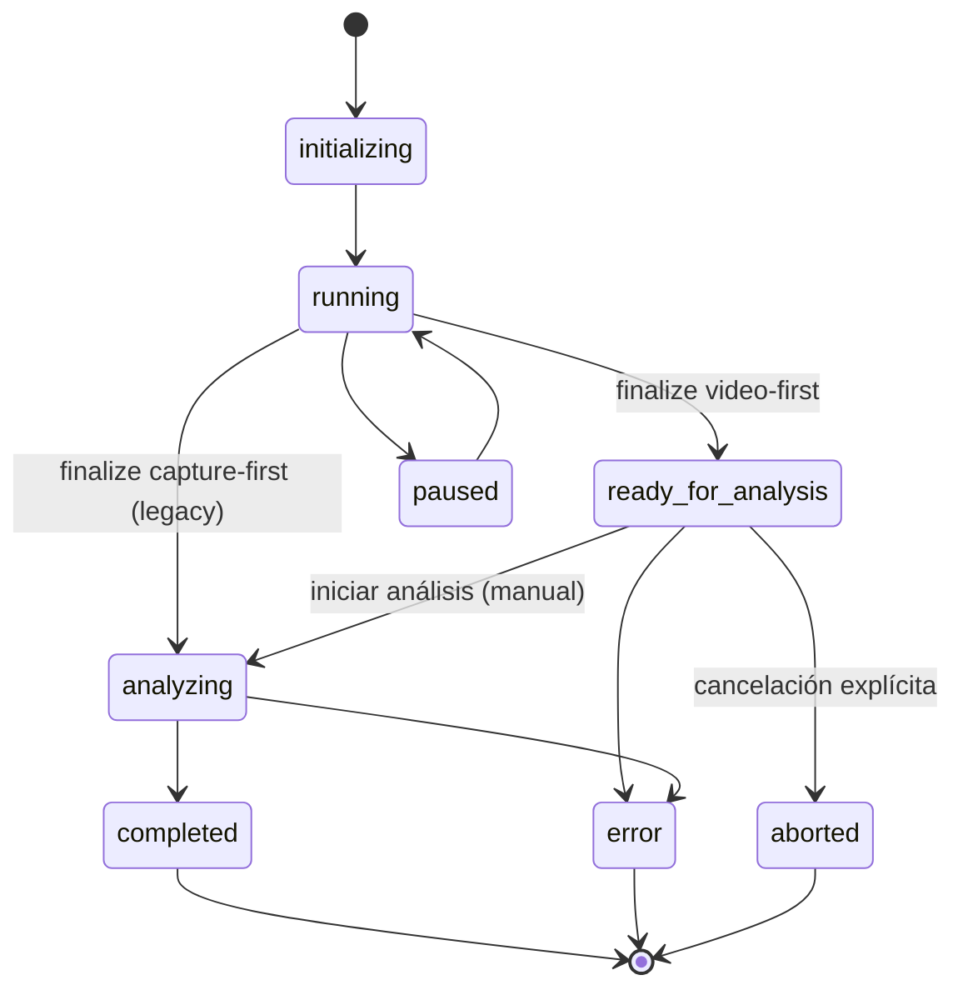

# Documento de Diseño

**Feature: 020 — Deferred Manual Analysis Workflow**

## Overview

### Resumen arquitectónico

Esta feature separa la **finalización de la grabación** del **inicio del análisis diferido** en el flujo video-first (Spec 019), introduciendo un estado no terminal, persistido y recuperable: `ready_for_analysis`. El cambio es **quirúrgico y aditivo**: reutiliza la arquitectura existente (FSM `MonitoringStatus`, `MonitoringService`, `MonitoringRuntimeRegistry`, `VideoAnalysisService`, `SnapshotAnalysisReportWriter`, `ThermalMonitor`, `path_sanitizer`) y NO modifica el pipeline de visión ni la lógica de inferencia de Spec 019.

El único cambio de comportamiento observable en video-first es: **finalizar la grabación ya no lanza el análisis automáticamente**. En su lugar, tras validar y promover el video, el monitoreo queda en `ready_for_analysis`, la cámara liberada y cero hilos de análisis. El operario dispara el análisis de forma explícita mediante una acción con **preflight técnico** y **confirmación de fuente de energía por intento**.

Se respeta la separación de capas (Clean Architecture):
- **Dominio**: `MonitoringState`/`MonitoringStatus` incorporan `ready_for_analysis` y sus transiciones. Sin dependencias de infraestructura.
- **Aplicación**: `MonitoringService` orquesta finalize→ready, start manual→analyzing, recovery y concurrencia. Nuevo componente `AnalysisPreflight` (helper testeable). `MonitoringRuntimeRegistry` extendido con reclamos de análisis.
- **Infraestructura**: capacidad opcional `UndervoltagePresenceProbe` (vía `vcgencmd get_throttled`); lectura de temperatura reutilizando el mecanismo de `ThermalMonitor`. `SqlMonitoringRepository` sin cambios de esquema.
- **Presentación**: nueva ruta HTML `POST /monitoreos/{id}/iniciar-analisis` (estilo `agricultural_ui.py`), bloque UI `ready_for_analysis` y diálogo de confirmación de energía en `monitoring_execution.html`.

### Compatibilidad y reprocesamiento

- **Capture-first legacy** (`video_first_enabled=False`): sin cambios en estados, transiciones ni salidas observables. `running→analyzing` automático se conserva vía `_start_capture_first` + `_run_analysis`.
- **Reprocesamiento (Spec 019):** `reprocess_monitoring` sobre monitoreos terminales permanece **fuera** del flujo `ready_for_analysis`; sigue usando `reset_for_reprocess` (reset controlado, no arista FSM) y guard estricto de sync. No introduce `ready_for_analysis`.
- **Monitoreos preexistentes terminales**: se consultan/transicionan sin requerir `ready_for_analysis`; sin migración de estado.
- **Superficies preservadas sin cambios observables**: autenticación, dashboard, invernaderos, módulos, historial, reportes, bitácora, exportación ZIP, sincronización manual, persistencia SQLite y UI kiosk/táctil.
- **Cero regresiones nuevas** frente a la línea base previa a Spec 020. El fallo de línea base conocido `tests/unit/test_sync_routes.py::TestSyncLocalTrigger::test_post_with_pending_records_triggers_export` queda **FUERA DE ALCANCE** y no se intenta corregir.
- La suite completa corre fuera de RPi sin cámara/GPIO/hardware.

### Decisiones de diseño y ADRs sugeridos

- **ADR sugerido** — "Análisis manual diferido y estado `ready_for_analysis`": documentar la separación captura/análisis, el estado no terminal recuperable, y la evidencia térmica (Monitoring 23) que la motiva.
- **ADR sugerido** — "Detección de subtensión por `get_throttled` (bit 0 vs bit 16)": documentar la semántica de bits y la naturaleza opcional/no bloqueante de la sonda.
- **ADR sugerido** — "Exclusión de análisis: alcances por-monitoreo, por-módulo y global de dispositivo": justificar el reclamo global por la restricción de un único dispositivo RPi.

Estas decisiones deben registrarse en `docs/decisions/` conforme a las reglas de documentación del proyecto.

## Architecture

### Flujo actual vs. flujo propuesto (video-first)

**Actual (Spec 019):**

```
running → (operario finaliza) → validar temp → promover monitoring.mp4 → persistir video_path
  → running→analyzing → LANZAR VideoAnalysisService (automático) → completed | error
```

**Propuesto (Spec 020):**

```
running → (operario finaliza) → validar temp → promover monitoring.mp4 → persistir video_path
  → running→ready_for_analysis → STOP (sin hilo de análisis, cámara liberada)
    → (operario cambia de fuente de energía)
      → (operario pulsa "Iniciar análisis" + confirma energía) → preflight → reclamo análisis
        → ready_for_analysis→analyzing → LANZAR VideoAnalysisService → completed | error
```

El flujo **capture-first legacy** (`video_first_enabled=False`) NO cambia: `running→analyzing` sigue disparándose automáticamente en `finalize_capture` con la ruta de `CaptureWorker` + `_run_analysis`.

### FSM final

Nuevo valor en `MonitoringState` (enum): `READY_FOR_ANALYSIS = "ready_for_analysis"`.

Transiciones actualizadas (`MonitoringStatus.VALID_TRANSITIONS`):

| Estado origen | Transiciones permitidas |
|---|---|
| `initializing` | `running`, `error` |
| `running` | `paused`, `finishing`, `analyzing`, `ready_for_analysis`, `completed`, `aborted`, `error` |
| `paused` | `running`, `aborted`, `error` |
| `finishing` | `completed`, `error` |
| `ready_for_analysis` | `analyzing`, `error`, `aborted` |
| `analyzing` | `completed`, `error` |
| `completed`, `aborted`, `error` | ∅ (terminal) |

Notas críticas:
- `running→analyzing` se **conserva** (usado por capture-first legacy y por reprocess vía reset controlado).
- `running→ready_for_analysis` es la nueva ruta video-first.
- `ready_for_analysis→aborted` **solo** ante cancelación explícita del operario.
- `ready_for_analysis` NO es terminal (`TERMINAL_STATES` sin cambios: `completed`, `aborted`, `error`).
- NO se añaden `completed→analyzing` ni `error→analyzing` como aristas de la FSM. El **reprocesamiento** de Spec 019 sigue usando `reset_for_reprocess` (reset controlado y auditado, fuera de la FSM) y permanece **fuera** del flujo `ready_for_analysis`.



### Responsabilidades por capa

- **Dominio**: define qué transiciones son válidas; `ready_for_analysis` como estado no terminal. Sin lógica de energía, hilos ni archivos.
- **Aplicación**: orquesta el ciclo (finalize→ready, start manual→analyzing), aplica preflight, gestiona reclamos de exclusión atómica, decide compatibilidad con recovery/reconciliación.
- **Infraestructura**: lectura de temperatura y subtensión, sanitización de rutas, validación de video (reutilizando `VideoRecorder.validate()`), escritura durable de métricas.
- **Presentación**: expone la acción manual con confirmación por intento; muestra el estado; no contiene lógica de negocio.

### Secuencia: finalize → ready_for_analysis

```mermaid
sequenceDiagram
    participant Op as Operario
    participant UI as agricultural_ui
    participant Svc as MonitoringService
    participant Rec as VideoRecorder
    participant Reg as RuntimeRegistry
    participant Repo as SqlMonitoringRepository

    Op->>UI: POST /monitoreos/{id}/finalizar-captura
    UI->>Svc: finalize_capture(id)
    Svc->>Reg: claim_finalization(id)
    Svc->>Svc: worker.finalize_event.set(); join(); libera cámara
    Svc->>Rec: validate() (existe, >0, abre, ≥1 frame)
    alt válido
        Svc->>Svc: os.replace(temp → monitoring.mp4)
        Svc->>Repo: update_video_path(id, final_rel)
        Svc->>Svc: escribir métricas de grabación (merge no destructivo)
        Svc->>Svc: escribir SOLO capture_completed_at (UTC) — sin manual_deferred_analysis ni deferred_analysis_started_at
        Svc->>Repo: update_status(id, "ready_for_analysis")
        Svc->>Reg: remove_runtime(id); release_finalization(id)
        Svc-->>UI: monitoring(status=ready_for_analysis)
    else inválido / rename falla / 0 frames
        Svc->>Repo: update_status(id, "error") (temp conservado)
        Svc->>Reg: remove(id); release_finalization(id)
    end
```

Puntos clave: cámara liberada por `VideoRecordingWorker` antes de alcanzar `ready_for_analysis`; si la liberación falla se impide la transición y se marca `error`; 0 frames → `error` (no `ready_for_analysis`); NO se registra hilo de análisis.

### Secuencia: inicio manual → analyzing

```mermaid
sequenceDiagram
    participant Op as Operario
    participant UI as agricultural_ui
    participant Svc as MonitoringService
    participant Pre as AnalysisPreflight
    participant Reg as RuntimeRegistry

    Op->>UI: POST /monitoreos/{id}/iniciar-analisis (power_source_confirmed=true)
    UI->>Svc: start_deferred_analysis(id, power_source_confirmed=true)
    alt confirmación ausente
        Svc-->>UI: rechazo (ready_for_analysis intacto) "Confirma la fuente de energía"
    else confirmación presente
        Svc->>Pre: run(monitoring)
        alt preflight falla
            Svc-->>UI: rechazo (ready_for_analysis intacto) + mensaje accionable
        else preflight OK
            Svc->>Reg: claim_analysis(id)
            alt ya reclamado (doble inicio)
                Svc-->>UI: "El análisis ya está en curso"
            else reclamado exitosamente
                Svc->>Svc: escribir metadata inicio SOLO tras el claim (manual_deferred_analysis=true, deferred_analysis_started_at, temp preflight)
                Svc->>Svc: update_status(id, "analyzing"); register(thread)
                Svc->>Svc: thread → _run_video_analysis(id, video_path)
                Note over Svc: si el lanzamiento falla → release_analysis + rollback a ready_for_analysis (sin dejar metadata de inicio falsa)
                Svc-->>UI: monitoring(status=analyzing)
            end
        end
    end
```

La confirmación de energía es **por intento** (in-memory, del request actual): no se persiste, sin TTL, no sobrevive a reinicio, no reutilizable. Al terminar el hilo (`completed`/`aborted`/`error`) se libera el reclamo de análisis en el `finally`.

### Secuencia: reinicio / recuperación

1. Al arrancar, `reconcile_orphaned_sessions_on_startup()` lista `get_active()` (que incluye `ready_for_analysis` por el Active_Status_Set).
2. Para cada sesión sin hilo vivo:
   - `ready_for_analysis` → **conservar** (no transicionar a `error`); es huérfano esperado.
   - `analyzing` → `error` (comportamiento actual; video preservado, reprocesable).
   - `initializing/running/paused/finishing` → `error` (comportamiento actual).
3. `recover_abrupt_recordings()` promueve `monitoring.recording.mp4` residual válido a `monitoring.mp4` (sin cambios). No auto-inicia análisis.
4. El operario reabre la UI; el render reconstruye el estado desde SQLite (`get_by_id`/status endpoint). Un monitoreo en `ready_for_analysis` muestra el bloque con "Iniciar análisis".
5. Al pulsar "Iniciar análisis" tras reinicio se ejecuta el **mismo** flujo (preflight + confirmación + lanzamiento). Si `monitoring.mp4` ya no existe/legible, se conserva `ready_for_analysis` y se presenta el error de video ausente/corrupto.

### Estrategia de concurrencia

La coordinación captura/análisis es de **alcance global de dispositivo** (device-global). Es una **decisión de diseño firme**, realizada íntegramente sobre el `MonitoringRuntimeRegistry` **existente** (NO se introduce un segundo coordinador). El registry ya rastrea workers/threads; se le añaden: (1) un reclamo/lock global de análisis ligero y thread-safe (para el "un análisis pesado a la vez"), y (2) una consulta thread-safe **global** de captura activa `has_active_capture()` (independiente del módulo, testeable fuera de la RPi). El método existente `has_live_worker_for_module` es **por módulo** y NO es fuente suficiente de captura activa global; `is_camera_locked()` se conserva únicamente como safety net de hardware y NO es la única fuente de la coordinación device-global.

Se distinguen tres alcances:

- **Por monitoreo (exactamente un análisis por monitoreo):** garantizado por el nuevo reclamo `_analysis_claims` del `MonitoringRuntimeRegistry`, adquirido atómicamente bajo el `RLock` existente. `claim_analysis(id)` retorna `True` a una sola solicitud concurrente; solicitudes duplicadas se rechazan sin alterar el análisis en curso. Liberación en el `finally` del hilo y en el rollback si el hilo no arranca.
- **Por módulo (una sesión activa por módulo):** garantizado por `_ACTIVE_STATUSES` (que ahora incluye `ready_for_analysis`). El preflight verifica que no exista otra sesión del mismo módulo en estado activo, **excluyendo el propio `monitoring_id`**.
- **Global de dispositivo (un único análisis pesado a la vez en toda la Raspberry Pi):** **decisión de diseño firme**. Como el prototipo es una sola RPi 5, CPU-only, con una cámara y coste térmico alto (evidencia Monitoring 23: 82.9 °C, 25 pausas), se adopta un reclamo/lock global de análisis ligero y thread-safe **dentro del `MonitoringRuntimeRegistry`** (p. ej. un claim/lock global de análisis), que permite como máximo **un** análisis pesado en curso en el dispositivo. NO es un segundo coordinador: reutiliza las primitivas del registry.

Reglas de coordinación device-global (ver Requirement 21):

- Varios monitoreos de **distintos módulos** pueden coexistir en `ready_for_analysis`. Ese estado NO consume cámara ni cómputo pesado y NO bloquea iniciar recorridos de otros módulos.
- Una **captura activa** (sesión de grabación/captura en curso, en cualquier módulo) **bloquea** el inicio de un análisis diferido: en `start_deferred_analysis` el preflight/coordinación DEBE rechazar si la consulta **global** `has_active_capture()` del registry indica una captura activa (independiente del módulo). `is_camera_locked()` puede consultarse solo como safety net de hardware adicional, no como fuente única. El análisis rechazado se mantiene en `ready_for_analysis` con mensaje accionable.
- Un **análisis pesado activo** **bloquea** el inicio de una nueva captura: en `start_session` (tanto video-first como capture-first legacy) DEBE rechazarse si el registry indica un análisis pesado activo en el dispositivo (reclamo global de análisis tomado). Este rechazo al iniciar la sesión es la ÚNICA restricción nueva sobre el capture-first legacy; una sesión capture-first ya admitida conserva su FSM, lógica, análisis y artefactos sin cambios.
- **Máximo un análisis pesado activo en todo el dispositivo** (device-global), realizado con el mecanismo ligero thread-safe del `MonitoringRuntimeRegistry` (claim/lock global de análisis), NO un segundo coordinador. El análisis rechazado por el global se mantiene en `ready_for_analysis` con mensaje accionable.
- Al terminar la captura o el análisis, el recurso vuelve a quedar disponible: liberar el reclamo/lock global en el bloque `finally`.
- NO se bloquean nuevos recorridos solo porque existan videos pendientes en `ready_for_analysis`; únicamente una captura o un análisis pesado **activos** ejercen exclusión device-global.

### Estrategia de preflight

`AnalysisPreflight.run(monitoring)` verifica **en orden**, deteniéndose en el primer fallo con un mensaje accionable en español:

1. `monitoring.status == "ready_for_analysis"`.
2. `video_path` no nulo.
3. Ruta segura dentro de outputs permitidos: `validate_safe_path(video_path, BASE_DIR)` (reutiliza `src/infrastructure/security/path_sanitizer`, como reprocess). Rechaza `../`, rutas absolutas y enlaces que escapen.
4. El archivo existe en disco y su tamaño > 0 bytes.
5. El video abre y lee ≥1 frame — reutiliza `VideoRecorder(output_path=video_path, fps=1.0, allowed_base=BASE_DIR).validate()` (o un `OpenCvVideoReader` liviano). **No** carga RetinaNet ni abre la cámara.
6. No hay análisis concurrente para este monitoreo (`is_analysis_claimed(id)` falso) ni conflicto de sesión de módulo por Active_Status_Set (excluyendo el propio id); tampoco reclamo global de análisis tomado; ni una captura activa en el dispositivo según la consulta global `has_active_capture()` (independiente del módulo).
7. Temperatura: `WHILE` la lectura está disponible, `temp_actual <= umbral máximo seguro del perfil activo`. Si la lectura no está disponible (fuera de RPi / `vcgencmd` ausente), **no bloquea** y registra "verificación térmica no disponible".
8. Subtensión: `WHERE` existe `UndervoltagePresenceProbe` disponible y detecta subtensión actual, rechaza; si la sonda no está disponible, no bloquea y registra la condición, delegando en la confirmación del operario.

El preflight nunca afirma que el dispositivo esté conectado a una fuente específica u oficial.

### Estrategia de energía / subtensión

- El software NO puede afirmar de forma confiable el tipo de fuente. Se combinan (1) preflight técnico y (2) confirmación explícita del operario por intento.
- **`UndervoltagePresenceProbe`** evalúa `vcgencmd get_throttled`, cuyo valor es una máscara de bits. Semántica relevante:
  - **bit 0** (`0x1`): subtensión detectada **actualmente** → condición que la sonda reporta como "subtensión presente".
  - **bit 16** (`0x10000`): subtensión ocurrida **desde el arranque** (flag histórico/latcheado) → **NO** se interpreta como fallo actual.
  - La sonda retorna un estado tri-valuado: `PRESENT` (bit 0 activo), `ABSENT` (bit 0 inactivo, lectura válida), `UNAVAILABLE` (fuera de RPi, `vcgencmd` ausente o error de parseo).
- **Decisión:** se implementa la pequeña abstracción `UndervoltagePresenceProbe` (recomendada), que lee **solo** el bit 0 para decidir bloqueo y expone la condición de disponibilidad. Nunca se bloquea por flags históricos. Fallback documentado: si el equipo juzga que expande el alcance, tratar la subtensión siempre como `UNAVAILABLE` (no bloqueante). Se adopta la abstracción por su bajo coste y valor diagnóstico.
- La captura (fase ligera) NUNCA se bloquea por condiciones de energía; solo se difiere la fase pesada de análisis.

## Components and Interfaces

### Componentes modificados (nombres reales)

- **`src/domain/value_objects/monitoring_status.py`** — Añadir `READY_FOR_ANALYSIS` al enum y las transiciones `running→ready_for_analysis`, `ready_for_analysis→{analyzing, error, aborted}`. No modificar `TERMINAL_STATES`.
- **`src/application/services/monitoring_service.py`**:
  - `_ACTIVE_STATUSES` — añadir `ready_for_analysis` (Active_Status_Set unificado, usado por regla de una sesión activa por módulo, reconciliación y preflight).
  - `_finalize_video_first(monitoring_id, worker)` — tras promover el video y persistir `video_path` + métricas de grabación, transicionar `running→ready_for_analysis` y **detenerse**: NO lanzar hilo de análisis, NO registrar hilo en el registry, `remove_runtime` del worker de grabación, `release_finalization`. Escribir metadata durable de `ready_for_analysis`. Idempotente: si el monitoreo ya está en `ready_for_analysis`, no repetir promoción ni transición (no-op de éxito).
  - `_run_video_analysis(monitoring_id, video_rel_path, config=None)` — **REUTILIZADO SIN CAMBIOS** de comportamiento de inferencia; ahora invocado desde el inicio manual y desde reprocess.
  - `reconcile_orphaned_sessions_on_startup()` — exceptuar `ready_for_analysis`: un monitoreo en ese estado sin hilo en memoria es esperado tras reinicio y NO debe transicionar a `error`. `analyzing` sin runtime sigue → `error`. `initializing/running/paused/finishing` huérfanos siguen → `error`.
  - `_reconcile_orphaned_sessions(module_id)` — misma excepción para `ready_for_analysis`.
  - Nuevo método `start_deferred_analysis(monitoring_id, power_source_confirmed, db_session)` (ver secuencia). Su preflight/coordinación DEBE rechazar el inicio si la consulta **global** `has_active_capture()` del registry indica una **captura activa** en el dispositivo (independiente del módulo), manteniendo `ready_for_analysis` (ver Requirement 21). `is_camera_locked()` puede usarse solo como safety net adicional, no como fuente única.
  - `start_session` (video-first y capture-first legacy) — añadir cross-check device-global: DEBE rechazarse el inicio de una nueva captura si el registry indica un **análisis pesado activo** en el dispositivo (reclamo global de análisis tomado). Este rechazo al iniciar la sesión es la ÚNICA restricción nueva sobre el capture-first legacy: una sesión capture-first ya admitida conserva su FSM, lógica interna, análisis y artefactos sin cambios (ver Requirement 21 y 15.1).
  - `reprocess_monitoring` y `recover_abrupt_recordings` — **sin cambios**; solo se documenta su interacción.
- **`src/application/services/monitoring_runtime_registry.py`** — Extender con: (1) un conjunto separado de reclamos de análisis por-monitoreo `_analysis_claims` y métodos `claim_analysis`/`release_analysis`/`is_analysis_claimed`, distinto de `_finalization_claims`; (2) un reclamo/lock **global de análisis** ligero y thread-safe (device-global), bajo el `RLock` existente, que permite como máximo un análisis pesado en curso en el dispositivo y se consulta desde `start_deferred_analysis` (para el propio análisis) y desde `start_session` (para bloquear nueva captura); (3) una consulta thread-safe **global** de captura activa `has_active_capture()` (o nombre coherente con el código) que detecta una captura activa con independencia del módulo y es testeable fuera de la RPi. El método por módulo `has_live_worker_for_module` NO es suficiente como fuente global de captura activa; `is_camera_locked()` se conserva solo como safety net de hardware. NO se crea un segundo coordinador.

### Componentes nuevos (mínimos)

1. **`AnalysisPreflight`** (`src/application/services/analysis_preflight.py`) — helper/servicio de aplicación puro y testeable que ejecuta las verificaciones técnicas en orden. No carga RetinaNet ni abre la cámara.
2. **`UndervoltagePresenceProbe`** (`src/infrastructure/monitoring/undervoltage_probe.py`) — capacidad OPCIONAL sobre `vcgencmd get_throttled`; distingue subtensión ACTUAL de flags históricos; retorna "no disponible" fuera de RPi.
3. **Extensión de `MonitoringRuntimeRegistry`** — reclamo de análisis (descrito arriba).
4. **Ruta `POST /monitoreos/{id}/iniciar-analisis`** en `app/routes/agricultural_ui.py` (handler HTML con redirect).
5. **Bloque UI `ready_for_analysis`** + diálogo de confirmación de energía en `app/templates/agricultural/monitoring_execution.html`.

Se evita cualquier abstracción adicional. No se crean nuevos repositorios, entidades ni modelos de persistencia.

### Integración UI / API

- **Ruta nueva (HTML):** `POST /monitoreos/{id}/iniciar-analisis` en `app/routes/agricultural_ui.py`, con `Depends(require_current_user_html)`. Recibe la confirmación de energía como **campo opcional con valor por defecto false** (`power_source_confirmed: bool = Form(False)`), **NO** `Form(...)`: así la ausencia del campo NO produce un 422 de FastAPI antes de ejecutar nuestra lógica. Tanto la ausencia como `false` deben llegar a `MonitoringService.start_deferred_analysis(id, power_source_confirmed, db_session)`, que en ese caso mantiene `ready_for_analysis`, no crea hilo, no retiene exclusión atómica y devuelve un error controlado en español (redirect con `?error=`). En caso aceptado redirige a `/monitoreos/{id}/ejecucion` (patrón 303 como `finalizar-captura`). Traduce excepciones a redirects con `?error=` accionable.
- **Confirmación por intento (semántica por request):** el flag viaja en cada POST; no se persiste (ni en sesión ni en DB), sin TTL, no reutilizable y no sobrevive a reinicio; cada reintento requiere re-confirmar. No implica detección de "fuente oficial".
- **Bloque UI `ready_for_analysis`** en `monitoring_execution.html` (siguiendo el patrón de bloques `#status-*` existentes):
  - Indicador en español "Captura finalizada — análisis pendiente" (prohibido usar "pausado"), texto legible y contraste conforme a las reglas de UI.
  - Botón primario único "Iniciar análisis" (área táctil ≥ mínimos del proyecto), disponible y habilitado.
  - Diálogo de confirmación de energía (patrón `finalize-dialog`): al confirmar, envía el formulario de inicio con `power_source_confirmed=true`; al cancelar, se mantiene `ready_for_analysis` con la acción disponible.
  - En `analyzing` se muestra el progreso y se oculta "Iniciar análisis".
  - Tras reinicio, el render reconstruye el bloque desde el estado del backend.
- El JS de polling (`app/static/js/monitoring.js`) debe reconocer `ready_for_analysis` en el mapa de bloques `#status-*`. No hay rediseño visual del dashboard; solo se añade la etiqueta del nuevo estado donde ya se listan estados.

## Data Models

### Persistencia y trazabilidad

- **Sin nueva columna ni migración.** No se introduce ningún nuevo modelo de persistencia ni columna en la base de datos. `MonitoringModel.status` es `String(20)`; `"ready_for_analysis"` (18 chars) cabe sin ampliar. `video_path` ya existe (`String(500)`, nullable, relativo). Se reutiliza el esquema de Spec 019 (Requirement 2.2).
- **Marcas durables de trazabilidad** — se persisten en el **archivo de métricas durable** ya usado por el flujo (`SnapshotAnalysisReportWriter`, el `pipeline_metrics.json` / capture-metrics bajo `outputs/monitorings/{id}/`), escrito **antes** del análisis, por lo que sobrevive a reinicio y es recuperable. NO se reutiliza `completed_at` (conserva su significado: finalización completa tras el análisis). Como existe una alternativa durable coherente a nivel de archivo, **NO** se requiere una nueva columna en la base de datos.
- **Semántica de escritura de las marcas de trazabilidad:**
  - Al **entrar en `ready_for_analysis`** (finalize) se escribe **únicamente** `capture_completed_at` (UTC, durable). NO se escribe `manual_deferred_analysis` ni `deferred_analysis_started_at` en el finalize.
  - `manual_deferred_analysis=true`, `deferred_analysis_started_at` (UTC) y la temperatura del preflight (°C, o nulo si no disponible) se escriben **solo cuando el inicio manual es ACEPTADO**: preflight OK + confirmación presente + exclusión atómica adquirida (claim de análisis). Nunca antes de adquirir el claim.
  - Si el hilo de análisis no arranca y se hace rollback a `ready_for_analysis`, NO debe quedar metadata que afirme falsamente que el análisis inició: no `manual_deferred_analysis=true` ni `deferred_analysis_started_at` para ese intento fallido.
- **Orden de merge incremental no destructivo** en el archivo de métricas:
  1. Métricas de captura/grabación — escritas en `finalize` por `SnapshotAnalysisReportWriter.write_capture_metrics`.
  2. `capture_completed_at` (UTC) — al entrar en `ready_for_analysis` (merge, sin sobrescribir 1). Sin `manual_deferred_analysis` ni `deferred_analysis_started_at` en este punto.
  3. `manual_deferred_analysis=true` + `deferred_analysis_started_at` (UTC) + temperatura del preflight — **solo en el inicio manual aceptado** (tras adquirir el claim; merge, sin sobrescribir 1–2).
  4. Métricas de análisis — escritas por `VideoAnalysisService`/su report writer al finalizar (merge, sin pérdida de 1–3).
  El writer debe **leer-fusionar-escribir** (o escribir claves nuevas) sin truncar las claves previas. `VideoAnalysisService` conserva su generación de reportes actual.

## Correctness Properties

*Una propiedad es una característica o comportamiento que debe cumplirse en todas las ejecuciones válidas del sistema — una afirmación formal sobre lo que el sistema debe hacer. Las propiedades tienden un puente entre la especificación legible por humanos y garantías de corrección verificables por máquina.*

### Property 1: `ready_for_analysis` es no terminal y solo transiciona a analyzing/error/aborted

*Para toda* instancia de `MonitoringStatus` en estado `ready_for_analysis`, el conjunto de transiciones permitidas es exactamente `{analyzing, error, aborted}`, `is_terminal()` es falso, y cualquier transición fuera de ese conjunto lanza `InvalidTransitionError`.

**Validates: Requirements 1.3, 1.5, 1.6, 1.7, 1.8**

### Property 2: Idempotencia del inicio manual bajo concurrencia (exactamente un análisis)

*Para todo* número de solicitudes concurrentes de inicio de análisis sobre un mismo monitoreo en `ready_for_analysis` con preflight satisfactorio y confirmación presente, exactamente una obtiene el reclamo de análisis e inicia exactamente un hilo; las demás se rechazan sin modificar el estado del monitoreo ni interrumpir el análisis en curso.

**Validates: Requirements 9.1, 9.2, 16.2, 16.3, 16.4**

### Property 3: La persistencia de `ready_for_analysis` es un round-trip fiel

*Para todo* monitoreo cuyo estado persistido es `ready_for_analysis`, leerlo desde SQLite (incluso tras reinicio simulado) devuelve exactamente `ready_for_analysis` sin recálculo ni modificación.

**Validates: Requirements 2.3, 2.4, 10.2**

### Property 4: Semántica de bits de la sonda de subtensión

*Para toda* máscara de `get_throttled`, `UndervoltagePresenceProbe` reporta `PRESENT` si y solo si el bit 0 está activo, ignorando el bit 16 (histórico); una lectura ausente/errónea reporta `UNAVAILABLE` y nunca `PRESENT`.

**Validates: Requirements 7.6, 7.7, 19.4, 19.5**

### Property 5: Preflight preserva el monitoreo ante cualquier rechazo

*Para todo* monitoreo en `ready_for_analysis` y toda combinación de condiciones de preflight en la que al menos una verificación falla, `start_deferred_analysis` deja el monitoreo en `ready_for_analysis` con `video_path` y datos intactos, sin retener reclamo de análisis.

**Validates: Requirements 6.4, 7.8, 11.4, 11.5, 12.1, 12.4**

## Error Handling

| Situación | Resultado de estado | Video / datos | Mensaje al operario |
|---|---|---|---|
| Video inválido/ilegible al finalizar (validación falla) | `error` | temp conservado para diagnóstico; `monitoring.mp4` no creado | error genérico de finalización |
| Promoción atómica (`os.replace`) falla | `error` | temp conservado | error de finalización |
| 0 frames capturados al finalizar | `error` | — | "No hay contenido para analizar" |
| `video_path` nulo al iniciar análisis | `ready_for_analysis` (intacto) | intacto | "El monitoreo no tiene un video asociado para analizar." |
| `monitoring.mp4` no existe en disco | `ready_for_analysis` | intacto | "El archivo de video del monitoreo no existe en disco." |
| `monitoring.mp4` no abre / no lee ≥1 frame | `ready_for_analysis` | intacto | "El archivo de video del monitoreo no es legible. Verifica que el archivo no esté dañado." |
| Preflight falla (térmico/subtensión/ruta/sesión) | `ready_for_analysis` | intacto | mensaje accionable identificando la condición |
| Confirmación de energía ausente | `ready_for_analysis` | intacto | "Se requiere confirmar la fuente de energía para continuar." |
| Confirmación cancelada en UI | `ready_for_analysis` | intacto | acción "Iniciar análisis" sigue disponible |
| Doble inicio concurrente | un solo `analyzing` | intacto | duplicado: "El análisis ya está en curso" |
| El hilo de análisis no arranca | rollback a `ready_for_analysis` (release_analysis) | intacto | "El análisis no pudo iniciarse. Reintenta." |
| Fallo fatal durante el análisis | `analyzing → error` | `monitoring.mp4` intacto | error sin detalles técnicos |
| Fallo no fatal en un frame | continúa análisis | resultados previos conservados | — |
| Fallo de escritura de `pipeline_metrics.json` | preserva transición (`error`/`completed`) | — | se registra indicador de fallo de métricas |
| Reinicio en `ready_for_analysis` | conservado | video preservado | bloque con "Iniciar análisis" |
| Reinicio en `analyzing` sin runtime | `error` (como hoy) | video preservado, reprocesable | — |

Regla transversal: ninguna de estas rutas de error borra ni modifica `monitoring.mp4`.

## Testing Strategy

Enfoque dual (unit + integración). Property-based testing NO aplica ampliamente aquí (FSM discreta, orquestación con I/O, rutas UI); se usa PBT solo donde hay una propiedad universal clara sobre la FSM.

**Unit tests (lógica pura / orquestación con dobles):**
- FSM: `running→ready_for_analysis`, `ready_for_analysis→{analyzing, error, aborted}` válidas; `ready_for_analysis` no terminal; transiciones inválidas rechazadas; `completed/error→analyzing` NO son aristas.
- `MonitoringRuntimeRegistry`: `claim_analysis` concede a una sola solicitud concurrente; `release_analysis` idempotente; independiente de `_finalization_claims`; reclamo global (si se adopta) permite un solo análisis.
- `finalize_capture` video-first → `ready_for_analysis` sin lanzar hilo de análisis; idempotencia (segunda finalización = no-op de éxito); 0 frames → `error`; validación inválida → `error` con temp conservado.
- `AnalysisPreflight`: cada verificación en orden; ruta insegura rechazada; temperatura no disponible no bloquea; subtensión ausente no bloquea; subtensión presente bloquea; sesión de módulo excluyendo el propio id.
- `start_deferred_analysis`: confirmación ausente → rechazo; preflight falla → rechazo; éxito → `analyzing` + hilo registrado; fallo de lanzamiento → rollback a `ready_for_analysis` + release; doble inicio → un solo hilo.
- Recuperación al arranque: `ready_for_analysis` exento de reconciliación; `analyzing` sin runtime → `error`; otros activos → `error`.
- Merge durable de métricas: escritura incremental no sobrescribe claves previas (captura → ready → inicio → análisis).
- `UndervoltagePresenceProbe`: bit 0 → `PRESENT`; bit 16 sin bit 0 → `ABSENT`; fuera de RPi → `UNAVAILABLE`.
- Rutas/UI: `POST /monitoreos/{id}/iniciar-analisis` con `power_source_confirmed: bool = Form(False)` opcional — su ausencia NO produce 422; ausencia/false llega a `start_deferred_analysis`, mantiene `ready_for_analysis`, no crea hilo ni retiene exclusión y devuelve error controlado en español (redirect `?error=`); redirects y mensajes; el bloque `ready_for_analysis` no usa "pausado" y expone "Iniciar análisis"; `analyzing` oculta la acción.

**Property-based (Hypothesis), mínimo 100 iteraciones, etiquetadas `Feature: 020-deferred-manual-analysis-workflow, Property N`:**
- Ver sección Correctness Properties.

**Integración / suite completa:** ejecutar `python -m pytest -q` y comparar contra la línea base (cero regresiones nuevas; fallo conocido de sync fuera de alcance).

**Raspberry Pi (E2E, manual, `@pytest.mark.raspberry`/`@pytest.mark.hardware`):** grabar → finalizar → `ready_for_analysis` → reiniciar app → estado preservado → confirmar energía → iniciar análisis → `completed`; registrar temperatura de inicio, pico y fin.
