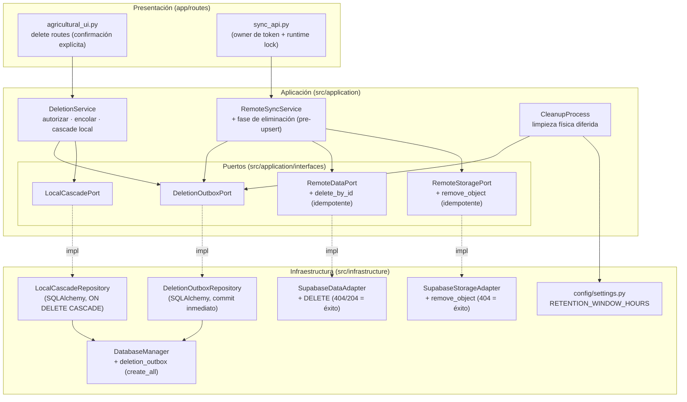
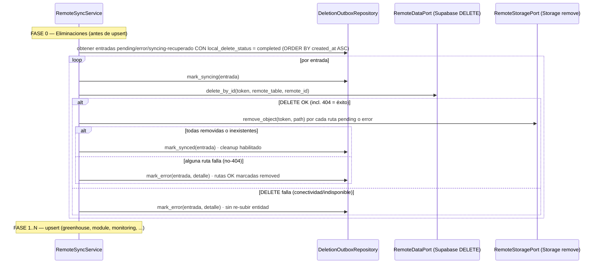

# Design Document

## Overview

Esta funcionalidad habilita la eliminación de monitoreos, módulos e invernaderos desde la UI con **borrado local duradero e independiente de la conectividad**, y propagación remota **eventualmente consistente** al backend Supabase.

El enfoque combina dos mecanismos:

1. **Borrado local inmediato** (`Deletion_Service`) que autoriza la operación, encola un registro duradero en un buzón (`Deletion_Outbox`) y ejecuta el `Local_Cascade` sobre SQLite, sin ninguna llamada de red (Req 1, 2, 5).
2. **Propagación remota diferida** integrada como una **fase de eliminación** dentro del `RemoteSyncService` existente, ejecutada durante la sincronización manual y colocada **antes** de las fases de upsert para impedir la resurrección (Req 9, 10).

La limpieza física de artefactos en `outputs/` es la **fase final**, diferida por un `Retention_Window` configurable y ejecutada por un `Cleanup_Process` duradero (Req 13).

El diseño reutiliza los componentes existentes descritos en el prompt (FSM `MonitoringState`, `RemoteDataPort`, `RemoteStoragePort`, `RemoteSyncService`, `SyncStateRepository`, `SupabaseDataAdapter`, `DatabaseManager`, `MonitoringRuntimeRegistry`) y **no** modifica el pipeline de visión, el ciclo de vida de captura/análisis, `ExportService`, el dashboard ni el esquema remoto de Supabase.

### Invariantes clave

- **Fuente de verdad local:** SQLite es autoritativo; la sincronización se mantiene unidireccional (local → remoto).
- **Durabilidad en dos transacciones:** TX1 escribe el `Deletion_Outbox` con `local_delete_status = prepared` y COMMIT antes de cualquier cascade; TX2 ejecuta el `Local_Cascade` y marca `completed` en la misma transacción (Req 4.8, 4.9, 4.10, 6.1–6.4).
- **Propagación remota condicionada al borrado local:** solo se propagan remotamente las entradas con `local_delete_status = completed` (Req 4.10, 10).
- **Deletion-before-upsert:** las eliminaciones se propagan antes que cualquier escritura pendiente de la misma entidad (Req 10.2).
- **Idempotencia remota:** un DELETE sobre un recurso inexistente es éxito (Req 7.3, 8.2).
- **Sin huérfanos:** al marcar una entrada como `synced` no quedan `Orphaned_Storage_Object` (Req 8.4).
- **Retención antes de limpieza física:** el `Local_Cascade` nunca borra `outputs/` de inmediato; la limpieza física usa rutas de artefacto persistidas y requiere `local_delete_status = completed` (Req 5.6, 13.1).

## Architecture

Se respeta la separación por capas de Clean Architecture. Los nuevos componentes se ubican según su responsabilidad, sin cruzar dependencias prohibidas.



Notas de frontera:

- `DeletionService`, `RemoteSyncService` y `CleanupProcess` viven en `src/application/services/` y dependen solo de puertos y stdlib (sin FastAPI/torch/cv2/SQLAlchemy/httpx).
- Los puertos (`RemoteDataPort` ya existente allí, más `DeletionOutboxPort`, `LocalCascadePort` y el `RemoteStoragePort` extendido) viven en `src/application/interfaces/`.
- `DeletionOutboxRepository` y `LocalCascadeRepository` viven en `src/infrastructure/persistence/` (SQLAlchemy) e implementan los puertos de `src/application/interfaces/`.
- El route de UI **no** contiene lógica de negocio: delega a `DeletionService` y retorna tras el borrado local.
- El token efímero y el lock de sincronización siguen siendo propiedad exclusiva de `sync_api.py`, como hoy.

## Components and Interfaces

### Responsabilidades de los componentes

- **`DeletionService`** (aplicación): autoriza la eliminación por estado FSM, consulta `MonitoringRuntimeRegistry`, captura `remote_id`, rutas de Storage y rutas de artefactos locales, encola la(s) entrada(s) del `Deletion_Outbox` en dos transacciones (TX1 `prepared` + COMMIT, TX2 `Local_Cascade` + `completed`). Depende solo de puertos y stdlib.
- **`RemoteSyncService`** (aplicación, existente + fase nueva): añade una **fase de eliminación** al inicio de `execute_sync`, antes de las fases de upsert. Mantiene la propiedad del token/lock en `sync_api.py`.
- **`CleanupProcess`** (aplicación): limpieza física diferida de `outputs/` según el `Retention_Window`. No depende de red.
- **`DeletionOutboxRepository`** / **`LocalCascadeRepository`** (infraestructura, SQLAlchemy): persistencia del buzón (commit inmediato) y cascada local (`ON DELETE CASCADE`).
- **`SupabaseDataAdapter`** / **`SupabaseStorageAdapter`** (infraestructura): implementan el DELETE idempotente de datos y `remove_object` de Storage.

### Extensión de `RemoteDataPort`

```python
@dataclass
class RemoteDeleteResult:
    success: bool
    already_absent: bool = False          # 404/not-found tratado como éxito
    error_type: Optional[str] = None      # CONNECTIVITY | REMOTE_UNAVAILABLE | RLS_DENIED | UNKNOWN
    error_message: Optional[str] = None

class RemoteDataPort(Protocol):
    def upsert(self, access_token: str, table: str, data: dict) -> RemoteUpsertResult: ...
    def delete_by_id(self, access_token: str, table: str, remote_id: str) -> RemoteDeleteResult: ...
```

### Extensión de `RemoteStoragePort`

```python
@dataclass
class RemoteStorageDeleteResult:
    success: bool
    already_absent: bool = False          # objeto inexistente = éxito
    error_type: Optional[str] = None      # CONNECTIVITY | REMOTE_UNAVAILABLE | RLS_DENIED | STORAGE_ERROR | UNKNOWN
    error_message: Optional[str] = None

class RemoteStoragePort(Protocol):
    def upload_file(self, access_token: str, local_file_path: str, remote_path: str) -> RemoteUploadResult: ...
    def remove_object(self, access_token: str, path: str) -> RemoteStorageDeleteResult: ...
```

Los puertos `DeletionOutboxPort` y `LocalCascadePort` (interfaces de encolado y cascada local), junto con `RemoteDataPort` y el `RemoteStoragePort` extendido, se definen en `src/application/interfaces/` y se implementan en infraestructura, siguiendo la inversión de dependencias de Clean Architecture.

## Data Models

### Tabla local `deletion_outbox` (nueva, solo local)

Modelo ORM nuevo en `src/infrastructure/persistence/models/`, creado vía `create_all` (Req 4.5). **No** modifica ninguna tabla existente ni el esquema remoto de Supabase.

| Campo | Tipo | Restricciones | Descripción |
|---|---|---|---|
| `id` | Integer | PK, autoincrement | Identificador local |
| `entity_type` | String(20) | NOT NULL | `greenhouse` \| `module` \| `monitoring` |
| `entity_local_id` | Integer | NOT NULL | Id local de la entidad eliminada (ámbito de la operación) |
| `remote_id` | String(36) | nullable | UUID remoto de la entidad raíz; nulo si nunca se sincronizó |
| `remote_table` | String(50) | NOT NULL | Tabla remota destino del DELETE (p. ej. `monitorings`) |
| `created_at` | DateTime | NOT NULL, default=now (UTC) | Timestamp de encolado |
| `status` | String(10) | NOT NULL, default=`pending` | `pending` \| `syncing` \| `synced` \| `error`; rastrea la **propagación REMOTA** (Req 4.4) |
| `local_delete_status` | String(12) | NOT NULL, default=`prepared` | `prepared` \| `completed` \| `failed`; rastrea la **durabilidad del borrado LOCAL** (Req 4.8–4.11) |
| `last_error` | Text | nullable | Descripción + timestamp UTC del último fallo (Req 11.3) |
| `retry_count` | Integer | NOT NULL, default=0 | Contador de reintentos |
| `cleanup_status` | String(12) | NOT NULL, default=`pending` | `pending` \| `done`; controla la fase física (Req 13) |
| `deleted_at` | DateTime | NOT NULL, default=now (UTC) | Marca base para el `Retention_Window` (Req 13.1) |

`entity_type`, `entity_local_id` y `remote_table` son **NOT NULL**; `remote_id` es **nullable** (nulo si la entidad nunca se sincronizó). Los campos `status` y `local_delete_status` son **distintos**: `status` (`pending|syncing|synced|error`) rastrea la propagación remota, mientras `local_delete_status` (`prepared|completed|failed`) rastrea la durabilidad de la eliminación local. Todas las columnas nuevas son nulas o con valor por defecto → compatibilidad de migración (Req 4.5).

### Tabla asociada `deletion_outbox_storage_path` (rutas de Storage)

**Decisión:** se almacenan las rutas de Storage como **filas separadas** en una tabla hija, en lugar de una lista JSON embebida. Justificación:

- Un monitoreo puede tener N snapshots × 2 rutas (`raw`, `annotated`); la limpieza de Storage es por-ruta y con reintento por-ruta (Req 8.3).
- Filas separadas permiten marcar cada ruta como `removed`/`pending`/`error` de forma independiente, evitando reprocesar rutas ya eliminadas y facilitando la garantía "sin huérfanos" (Req 8.4).
- Evita parsear/serializar JSON en cada reintento y mantiene consultas SQL simples.

| Campo | Tipo | Restricciones | Descripción |
|---|---|---|---|
| `id` | Integer | PK, autoincrement | Identificador local |
| `outbox_id` | Integer | FK → deletion_outbox, NOT NULL | Entrada padre |
| `storage_path` | String(500) | NOT NULL | Ruta remota (`monitorings/<uuid>/{raw,annotated}/snapshot_NNNNNN.jpg`) |
| `status` | String(10) | NOT NULL, default=`pending` | `pending` \| `removed` \| `error` |

Las rutas se capturan **antes** del `Local_Cascade` desde `SnapshotModel.raw_storage_path` / `annotated_storage_path` vía el `SyncStateRepository` existente (Req 4.2, 6.3). Solo se registran rutas no nulas (snapshots ya sincronizados). Un monitoreo nunca sincronizado no tiene rutas y su entrada de Storage queda vacía.

**Estados de ruta y reintento (Req 8):** los valores son `pending | removed | error`; `removed` es el **único estado terminal**. `RemoteSyncService` procesa **tanto rutas `pending` como `error`** (una ruta `error` se reintenta en la siguiente sincronización). Una entrada del outbox alcanza `synced` solo cuando **todas** sus rutas están `removed`.

### Tabla asociada `deletion_outbox_local_artifact` (artefactos físicos locales)

Registra las rutas físicas locales (`outputs/`) a limpiar de forma diferida, **persistidas antes** del `Local_Cascade` para que `CleanupProcess` no dependa de reconstruir rutas tras borrar los registros SQLite (Req 4.12–4.13, Req 13).

| Campo | Tipo | Restricciones | Descripción |
|---|---|---|---|
| `id` | Integer | PK, autoincrement | Identificador local |
| `outbox_id` | Integer | FK → deletion_outbox, NOT NULL | Entrada padre |
| `relative_path` | String(500) | NOT NULL | Ruta física **relativa a `OUTPUTS_DIR`** (sin prefijo `outputs/`; p. ej. `monitorings/{monitoring_id}`) |
| `status` | String(10) | NOT NULL, default=`pending` | `pending` \| `done` \| `error` |
| `last_error` | Text | nullable | Detalle del último fallo de limpieza física |

Las filas se persisten **antes** del `Local_Cascade`: para un monitoreo, una fila con `monitorings/{monitoring_id}` (relativa a `OUTPUTS_DIR`, sin prefijo `outputs/`); para módulo o invernadero, una fila por cada monitoreo descendiente. Así las rutas quedan disponibles aunque los registros SQLite ya no existan.

> No se agregan columnas de eliminación a las tablas remotas de Supabase ni a las tablas locales existentes (Non-Goals).

## Deletion flow (borrado local)

Secuencia por operación de eliminación (monitoreo, módulo o invernadero). Es **independiente de la conectividad**: no realiza llamadas de red (Req 2.1, 2.3).

```mermaid
sequenceDiagram
    participant UI as agricultural_ui (route)
    participant DS as DeletionService
    participant REG as MonitoringRuntimeRegistry
    participant SS as SyncStateRepository
    participant OUT as DeletionOutboxRepository
    participant LC as LocalCascadeRepository

    UI->>DS: delete(entity_type, local_id)  [confirmación explícita previa]
    DS->>DS: autorizar por estado FSM (monitoreo: el objetivo; módulo/invernadero: TODOS los descendientes)
    DS->>REG: ¿worker activo? (monitoreo objetivo o TODOS los monitoreos descendientes)
    alt estado no permitido / no existe / worker activo (en cualquier descendiente)
        DS-->>UI: error (rechazo total: sin outbox, sin cascade, jerarquía intacta)
    else autorizado (todos los descendientes eliminables y sin worker)
        DS->>SS: capturar remote_id raíz + storage paths + artefactos locales (descendientes)
        Note over DS,OUT: TX1 — crear entrada(s) outbox + rutas + artefactos, local_delete_status=prepared, COMMIT
        DS->>OUT: crear entrada(s) (prepared) + COMMIT
        alt fallo al persistir outbox (TX1)
            DS-->>UI: error "no se pudo registrar de forma duradera" (sin cascade)
        else outbox confirmado (prepared, durable)
            Note over DS,LC: TX2 — Local_Cascade + marcar local_delete_status=completed en la MISMA transacción
            DS->>LC: Local_Cascade + set completed (una transacción)
            alt fallo en TX2
                LC-->>DS: rollback del cascade y del marcado completed (entrada queda prepared/failed)
                DS-->>UI: error (entidad no eliminada; NO se propaga remotamente)
            else TX2 OK (completed)
                DS-->>UI: éxito (retorno inmediato)
            end
        end
    end
```

Detalles:

- **Autorización por estado** (Req 1, 6.5–6.8): para `monitoring`, se valida el monitoreo objetivo. Para `module`/`greenhouse`, **antes de TX1** (antes de cualquier entrada de outbox y de cualquier `Local_Cascade`) se validan **todos** los monitoreos descendientes. Deletable = `{ready_for_analysis, completed, error, aborted}`; prohibido = `{initializing, running, paused, finishing, analyzing}`. El servicio consulta el estado persistido y usa la clasificación del FSM `MonitoringState` (no reimplementa transiciones). Id inexistente → error "no encontrado" (Req 1.4). Si algún descendiente está en estado prohibido, se **rechaza la operación completa** (sin outbox, sin cascade, jerarquía intacta).
- **No interferencia** (Req 3, 6.5–6.8): antes de borrar, se consulta `MonitoringRuntimeRegistry` por worker de captura/análisis activo del monitoreo objetivo (o de **cada** monitoreo descendiente en módulos/invernaderos). Si existe un worker activo en cualquier descendiente, se **rechaza la operación completa** sin alterar estado ni datos (sin outbox, sin cascade). El borrado nunca detiene ni altera workers de otros monitoreos.
- **Durabilidad en dos transacciones** (Req 4.8–4.11, Req 5, 6.1–6.4): el borrado local sigue un protocolo de dos transacciones:
  - **TX1:** crear la(s) entrada(s) del outbox (+ rutas de Storage + artefactos locales) con `local_delete_status = prepared` y **COMMIT**. Si TX1 falla, se aborta y la jerarquía queda intacta (Req 4.7, 6.4).
  - **TX2:** ejecutar el `Local_Cascade` y marcar `local_delete_status = completed` en **la misma transacción**.
  - Si TX2 falla: `rollback` del cascade **y** del marcado `completed`; la entrada permanece `prepared`/`failed` y la eliminación **no** se propaga remotamente.
  - **Reintento seguro:** una entrada `prepared`/`failed` se reintenta sin duplicar, con idempotencia por (`entity_type`, `entity_local_id`).
- **Local_Cascade** (Req 5): elimina únicamente registros locales, apoyándose en `ON DELETE CASCADE` local (invernadero → módulo → monitoreo → snapshot → resultado → métricas; módulo → bitácora). Se ejecuta dentro de TX2; si falla, `rollback` deja la jerarquía en su estado previo (Req 5.5). No borra `outputs/` (Req 5.6). Al finalizar, cero registros dependientes (Req 5.4).
- **Acción "Eliminar" en la UI** (Req 2.5–2.7): la UI expone una acción "Eliminar" **visible** en los flujos de historial/detalle del módulo, ejecución y reporte, **sin depender de escribir la URL manualmente**, con confirmación explícita. El backend (`DeletionService`) **re-valida** estado y worker activo aunque la UI oculte el botón.
- **UI inmediata** (Req 2.2, 2.4): el route requiere confirmación explícita, invoca el borrado local y retorna de inmediato; la entidad y sus hijos dejan de mostrarse. En fallo, muestra mensaje de error y conserva los datos.

## Remote propagation flow (fase de eliminación en RemoteSyncService)

Se integra una **fase de eliminación** al inicio de `execute_sync`, **antes** de las fases de upsert (`_PHASES`). Mantiene el modelo de propiedad actual: `sync_api.py` adquiere/libera token y lock; el servicio solo llama `runtime_state.update_progress()`.



Detalles:

- **Selección y gating por borrado local** (Req 4.10, 9.1, 9.3, 10): la fase de eliminación procesa **únicamente** entradas con `local_delete_status = completed` (borrado local duradero confirmado). Bajo esa condición, procesa entradas cuyo estado remoto sea `pending`, `error`, **o** un `syncing` recuperado tras un crash/reinicio, ascendente por `created_at`. Las entradas en `local_delete_status = prepared`/`failed` **nunca** se propagan remotamente. Un `syncing` persistido tras reinicio es reintentable (no queda bloqueado).
- **DELETE idempotente por raíz** (Req 7.5): solo se emite el DELETE de la entidad raíz (`remote_id` + `remote_table`); las filas remotas hijas se eliminan por `ON DELETE CASCADE` remoto existente. Una entrada sin `remote_id` (nunca sincronizada) no requiere DELETE remoto de datos y pasa directo a la limpieza de Storage (si hubiera rutas) → `synced`.
- **Limpieza de Storage** (Req 8): tras el DELETE de datos, se recorren las rutas en `pending` **o** `error` de la entrada y se invoca `remove_object`. `404`/inexistente = éxito. Rutas removidas se marcan `removed` (único estado terminal); una ruta con error no-404 mantiene la entrada como `error` reintentable y esa ruta se reintenta en la siguiente sincronización (Req 8.3). Solo se marca `synced` cuando el DELETE de datos y **todas** las rutas están `removed`, garantizando ausencia de huérfanos (Req 8.4).
- **Anti-resurrección** (Req 10.2): al ejecutarse antes de las fases de upsert, la eliminación de una entidad se propaga primero. Como el `Local_Cascade` ya eliminó los registros locales, las fases de upsert no encuentran esa entidad y no la re-suben (Req 10.1). Si el DELETE falla, la entrada permanece reintentable y la entidad no se re-sube (Req 10.3).
- **Continuación ante fallos** (Req 9.4, 9.5): un fallo marca la entrada `error` con `last_error` y continúa con las demás; nunca se elimina la entrada del outbox.
- **Unidireccionalidad** (Req 9.2): no se introduce propagación remoto → local.

## Error Handling

### Idempotencia del DELETE de datos (`RemoteDataPort`)

- **Validación previa** (Req 7.2): si `access_token`, `table` o `remote_id` están vacíos, devuelve error de validación sin llamada remota.
- **Idempotencia** (Req 7.3, 7.4): en `SupabaseDataAdapter`, un DELETE PostgREST que resulte en `204` o `404` (recurso ausente) devuelve `success=True`; dos DELETE consecutivos sobre el mismo `remote_id` producen resultados de éxito idénticos.
- **Errores reintentables** (Req 7.6): `CONNECTIVITY` (timeout/conexión) y `REMOTE_UNAVAILABLE` (5xx) → reintentable; la entidad no se marca eliminada remotamente. `RLS_DENIED`/`UNKNOWN` se registran como `error` reintentable en la siguiente sincronización.

### Idempotencia del borrado de Storage (`RemoteStoragePort`)

- Objeto inexistente = éxito (Req 8.2); errores distintos de inexistencia → reintentable, ruta conservada `pending`/`error` (Req 8.3).

### Seguimiento de error y offline

- `retry_count` se incrementa en cada intento fallido; `last_error` conserva descripción + timestamp UTC (Req 11.3).
- Sincronización sin conectividad: las entradas permanecen `pending`/`error`, nunca se descartan (Req 11.1); se reintentan en la siguiente sincronización (Req 11.2).

## Correctness Properties

Estas son invariantes que la implementación debe mantener. Dado que el diseño es CRUD/orquestación con efectos externos (SQLite, red, sistema de archivos), se verifican mediante pruebas basadas en ejemplos e integración con fakes, **no** mediante property-based testing.

### Property 1: Durabilidad en dos transacciones (durability-before-cascade)

TX1 confirma (COMMIT) la entrada del `Deletion_Outbox` con `local_delete_status = prepared` antes de cualquier `Local_Cascade`; TX2 ejecuta el cascade y marca `completed` en la misma transacción. Para módulo/invernadero, la validación de **todos** los descendientes (estado eliminable y sin worker activo) ocurre **antes de TX1**: si algún descendiente es no eliminable o tiene worker activo, se rechaza la operación completa (sin outbox, sin cascade). Si TX1 falla, la jerarquía local permanece intacta; si TX2 falla, se revierte el cascade y el marcado `completed`, y la entrada queda `prepared`/`failed`.
**Validates: Requirements 4.3, 4.7, 4.8, 4.9, 4.10, 6.1, 6.2, 6.3, 6.4, 6.5, 6.6, 6.7, 6.8**

### Property 2: Orden eliminación-antes-de-upsert (deletion-before-upsert ordering)

En cada `execute_sync`, la fase de eliminación se ejecuta completamente antes que cualquier fase de upsert; ninguna entidad con eliminación encolada se propaga como upsert en la misma sincronización.
**Validates: Requirements 10.1, 10.2**

### Property 3: DELETE remoto idempotente (idempotent remote delete = success on absent)

Un DELETE sobre un recurso remoto inexistente (datos `404`/`204`, objeto de Storage inexistente) se trata como éxito; dos DELETE consecutivos sobre el mismo recurso producen resultados de éxito idénticos.
**Validates: Requirements 7.3, 7.4, 8.2**

### Property 4: Sin objetos huérfanos al marcar synced (no-orphan storage on synced)

Una entrada del outbox solo alcanza `synced` cuando el DELETE de datos y todas sus rutas de Storage están resueltos (removidos o inexistentes). Al marcar `synced` no queda ningún `Orphaned_Storage_Object`.
**Validates: Requirements 8.4**

### Property 5: Retención antes de limpieza física (retention-before-physical-cleanup)

El `Local_Cascade` nunca borra `outputs/` de inmediato; la limpieza física de una entidad usa las rutas de artefacto **persistidas** y solo procede cuando `now_utc - deleted_at >= Retention_Window` y `local_delete_status = completed`.
**Validates: Requirements 5.6, 13.1, 13.4, 13.5**

### Property 6: Sin resurrección (no-resurrection)

Tras una eliminación local y su propagación, la entidad no se re-sube al backend; solo se propagan entradas con `local_delete_status = completed`; si el DELETE remoto falla, la entrada permanece reintentable y la entidad sigue sin re-subirse.
**Validates: Requirements 4.10, 10.1, 10.3**

## Module/greenhouse deletion

Reutilizan exactamente el mismo camino **encolar-antes-de-cascade** (Req 6). Diferencia: la generación de entradas de outbox para la jerarquía.

- **Pre-validación de descendientes antes de TX1** (Req 6.5–6.8): **antes** de crear cualquier entrada de outbox y **antes** de cualquier `Local_Cascade` (es decir, antes de TX1), `DeletionService` valida **todos** los monitoreos descendientes del módulo/invernadero. La operación se autoriza **solo si** todos los descendientes están en `{ready_for_analysis, completed, error, aborted}` **y** ninguno tiene un worker de captura/análisis activo en `MonitoringRuntimeRegistry`. Si algún descendiente está en un estado prohibido o tiene un worker activo, se **rechaza la operación completa**: no se crea ninguna entrada de outbox, no se ejecuta ningún `Local_Cascade` y la jerarquía queda intacta.
- **Se apoya en el `ON DELETE CASCADE` remoto** (Req 7.5): se encola **una sola entrada de datos** con el `remote_id` de la entidad raíz (módulo o invernadero) y su `remote_table`. El DELETE remoto de esa raíz elimina en cascada módulos, monitoreos, snapshots, resultados, métricas y bitácoras remotos. **No** se encolan entradas de datos por descendiente, evitando trabajo redundante y respetando el esquema remoto.
- **Storage requiere captura explícita de todas las rutas descendientes** (Req 6.3, 8.1): dado que Storage **no** tiene cascada de objetos, antes del `Local_Cascade` se recorren todos los snapshots descendientes (vía consulta a la jerarquía local) y se registran sus rutas `raw`/`annotated` no nulas como filas de `deletion_outbox_storage_path` bajo la entrada raíz. Así, al propagar la eliminación, cada objeto de Storage descendiente se elimina y no quedan huérfanos.
- **Artefactos locales por descendiente** (Req 4.12–4.13, 13): antes del `Local_Cascade` se registra una fila de `deletion_outbox_local_artifact` por cada monitoreo descendiente (`monitorings/{monitoring_id}`, relativa a `OUTPUTS_DIR`), para que `CleanupProcess` disponga de las rutas físicas tras el borrado de registros locales.
- **Justificación:** minimiza llamadas remotas de datos (una por raíz) mientras garantiza limpieza completa de Storage (una fila por objeto), alineando el mecanismo remoto (cascada de filas) con la ausencia de cascada de objetos.

Una raíz nunca sincronizada (sin `remote_id`) omite el DELETE remoto de datos; sus rutas de Storage tampoco existirán (los snapshots no se subieron), por lo que la entrada llega directo a `synced`.

## Local physical cleanup (fase final)

`CleanupProcess` (aplicación) ejecuta la limpieza física diferida de `outputs/` (Req 13). No depende de red.

- **Rutas persistidas, no reconstruidas** (Req 4.12–4.13, Req 13): `CleanupProcess` lee las rutas físicas desde las filas **ya persistidas** de `deletion_outbox_local_artifact` (guardadas antes del `Local_Cascade`). Nunca reconstruye rutas a partir de registros SQLite ya eliminados.
- **Registro de limpieza pendiente:** las columnas `deleted_at` y `cleanup_status` de `deletion_outbox`, junto con las filas de artefactos, actúan como marcador de limpieza pendiente (Req 13.1). El `Local_Cascade` no borra `outputs/`; solo marca (Req 5.6).
- **Retention_Window configurable:** `RETENTION_WINDOW_HOURS` (por defecto 24) en `src/infrastructure/config/settings.py`. Si el valor configurado no es numérico válido, se usa 24 y se registra una advertencia (Req 13.2, 13.3).
- **Condición de ejecución:** para cada entrada con `cleanup_status = pending` y `local_delete_status = completed`, si `now_utc - deleted_at >= Retention_Window`, se procesan sus filas de artefactos. Como `relative_path` **ya es relativa a `OUTPUTS_DIR`**, `CleanupProcess` invoca `validate_safe_path(relative_path, OUTPUTS_DIR)` **sin volver a anteponer `outputs/`** (protección anti-traversal) antes de eliminar el artefacto de forma duradera. Un path inexistente se trata como **éxito idempotente**. La limpieza física **no** depende de que la propagación remota (`status = synced`) haya finalizado.
- **Reintento duradero:** cada fila de artefacto se marca `done` en éxito o `error` (con `last_error`) en fallo, conservando los artefactos restantes y reintentando en la siguiente ejecución (Req 13.6). `cleanup_status = done` se alcanza cuando todas las filas de artefactos están `done`.
- **Trigger:** se invoca en el arranque de la app (`app/main.py` startup) y opcionalmente tras una sincronización manual. No se usan hooks pesados ni inferencia; es una operación de sistema de archivos ligera. La eliminación de `outputs/` usa `validate_safe_path` contra `OUTPUTS_DIR` para evitar traversal.

## Prerequisite remote migration (solo diseño/documentación)

`public.monitorings.status` en Supabase tiene una restricción CHECK que no incluye `ready_for_analysis` (estado introducido por Spec 020). Para que el upsert de monitoreos en ese estado no sea rechazado por el backend, se documenta una migración **mínima, separada y revisable** (Req 12):

- **Alcance:** exclusivamente `ALTER` de la restricción CHECK real `ck_monitorings_status` de la columna `status` para agregar `ready_for_analysis`, **conservando** todos los valores previamente permitidos (`initializing`, `running`, `paused`, `finishing`, `analyzing`, `completed`, `aborted`, `error`). Solo modifica ese CHECK; no toca PK, UUID, FK, RLS ni relaciones (Req 12.3).
- **Entrega:** artefacto SQL de documentación, **no** ejecutado ni aplicado automáticamente (Req 12.2). Ubicación sugerida: `docs/migrations/021-monitorings-status-check.sql`, con nota explícita de que requiere revisión humana previa a su aplicación.

Esta migración es un prerrequisito de la propagación de upsert (no de la eliminación), pero se documenta aquí por pertenecer al ciclo de vida de datos remotos.

## Design decisions & rationale

- **Outbox duradero vs. columnas soft-delete remotas:** se elige el outbox local porque los Non-Goals prohíben agregar columnas de eliminación a Supabase. El outbox mantiene la fuente de verdad local, sobrevive reinicios y desacopla el borrado local de la conectividad.
- **Deletion-before-upsert:** ejecutar la fase de eliminación antes de los upserts es la garantía estructural anti-resurrección (Req 10). Alternativa descartada: filtrar entidades eliminadas en cada fase de upsert (más frágil y disperso).
- **Rutas de Storage en filas separadas (no JSON):** permite estado y reintento por-ruta y la garantía "sin huérfanos" con SQL simple.
- **Confianza en cascada remota para datos, captura explícita para Storage:** alinea el mecanismo con la realidad de Supabase (filas con `ON DELETE CASCADE`, objetos de Storage sin cascada).
- **Captura de rutas antes del cascade:** una vez borrados los registros locales, las rutas ya no serían recuperables; deben capturarse antes (Req 4.2).
- **Limpieza física diferida:** el `Retention_Window` da margen de recuperación y desacopla el borrado lógico del físico.
- **ADR sugerido:** documentar en `docs/decisions/ADR-NNN-durable-deletion-outbox.md` la decisión del buzón de eliminación duradero y el ordenamiento anti-resurrección, con contexto, alternativas descartadas y consecuencias.

## Testing strategy

Se emplean pruebas de ejemplo/unitarias e integración con **fakes/mocks** de los puertos. Toda la suite corre **sin hardware, cámara ni red** (adaptadores remotos sustituidos por fakes en memoria). El diseño es CRUD/orquestación con efectos externos, por lo que **no aplica property-based testing** (PBT); las invariantes de la sección **Correctness Properties** se verifican mediante ejemplos, casos límite e integración con mocks, no con PBT.

Cobertura mapeada a Req 14:

- **Autorización por estado (14.1):** unit de `DeletionService` verificando permitido en `{ready_for_analysis, completed, aborted, error}` y rechazo en `{initializing, running, paused, finishing, analyzing}`; id inexistente → error.
- **Durabilidad del outbox (14.2):** unit/integración que crea una entrada, simula reinicio (recrea repositorio/sesión) y verifica persistencia de `remote_id` y rutas de Storage **antes** del `Local_Cascade`.
- **Local_Cascade (14.3):** integración con SQLite en memoria verificando cero registros hijos para monitoreo, módulo e invernadero, y `rollback` ante fallo.
- **DELETE remoto idempotente (14.4):** unit con fake `RemoteDataPort` que retorna ausencia (404) → éxito; doble invocación → resultados idénticos.
- **Reintento offline (14.5):** unit con fake que simula `CONNECTIVITY`; verifica entrada reintentable y `last_error` con causa + timestamp.
- **Storage sin huérfanos (14.6):** unit con fake `RemoteStoragePort` verificando que todas las rutas se resuelven (removidas/inexistentes) antes de marcar `synced`.
- **Anti-resurrección (14.7):** integración que elimina localmente y luego ejecuta `RemoteSyncService`; verifica que la fase de eliminación corre antes del upsert y que la entidad no se re-sube.
- **No interferencia (14.8):** unit con `MonitoringRuntimeRegistry` fake reportando worker activo → rechazo sin alterar estado/datos; y que otros workers no se ven afectados.
- **Validación de descendientes módulo/invernadero (14.9):** cobertura dirigida sobre borrado de módulo/invernadero — se **rechaza la operación completa** (no se crea outbox, no se ejecuta cascade, jerarquía intacta) cuando **cualquier** monitoreo descendiente está en estado prohibido (`{initializing, running, paused, finishing, analyzing}`) o tiene un worker activo en `MonitoringRuntimeRegistry`; y se **autoriza** cuando **todos** los descendientes son eliminables (`{ready_for_analysis, completed, error, aborted}`) y sin worker activo.

Configuración: pruebas unitarias de lógica pura sin dependencias pesadas; los puertos remotos se inyectan como fakes deterministas. Las pruebas que eventualmente requieran RPi/hardware se marcarían con `@pytest.mark.raspberry`/`@pytest.mark.hardware`, pero esta funcionalidad no lo requiere.

## Out of scope / non-goals

Ver la sección **Non-Goals** de `requirements.md`. En resumen: sin sincronización bidireccional, sin columnas de eliminación en Supabase, sin cambios a PK/UUID/FK/RLS remotos, sin alterar el pipeline de visión, Spec 019/020, modelos de ML, `ExportService` ni el dashboard.
