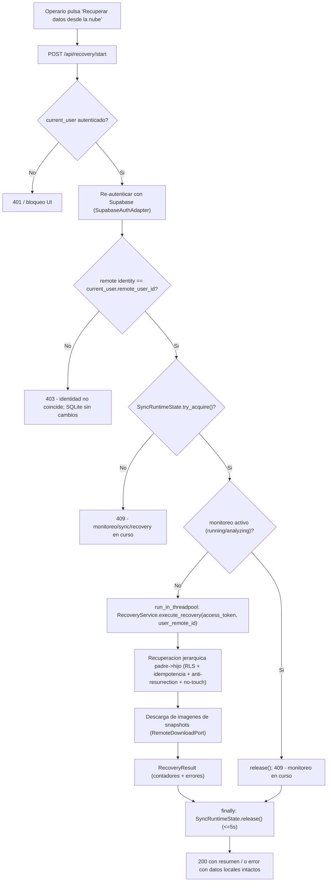
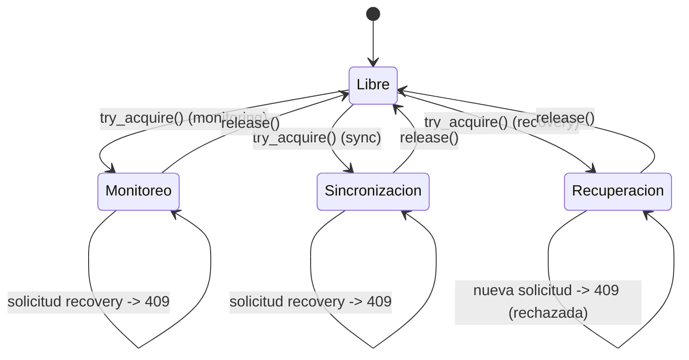

# Design Document

## Overview

Esta especificación añade la **recuperación histórica manual Supabase → SQLite** para el usuario autenticado, junto con un modelo de **propiedad (ownership) multiusuario** anclado en el `Greenhouse` raíz y **aislamiento por RLS** que se hereda a toda la jerarquía. Es la operación inversa a la sincronización existente (`RemoteSyncService`, SQLite → Supabase) y reutiliza toda la infraestructura de re-autenticación, validación de identidad y exclusión mutua de runtime ya establecida en la ruta de sincronización.

El diseño respeta los no-negociables del proyecto:

- **Offline-first / CPU-only.** SQLite es la fuente de verdad operativa local. Supabase es un backend remoto opcional y provider-agnostic en la capa de puertos.
- **Clean Architecture.** El dominio y la aplicación no importan FastAPI, SQLAlchemy, httpx, OpenCV ni PyTorch. Toda capacidad remota se expresa como puertos abstractos (`Protocol`).
- **Migración segura.** Las columnas nuevas son nullable; los scripts de migración son idempotentes y reversibles.
- **Autenticación como `Depends()`**, no como middleware global.

La recuperación es **manual** (iniciada por el operario), **import-missing-only** e **idempotente por `remote_id`** (inserta si falta, reutiliza si existe, nunca actualiza filas existentes), **respetuosa del contrato anti-resurrection** del `Deletion_Outbox` (Spec 021) y **protectora de los datos locales pendientes** (política no-touch / never-update).

### Alcance de los cambios

| Capa | Cambio |
|---|---|
| Dominio / Modelo de datos | `owner_user_id` (FK entera nullable → `users.id`) en `GreenhouseModel`; unicidad `UNIQUE(owner_user_id, name)`; retiro de la unicidad global sobre `name`. |
| Aplicación (puertos) | Nuevos puertos abstractos `RemoteReadPort` y `RemoteDownloadPort`. |
| Aplicación (servicio) | Nuevo `RecoveryService` que orquesta la recuperación jerárquica. |
| Aplicación (repositorios) | Nuevos métodos de lectura e inserción idempotente por `remote_id` (insert-if-missing / reuse-if-present, nunca update) en interfaces de repositorio existentes. |
| Infraestructura | Implementaciones Supabase (PostgREST + Storage) de los nuevos puertos, bajo `src/infrastructure/supabase/`. |
| Presentación | Nueva ruta `app/routes/recovery_api.py` (dueña del `Runtime_Lock`); acción de UI "Recuperar datos desde la nube". |
| Migraciones | SQLite (columna aditiva + recreación segura de constraint); Supabase (columna owner, unicidad por propietario, políticas RLS idempotentes). |

### Non-Goals (heredados de requirements.md)

1. **No sincronización en tiempo real (realtime).** Recuperación y sincronización son manuales.
2. **No colaboración entre usuarios.**
3. **No invernaderos compartidos.** El ownership es de un único usuario.
4. **No uso de `service_role`** en el flujo normal. Solo el JWT del usuario.
5. **No merge automático complejo de conflictos.** Política ante datos locales pendientes: no-touch/skip.
6. **No dashboard** ni vistas analíticas nuevas.
7. **No cambios al pipeline de visión.**
8. **No refactors generales** más allá de lo requerido por ownership y lectura/descarga remota.
9. **No recuperación de videos** (no se almacenan remotamente): fuera de alcance, sin lógica, contadores ni pruebas.
10. **No recuperación de usuarios** (la identidad se establece por autenticación) ni de `activity_types` (catálogo global sembrado localmente en `init_db()` vía `seed_activity_types`).

---

## Architecture

### Jerarquía de propiedad

El ownership se ancla en el `Greenhouse` (raíz) y se hereda por la cadena de propiedad:

```
User (owner)
  └── Greenhouse  (local: owner_user_id → users.id ; remote: owner_user_id (uuid) = auth.uid(), mapeado vía users.remote_user_id)
        └── Module
              ├── Monitoring
              │     ├── MonitoringMetrics (1:1)
              │     └── Snapshot
              │           └── InspectionResult
              └── ActivityLog
```

- **Local (SQLite):** el propietario efectivo de cualquier fila hija se resuelve subiendo por FKs hasta el `Greenhouse` y leyendo su `owner_user_id` (entero → `users.id`).
- **Remoto (Supabase):** el propietario efectivo se resuelve por RLS mediante `EXISTS`/join hacia `greenhouses.owner_user_id` (uuid), comparándolo con la identidad del JWT (`auth.uid()`).

### Flujo de datos de recuperación

El `RecoveryService` procesa entidades en el **mismo orden padre → hijo** que `RemoteSyncService._PHASES`:

```
greenhouse → module → monitoring → monitoring_metrics → snapshot → inspection_result → activity_log
```

Para cada entidad de cada nivel:

> **Identidad remota vs local.** Una fila leída de Supabase tiene como PK la columna `id` (UUID). La fila remota **no** tiene columna `remote_id`. La fila local (SQLite) tiene `id` entero + columna `remote_id` que almacena ese UUID remoto. El mapeo es `remote_row.id → local_row.remote_id`. Las FKs remotas contienen el `id` remoto del padre (p. ej. `module.greenhouse_id` remoto = `id` remoto del greenhouse; `monitoring.module_id` remoto = `id` remoto del module; etc.).

1. **RLS filtra** — el `RemoteReadPort` solo devuelve filas cuyo propietario efectivo coincide con la identidad del JWT.
2. **Validación de `id` remoto** — si la fila remota no tiene un `id` remoto válido, se omite (contador `skipped`).
3. **Anti-resurrection** — se consulta `DeletionOutboxPort` emparejando por `(entity_type, remote_id)` y comparando `deletion_outbox.remote_id == remote_row.id`; si hay entrada cuyo `status` remoto es no-`synced` (∈ {pending, syncing, error}) o la consulta falla, se omite la importación. Además, si un ancestro (greenhouse/module/monitoring) está marcado, se omite todo su subárbol (supresión jerárquica).
4. **Idempotencia (import-missing-only)** — se busca fila local del mismo tipo cuyo `remote_id == remote_row.id`; si existe, se **valida la coherencia jerárquica** (que su padre/propietario local mapee al mismo `id` remoto de padre/propietario que la fila remota referencia); si coincide, se reutiliza su `id` local para resolver FKs de descendientes sin modificar ningún campo (nunca update); si no coincide → **conflicto** (no modificar, no reutilizar, omitir entidad y subárbol, reportar). Si no existe fila con ese `remote_id` pero existe una fila con la misma clave natural sin ese `remote_id` → **conflicto de clave natural** (no auto-asociar ni sobrescribir; omitir y reportar). En otro caso, insert con PK autoincremental nueva preservando `remote_id = remote_row.id`.
5. **Protección de pendientes locales** — como la recuperación nunca actualiza filas existentes, las filas locales (incluidas `remote_sync_status ∈ {pending, error}`) quedan inherentemente preservadas: solo se reutilizan, nunca se escriben (no-touch / never-update).
6. **Remapeo de FK** — se resuelve el `id` remoto del padre (contenido en la FK remota de la hija) a su `id` local (recién insertado o preexistente reutilizado) mediante un mapa en memoria `(entity_type, remote_row.id) -> local_id`.
7. **Snapshots:** además, se descarga la imagen vía `RemoteDownloadPort` usando el **mismo** builder de ruta determinista de la sincronización.

Cada fila/objeto tiene **aislamiento de fallos**: un error se acumula en `RecoveryResult.errors` y se continúa con el resto.

### Exclusión mutua de runtime

La recuperación comparte el **mismo** `SyncRuntimeState` que monitoreo y sincronización. La ruta `recovery_api.py` es la **única** dueña de `try_acquire()`/`release()` para recuperación (igual que `sync_api.py` lo es para sincronización). Si el lock está tomado (monitoreo, sync o recovery en curso), la ruta responde **409** sin tocar datos.





### Capas y ubicación de artefactos

| Artefacto | Ruta | Capa |
|---|---|---|
| `RemoteReadPort`, `RemoteDownloadPort` | `src/application/interfaces/` | Aplicación (puertos) |
| `RecoveryService`, `RecoveryResult` | `src/application/services/recovery_service.py` | Aplicación |
| Métodos de repositorio (`find_by_remote_id`, `insert_preserving_remote_id`, …) | `src/domain/repositories/*` (ABC) | Dominio (interfaces) |
| Implementaciones SQLAlchemy | `src/infrastructure/persistence/repositories/*` | Infraestructura |
| Impl. Supabase de read/download | `src/infrastructure/supabase/` | Infraestructura |
| `owner_user_id` + constraint | `src/infrastructure/persistence/models/greenhouse_model.py` | Infraestructura |
| Ruta `recovery_api.py` | `app/routes/recovery_api.py` | Presentación |
| UI "Recuperar datos desde la nube" | `app/templates/*` + `app/static/js/remote_sync.js` (o nuevo `recovery.js`) | Presentación |
| Migración SQLite | módulo de init/migración de persistencia | Infraestructura |
| Migración Supabase + RLS | `supabase/migrations/` (SQL idempotente) | Infra / docs |

---

## Components and Interfaces

### Puertos nuevos (capa de aplicación, `Protocol`, sin imports de infraestructura)

#### RemoteReadPort — `src/application/interfaces/remote_read_port.py`

Añade la capacidad de **lectura remota filtrada por RLS** (ausente en `RemoteDataPort`). Provider-agnostic; no conoce PostgREST, buckets ni httpx.

```python
from dataclasses import dataclass, field
from typing import Optional, Protocol

@dataclass
class RemoteQueryResult:
    """Resultado de una consulta remota de filas."""
    success: bool
    rows: list[dict] = field(default_factory=list)
    error_type: Optional[str] = None      # CONNECTIVITY | REMOTE_UNAVAILABLE | RLS_DENIED | UNKNOWN
    error_message: Optional[str] = None

class RemoteReadPort(Protocol):
    def fetch_by_owner(
        self,
        access_token: str,
        table: str,
        owner_user_id: str,   # UUID remoto = auth.uid()
        filters: Optional[dict] = None,
    ) -> RemoteQueryResult:
        """Devuelve las filas de `table` que RLS autoriza para `owner_user_id` (UUID = auth.uid()).

        Para tablas hijas cuyo propietario se resuelve por join, la implementación
        remota (RLS) ya limita el resultado; `filters` permite acotar por padre
        (p. ej. {"greenhouse_id": <remote_id>}) cuando convenga paginar por rama.
        """
        ...
```

Notas de contrato:
- `error_type` reutiliza la misma clasificación que los puertos existentes (`CONNECTIVITY`, `REMOTE_UNAVAILABLE`, `RLS_DENIED`, `UNKNOWN`), para mapear errores de forma homogénea.
- El puerto **no** construye URLs ni lee variables de entorno.
- `filters` es opcional; la seguridad real la impone RLS, no `filters`.

#### RemoteDownloadPort — `src/application/interfaces/remote_download_port.py`

Añade la capacidad de **descarga de objetos de Storage** (ausente en `RemoteStoragePort`).

```python
from dataclasses import dataclass
from typing import Optional, Protocol

@dataclass
class RemoteDownloadResult:
    """Resultado de una descarga de objeto remoto."""
    success: bool
    already_absent: bool = False          # objeto no existe remotamente (tolerado)
    local_file_path: Optional[str] = None
    error_type: Optional[str] = None      # CONNECTIVITY | REMOTE_UNAVAILABLE | RLS_DENIED | STORAGE_ERROR | UNKNOWN
    error_message: Optional[str] = None

class RemoteDownloadPort(Protocol):
    def download_object(
        self,
        access_token: str,
        remote_path: str,
        local_file_path: str,
    ) -> RemoteDownloadResult:
        """Descarga un objeto remoto a la ruta local indicada.

        Si el objeto no existe remotamente, retorna success=False con
        already_absent=True (condición tolerada, no error fatal).
        """
        ...
```

Las implementaciones concretas (Supabase Storage vía httpx / PostgREST) viven en `src/infrastructure/supabase/` y se describen solo por su interfaz. No se añaden lecturas a los puertos de escritura existentes.

### Servicio de aplicación: RecoveryService — `src/application/services/recovery_service.py`

Depende **solo** de puertos abstractos, interfaces de repositorio y stdlib. Sin httpx / SQLAlchemy / FastAPI.

```python
@dataclass
class EntityCounters:
    recovered: int = 0
    skipped: int = 0
    failed: int = 0

@dataclass
class RecoveryError:
    entity_type: str
    entity_id: str            # remote_id de la entidad afectada
    reason: str

@dataclass
class RecoveryResult:
    success: bool
    # Contadores por tipo de entidad recuperable
    # (NO incluye users ni activity_types: fuera de alcance de recuperación)
    greenhouses: EntityCounters
    modules: EntityCounters
    monitorings: EntityCounters
    monitoring_metrics: EntityCounters
    snapshots: EntityCounters
    inspection_results: EntityCounters
    activity_logs: EntityCounters
    # Imágenes
    images_downloaded: int = 0
    images_skipped: int = 0
    images_failed: int = 0
    # Omitidos por reglas de protección
    skipped_local_pending: list[str] = field(default_factory=list)   # ids locales preservados
    skipped_anti_resurrection: list[RecoveryError] = field(default_factory=list)
    errors: list[RecoveryError] = field(default_factory=list)
    duration_seconds: float = 0.0
```

Método principal:

```python
def execute_recovery(self, access_token: str, user_remote_id: str) -> RecoveryResult
```

Responsabilidades:

1. **Orden jerárquico** idéntico al de la sincronización (reutiliza la lista de fases padre→hijo).
2. **Mapa de remapeo de FK en memoria:** `Dict[(entity_type, remote_row.id)] -> local_id`. Se completa al materializar cada nivel y se consulta para resolver la FK del hijo (cuya FK remota contiene el `id` remoto del padre).
3. **Idempotencia (import-missing-only) y conflictos:** por cada fila remota con `id` remoto válido → `repo.find_by_remote_id(remote_row.id)` (busca la fila local cuyo `remote_id == remote_row.id`); si existe, se valida la coherencia jerárquica (que el padre/propietario local mapee al mismo `id` remoto que la fila remota referencia) y, si coincide, se reutiliza su `id` local para resolver FKs de descendientes **sin modificar ningún campo** (nunca update); si NO coincide → **conflicto** (no modificar, no reutilizar para descendientes, omitir la entidad y todo su subárbol, y registrar el conflicto). Si no existe fila con ese `remote_id` pero sí una con la misma **clave natural** sin ese `remote_id` (p. ej. local `(owner=A, name=USB, remote_id=NULL)` vs remoto `(owner=A, name=USB, id=XYZ)`) → **conflicto de clave natural** (no auto-asociar el UUID, no sobrescribir, omitir y reportar). En otro caso, `repo.insert_preserving_remote_id(...)` preservando `remote_id = remote_row.id`.
4. **Anti-resurrection:** antes de importar, `deletion_outbox_port.find_blocking_by_remote(entity_type, remote_row.id)` (empareja por `(entity_type, remote_id)` comparando `deletion_outbox.remote_id == remote_row.id`, `entity_type ∈ {greenhouse, module, monitoring}`, el `remote_id` del outbox puede ser None); si existe una entrada cuyo `status` remoto es no-`synced` (∈ {pending, syncing, error}), se omite y se registra en `skipped_anti_resurrection`. Además, se propaga la **supresión jerárquica**: si un ancestro está marcado, se omite todo su subárbol de descendientes. Si la consulta falla → se omite (fail-safe) y se registra el motivo.
5. **Protección de pendientes locales:** como la recuperación nunca actualiza filas existentes, las filas locales con `remote_sync_status ∈ {pending, error}` quedan inherentemente preservadas; su `id` se registra en `skipped_local_pending` cuando se reutiliza en vez de insertar.
6. **Snapshots:** tras materializar el snapshot, se construye la ruta remota con el **mismo** builder de ruta existente (`monitorings/{monitoring_remote_uuid}/{snapshot_type}/snapshot_{frame_index:06d}.jpg`) y se descarga vía `RemoteDownloadPort`, apoyándose en los timeouts ya configurados en el adaptador httpx existente (sin reintentos propios). `already_absent` → contador `images_skipped`; fallo → `images_failed`; éxito → `images_downloaded`. Invariante: `downloaded + skipped + failed == total esperados`.
7. **Fuera de alcance:** no se recuperan videos, usuarios ni `activity_types`; el `activity_log` resuelve su `activity_type` a partir del catálogo global ya presente localmente (por `activity_type_code`/`id`).
8. **Tolerancia por fila:** todo fallo individual se acumula en `errors` y no aborta la operación; se aborta antes de tocar SQLite solo ante fallo previo de re-autenticación o backend inalcanzable (según timeouts de los adaptadores existentes).

### Repositorios: métodos nuevos (dominio ABC + impl. infraestructura)

El `RecoveryService` lee/escribe SQLite solo a través de interfaces de repositorio; el dominio permanece libre de SQLAlchemy. La recuperación es **import-missing-only**, por lo que **no** existe un método de actualización desde remoto. Métodos añadidos a cada repositorio de la jerarquía (Greenhouse, Module, Monitoring, MonitoringMetrics, Snapshot, InspectionResult, ActivityLog):

| Método | Propósito |
|---|---|
| `find_by_remote_id(remote_id: str) -> Entity | None` | Detección de existencia: busca la fila local cuyo `remote_id` es igual al `id` de la fila remota (`local_row.remote_id == remote_row.id`); si existe se reutiliza sin modificar, previa validación de coherencia jerárquica (idempotencia + conflictos, Req 9). |
| `insert_preserving_remote_id(entity, remote_id, local_parent_id) -> Entity` | Inserta con PK local entera autoincremental nueva, preserva `remote_id = remote_row.id`, remapea la FK del padre resolviendo el `id` remoto del padre a su `id` local (Req 8). Solo se invoca cuando la fila no existe y no hay conflicto. |
| `get_local_id_by_remote_id(remote_id: str) -> int | None` | Resolución de FK padre→hijo (dado el `id` remoto del padre, devuelve el `id` local cuyo `remote_id` coincide) para el mapa de remapeo (Req 8.5). |

Para el `Greenhouse` adicionalmente:

| Método | Propósito |
|---|---|
| `create_with_owner(name, owner_user_id, ...) -> Greenhouse` | Creación con propietario (Req 1.2). Rechaza si `owner_user_id` es nulo cuando se exige autenticación (Req 1.3). Valida `UNIQUE(owner_user_id, name)` con el nombre comparado tal como se almacena. |
| `find_owner_remote_id(greenhouse_id) -> str | None` | Correlación `owner_user_id (local → users.id) → users.remote_user_id` (UUID = auth.uid()) (Req 1.4/1.5). |

### Presentación: ruta recovery_api.py — `app/routes/recovery_api.py`

Espeja el patrón de `sync_api.py`:

- Requiere `current_user` mediante la dependencia de autenticación existente (`Depends()`).
- Re-autentica con `SupabaseAuthAdapter` y obtiene `auth_result.access_token` (JWT efímero, no persistido).
- Valida `current_user.remote_user_id` contra la identidad remota re-autenticada; **mismatch → 403** con SQLite intacto.
- Es la **única** dueña de `SyncRuntimeState.try_acquire()`/`release()` para recuperación; **contención → 409**.
- Verifica que no exista monitoreo activo (`running`/`analyzing`); si lo hay → `release()` + **409**.
- Ejecuta `RecoveryService.execute_recovery(...)` en `run_in_threadpool`.
- Libera el lock en `finally` (≤ 5 s), tanto en éxito como en error/excepción (Req 14.5/14.6).

Endpoint propuesto:
- `POST /api/recovery/start` → inicia la recuperación (síncrona dentro del request) y devuelve el resumen (`RecoveryResult`) al completar, o 401/403/409/500. No se añade endpoint de estado ni polling: la UI muestra un spinner y deshabilita el control durante el POST.

### Presentación: UI "Recuperar datos desde la nube"

Ubicación: sección de **Exportación / Sincronización** (portrait-first). Cumple el steering de UX:

- Etiqueta en español, lenguaje de operario: **"Recuperar datos desde la nube"**; sin jerga técnica ni lenguaje robótico/autónomo.
- Objetivo táctil ≥ 60×48 px, separación ≥ 8 px, texto ≥ 16 px, márgenes de seguridad 16 px, orientación vertical 480×800.
- Si no hay sesión activa → bloquea el inicio y muestra mensaje en español "Debes iniciar sesión para recuperar tus datos".
- Solo se inicia con activación explícita (sin automático, programado ni realtime).
- Indicador de actividad visible (spinner) y control deshabilitado durante la petición POST, sin sondeo ni endpoint de estado adicional.
- En error: detiene el indicador, muestra causa en lenguaje de operario y ofrece **reintentar**; datos locales intactos.

---

## Data Models

### Delta SQLite

`greenhouses` (cambios):

| Campo | Tipo | Constraint | Descripción |
|---|---|---|---|
| `owner_user_id` | Integer | FK → `users.id`, **nullable**, default NULL | Propietario local del invernadero. |

Cambios de restricción:
- **Retirar** la unicidad global sobre `greenhouses.name` (`unique=True`).
- **Añadir** unicidad compuesta `UniqueConstraint(owner_user_id, name)` con nombre `uq_greenhouse_owner_name`.

Modelo ORM resultante (extracto):

```python
owner_user_id: Mapped[int | None] = mapped_column(
    Integer, ForeignKey("users.id"), nullable=True, default=None
)
name: Mapped[str] = mapped_column(String(100), nullable=False)  # ya no unique=True
__table_args__ = (
    UniqueConstraint("owner_user_id", "name", name="uq_greenhouse_owner_name"),
)
```

Comparación de nombre (Req 2.1): la unicidad es únicamente `UNIQUE(owner_user_id, name)` y el nombre se compara **tal como se almacena** (sin normalización de mayúsculas/minúsculas ni recorte de espacios; no hay índice funcional ni contrato de normalización existente). El valor mostrado es el valor almacenado.

**Filas legacy sin propietario determinístico.** El requisito 5 exige no adjudicar propietario a filas legacy ambiguas. Dado que `owner_user_id` es una FK a `users.id`:

- **`owner_user_id = NULL`** representa el estado "sin propietario asignado" en SQLite (coherente con Req 1.6, 3.3, 3.4). El backfill solo asigna propietario con evidencia persistida, inequívoca y determinística (p. ej. un `created_by_user_id` persistido si y solo si existe y no es ambiguo); la existencia de un único usuario activo NO basta.
- Las filas con `owner_user_id = NULL` se registran en el **reporte de migración** (orientado a administración). `RemoteSyncService` aplica una **validación explícita** que omite su propagación (no las sincroniza como propiedad de nadie) y marca la entidad usando el **mecanismo de error/reporte existente**, sin introducir un nuevo estado de sincronización: `owner_user_id IS NULL` por sí solo basta para bloquear la sincronización de propiedad (Req 5.4). Bajo RLS, sus filas remotas (con `owner_user_id` NULL) no son visibles para un usuario normal.
- Justificación: mantener la integridad de la FK, evitar un usuario "fantasma" y no adjudicar datos por defecto.

### Delta Supabase (remoto)

`greenhouses` (remoto):

| Campo | Tipo | Constraint |
|---|---|---|
| `owner_user_id` | uuid | referencia el id del usuario en Supabase Auth (`auth.users(id)` = `auth.uid()`), nullable para legacy |
| unicidad | — | `UNIQUE (owner_user_id, name)` por propietario (nombre comparado tal como se almacena) |

El resto de tablas hijas (`modules`, `monitorings`, `monitoring_metrics`, `snapshots`, `inspection_results`, `activity_logs`) **no** añaden columna de propietario: su propietario efectivo se resuelve por join hacia `greenhouses.owner_user_id`.

Correlación local↔remoto: `greenhouses.owner_user_id (local, int → users.id) → users.remote_user_id (UUID) == greenhouses.owner_user_id (remoto, uuid = auth.uid())`.

**Decisión de identidad (confirmada).** El `owner_user_id` remoto es un UUID que referencia el id del usuario de Supabase Auth (`auth.users(id)` = `auth.uid()`), **no** `profiles(id)`. Existe una tabla `profiles` creada por trigger, pero el flujo de autenticación no la lee: la identidad remota usada es `auth.uid()`. Localmente, `greenhouses.owner_user_id` es una FK entera a `users.id`, y el mapeo local→remoto es `users.remote_user_id` (que almacena ese `auth.uid()`).

### RLS (diseño de políticas)

- **`greenhouses`:**
  - **SELECT / DELETE:** `USING (owner_user_id = auth.uid())` (propiedad de la fila existente).
  - **INSERT:** `WITH CHECK (owner_user_id = auth.uid())`.
  - **UPDATE:** `USING (owner_user_id = auth.uid())` sobre la fila existente **y** `WITH CHECK (owner_user_id = auth.uid())` para impedir reasignar la fila a otro propietario.
  - Las filas cuyo `owner_user_id` es NULL o no coincide con `auth.uid()` simplemente no son visibles en SELECT (filtradas); la escritura sobre ellas es denegada por `USING`/`WITH CHECK` (Req 4.1, 4.4, 4.5).
- **Tablas hijas:** para CADA tabla hija (`modules`, `monitorings`, `monitoring_metrics`, `snapshots`, `inspection_results`, `activity_logs`) se definen **las cuatro** operaciones resolviendo la propiedad por `EXISTS`/join subiendo la cadena hasta un `greenhouses` cuyo `owner_user_id = auth.uid()`. Las tablas hijas **no** duplican `owner_user_id`: la propiedad se resuelve únicamente por join hacia `greenhouses`. El propósito es impedir insertar o mover una entidad hija hacia la jerarquía de otro usuario.
  - **SELECT / DELETE:** `USING (EXISTS(... join hasta greenhouse WHERE greenhouse.owner_user_id = auth.uid()))`.
  - **INSERT:** `WITH CHECK (EXISTS(... propiedad vía el padre ...))`.
  - **UPDATE:** `USING (EXISTS(... propiedad actual ...))` **y** `WITH CHECK (EXISTS(... propiedad resultante ...))`.

  Ej. `modules`:

  ```sql
  -- SELECT / DELETE
  USING (EXISTS (
    SELECT 1 FROM greenhouses g
    WHERE g.id = modules.greenhouse_id
      AND g.owner_user_id = auth.uid()
  ))
  -- INSERT
  WITH CHECK (EXISTS (
    SELECT 1 FROM greenhouses g
    WHERE g.id = modules.greenhouse_id
      AND g.owner_user_id = auth.uid()
  ))
  -- UPDATE: USING (propiedad actual) + WITH CHECK (propiedad resultante), ambos con el mismo EXISTS
  ```

  Cadenas de resolución: `monitorings` → join a `modules` → `greenhouses`; `snapshots` → `monitorings` → …; `inspection_results` → `snapshots` → …; `monitoring_metrics` → `monitorings` → …; `activity_logs` → `modules` → … (Req 4.2). En INSERT/UPDATE el `WITH CHECK` impide insertar o reubicar una fila hija bajo un `greenhouse` ajeno.
- **Comportamiento de SELECT:** las filas ajenas se **filtran** del conjunto de resultados; RLS no emite un error explícito para SELECT (Req 4.3). La denegación explícita aplica a las escrituras (INSERT/UPDATE vía `WITH CHECK`, DELETE vía `USING`).
- **Sin JWT / JWT inválido/expirado:** sin acceso a las filas protegidas (Req 4.5).
- **Cadena de propiedad irresoluble:** si una fila hija no resuelve un `greenhouse` con `owner_user_id = auth.uid()`, esa fila queda fuera del conjunto de resultados (no visible / filtrada) para el usuario (Req 4.6).
- **Idempotencia de políticas:** cada política se crea con `DROP POLICY IF EXISTS ...; CREATE POLICY ...` (Req 18.4).

**Aislamiento de Storage (snapshots).** El JWT de un usuario no debe poder descargar objetos de otra jerarquía. Reutilizando el contrato de ruta existente (`monitorings/{monitoring_remote_uuid}/{snapshot_type}/snapshot_{frame_index:06d}.jpg`), la política de Storage restringe el acceso a objetos cuya jerarquía propietaria (resuelta `monitoring_remote_uuid` → `monitoring` → `module` → `greenhouse.owner_user_id = auth.uid()`) pertenezca al usuario solicitante. No se rediseña Storage (Req 12.6).

Ubicación de scripts: `supabase/migrations/NNN_ownership_and_rls.sql` (SQL idempotente). La estrategia y el `create_all` local se documentan en `docs/` cuando corresponda.

---

## Invariantes de corrección (referencia, no requieren PBT)

*Los siguientes invariantes describen comportamientos que deben cumplirse en toda ejecución válida.* Se documentan como referencia de diseño; **esta especificación no exige verificarlos mediante pruebas basadas en propiedades (Hypothesis)**. Se cubren con las pruebas dirigidas (unitarias/integración) de la estrategia de pruebas.

1. **Unicidad por propietario:** para todo par de invernaderos del mismo propietario con el mismo `name` (comparado tal como se almacena), la segunda inserción es rechazada por `UNIQUE(owner_user_id, name)`; dos propietarios distintos pueden tener cada uno un invernadero con el mismo nombre sin conflicto. *(Req 2.1, 2.4, 2.5)*
2. **Remapeo de FK y preservación de `remote_id`:** cada entidad materializada conserva su `remote_id` original, recibe una PK local autoincremental nueva (nunca usa el `remote_id` como PK) y cada FK local apunta al `id` local del padre remapeado desde el `remote_id` del padre. *(Req 8.1–8.5)*
3. **Idempotencia import-missing-only:** ejecutar la recuperación 2+ veces sobre un estado remoto sin cambios produce un estado local idéntico; el número de filas por `remote_id` permanece en 1 por nivel y el `id` local de cada fila preexistente se conserva sin modificación. *(Req 9.1, 9.2, 9.4, 9.5)*
4. **Preservación local (never-update):** la recuperación nunca actualiza ni elimina filas existentes (incluidas `remote_sync_status ∈ {pending, error}`); el conteo e identificadores de dichas filas son idénticos antes y después. *(Req 10.1, 10.2, 10.4)*
5. **Anti-resurrection (directo y jerárquico):** para toda entidad con una entrada de `Deletion_Outbox` cuyo `status` remoto es no-`synced` (∈ {pending, syncing, error}) emparejada por `(entity_type, remote_id)`, la recuperación no la inserta ni la reactiva y no modifica la entrada del outbox; además, si un ancestro (greenhouse/module/monitoring) está marcado, ninguno de sus descendientes se recupera aunque existan remotamente. *(Req 11.1, 11.2, 11.3)*
6. **Conservación del conteo de imágenes:** la suma de imágenes descargadas, omitidas y fallidas es igual al total de objetos esperados. *(Req 12.4)*
7. **Forma del resultado:** todos los contadores por entidad e imagen son enteros no negativos; sin entidades ni imágenes procesadas, el resultado tiene todos los contadores en cero y la lista de errores vacía. *(Req 16.1, 16.2, 16.5)*
8. **Idempotencia de la migración local:** aplicar la migración local (`create_all(checkfirst)` + backfill) 1+ veces produce el mismo estado final: sin errores, sin columnas/tablas/registros duplicados y sin modificar propietarios ya asignados. *(Req 5.5, 18.1, 18.2)*
9. **Exclusión mutua del Runtime_Lock:** a lo sumo un titular (monitoreo, sincronización o recuperación) sostiene el lock en cualquier instante; toda solicitud recibida con el lock tomado se rechaza sin adquirirlo, y toda liberación restablece el estado a libre. *(Req 14.1, 14.4, 14.5, 14.6)*

---

## Error Handling

### Clasificación de errores remotos (reutilizada)

Los nuevos puertos reutilizan la clasificación existente para homogeneidad:

| `error_type` | Origen | Tratamiento en recuperación |
|---|---|---|
| `CONNECTIVITY` | Red inalcanzable / timeout de conexión | Si ocurre **antes de cualquier escritura**: abortar con SQLite íntegro (Req 7.6). Si ocurre **después** de insertar algunas entidades: conservar lo ya recuperado, no tocar filas preexistentes, reportar recuperación parcial/error y permitir re-ejecución idempotente posterior (Req 7.8, 16.6). Error de causa "backend remoto inalcanzable". |
| `REMOTE_UNAVAILABLE` | Backend responde no disponible | Igual que `CONNECTIVITY`. |
| `RLS_DENIED` | Fila no autorizada por RLS | En SELECT, la fila simplemente no aparece en el conjunto (RLS filtra, sin error). Para escrituras denegadas se registra y no se aplican cambios parciales (Req 4.3, 4.4). |
| `STORAGE_ERROR` | Fallo de Storage (solo descarga) | Sin reintentos propios (se apoya en el adaptador httpx existente); tras fallo → `images_failed` (Req 12.3). |
| `UNKNOWN` | No clasificado | Registrar en `errors`, continuar (tolerancia por fila). |

### Reglas de manejo

- **Re-auth / backend inalcanzable antes de escribir (Req 7.6):** si la re-autenticación falla o el backend resulta inalcanzable **antes de iniciar cualquier escritura** (según los timeouts ya configurados en los adaptadores httpx existentes, sin límites nuevos), la recuperación aborta **antes** de tocar SQLite; la DB local queda íntegra e intacta y se devuelve el error de causa (credenciales inválidas o backend inalcanzable).
- **Conectividad perdida a mitad de la recuperación (Req 7.8, 16.6):** si la conectividad falla **después** de que ya se insertaron algunas entidades, se conservan las entidades ya recuperadas correctamente, no se modifica ninguna fila local preexistente, se reporta una recuperación parcial/error (éxito=falso) con la causa, y una ejecución posterior puede continuar de forma idempotente (import-missing-only). No se ejecuta rollback global, prefetch total ni infraestructura adicional.
- **Identidad no coincide (Req 7.4):** `recovery_api` devuelve **403** y no ejecuta el servicio; SQLite sin cambios.
- **Tolerancia por fila (Req 16.4):** todo fallo de una fila u objeto individual incrementa el contador `failed` correspondiente, se registra en `errors` con `(entity_type, entity_id, reason)` y se continúa con las restantes. Nunca aborta la operación completa por un fallo aislado.
- **Padre no resuelto (Req 8.6):** se omite la hija, se registra `(entity_type, id_remoto_hija, id_remoto_padre)` (el `id` remoto del padre proviene de la FK remota de la hija) y no se revierten las entidades ya recuperadas.
- **`id` remoto nulo/vacío (Req 8.7, 9.3):** si la fila remota no tiene un `id` remoto válido, se omite y se indica la causa en el resumen (`skipped`).
- **Conflictos (Req 9.6/9.7):** fila local con `remote_id == remote_row.id` pero padre/propietario no coincidente → conflicto (omitir entidad + subárbol, reportar, sin merge). Clave natural existente sin `remote_id` coincidente → conflicto de clave natural (no auto-asociar ni sobrescribir; omitir y reportar).
- **Anti-resurrection (Req 11):** se empareja por `(entity_type, remote_id)` comparando `deletion_outbox.remote_id == remote_row.id`; si hay entrada de `Deletion_Outbox` con `status` no-`synced` (∈ {pending, syncing, error}), se omite la importación y, si es un ancestro, se omite todo su subárbol (supresión jerárquica). Si la consulta al `Deletion_Outbox` falla → fail-safe: se omite la importación y se registra el motivo.
- **Objeto de Storage ausente (Req 12.2):** `already_absent=True` → `images_skipped`, se continúa. Un fallo de descarga → `images_failed`, sin reintentos propios.
- **Liberación del lock (Req 14.5/14.6):** `recovery_api` libera el `Runtime_Lock` en un bloque `finally`, dentro de 5 s, tanto en éxito como en error/excepción; ante error, se preserva el estado previo sin cambios parciales.

---

## Testing Strategy

Enfoque **dirigido** (targeted): solo pruebas unitarias y de integración basadas en ejemplos para los comportamientos críticos. Esta especificación **no exige pruebas basadas en propiedades (Hypothesis)**; los invariantes de la sección anterior existen como referencia de diseño, pero no se requiere su verificación por PBT. Todas las pruebas de lógica de aplicación se ejecutan **sin hardware** (sin cámara, GPIO ni Raspberry Pi), usando implementaciones fake/in-memory de los puertos y SQLite in-memory (según convención de `tests/conftest.py`).

### Pruebas requeridas (exactamente estas)

Las pruebas 1, 3, 4, 5, 6, 9 y la de regresión de `RemoteSyncService` son **obligatorias** (suite offline). Las pruebas 2 y 8 (RLS/Storage reales) son de **validación manual** (backend Supabase; fuera de la suite offline). Las pruebas menores de dataclasses/UI son opcionales.

1. **Ownership y unicidad — obligatoria (Req 2.1/2.4/2.5):** `UNIQUE(owner_user_id, name)` acepta el mismo nombre bajo dos propietarios distintos y rechaza el mismo nombre bajo un mismo propietario (nombre comparado tal como se almacena). Incluye creación con owner (con auth → owner asignado; sin auth → rechazo sin persistir; columna acepta NULL) y FK inválida (`owner_user_id` inexistente → rechazo por integridad referencial).
2. **RLS con dos usuarios — manual (Req 4.1–4.6):** con dos identidades, cada usuario obtiene solo sus filas (las ajenas se filtran, sin error en SELECT) y las escrituras que violan la propiedad se deniegan (incluidos INSERT/UPDATE `WITH CHECK` en tablas hijas). *(Validación MANUAL; requiere backend Supabase; fuera de la suite offline por defecto; entorno dedicado.)*
3. **Recuperación en SQLite vacío — obligatoria (Req 8.1–8.5):** se reconstruye la jerarquía completa; cada entidad conserva su `remote_id` igual al `id` de la fila remota y cada FK apunta al `id` local del padre remapeado (resuelto por el `id` remoto del padre).
4. **Idempotencia import-missing-only — obligatoria (Req 9):** dos ejecuciones consecutivas no crean filas adicionales (conteo por `remote_id` == 1 por nivel) y las filas preexistentes no se modifican.
5. **Preservación local — obligatoria — nunca se actualizan filas existentes (Req 10):** filas locales existentes (incluidas `pending`/`error`) conservan sus valores sin modificación tras la recuperación.
6. **RecoveryService núcleo — obligatoria — conflictos y anti-resurrection (Req 9.6/9.7, 11):** (a) una entidad con entrada de `Deletion_Outbox` no-`synced` no se reinserta; (b) si un ancestro está marcado (tombstoned), sus descendientes tampoco se recuperan aunque existan remotamente; (c) conflicto por padre/propietario no coincidente (fila local con mismo `remote_id` pero padre/propietario que no corresponde al remoto → omite entidad + subárbol y reporta, sin merge); (d) conflicto de clave natural sin `remote_id` coincidente (local `(owner=A, name=USB, remote_id=NULL)` vs remoto `(owner=A, name=USB, id=XYZ)` → omite y reporta, sin auto-asociar ni sobrescribir).
7. **Snapshot presente/ausente — obligatoria (Req 12.2/12.3):** un objeto presente se descarga; uno ausente se registra como omitido y la operación continúa sin abortar.
8. **Aislamiento de Storage — manual (Req 12.6):** el JWT de un usuario no puede descargar objetos de otra jerarquía. *(Validación MANUAL; requiere backend/Storage; fuera de la suite offline por defecto.)*
9. **Exclusión mutua — obligatoria (Req 14):** una solicitud de recuperación con monitoreo, sincronización o recuperación activa se rechaza con 409 sin modificar datos locales. Incluye la ruta `recovery_api` (identidad no coincide → 403 + DB intacta; sin sesión → 401; re-auth falla/backend inalcanzable → abort + DB intacta).

Prueba de compatibilidad adicional **obligatoria** (regresión): **RemoteSyncService con ownership (Req 6.1–6.5)** — owner en payload, preservación de orden/FASE 0/exclusión de campos, `RLS_DENIED` → entidad reintentable no re-subida, y greenhouse con `owner_user_id IS NULL` no propagado (validación explícita + mecanismo de error/reporte existente, sin nuevo estado).

### UI

- **Control de recuperación (Req 15.1–15.7):** etiqueta en español, objetivo táctil ≥ 60×48 px, texto ≥ 16 px, mensaje sin sesión, spinner + control deshabilitado durante el POST (sin polling), acción de reintento en error, portrait-first.

### Ejecución de la suite

- Durante los checkpoints intermedios, ejecutar **solo** las pruebas dirigidas del área modificada, no la suite completa.
- La suite completa (`python -m pytest`) se ejecuta **a lo sumo una vez, al final** (checkpoint final).
- Solo las pruebas de RLS/Storage/migración contra Supabase real dependen de backend y quedan fuera de la suite offline por defecto.
