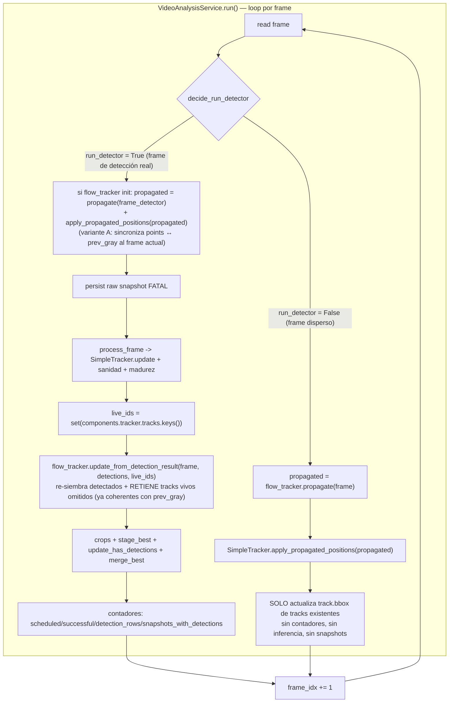
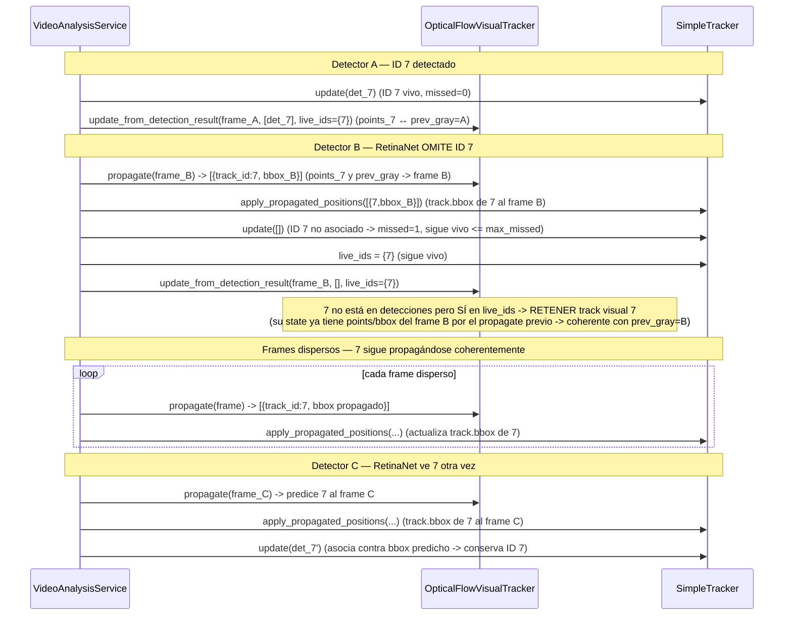

# Diseño de Bugfix — SPEC 026: Continuidad de Flujo del Tracker

## Overview

El análisis diferido de video (`VideoAnalysisService`) ejecuta RetinaNet de forma **dispersa**: solo en algunos frames corre el detector, y en los frames intermedios un `OpticalFlowVisualTracker` (Lucas-Kanade) propaga espacialmente las posiciones de los tracks. El defecto confirmado es que la posición propagada por Optical Flow **nunca se reincorpora** al estado espacial de `SimpleTracker`: en la rama dispersa `else` de `VideoAnalysisService.run()` se llama `flow_tracker.propagate(frame)` y se **descarta** su retorno. Como `SimpleTracker.update()` asocia detecciones contra `track.bbox` (que solo se actualiza en detección real), tras varios frames dispersos con movimiento la siguiente detección de RetinaNet se compara contra una posición desactualizada, la asociación por IoU/distancia falla y se genera un `track_id` nuevo para el mismo tomate físico → **fragmentación de identidad** y **sobreconteo** de `unique_tomatoes`.

El defecto tiene **dos facetas** confirmadas en código:

- **Faceta 1 (desincronización espacial):** el retorno de `propagate()` se descarta y `SimpleTracker.track.bbox` queda congelado en la última detección real, rompiendo la asociación tras movimiento.
- **Faceta 2 (omisión del detector, CA-09):** `OpticalFlowVisualTracker.update_from_detection_result()` reconstruye `self.tracks` **solo** a partir de las detecciones recibidas (`self.tracks = new_tracks`), por lo que un track que RetinaNet **omite** en un frame de detección programado se destruye del estado visual aunque `SimpleTracker` lo mantenga vivo por `max_missed`; ese track deja de propagarse y, al reaparecer, la fragmentación vuelve.

**Cadencia dispersa real (perfil EDGE):** la configuración vigente es `sparse_min_frames_between_detections = 1`, `sparse_max_frames_without_detection = 4` y `camera_fps = 5`. Es decir, hay **al menos 1 frame disperso** entre detecciones y se **fuerza una detección tras 4 frames** sin ella. Toda referencia previa a una cadencia de "3–7 frames" era incorrecta y queda sustituida por estos valores.

La estrategia de corrección es **mínima, reversible y compatible con la arquitectura**:

1. Añadir a `SimpleTracker` un método nuevo `apply_propagated_positions(propagated)` que actualiza **solo la posición espacial** (`track.bbox`) de tracks **ya existentes**, sin crear identidad ni contar nada.
2. En la rama dispersa de `VideoAnalysisService.run()`, capturar el retorno de `flow_tracker.propagate(frame)` y pasarlo a `components.tracker.apply_propagated_positions(...)`.
3. **(Faceta 2 / CA-09 + coherencia temporal / CA-10)** En **todo frame de detector** con `flow_tracker` ya inicializado, **predecir Optical Flow hasta el frame de detección actual** (`propagate(frame_detector)`) ANTES de `process_frame`/`SimpleTracker.update()`, reincorporar esas posiciones al `SimpleTracker`, ejecutar la detección, y luego cambiar `OpticalFlowVisualTracker.update_from_detection_result()` para que **retenga** los tracks visuales cuyo `track_id` sigue **vivo** en `SimpleTracker` pero no fueron detectados en este frame. Como el `propagate` previo ya avanzó `points`/`bbox` de esos tracks (y `self.prev_gray`) al frame de detección actual, los tracks retenidos quedan sincronizados con `self.prev_gray` (invariante `track.points` ↔ `self.prev_gray`), y continúan propagándose correctamente hasta que `SimpleTracker` los expire por `max_missed`.

**Invariante de coherencia temporal (crítica).** `propagate()` ejecuta `cv2.calcOpticalFlowPyrLK(self.prev_gray, curr_gray, track.points, ...)`; por tanto `track.points` DEBE corresponder al mismo frame que `self.prev_gray`. Una retención "ingenua" (conservar un `VisualTrackState` antiguo y luego fijar `self.prev_gray = gray_detector`) **rompe** esta invariante: los `points` retenidos pertenecerían al frame previo mientras `prev_gray` es el frame de detector, corrompiendo el siguiente `propagate()` — justo en el escenario CA-09 que buscamos corregir. La solución adoptada (predecir en todo frame de detector antes de detectar) garantiza que los tracks omitidos que se retienen ya tengan `points`/`bbox` del frame de detector actual.

No se toca RetinaNet, sanidad, madurez, umbrales, ni la lógica interna de `process_frame`. El camino `enable_flow_propagation=False` queda idéntico.

## Glossary

- **Bug_Condition (C)**: la desincronización espacial entre `OpticalFlowVisualTracker` y `SimpleTracker` durante secuencias de frames dispersos con movimiento, que rompe la continuidad de identidad entre inferencias no consecutivas de RetinaNet.
- **Property (P)**: cuando C se cumple, el mismo tomate físico conserva un único `track_id`, una sola entrada en `best_by_track` y se cuenta una sola vez en `unique_tomatoes`.
- **Preservation**: todo comportamiento fuera de C(X) permanece idéntico — detección consecutiva, umbrales, inferencia en frames reales, path `enable_flow_propagation=False`, ausencia de fuga de estado entre `run()`.
- **F**: función de análisis actual (sin corregir), que descarta el retorno de `propagate`.
- **F'**: función corregida, que reincorpora la posición propagada al estado espacial de `SimpleTracker` antes de la siguiente asociación.
- **SimpleTracker**: tracker por asociación (IoU ≥ 0.30 o distancia de centroide ≤ 120px, `max_missed=3`) en `src/infrastructure/vision/tracker_adapter.py`. Mantiene `self.tracks: Dict[int, Track]`.
- **Track**: estado de un track (`track_id`, `bbox`, `score`, `hits`, `missed`, `best_area`, `last_health`, `last_maturity`, `has_been_processed`).
- **OpticalFlowVisualTracker.propagate(frame)**: en `src/infrastructure/vision/visual_tracker.py`; devuelve `List[dict]` con claves `track_id`, `bbox`, `det_score`, `is_new_track=False`, `track_hits=0`, `reused_previous_result=True`, `propagated=True`, `health_result`, `maturity_result`. Ya avanza `prev_gray` en cada frame disperso.
- **OpticalFlowVisualTracker.update_from_detection_result(frame, detections, live_track_ids)**: re-siembra los tracks visuales desde las detecciones reales. Hoy hace `self.tracks = new_tracks` (solo detecciones). Con la corrección (variante B) además **retiene** los tracks visuales cuyo `track_id` sigue vivo en `SimpleTracker` pero fueron omitidos por el detector (Faceta 2 / CA-09).
- **apply_propagated_positions**: método nuevo (esta corrección) que actualiza solo `track.bbox` de tracks existentes de `SimpleTracker` a partir de la lista propagada.
- **live_track_ids**: conjunto de `track_id` vivos en `SimpleTracker.tracks` tras `update()`, provisto por `VideoAnalysisService` a `update_from_detection_result` para decidir qué tracks visuales omitidos retener.
- **Faceta 1**: desincronización espacial (retorno de `propagate` descartado). Corregida por Cambios 1 y 2.
- **Faceta 2 / CA-09**: destrucción de tracks visuales vivos omitidos por el detector (`self.tracks = new_tracks`). Corregida por Cambio 3 (variante B).

## Bug Details

### Bug Condition

El defecto es la **unión de dos facetas**. Faceta 1: un mismo tomate físico persiste a través de un ciclo `detección_real → frames_dispersos_con_movimiento → detección_real`, el Optical Flow lo siguió, pero el estado espacial de `SimpleTracker` sigue congelado en el `bbox` de la última detección (el retorno de `propagate()` se descartó) → la asociación falla → nuevo `track_id`. Faceta 2: un track vivo en `SimpleTracker` (`missed ≤ max_missed`) es omitido por RetinaNet en un frame de detección; el track visual se destruye (`self.tracks = new_tracks`), deja de propagarse, y al reaparecer la asociación falla → fragmentación.

**Formal Specification (dos sub-condiciones + unión):**
```
FUNCTION isSpatialDesyncCondition(X)         // Faceta 1
  RETURN existe_track_real_en_frame_A(X)
         AND hay_frames_dispersos_con_movimiento_entre_A_y_B(X)
         AND optical_flow_siguio_el_track(X)
         AND simpleTracker_conserva_bbox_de_A_en_frame_B(X)
         AND NOT continuidad_de_identidad_preservada(X)
END FUNCTION

FUNCTION isDetectorMissContinuityCondition(X)   // Faceta 2
  RETURN track_vivo_en_simpleTracker(X)          // missed <= max_missed
         AND retinaNet_omite_el_track_en_frame_deteccion(X)
         AND track_visual_destruido_y_sin_propagacion(X)
         AND reasociacion_falla_al_reaparecer(X)
END FUNCTION

FUNCTION isBugCondition(X)
  RETURN isSpatialDesyncCondition(X)
      OR isDetectorMissContinuityCondition(X)
END FUNCTION
```

### Examples

- **Monitoreo 55 (reproducido en RPi):** ~17 tomates físicos; el sistema reportó `unique_tomatoes=16` por compensación accidental (pérdidas que cancelan duplicados), no por conteo correcto por identidad. Los snapshots anotados muestran el mismo tomate físico con `track_id` distintos a lo largo del video.
- **Movimiento > 120px:** detección real en frame A (bbox centrado en x=100) → 5 frames dispersos con paneo de cámara (el tomate se desplaza a x=260) → detección real en frame B. Esperado: track conservado. Actual (F): distancia 160px > 120px, IoU ≈ 0 → `track_id` nuevo.
- **Movimiento pequeño dentro de umbrales (¬C):** el tomate se desplaza 30px entre detecciones consecutivas. La asociación funciona con o sin la corrección → F(X) = F'(X).
- **Caso borde — track eliminado:** el Optical Flow propaga un `track_id` que `SimpleTracker` ya eliminó por `max_missed`. Esperado: se ignora sin excepción y sin crear track nuevo.

## Expected Behavior

### Preservation Requirements

**Unchanged Behaviors:**
- Con `enable_flow_propagation=False`, el pipeline se comporta exactamente igual que antes (no depende del nuevo mecanismo).
- La asociación en detecciones consecutivas (o con movimiento pequeño dentro de umbrales) usa la misma lógica de IoU (0.30) y distancia de centroide (120px) sin cambios.
- Los umbrales `detection_score_threshold=0.50` (EDGE), `center_distance_threshold=120`, `max_missed=3` e `iou_threshold=0.30` no se modifican.
- En frames de detección real: sanidad, madurez, `best_by_track` por área máxima, `InspectionResult` (≤1 por track), crops y snapshots anotados se generan exactamente como antes.
- Los contadores `detector_scheduled_frames`, `analysis_successful_frames`, `analysis_failed_frames`, `snapshots_with_detections` y `total_detection_rows` no se ven afectados por los frames propagados.
- No hay fuga de estado entre monitoreos ni entre ejecuciones de `run()` (los componentes se construyen una vez por `run()`).
- Se mantienen las capas de Clean Architecture: `src/domain` y `src/application` no importan `cv2`/`torch`/`detectron2`; ejecución CPU-only.

**Scope:**
Todas las entradas que **no** cumplen la condición del defecto (¬C(X)) deben quedar completamente inalteradas: `F(X) = F'(X)`. Esto incluye análisis en modo detección completa, secuencias sin frames dispersos, movimiento pequeño dentro de umbrales, y el path con propagación deshabilitada.

**Nota:** el comportamiento correcto esperado bajo C(X) se define en la sección Correctness Properties (Property 1). Esta sección enumera lo que NO debe cambiar.

## Hypothesized Root Cause

La causa raíz está **confirmada por lectura de código** (no es una mera hipótesis), pero se documenta el análisis para trazabilidad:

1. **Retorno descartado en la rama dispersa (confirmado):** en `VideoAnalysisService.run()`, la rama `else` ejecuta:
   ```python
   frames_since_last_detection += 1
   if flow_tracker is not None:
       flow_tracker.propagate(frame)   # retorno descartado
   ```
   La lista de bboxes propagados nunca llega a `SimpleTracker`.

2. **Ausencia de método de actualización espacial en SimpleTracker (confirmado):** `Track.update()` fija `bbox`, incrementa `hits` y resetea `missed` — semántica de detección real. No existe forma de actualizar solo `track.bbox` sin crear track ni tocar contadores. Por diseño, `best_area` tampoco se actualiza en `Track.update()` (Spec 009).

3. **Asociación contra posición obsoleta (confirmado):** `SimpleTracker.update()` compara `det_bbox` contra `track.bbox` vía `iou()` y `center_distance()`. Si `track.bbox` quedó congelado en la posición A, el movimiento acumulado en los frames dispersos rompe la asociación en el frame B.

4. **`OpticalFlowVisualTracker` ya expone la información necesaria (confirmado):** `propagate()` retorna dicts con `track_id` + `bbox` propagado y avanza `prev_gray` cada frame disperso. El único eslabón faltante (Faceta 1) es reincorporar esos `bbox` a `SimpleTracker`.

5. **Destrucción de tracks visuales vivos omitidos (Faceta 2, confirmado):** `OpticalFlowVisualTracker.update_from_detection_result()` construye `new_tracks` **solo** desde las detecciones recibidas y termina con `self.tracks = new_tracks`. Por tanto, un track que RetinaNet omite en un frame de detección programado se **elimina** del estado visual, aunque `SimpleTracker` lo mantenga vivo (`missed ≤ max_missed`). Ese track deja de propagarse en los frames dispersos siguientes; cuando el detector vuelve a verlo, `track.bbox` de `SimpleTracker` quedó desactualizado y la asociación puede fallar → fragmentación (escenario CA-09). La corrección retiene selectivamente esos tracks visuales vivos.

## Correctness Properties

Property 1: Bug Condition - Continuidad de identidad tras propagación

_For any_ entrada donde la condición del defecto se cumple (`isBugCondition` devuelve true) — es decir, un tomate físico atraviesa un ciclo detección→dispersos_con_movimiento→detección y el Optical Flow lo siguió — la función corregida SHALL reincorporar la posición propagada al estado espacial de `SimpleTracker` de modo que la siguiente detección se asocie al track existente, conservando un único `track_id`, una sola entrada en `best_by_track` e incrementando `unique_tomatoes` una sola vez. La reincorporación SHALL actualizar únicamente `track.bbox` de tracks existentes y NO SHALL crear tracks, incrementar `hits`, alterar `best_area`, `last_health`, `last_maturity`, `has_been_processed`, `unique_tomatoes`, ni generar `InspectionResult` o snapshots.

**Validates: Requirements 2.1, 2.2, 2.3, 2.4**

Property 2: Preservation - Comportamiento fuera de la condición del defecto

_For any_ entrada donde la condición del defecto NO se cumple (`isBugCondition` devuelve false) — detecciones consecutivas, movimiento pequeño dentro de umbrales, `enable_flow_propagation=False`, o `track_id` propagado inexistente — la función corregida SHALL producir el mismo resultado que la función original, preservando la asociación por IoU/distancia con los umbrales actuales, la inferencia en frames reales, los contadores de ejecución y la ausencia de fuga de estado entre ejecuciones.

**Validates: Requirements 2.5, 2.6, 3.1, 3.2, 3.3, 3.4, 3.5, 3.6, 3.7**

Property 3: Bug Condition (Faceta 2 / CA-09) - Continuidad ante omisión del detector

_For any_ entrada donde un track vivo en `SimpleTracker` es **omitido** por RetinaNet en un frame de detección programado mientras `missed ≤ max_missed` (`isBugCondition` de la Faceta 2 se cumple), la función corregida SHALL retener ese track visual en `OpticalFlowVisualTracker` y seguir propagándolo en los frames dispersos siguientes, de modo que cuando el detector lo vuelva a ver conserve el mismo `track_id`. Esta retención/propagación NO SHALL: crear `InspectionResult`, incrementar `unique_tracks`/`unique_tomatoes`, modificar `hits`, ni alterar la semántica de `max_missed`. _For any_ track realmente perdido (ya expirado en `SimpleTracker` por `max_missed`), la función corregida SHALL descartar también su track visual retenido.

**Validates: Requirements 1.6, 2.7, 2.8, 3.8**

Property 4: Coherencia temporal del estado visual (CA-10)

_For any_ frame de detección procesado por el flujo corregido, tras ejecutar `propagate(frame_detector)` + `apply_propagated_positions` + `SimpleTracker.update()` + `update_from_detection_result(frame, detections, live_ids)`, todo `VisualTrackState` conservado en `OpticalFlowVisualTracker` (re-anclado desde detección o retenido por omisión) SHALL tener `points` y `bbox` correspondientes a **ese** frame, y `self.prev_gray` SHALL corresponder a **ese mismo** frame, de modo que la invariante `track.points` ↔ `self.prev_gray` se cumpla y el siguiente `propagate()` continúe sin desincronización. La corrección NO SHALL retener un `VisualTrackState` cuyos `points`/`bbox` pertenezcan a un frame distinto del representado por `self.prev_gray`.

**Validates: Requirements 1.6, 2.7, 2.9**

## Fix Implementation

### Changes Required

Asumiendo que el análisis de causa raíz es correcto (lo está, verificado en código):

#### Cambio 1 — Nuevo método en `SimpleTracker`

**File**: `src/infrastructure/vision/tracker_adapter.py`

**Método**: `apply_propagated_positions(self, propagated: List[dict]) -> None`

**Comportamiento**:
1. Recibe la lista de resultados propagados por `OpticalFlowVisualTracker.propagate()` (cada dict con al menos `track_id` y `bbox`).
2. Para cada entrada, si el `track_id` existe en `self.tracks`, actualiza **solo** `track.bbox` con el `bbox` propagado (normalizado a tupla de enteros).
3. Si el `track_id` **no** existe en `self.tracks`, lo ignora de forma segura (no crea track, no lanza excepción).
4. **No** debe: crear tracks nuevos, incrementar `hits`, tocar `best_area`, `score`, `last_health`, `last_maturity`, `has_been_processed`, ni `next_track_id`; **no** genera `InspectionResult` ni snapshots; **no** incrementa ningún contador de conteo.

**Decisión explícita sobre `missed`**: `apply_propagated_positions` **NO** modifica `track.missed`. Racional: la propagación por Optical Flow **no es** una confirmación de detección real; resetear `missed` a 0 en cada frame disperso haría que un track propagado sobreviva indefinidamente aunque el detector nunca vuelva a confirmarlo, cambiando la semántica de reserva (`max_missed`) que solo debe contar contra inferencias reales. Mantener `missed` intacto es la opción mínima y conserva el comportamiento de expiración existente: `missed` solo se incrementa (en la rama de detección de `update()`) y solo se resetea en `Track.update()` (detección real). Esto es coherente con el criterio 2.6 (fallback: el track conserva su última posición conocida hasta que `max_missed` lo elimine).

**Pseudocódigo:**
```
FUNCTION apply_propagated_positions(propagated)
  INPUT: propagated : List[dict]  (cada uno con track_id, bbox)
  OUTPUT: None

  FOR EACH item IN propagated DO
    track_id ← item["track_id"]
    IF track_id NOT IN self.tracks THEN
      CONTINUE            // ignorar de forma segura, sin crear track ni excepción
    END IF
    bbox ← normalize_to_int_tuple(item["bbox"])
    self.tracks[track_id].bbox ← bbox   // SOLO posición espacial
    // NO tocar: hits, missed, best_area, score, last_health,
    //           last_maturity, has_been_processed
  END FOR
END FUNCTION
```

Notas de implementación:
- El método vive en infraestructura (`tracker_adapter.py`), es **geometría pura**: no importa `cv2` ni `torch` (el módulo ya solo usa `math`/`dataclasses`).
- `apply_propagated_positions([])` es un no-op (fault tolerance para `propagate()` que retorna `[]`).
- Robustez de lectura: acceder a `item["track_id"]`/`item["bbox"]` sobre los dicts que produce `propagate()` (contrato ya estable). Si se desea máxima defensa, usar `item.get("track_id")` y omitir entradas sin `bbox`, pero manteniendo el método mínimo.

#### Cambio 2 — Cableado en la rama dispersa de `VideoAnalysisService`

**File**: `src/application/services/video_analysis_service.py`

**Función**: `run()`, rama `else` (detector NO ejecuta)

**Cambio**: capturar el retorno de `propagate` y pasarlo a `apply_propagated_positions`:
```python
else:
    frames_since_last_detection += 1
    if flow_tracker is not None:
        propagated = flow_tracker.propagate(frame)
        components.tracker.apply_propagated_positions(propagated)
    frame_idx += 1   # (sin cambios respecto al flujo actual)
```

Restricciones del cableado:
- Guardado por `if flow_tracker is not None`, que ya está condicionado por `enable_flow_propagation` (el `flow_tracker` solo se crea cuando la bandera está activa). Con la bandera en `False`, la rama es idéntica a la actual.
- **No** afecta contadores: `detector_scheduled_frames`, `analysis_successful_frames`, `analysis_failed_frames`, `snapshots_with_detections`, `total_detection_rows` solo se tocan en la rama de detección real; la rama dispersa no los toca ni antes ni después de este cambio.
- **No** genera crops, **no** hace staging de `best`, **no** actualiza `has_detections`, **no** genera snapshot anotado en frames dispersos.
- La capa de aplicación solo **pasa la lista de dicts** de infraestructura a infraestructura; no interpreta bboxes ni importa `cv2`/`torch`/`detectron2`.

#### Cambio 3 — Retención de tracks visuales vivos en `update_from_detection_result` (Faceta 2 / CA-09)

**File**: `src/infrastructure/vision/visual_tracker.py`

**Función**: `OpticalFlowVisualTracker.update_from_detection_result(frame_bgr, detections, live_track_ids)`

**Problema confirmado (lectura de código):** hoy el método construye `new_tracks` **solo** desde las detecciones recibidas y termina con `self.tracks = new_tracks`. Consecuencia: si RetinaNet **omite** un tomate en un frame de detección programado, su track visual desaparece del estado de Optical Flow, aunque `SimpleTracker` lo conserve vivo (`missed ≤ max_missed`). En los frames dispersos siguientes ese tomate ya no se propaga; cuando RetinaNet vuelve a verlo, `SimpleTracker.track.bbox` quedó congelado y la asociación puede fallar → reaparece la fragmentación (escenario CA-09: `ID 7 → sparse → detector omite 7 → sparse → detector ve 7 otra vez`).

**Requisito de coherencia temporal (por qué NO basta la retención ingenua):** `propagate()` ejecuta `cv2.calcOpticalFlowPyrLK(self.prev_gray, curr_gray, track.points, ...)`, así que `track.points` DEBE corresponder al mismo frame que `self.prev_gray`. Si `update_from_detection_result` retuviera el `VisualTrackState` **antiguo** de un track omitido y luego fijara `self.prev_gray = gray_detector`, los `points` retenidos pertenecerían al frame previo y `prev_gray` al frame de detector → el siguiente `propagate()` recibiría puntos que no pertenecen a `prev_gray`, produciendo tracking incorrecto o pérdida del track. Por eso el estado retenido debe estar **ya sincronizado** con el frame de detector antes de retenerlo. Esto se logra ejecutando `propagate(frame_detector)` en la rama de detección **antes** de `update_from_detection_result` (variante A adoptada, ver más abajo): tras ese `propagate`, cada `VisualTrackState` vivo tiene `points`/`bbox` correspondientes al frame de detector y `self.prev_gray` es ese mismo frame.

**Comportamiento corregido (retención selectiva coherente):**
1. **Precondición (garantizada por la variante A adoptada):** antes de llamar a `update_from_detection_result` en un frame de detector, `VideoAnalysisService` ya ejecutó `propagate(frame_detector)`, de modo que `self.tracks` contiene los `VisualTrackState` de los tracks vivos con `points`/`bbox` del **frame de detector actual** y `self.prev_gray` es ese frame.
2. El método recibe adicionalmente `live_track_ids: set[int]`, provisto por `VideoAnalysisService` desde `components.tracker.tracks.keys()` **después** de `SimpleTracker.update()`.
3. Para cada detección recibida: se (re)siembra el track visual desde el `bbox` real de RetinaNet sobre `gray` del frame actual (re-anclaje a la verdad del detector — comportamiento actual).
4. Para cada track visual **previo** cuyo `track_id`:
   - **no** está en las detecciones de este frame, **y**
   - **sí** está en `live_track_ids` (sigue vivo en `SimpleTracker`),
   se **retiene** su `VisualTrackState` **ya propagado al frame actual** (por el `propagate(frame_detector)` previo), de modo que sus `points`/`bbox` corresponden al mismo frame que `self.prev_gray`. Sigue propagándose coherentemente en los frames dispersos siguientes.
5. Los tracks visuales previos cuyo `track_id` **no** está vivo en `SimpleTracker` (ya expirado por `max_missed`) se **descartan** (no hay tracks visuales "zombis").
6. `self.prev_gray` se fija al gris del frame actual (el mismo frame al que ya están sincronizados los tracks retenidos).

**Pseudocódigo:**
```
// PRECONDICIÓN: en un frame de detector, VideoAnalysisService ya ejecutó
// propagate(frame_detector); por tanto self.tracks[tid].points/bbox y
// self.prev_gray corresponden al frame de detector actual.
FUNCTION update_from_detection_result(frame_bgr, detections, live_track_ids)
  gray ← to_gray(frame_bgr)          // mismo frame que el propagate previo
  new_tracks ← {}

  // 1. (re)sembrar desde detecciones reales (igual que hoy)
  FOR EACH det IN detections DO
    tid ← det.track_id
    new_tracks[tid] ← VisualTrackState(from det, points=extract(gray, det.bbox))
  END FOR

  // 2. retener tracks vivos omitidos, YA propagados al frame actual
  FOR EACH (tid, state) IN self.tracks DO
    IF tid NOT IN new_tracks AND tid IN live_track_ids THEN
      // state.points/bbox ya corresponden a `gray` (frame de detector),
      // por el propagate(frame_detector) previo -> coherente con prev_gray
      new_tracks[tid] ← state
    END IF
    // si tid NO está vivo en SimpleTracker -> se descarta (expiró por max_missed)
  END FOR

  self.tracks ← new_tracks
  self.prev_gray ← gray              // coherente: points de todos ↔ prev_gray
END FUNCTION
```

**Cableado en `VideoAnalysisService.run()` (rama de detección, orden completo):**
```python
# 1. Predecir Optical Flow hasta el frame de detector (si flow ya inicializado)
if flow_tracker is not None:
    propagated = flow_tracker.propagate(frame)            # sincroniza tracks vivos al frame actual
    components.tracker.apply_propagated_positions(propagated)  # actualiza track.bbox en SimpleTracker
# 2. Detección + tracking sobre ESE mismo frame
frame_result = process_frame_fn(frame, components, frame_name)  # ejecuta SimpleTracker.update
detections = frame_result.get("detections", [])
# 3. live_ids tras update()
live_ids = set(components.tracker.tracks.keys())
# 4. re-anclar detecciones + retener vivos omitidos (ya sincronizados por el propagate previo)
flow_tracker.update_from_detection_result(frame, detections, live_ids)
```

**Nota sobre el primer frame de detector:** en el primer frame donde corre el detector, `flow_tracker` aún no tiene estado (`prev_gray is None`, `tracks` vacío); `propagate(frame)` en ese caso solo fija `prev_gray` y retorna `[]` (comportamiento actual), y `apply_propagated_positions([])` es no-op. El re-sembrado ocurre en `update_from_detection_result` como hoy. Coherente.

**Invariantes preservadas (CA-09):**
- La retención **no** genera `InspectionResult` ni snapshots: un track retenido no aparece en `detections`, solo se propaga espacialmente en frames dispersos vía `propagate()` (que produce dicts `propagated=True` con `is_new_track=False`), y esos dicts solo alimentan `apply_propagated_positions` (solo `bbox`).
- La retención **no** incrementa `unique_tracks`/`unique_tomatoes` ni modifica `hits`: no crea `track_id` nuevos (reutiliza los vivos), no llama a `SimpleTracker.update`, y `apply_propagated_positions` no toca contadores.
- **`max_missed` intacto:** la retención está **condicionada** a que el `track_id` siga en `SimpleTracker.tracks`. Cuando `SimpleTracker` lo elimina por `max_missed` (en su `update()`), ese `track_id` desaparece de `live_track_ids` y el track visual retenido también se descarta en el siguiente `update_from_detection_result`. Un track realmente perdido expira normalmente (CA-09 / criterio 2.8).
- **Sin fuga de estado entre runs:** `flow_tracker` se crea dentro de `run()`; el estado retenido no sobrevive a la ejecución.

**Compatibilidad de firma:** para no romper llamadas existentes ni tests, `live_track_ids` se añade como parámetro con default (`live_track_ids: Optional[set] = None`); si es `None`, el método se comporta como hoy (`self.tracks = new_tracks` sin retención). Solo `VideoAnalysisService` pasa el conjunto real, activando la retención.

### Decisión A: variante "predecir hasta el frame de detección antes de detectar" — ADOPTADA

**Pregunta:** ¿debería el Optical Flow propagar hasta el frame de detección ACTUAL antes de `SimpleTracker.update()`, para que la detección se compare contra una posición predicha del mismo frame, y luego re-sembrar `OpticalFlowVisualTracker` con las detecciones reales?

**Decisión: SÍ — adoptar A junto con B.** El diseño previo descartó A por costo de CPU y la trató como aporte "marginal". Esa evaluación era incorrecta: **A no es opcional**, es **necesaria para la coherencia del estado** en el escenario de omisión (Faceta 2 / CA-09), no solo para reducir un desfase de 1 frame.

**Por qué A es necesaria (no meramente conveniente):**

1. **Coherencia temporal del estado visual (CA-10).** La retención de la variante B requiere conservar el `VisualTrackState` de un track omitido para que siga propagándose. Pero `propagate()` exige `track.points` ↔ `self.prev_gray`. Sin A, la única forma de retener sería conservar el estado **antiguo** (points del frame previo) y fijar `prev_gray` al frame de detector — lo que **rompe la invariante** y corrompe el siguiente `propagate()` (tracking incorrecto / pérdida del track), justo en el caso que intentamos arreglar. Con A, `propagate(frame_detector)` avanza `points`/`bbox` de todos los tracks vivos (incluidos los que el detector omitirá) al frame de detector **y** fija `prev_gray` a ese frame; entonces retener el estado ya-propagado es coherente por construcción.

2. **Comparación de detecciones contra una posición predicha del mismo frame.** Ejecutar `propagate(frame_detector)` + `apply_propagated_positions` antes de `SimpleTracker.update()` hace que las detecciones reales se comparen contra la posición **predicha para el frame actual**, no contra una posición de varios frames atrás. Esto elimina el desfase residual de 1 frame de la propagación por-frame-disperso.

**Ordenamiento adoptado (rama de detección):**
```
propagate(frame_detector)                     # predice tracks vivos hasta el frame actual (sincroniza points ↔ prev_gray)
→ apply_propagated_positions(propagated)      # actualiza track.bbox en SimpleTracker
→ process_frame -> SimpleTracker.update(dets) # asocia detecciones reales contra bbox predicho
→ live_ids = set(tracker.tracks.keys())
→ update_from_detection_result(frame, dets, live_ids)   # re-ancla detectados + retiene vivos omitidos (ya coherentes)
```

**Prioridad de correctitud sobre CPU (regla de la spec).** El análisis es **offline**; la prioridad de esta corrección es la **correctitud de identidad**, no el throughput. Por tanto no se sacrifica coherencia del estado por ahorrar un `cvtColor` + `calcOpticalFlowPyrLK` por frame de detector. El costo adicional de A **deberá medirse posteriormente** (benchmark en RPi, regla benchmark-first) y documentarse; si resultara significativo, se optimizará entonces con evidencia, sin volver a la variante incoherente. No se descarta A por CPU sin evidencia.

**Enfoque mínimo viable adoptado:** Cambio 1 (`apply_propagated_positions`) + Cambio 2 (rama dispersa) + Cambio 3 (retención coherente en `update_from_detection_result`) + **A** (predecir en todo frame de detector antes de detectar). A y B se implementan juntos: B sin A es incoherente; A da a B la precondición de sincronización que necesita.

**Consideración de rendimiento (a medir, no bloqueante):** un paso de predicción por frame de detector añade `cv2.cvtColor` + `cv2.calcOpticalFlowPyrLK`. Con la cadencia EDGE real (`min=1`, `max=4`, `fps=5`) los frames de detector son frecuentes. Este costo se registrará en un benchmark posterior; no condiciona la decisión de correctitud.

### Compatibilidad con `OpticalFlowVisualTracker.propagate`

`propagate()` ya avanza `self.prev_gray = curr_gray` y actualiza `self.tracks` en **cada** frame disperso, independientemente de que su retorno se use o no. Por tanto, capturar y consumir el retorno con `apply_propagated_positions` **no altera** el estado interno del Optical Flow ni su cadencia: el cambio es puramente aditivo (usar información que hoy se descarta). Con la variante B, `propagate()` ahora también itera sobre los tracks retenidos (vivos pero omitidos), propagándolos como cualquier otro track visual — sin cambios en su lógica interna. Compatible.

## Data Flow



Secuencia de estado del `SimpleTracker` a través de un ciclo (con la corrección):

```mermaid
sequenceDiagram
    participant VAS as VideoAnalysisService
    participant OF as OpticalFlowVisualTracker
    participant ST as SimpleTracker

    Note over VAS,ST: Frame A (detección real) — flow aún sin estado
    VAS->>OF: propagate(frame_A) -> [] (prev_gray=None); fija prev_gray
    VAS->>ST: update(detections_A)  (asocia / crea tracks, hits++, missed=0)
    VAS->>ST: live_ids = tracks.keys()
    VAS->>OF: update_from_detection_result(frame_A, detections_A, live_ids)  (re-siembra flujo)

    Note over VAS,ST: Frames dispersos (movimiento) — cadencia EDGE: min=1, max=4
    loop cada frame disperso
        VAS->>OF: propagate(frame)  -> [ {track_id, bbox propagado}, ... ]
        VAS->>ST: apply_propagated_positions(propagated)  (SOLO track.bbox)
    end

    Note over VAS,ST: Frame B (detección real)
    VAS->>OF: propagate(frame_B) -> predice tracks vivos al frame B (points ↔ prev_gray=B)
    VAS->>ST: apply_propagated_positions(propagated)  (track.bbox al frame B)
    VAS->>ST: update(detections_B)  (asocia contra bbox PREDICHO -> mismo track_id)
    VAS->>ST: live_ids = tracks.keys()
    VAS->>OF: update_from_detection_result(frame_B, detections_B, live_ids)  (re-ancla + retiene coherente)
```

Secuencia CA-09 (omisión del detector — variante B):



## Fault Tolerance

- **`propagate()` retorna `[]`:** ocurre cuando `prev_gray is None` o no hay tracks. `apply_propagated_positions([])` es un no-op → sin efecto, sin excepción.
- **Optical Flow pierde un track:** ese `track_id` simplemente no aparece en la lista propagada; `SimpleTracker` conserva el último `bbox` conocido de ese track. Como `apply_propagated_positions` no toca `missed`, el track expira normalmente por `max_missed` en los siguientes `update()` reales si RetinaNet no lo reconfirma (fallback seguro, criterio 2.6).
- **`track_id` propagado inexistente en `SimpleTracker`** (eliminado por `max_missed`): se ignora sin crear track ni lanzar excepción (criterio 2.5).
- **Ninguna excepción debe escapar** de la rama dispersa: `apply_propagated_positions` no realiza I/O ni inferencia; es aritmética de tuplas. La rama dispersa no está dentro del `try/except` recuperable de la rama de detección, por lo que el método debe ser intrínsecamente no-lanzante para entradas bien formadas (el contrato de `propagate()` garantiza dicts con `track_id`/`bbox`).

## Compatibility & Architecture

- **`enable_flow_propagation=False`:** `flow_tracker` no se crea; la guarda `if flow_tracker is not None` deja la rama idéntica a la actual → `F(X) = F'(X)` (criterio 3.1).
- **Sin fuga de estado entre ejecuciones:** `components = components_factory()` (y por tanto el `SimpleTracker`) se construye una sola vez **dentro** de `run()`, y `flow_tracker` también se crea dentro de `run()`. Cada ejecución parte de estado limpio (criterio 3.6).
- **Coherencia temporal (CA-10):** en todo frame de detector con `flow_tracker` inicializado, `VideoAnalysisService` ejecuta `propagate(frame_detector)` ANTES de la detección, sincronizando `points`/`bbox` de los tracks vivos y `self.prev_gray` al frame actual. Así los tracks retenidos por `update_from_detection_result` ya son coherentes con `self.prev_gray` y el siguiente `propagate()` no se desincroniza. La retención NUNCA conserva un `VisualTrackState` de un frame distinto del que quedará en `prev_gray`.
- **Boundaries de Clean Architecture (preservadas):**
  - `apply_propagated_positions` vive en `src/infrastructure/vision/tracker_adapter.py` (infraestructura); es geometría pura y **no** importa `cv2`/`torch`/`detectron2`.
  - El cambio de `update_from_detection_result` (variante B) vive en `src/infrastructure/vision/visual_tracker.py` (infraestructura), donde `cv2` **sí** está permitido. La retención es lógica de diccionarios; no añade dependencias nuevas.
  - `VideoAnalysisService` (aplicación) **no** importa `cv2`/`torch`/`detectron2`: solo lee `components.tracker.tracks.keys()` (un `set[int]`), invoca `flow_tracker.propagate(frame)` (cuyo retorno es `List[dict]`) y `flow_tracker.apply.../update_from_detection_result(...)` sobre objetos de infraestructura. No interpreta bboxes ni píxeles. El test `tests/unit/test_architecture_boundaries.py` sigue verde.
  - Ejecución CPU-only sin cambios (criterio 3.7).
- **Rendimiento (a medir, no bloqueante):** la variante A añade un `cvtColor` + `calcOpticalFlowPyrLK` por frame de detector. Al ser análisis offline con prioridad de correctitud, no se descarta por CPU sin evidencia; el costo se registrará en un benchmark posterior (regla benchmark-first).
- **Umbrales sin cambios:** `iou_threshold=0.30`, `center_distance_threshold=120`, `max_missed=3`, `detection_score_threshold=0.50` intactos (criterio 3.3).

## Testing Strategy

### Validation Approach

Dos fases: primero surface counterexamples que demuestran el bug sobre el código sin corregir (fix checking sobre C(X)); luego property/preservation checking para garantizar que ¬C(X) no cambia. Como la causa raíz ya está confirmada por lectura de código, el exploratory checking sirve para fijar la reproducción determinista en test y prevenir regresión futura.

### Exploratory Bug Condition Checking (RED — pre-fix)

**Goal**: Producir un contraejemplo que demuestre el bug ANTES del fix y que **falle por fragmentación real**, no por un `AttributeError` de un método aún inexistente.

**Nivel correcto del test RED: `VideoAnalysisService` (rama dispersa), NO `SimpleTracker` en aislamiento.**

Un test RED que llamara directamente a `SimpleTracker.apply_propagated_positions(...)` fallaría con `AttributeError` porque **el método aún no existe** — eso no reproduce el bug, solo demuestra que falta código. Por tanto, la reproducción pre-fix se construye al nivel de `VideoAnalysisService`, donde el bug se manifiesta con el código **actual** (que descarta el retorno de `propagate`).

**Test Plan (patrón de `tests/unit/test_video_analysis_service_sparse.py`, solo fakes — sin cv2/torch/detectron2/detector/video real):**
- `components_factory` → `FakeComponents` cuyo `.tracker` es un **`SimpleTracker` real** (`src/infrastructure/vision/tracker_adapter.py`).
- `process_frame_fn` → spy que, en frames de detección, ejecuta `components.tracker.update(detections)` con las detecciones simuladas y devuelve `{"detections": [...]}` (para que las detecciones reales pasen por el tracker real).
- `video_reader` → `FakeReader` con N frames.
- `_create_flow_tracker` monkeypatched → un **fake/doble de OpticalFlow** cuyo `propagate(frame)` retorna `[{ "track_id": 1, "bbox": (bbox desplazado > 120px), ... }]` (imita al Optical Flow siguiendo el tomate) y cuyo `update_from_detection_result(...)` es un no-op registrado.
- `config` con `enable_flow_propagation=True` y cadencia que produzca frames dispersos entre dos detecciones (coherente con EDGE: `min_frames_between_detections=1`).

**Secuencia simulada:**
1. **Detector frame A**: `process_frame_fn` ejecuta `tracker.update([det_A])` → `SimpleTracker` crea **ID 1** en la posición A.
2. **Uno o más frames dispersos**: la rama `else` de `run()` llama `flow_tracker.propagate(frame)`, que (en el fake) retorna un bbox **desplazado > 120px**. **El código ACTUAL descarta ese retorno** → `SimpleTracker.tracks[1].bbox` sigue congelado en A.
3. **Detector frame B**: `process_frame_fn` ejecuta `tracker.update([det_B])` con `det_B` en la **posición desplazada** (mismo tomate físico). Como `track.bbox` sigue en A y el desplazamiento supera IoU 0.30 / 120px, `SimpleTracker` crea un **nuevo ID (2)**.

**Aserción (RED):** `result.unique_tracks == 1`. Sobre el **código actual** el test **FALLA** porque obtiene `unique_tracks == 2` (fragmentación) — **no** por `AttributeError`. Tras el fix (Cambios 1+2), la rama dispersa consume el retorno vía `apply_propagated_positions`, `track.bbox` se actualiza a la posición desplazada, y `update` en B asocia al ID 1 → `unique_tracks == 1` (GREEN).

**Expected Counterexample:** el mismo tomate físico recibe `track_id` 1 y 2; `unique_tracks == 2` en lugar de 1.

**Nota:** los tests unitarios directos de `apply_propagated_positions` se escriben **DESPUÉS** de crear el método (son tests POST-método, ver más abajo). NO forman parte del test RED pre-fix.

### Fix Checking

**Goal**: Para toda entrada donde la condición del defecto se cumple, la función corregida produce la continuidad de identidad esperada.

**Pseudocode:**
```
FOR ALL input WHERE isBugCondition(input) DO
  result := F_fixed(input)
  ASSERT mismo_track_id_para_mismo_tomate(result)
     AND una_sola_entrada_en_best_by_track_por_tomate(result)
     AND unique_tomatoes_cuenta_una_vez(result)
END FOR
```

### Preservation Checking

**Goal**: Para toda entrada donde la condición del defecto NO se cumple, la función corregida produce el mismo resultado que la original.

**Pseudocode:**
```
FOR ALL input WHERE NOT isBugCondition(input) DO
  ASSERT F_original(input) = F_fixed(input)
END FOR
```

**Testing Approach**: property-based testing (Hypothesis) es recomendable para preservation porque genera muchas entradas ¬C(X) (movimientos pequeños, listas propagadas con `track_id` inexistentes, listas vacías) y verifica que el estado de conteo/asociación no cambia. Observar primero el comportamiento sobre el código sin fix para las entradas ¬C(X) y capturarlo en tests.

**Test Cases**:
1. **Movimiento pequeño / detección consecutiva**: la asociación funciona igual con y sin fix.
2. **`enable_flow_propagation=False`**: métricas y flujo idénticos al comportamiento previo.
3. **Sin fuga de estado**: dos `run()` consecutivos parten de estado limpio.

### Unit Tests de `apply_propagated_positions` (POST-método, nuevo archivo: `tests/unit/test_026_tracker_apply_propagated.py`)

**Estos tests son POST-método**: se escriben una vez creado `apply_propagated_positions` (no son el test RED pre-fix, que vive a nivel de `VideoAnalysisService`).

Mapeo a criterios de aceptación:
- **CA-01** — posición actualizada, identidad intacta: tras `apply_propagated_positions`, `track.bbox` cambia al bbox propagado; `track_id`, `hits`, `best_area`, `last_health`, `last_maturity`, `has_been_processed` **no** cambian; `len(tracker.tracks)` no aumenta; probar con cambio de bbox grande (> 120px).
- **CA-02** — continuidad tras movimiento > 120px: crear track en A, aplicar propagación a posición +160px, luego `update()` con detección en esa posición → mismo `track_id` (sin fix crearía uno nuevo).
- **CA-03** — dos tracks independientes: propagar dos tracks a posiciones distintas actualiza cada `bbox` de forma independiente; no se fusionan ni intercambian identidad.
- **CA-04** — `track_id` inexistente: `apply_propagated_positions` con un `track_id` que no está en `self.tracks` → no crea track, no lanza excepción; y `propagate()` que retorna `[]` → `apply_propagated_positions([])` es no-op.
- **CA-05** — sin inferencia adicional: verificar que el método no toca contadores ni genera resultados (a nivel de `SimpleTracker` no hay contadores; el test asegura que solo `bbox` cambia).
- **`missed` intacto**: tras `apply_propagated_positions`, `track.missed` conserva su valor previo (decisión documentada).

### Property-Based Tests (Hypothesis, en el mismo archivo o `tests/properties/`)

- Generar bboxes/desplazamientos aleatorios y verificar que `apply_propagated_positions` **solo** cambia `track.bbox` y nunca crea tracks ni altera otros campos (invariante de preservación estructural).
- Generar listas propagadas con mezcla de `track_id` existentes e inexistentes → los existentes se actualizan, los inexistentes se ignoran, el conteo de tracks no cambia.

### Integration Tests (nuevo archivo: `tests/unit/test_026_video_analysis_sparse_continuity.py`)

Patrón de fakes de `tests/unit/test_video_analysis_service_sparse.py`: `components_factory` (con `SimpleTracker` real como `components.tracker`), `process_frame_fn` (spy que ejecuta `tracker.update(detections)` en frames de detección), `video_reader` fake, y `_create_flow_tracker` monkeypatched con un doble de Optical Flow que propaga bboxes deterministas. Sin cv2/torch/detectron2.

- **RED pre-fix (Faceta 1) → GREEN post-fix**: la reproducción descrita en *Exploratory Bug Condition Checking*: detector A (ID 1) → frame(s) disperso(s) con `propagate()` devolviendo bbox desplazado > 120px → detector B en la posición desplazada. Aserción `result.unique_tracks == 1`. **Falla con fragmentación (`== 2`) sobre el código actual** (no por `AttributeError`); pasa tras el fix.
- **CA-02 / CA-06 (continuidad tras movimiento)**: variante del anterior con varios ciclos detección→dispersos→detección; con el fix `unique_tracks == 1` y `unique_tomatoes` no se infla.
- **CA-09 (omisión del detector)** — cubre Faceta 2 con el doble de Optical Flow que propaga y un `update_from_detection_result` que aplica retención + variante A (propagate en el frame de detector antes de detectar), `live_track_ids`:
  - **Detector A**: `propagate(frame_A)` (sin estado → `[]`), `tracker.update([det_1])` → ID 1 presente y vivo; `update_from_detection_result(frame_A, [det_1], {1})`.
  - frame(s) disperso(s): `propagate()` devuelve bbox de ID 1 → `apply_propagated_positions` actualiza `track.bbox`.
  - **Detector B**: `propagate(frame_B)` predice ID 1 al frame B (points ↔ prev_gray=B) → `apply_propagated_positions`; RetinaNet **NO** devuelve ese tomate (`tracker.update([])`) → ID 1 no asociado, `missed=1` (< `max_missed=3`, sigue vivo). `live_ids={1}` → `update_from_detection_result(frame_B, [], {1})` **retiene** el track visual 1, ya coherente con el frame B.
  - frame(s) disperso(s): ID 1 **sigue propagándose** (comprobar que `propagate()` lo emite y `apply_propagated_positions` sigue actualizando `track.bbox`).
  - **Detector C**: `propagate(frame_C)` + `apply_propagated_positions`, luego `tracker.update([det_1'])` en la posición actualizada → **conserva ID 1** (no crea ID nuevo).
  - **Aserciones adicionales (invariantes CA-09):**
    - Ninguna propagación genera `InspectionResult` (el `inspection_result_repo` fake no recibe filas por frames dispersos ni por el track retenido).
    - `unique_tracks`/`unique_tomatoes` no aumentan por la propagación/retención (solo por detecciones reales de tomates distintos).
    - `hits` del ID 1 no se modifica por la propagación (solo por `update()` en detecciones reales).
    - **`max_missed` preservado**: en un caso donde el detector omite el track **más** de `max_missed` frames de detección seguidos, `SimpleTracker` lo elimina; entonces `live_ids` ya no lo contiene y el track visual retenido se descarta (no queda "zombi"), y al reaparecer sí obtiene un ID nuevo (expiración normal — criterio 2.8).
- **CA-10 (coherencia temporal del estado visual)** — con un `OpticalFlowVisualTracker` **real** (requiere `cv2`; este caso puede vivir en `test_026_visual_tracker_retention.py` si el archivo de integración evita cv2): track visual en frame A; frame B donde RetinaNet debe correr pero **omite** ese track. Tras procesar B, verificar que el track visual retenido tiene `points` y `bbox` correspondientes a B (no al frame previo), que `self.prev_gray` corresponde a B, y que un `propagate(frame_C)` posterior **continúa** el track sin desincronización (no lo pierde por puntos incoherentes). Este test demuestra que la variante A es la que hace coherente la retención.
- **Detector-miss CON MOVIMIENTO en el propio frame de detector** — variante del CA-09 donde entre B y C (y en el propio B) hay desplazamiento apreciable de la cámara: demostrar que predecir hasta el frame actual (variante A) evita el desfase residual. Sin el `propagate(frame_detector)` previo, la asociación en C compararía contra una posición de un frame atrás y podría fragmentar con movimiento rápido; con A, `track.bbox` está en la posición del frame C y la asociación conserva el ID. Aserción: `unique_tracks == 1` incluso con movimiento en el frame de detector.
- **CA-07**: con `enable_flow_propagation=False`, el resultado (unique_tracks y contadores) es idéntico al comportamiento previo; `apply_propagated_positions` nunca se invoca y `update_from_detection_result` no recibe `live_track_ids` (comportamiento legacy).
- **CA-08**: dos `run()` sobre la misma instancia no acumulan estado (unique_tracks del segundo run no depende del primero); los tracks retenidos no sobreviven entre runs.
- **Contadores no afectados por frames propagados**: tras un run con frames dispersos, verificar que `detector_scheduled_frames` == nº de frames de detección, `analysis_successful_frames`/`analysis_failed_frames` corresponden solo a frames de detección, y `snapshots_with_detections`/`total_detection_rows` no cuentan los frames propagados ni los tracks retenidos.

### Unit Tests de `update_from_detection_result` (POST-método, en `tests/unit/test_026_visual_tracker_retention.py`)

Tests directos del comportamiento de retención (variante B) y de coherencia temporal (variante A), escritos tras implementar el cambio (requieren `cv2`; ubicar junto a los tests de infraestructura/visión):
- **Retención de track vivo omitido**: con `self.tracks = {7: state7}` y detecciones `[det_3]`, `live_track_ids={3,7}` → tras la llamada `self.tracks` contiene `3` (re-sembrado) y `7` (retenido).
- **Descarte de track expirado**: mismas condiciones pero `live_track_ids={3}` (el 7 ya expiró en SimpleTracker) → `self.tracks` contiene solo `3`; el 7 se descarta.
- **Compatibilidad legacy**: `live_track_ids=None` (o ausente) → `self.tracks = new_tracks` exactamente como hoy (solo detecciones), sin retención.
- **Re-anclaje**: un track previamente retenido que ahora SÍ es detectado se re-siembra desde el bbox real (no conserva el bbox retenido).
- **Coherencia temporal (CA-10, invariante `points` ↔ `prev_gray`)**: simular la secuencia real de la variante A — `propagate(frame_B)` (que avanza `points`/`bbox` del track 7 y `prev_gray` a B) → `update_from_detection_result(frame_B, [], {7})`. Verificar que el `state` retenido de 7 tiene `points`/`bbox` correspondientes a B y que `prev_gray` es B, y que `propagate(frame_C)` posterior propaga 7 sin perderlo (no lanza, `len(good_new)` suficiente / fallback correcto). Este test es el que fallaría con la retención ingenua (points de A + prev_gray de B).

### Pruebas existentes a preservar

- `tests/unit/test_video_analysis_service_sparse.py` — debe seguir verde. La rama dispersa sigue llamando `propagate`; ahora además consume su retorno. En la rama de detección, `update_from_detection_result` recibe un argumento adicional (`live_track_ids`); el `FlowSpy` de ese archivo puede necesitar aceptar el parámetro extra (o usarse el default). Verificar/ajustar el fake si su firma es estricta.
- `tests/unit/test_pipeline_orchestrator_dedup.py` — sin cambios de comportamiento en `process_frame`/dedup.
- `tests/unit/test_architecture_boundaries.py` — boundaries preservadas (`src/application` no importa cv2/torch/detectron2; solo pasa un `set[int]` y `List[dict]`).

## Files & Scope

### Archivos de producción que se espera modificar (TRES)
1. `src/infrastructure/vision/tracker_adapter.py` — añadir `SimpleTracker.apply_propagated_positions(propagated: List[dict]) -> None` (Faceta 1 / Cambio 1).
2. `src/application/services/video_analysis_service.py` — (a) rama dispersa `else` de `run()`: capturar el retorno de `flow_tracker.propagate(frame)` y pasarlo a `components.tracker.apply_propagated_positions(...)` (Cambio 2); (b) rama de detección — **variante A**: ANTES de `process_frame`/`SimpleTracker.update()`, si `flow_tracker is not None`, ejecutar `propagated = flow_tracker.propagate(frame)` + `components.tracker.apply_propagated_positions(propagated)` para predecir/sincronizar al frame de detector; (c) rama de detección: tras `SimpleTracker.update()`, calcular `live_ids = set(components.tracker.tracks.keys())` y pasarlo a `flow_tracker.update_from_detection_result(frame, detections, live_ids)` (cableado del Cambio 3). Los contadores de la rama de detección (scheduled/successful/failed/snapshots/detection_rows) no cambian por el `propagate` previo.
3. `src/infrastructure/vision/visual_tracker.py` — **tercer archivo de producción** (adopción de la variante B): `update_from_detection_result(frame_bgr, detections, live_track_ids=None)` retiene los tracks visuales cuyo `track_id` sigue vivo en `SimpleTracker` pero fueron omitidos por el detector, en lugar de reconstruir `self.tracks` solo desde las detecciones (Faceta 2 / CA-09). Parámetro con default para compatibilidad legacy.

> Justificación de tocar `visual_tracker.py`: la Faceta 2 (CA-09) **no** puede resolverse solo con Cambios 1+2, porque el track visual omitido se destruye en `update_from_detection_result` antes de que `propagate` pueda seguir emitiéndolo. La variante B es el cambio mínimo que preserva la continuidad ante omisiones del detector.

### Archivos de test nuevos
- `tests/unit/test_026_tracker_apply_propagated.py` — unit + property tests POST-método de `apply_propagated_positions` (CA-01, CA-03, CA-04, CA-05, `missed` intacto).
- `tests/unit/test_026_video_analysis_sparse_continuity.py` — integración del flujo disperso: **RED pre-fix** (`unique_tracks==1`, falla con fragmentación `==2` sobre código actual), CA-02, CA-06, **CA-09** (omisión del detector + invariantes), CA-07, CA-08, contadores no afectados.
- `tests/unit/test_026_visual_tracker_retention.py` — unit tests POST-método de `update_from_detection_result` (retención de vivo omitido, descarte de expirado, compatibilidad legacy con `live_track_ids=None`, re-anclaje).

### Archivos de test a revisar/ajustar
- `tests/unit/test_video_analysis_service_sparse.py` — el `FlowSpy.update_from_detection_result` puede requerir aceptar el argumento adicional `live_track_ids` (o usar `*args`/default).

### Fuera de alcance (NO se cambia)
- `OpticalFlowVisualTracker.propagate()` — sin cambios internos (ya expone el retorno correcto; solo iterará también sobre tracks retenidos).
- `pipeline_orchestrator.py` (`process_frame`, `build_pipeline_components`) — sin cambios.
- Umbrales: `detection_score_threshold=0.50`, `center_distance_threshold=120`, `max_missed=3`, `iou_threshold=0.30`. Cadencia EDGE `sparse_min_frames_between_detections=1`, `sparse_max_frames_without_detection=4`, `camera_fps=5` — no se modifican.
- Modelo RetinaNet, sanidad, madurez, deduplicación, `best_by_track`, `InspectionResult`, crops, snapshots anotados.
- No ByteTrack/DeepSORT/SORT/ReID, ni nuevas tablas, migraciones, API, UI, Dashboard, Exportación o alertas.
- (Nota: la **variante A** — predecir Optical Flow en el frame de detector antes de detectar — **SÍ se implementa** en esta corrección junto con B; es necesaria para la coherencia temporal del estado visual, no un extra opcional. Ver *Decisión A: ADOPTADA*. Su costo de CPU se medirá en un benchmark posterior, sin bloquear la corrección.)
```