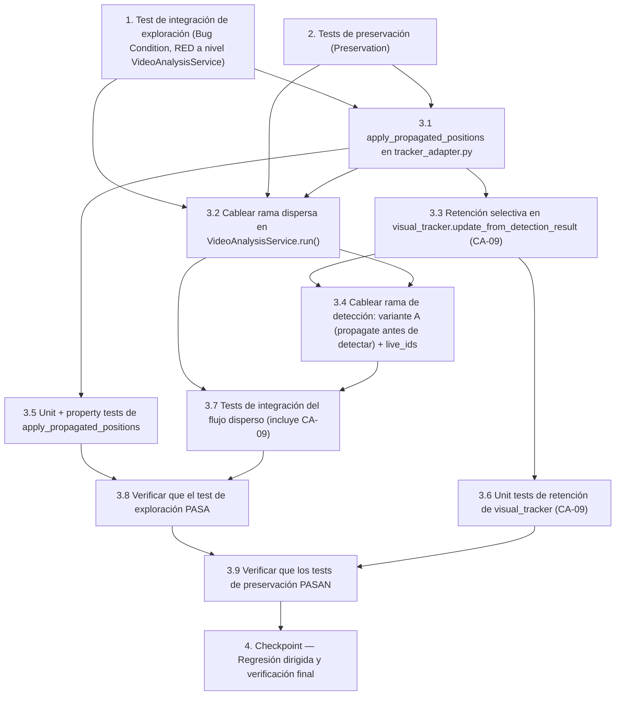

# Implementation Plan: SPEC 026 — Continuidad de Flujo del Tracker

## Overview

Alcance estricto: **solo tracking**. NO se tocan UI, modelos, umbrales, base de datos, migraciones, API, sanidad, madurez, deduplicación ni `best_by_track`. Los **tres** archivos de producción a modificar son: `src/infrastructure/vision/tracker_adapter.py` (nuevo método `apply_propagated_positions`), `src/application/services/video_analysis_service.py` (cableado de la rama dispersa y de la rama de detección) y `src/infrastructure/vision/visual_tracker.py` (retención selectiva en `update_from_detection_result`, Faceta 2 / CA-09). Cada tarea es pequeña, secuencial y verificable de forma independiente.

El defecto tiene **dos facetas**: (1) desincronización espacial — el retorno de `propagate()` se descarta y `SimpleTracker.track.bbox` queda congelado en la última detección real; (2) omisión del detector (CA-09) — `update_from_detection_result()` reconstruye `self.tracks` solo desde las detecciones (`self.tracks = new_tracks`) y destruye tracks visuales vivos omitidos por RetinaNet.

**Coherencia temporal (CA-10) y variante A adoptada.** `propagate()` ejecuta `cv2.calcOpticalFlowPyrLK(self.prev_gray, curr_gray, track.points, ...)`, por lo que `track.points` DEBE corresponder al mismo frame que `self.prev_gray`. Para retener coherentemente un track omitido (Faceta 2), el diseño adopta la **variante A**: en TODO frame de detector con `flow_tracker` ya inicializado, ejecutar `propagate(frame_detector)` + `apply_propagated_positions` ANTES de `process_frame`/`SimpleTracker.update()`. Así los tracks vivos (incluidos los que el detector omitirá) quedan con `points`/`bbox` del frame de detector actual y `self.prev_gray` es ese frame; la retención posterior es coherente y el siguiente `propagate()` no se desincroniza. La variante A y la retención (B) se implementan juntas: B sin A sería incoherente. El costo de CPU de A (un `cvtColor` + `calcOpticalFlowPyrLK` por frame de detector) se medirá en un benchmark posterior; al ser análisis offline con prioridad de correctitud, no se descarta por CPU sin evidencia.

**Cadencia dispersa real (perfil EDGE):** la configuración vigente es `sparse_min_frames_between_detections = 1`, `sparse_max_frames_without_detection = 4` y `camera_fps = 5`. Hay **al menos 1 frame disperso** entre detecciones y se **fuerza una detección tras 4 frames** sin ella. Los tests de integración usan un config con `min_frames_between_detections=1` para garantizar frames dispersos entre detecciones. (Cualquier referencia previa a una cadencia de "3–7 frames" era incorrecta y queda sustituida por estos valores.)

Metodología de bugfix (condición del defecto): primero se escriben las pruebas de exploración (Property 1: Bug Condition) que **fallan** sobre el código sin corregir, luego las de preservación (Property 2: Preservation) que **pasan** sobre el código sin corregir; después se implementa el fix y se re-ejecutan.

## Task Dependency Graph



```json
{
  "waves": [
    { "id": 0, "tasks": ["1", "2"], "description": "Test de integración de exploración (Bug Condition, RED a nivel VideoAnalysisService) y tests de preservación (Preservation) — independientes entre sí, ambos antes del fix." },
    { "id": 1, "tasks": ["3.1"], "description": "Añadir SimpleTracker.apply_propagated_positions en tracker_adapter.py (Faceta 1 / Cambio 1)." },
    { "id": 2, "tasks": ["3.2", "3.3"], "description": "Cablear la rama dispersa else de VideoAnalysisService.run() (Cambio 2) y retención selectiva en visual_tracker.update_from_detection_result (Faceta 2 / Cambio 3, CA-09)." },
    { "id": 3, "tasks": ["3.4"], "description": "Cablear la rama de detección de VideoAnalysisService.run(): variante A (propagate(frame_detector) + apply_propagated_positions antes de detectar, coherencia temporal CA-10) y live_ids tras SimpleTracker.update() hacia update_from_detection_result." },
    { "id": 4, "tasks": ["3.5", "3.6", "3.7"], "description": "Unit/property tests de apply_propagated_positions, unit tests de retención de visual_tracker (CA-09) y tests de integración del flujo disperso (incluye CA-09)." },
    { "id": 5, "tasks": ["3.8"], "description": "Verificar que el test de exploración de la condición del defecto ahora PASA (GREEN)." },
    { "id": 6, "tasks": ["3.9"], "description": "Verificar que los tests de preservación siguen PASANDO (sin regresiones)." },
    { "id": 7, "tasks": ["4"], "description": "Checkpoint — regresión dirigida y verificación final." }
  ]
}
```

Las tareas 1 y 2 pueden ejecutarse en paralelo (wave 0). La tarea 3.1 depende de 1 y 2 (wave 1). Las tareas 3.2 y 3.3 dependen de 3.1 (wave 2). La tarea 3.4 depende de 3.2 y 3.3 (wave 3). Las tareas 3.5, 3.6 y 3.7 dependen del código implementado (wave 4). La tarea 3.8 depende de 3.5 y 3.7 (wave 5). La tarea 3.9 depende de 3.8 y 3.6 (wave 6). La tarea 4 depende de todas las anteriores (wave 7).

## Tasks

- [ ] 1. Escribir test de integración de exploración de la condición del defecto (ANTES del fix)
  - **Property 1: Bug Condition** — Continuidad de identidad tras propagación
  - **CRÍTICO**: Este test DEBE FALLAR sobre el código sin corregir — el fallo confirma que el defecto existe.
  - **NO** intentar corregir el test ni el código cuando falle en esta fase.
  - **NOTA**: Este test codifica el comportamiento esperado — validará el fix cuando pase tras la implementación.
  - **OBJETIVO**: Producir un contraejemplo determinista que demuestre la fragmentación de identidad **por el defecto real**, no por un `AttributeError` de un método aún inexistente.
  - **NIVEL CORRECTO — integración en `VideoAnalysisService`, NO unit de `SimpleTracker`**: un test que llamara directamente a `SimpleTracker.apply_propagated_positions(...)` fallaría con `AttributeError` porque el método aún no existe — eso no reproduce el bug, solo demuestra que falta código. La reproducción pre-fix se construye al nivel de `VideoAnalysisService`, donde el bug se manifiesta con el código actual (que descarta el retorno de `propagate`).
  - Crear archivo `tests/unit/test_026_video_analysis_sparse_continuity.py`, siguiendo el patrón de fakes de `tests/unit/test_video_analysis_service_sparse.py` (sin cv2/torch/detectron2/detector/video real):
    - `components_factory` → `FakeComponents` cuyo `.tracker` es un **`SimpleTracker` real** (`src/infrastructure/vision/tracker_adapter.py`).
    - `process_frame_fn` → spy que, en frames de detección, ejecuta `components.tracker.update(detections)` con las detecciones simuladas y devuelve `{"detections": [...]}` (para que las detecciones reales pasen por el tracker real).
    - `video_reader` → `FakeReader` con N frames.
    - `_create_flow_tracker` monkeypatched → un **fake/doble de OpticalFlow** cuyo `propagate(frame)` retorna `[{ "track_id": 1, "bbox": (bbox desplazado > 120px), ... }]` (imita al Optical Flow siguiendo el tomate) y cuyo `update_from_detection_result(...)` es un no-op registrado.
    - `config` con `enable_flow_propagation=True` y `min_frames_between_detections=1` (coherente con EDGE) para que quede **al menos un frame disperso** entre el detector A y el detector B.
  - **Secuencia simulada:**
    1. **Detector frame A**: `process_frame_fn` ejecuta `tracker.update([det_A])` → `SimpleTracker` crea **ID 1** en la posición A.
    2. **Frame disperso**: la rama `else` de `run()` llama `flow_tracker.propagate(frame)`, que (en el fake) retorna un bbox **desplazado > 120px**. **El código ACTUAL descarta ese retorno** → `SimpleTracker.tracks[1].bbox` sigue congelado en A.
    3. **Detector frame B**: `process_frame_fn` ejecuta `tracker.update([det_B])` con `det_B` en la **posición desplazada** (mismo tomate físico). Como `track.bbox` sigue en A y el desplazamiento supera IoU 0.30 / 120px, `SimpleTracker` crea un **nuevo ID (2)**.
  - **Aserción (RED):** `result.unique_tracks == 1`. Sobre el **código actual** el test **DEBE FALLAR** con fragmentación (`unique_tracks == 2`), **NO** con `AttributeError`.
  - Documentar el contraejemplo hallado (mismo tomate físico recibe `track_id` 1 y 2; `unique_tracks == 2` en lugar de 1).
  - **NOTA de alcance**: los unit tests directos de `apply_propagated_positions` se escriben **DESPUÉS** de crear el método (tarea 3.5), no aquí. Este test RED es de integración, no un unit de `SimpleTracker`.
  - **RESULTADO ESPERADO**: el test FALLA sobre el código sin fix con fragmentación (confirma el defecto).
  - Marcar la tarea completa cuando el test esté escrito, ejecutado y su fallo documentado.
  - _Bug_Condition: isBugCondition(X) — track real en A + frame(s) disperso(s) con movimiento + Optical Flow siguió el track + SimpleTracker conserva bbox de A en frame B_
  - _Requirements: 2.1, 2.2, 2.3, 2.4_
  - _Criterios de aceptación: CA-01, CA-02, CA-06_

- [ ] 2. Escribir tests de preservación (ANTES del fix)
  - **Property 2: Preservation** — Comportamiento fuera de la condición del defecto
  - **IMPORTANTE**: Seguir la metodología de observación primero (observation-first): ejecutar el código SIN corregir para entradas ¬C(X), observar la salida real y escribir aserciones que la capturen.
  - En un archivo de preservación (p. ej. `tests/unit/test_026_tracker_apply_propagated.py` para lo estructural, o `tests/properties/` para los property-based):
    - **Movimiento pequeño / detección consecutiva (¬C)**: con un `SimpleTracker` real, un track que se desplaza ~30px entre detecciones consecutivas se asocia al mismo `track_id` con la lógica actual (IoU 0.30 / distancia 120px). Observar y aseverar que el resultado es idéntico con y sin propagación aplicada.
    - **`enable_flow_propagation=False`**: a nivel de `VideoAnalysisService`, las métricas y el flujo son idénticos al comportamiento previo; `apply_propagated_positions` nunca se invoca y `update_from_detection_result` no recibe `live_track_ids` (comportamiento legacy con default).
    - **`missed` intacto**: aserción de que, tras aplicar propagación (una vez exista el método), `track.missed` conservará su valor previo — se documenta aquí como comportamiento a preservar (decisión explícita del diseño).
  - Property-based (Hypothesis) recomendado:
    - Generar bboxes/desplazamientos aleatorios y verificar la invariante de preservación estructural: `apply_propagated_positions` SOLO cambia `track.bbox` y nunca crea tracks ni altera `track_id`, `hits`, `missed`, `best_area`, `score`, `last_health`, `last_maturity`, `has_been_processed`, `next_track_id`.
    - Generar listas propagadas que mezclan `track_id` existentes e inexistentes → los existentes se actualizan, los inexistentes se ignoran, `len(tracker.tracks)` no cambia.
  - **RESULTADO ESPERADO**: los tests de preservación que no dependen de los métodos nuevos PASAN sobre el código sin fix (baseline); los que ejercitan `apply_propagated_positions`/retención quedan preparados para verificarse tras el fix.
  - Marcar la tarea completa cuando los tests estén escritos y el baseline observado esté documentado.
  - _Requirements: 2.5, 2.6, 3.1, 3.2, 3.3_
  - _Criterios de aceptación: CA-03, CA-04, CA-05, CA-07_

- [ ] 3. Corrección — Continuidad de flujo del tracker

  - [ ] 3.1 Añadir `SimpleTracker.apply_propagated_positions(propagated)` en `tracker_adapter.py`
    - Archivo: `src/infrastructure/vision/tracker_adapter.py`.
    - Firma: `apply_propagated_positions(self, propagated: List[dict]) -> None`.
    - Para cada entrada con `track_id` existente en `self.tracks`: actualizar **solo** `track.bbox` con el bbox propagado, normalizado a tupla de enteros.
    - Si el `track_id` NO existe en `self.tracks`: ignorar de forma segura (no crear track, no lanzar excepción).
    - `apply_propagated_positions([])` es un no-op (tolerancia a fallos cuando `propagate()` retorna `[]`).
    - NO tocar: `hits`, `missed`, `best_area`, `score`, `last_health`, `last_maturity`, `has_been_processed`, `next_track_id`; NO generar `InspectionResult` ni snapshots; NO incrementar ningún contador.
    - Geometría pura: NO importar `cv2` ni `torch` (el módulo solo usa `math`/`dataclasses`).
    - _Bug_Condition: isBugCondition(X) del diseño (Faceta 1)_
    - _Expected_Behavior: expectedBehavior — reincorporar posición propagada actualizando solo track.bbox de tracks existentes_
    - _Preservation: no modificar hits/missed/best_area/last_health/last_maturity/has_been_processed; ignorar track_id inexistente; no-op con lista vacía_
    - _Requirements: 2.1, 2.4, 2.5, 2.6_
    - _Criterios de aceptación: CA-01, CA-04_

  - [ ] 3.2 Cablear la rama dispersa `else` de `VideoAnalysisService.run()`
    - Archivo: `src/application/services/video_analysis_service.py`.
    - En la rama `else` (detector NO ejecuta): capturar el retorno de `flow_tracker.propagate(frame)` y pasarlo a `components.tracker.apply_propagated_positions(propagated)`.
    - Mantener la guarda `if flow_tracker is not None` (ya condicionada por `enable_flow_propagation`); con la bandera en `False` la rama queda idéntica a la actual.
    - NO tocar contadores en la rama dispersa (`detector_scheduled_frames`, `analysis_successful_frames`, `analysis_failed_frames`, `snapshots_with_detections`, `total_detection_rows`); NO generar crops, staging de `best`, `has_detections`, ni snapshots anotados.
    - La capa de aplicación solo pasa la `List[dict]` de infraestructura a infraestructura; NO importar `cv2`/`torch`/`detectron2`.
    - _Bug_Condition: rama dispersa que descarta el retorno de propagate (Faceta 1)_
    - _Expected_Behavior: reincorporar la posición propagada antes de la siguiente asociación de detecciones_
    - _Preservation: contadores intactos; path enable_flow_propagation=False idéntico; boundaries de Clean Architecture_
    - _Requirements: 2.1, 2.2_
    - _Criterios de aceptación: CA-02_

  - [ ] 3.3 Retención selectiva en `OpticalFlowVisualTracker.update_from_detection_result` (Faceta 2 / CA-09)
    - Archivo: `src/infrastructure/vision/visual_tracker.py`.
    - Firma: `update_from_detection_result(self, frame_bgr, detections, live_track_ids=None)` — `live_track_ids: Optional[set[int]] = None` como parámetro con **default para compatibilidad legacy** (si es `None`, comportamiento actual `self.tracks = new_tracks`, sin retención).
    - **Precondición de coherencia temporal (CA-10):** este método asume que, en un frame de detector, `VideoAnalysisService` ya ejecutó `propagate(frame_detector)` (tarea 3.4, variante A), de modo que los `VisualTrackState` vivos ya tienen `points`/`bbox` del frame actual y `self.prev_gray` es ese frame. La retención conserva ese estado ya-propagado (NO un `VisualTrackState` antiguo), manteniendo la invariante `track.points` ↔ `self.prev_gray`.
    - Comportamiento corregido (variante B — retención selectiva coherente):
      1. Para cada detección recibida: (re)sembrar el track visual desde el `bbox` real de RetinaNet sobre el gris del frame actual (re-anclaje a la verdad del detector — comportamiento actual).
      2. Para cada track visual **previo** cuyo `track_id` **no** esté en las detecciones de este frame **y** **sí** esté en `live_track_ids` (sigue vivo en `SimpleTracker`): **retenerlo** con su `VisualTrackState` **ya propagado al frame actual** (por el `propagate(frame_detector)` previo), de modo que `points`/`bbox` correspondan al mismo frame que `self.prev_gray`. Sigue propagándose coherentemente.
      3. Los tracks visuales previos cuyo `track_id` **no** esté vivo en `SimpleTracker` (ya expirado por `max_missed`) se **descartan** (no quedan "zombis").
      4. Fijar `self.prev_gray` al gris del frame actual (el mismo al que ya están sincronizados los tracks retenidos).
    - NO retener un `VisualTrackState` cuyos `points`/`bbox` pertenezcan a un frame distinto del que quedará en `self.prev_gray` (rompería la invariante y corrompería el siguiente `propagate()`).
    - La retención es lógica de diccionarios; no añade dependencias nuevas. `cv2` está permitido en este módulo de infraestructura.
    - _Bug_Condition: isBugCondition (Faceta 2) — track vivo en SimpleTracker omitido por RetinaNet + self.tracks = new_tracks lo destruye_
    - _Expected_Behavior: retener el track visual vivo omitido (ya coherente con prev_gray) y seguir propagándolo; descartar el expirado; re-anclar el detectado_
    - _Preservation: no crea InspectionResult; no incrementa unique_tracks/unique_tomatoes; no modifica hits; max_missed preservado; live_track_ids=None → comportamiento legacy_
    - _Requirements: 1.6, 2.7, 2.8, 2.9, 3.8_
    - _Criterios de aceptación: CA-09, CA-10_

  - [ ] 3.4 Cablear la rama de detección de `VideoAnalysisService.run()`: variante A (predecir antes de detectar) + `live_ids`
    - Archivo: `src/application/services/video_analysis_service.py`.
    - **Variante A (coherencia temporal, CA-10):** en la rama de detección, ANTES de `process_frame`/`SimpleTracker.update()`, si `flow_tracker is not None`: ejecutar `propagated = flow_tracker.propagate(frame)` + `components.tracker.apply_propagated_positions(propagated)`. Esto sincroniza `points`/`bbox` de los tracks vivos y `self.prev_gray` al frame de detector actual, y hace que la detección se compare contra la posición predicha del mismo frame. En el primer frame de detector `propagate` retorna `[]` (sin estado) y `apply_propagated_positions([])` es no-op — coherente.
    - **live_ids (Faceta 2):** **después** de que `process_frame` haya ejecutado `SimpleTracker.update()`: calcular `live_ids = set(components.tracker.tracks.keys())` y pasarlo a `flow_tracker.update_from_detection_result(frame, detections, live_ids)`.
    - Orden completo de la rama de detección: `propagate(frame)` → `apply_propagated_positions` → `process_frame` (`SimpleTracker.update`) → `live_ids = ...` → `update_from_detection_result(frame, detections, live_ids)`.
    - La capa de aplicación solo lee `components.tracker.tracks.keys()` (un `set[int]`), invoca `flow_tracker.propagate(frame)` (retorno `List[dict]`) y pasa `detections` (`List[dict]`) a infraestructura; NO interpreta bboxes ni píxeles; NO importar `cv2`/`torch`/`detectron2` (el test `tests/unit/test_architecture_boundaries.py` debe seguir verde).
    - NO tocar contadores ni el resto del flujo de la rama de detección (el `propagate` previo no afecta `detector_scheduled_frames`/`successful`/`failed`/`snapshots_with_detections`/`total_detection_rows`; sanidad, madurez, `best_by_track`, crops, snapshots se generan exactamente como antes).
    - _Bug_Condition: rama de detección que (a) compara contra posición desactualizada y (b) no informa a visual_tracker qué tracks siguen vivos (Facetas 1 y 2)_
    - _Expected_Behavior: predecir Optical Flow al frame de detector antes de asociar (variante A) y proveer live_track_ids para activar la retención coherente_
    - _Preservation: contadores intactos; boundaries de Clean Architecture (solo set[int] + List[dict]); CPU-only; primer frame de detector coherente (propagate → [])_
    - _Requirements: 1.6, 2.2, 2.7, 2.9, 3.7_
    - _Criterios de aceptación: CA-09, CA-10_

  - [ ] 3.5 Añadir unit + property tests de `apply_propagated_positions` (POST-método)
    - Crear archivo `tests/unit/test_026_tracker_apply_propagated.py` (o completar el usado en la tarea 2).
    - **Estos tests son POST-método**: se escriben una vez creado `apply_propagated_positions`. NO son el test RED pre-fix (que vive a nivel de `VideoAnalysisService`, tarea 1).
    - **CA-01** — posición actualizada, identidad intacta: tras `apply_propagated_positions`, `track.bbox` cambia al bbox propagado; `track_id`, `hits`, `best_area`, `last_health`, `last_maturity`, `has_been_processed` **no** cambian; `len(tracker.tracks)` no aumenta; probar con cambio de bbox grande (> 120px).
    - **CA-02** — continuidad tras movimiento > 120px: crear track en A, aplicar propagación a posición +160px, luego `update()` con detección en esa posición → mismo `track_id`.
    - **CA-03** — dos tracks independientes: propagar dos tracks a posiciones distintas actualiza cada `bbox` de forma independiente; no se fusionan ni intercambian identidad.
    - **CA-04** — `track_id` inexistente: `apply_propagated_positions` con un `track_id` que no está en `self.tracks` → no crea track, no lanza excepción; `apply_propagated_positions([])` es no-op.
    - **`missed` intacto**: tras `apply_propagated_positions`, `track.missed` conserva su valor previo.
    - Property-based (Hypothesis): solo `track.bbox` cambia; `track_id` inexistentes se ignoran; el conteo de tracks no cambia; mezcla de `track_id` existentes/inexistentes.
    - _Requirements: 2.4, 2.5_
    - _Criterios de aceptación: CA-01, CA-03, CA-04, CA-05_

  - [ ] 3.6 Añadir unit tests de retención de `visual_tracker` (POST-método, CA-09)
    - Crear archivo `tests/unit/test_026_visual_tracker_retention.py` (**requiere `cv2`**; ubicar junto a los tests de infraestructura/visión).
    - **Estos tests son POST-método**: se escriben tras implementar la retención (tarea 3.3).
    - **Retención de track vivo omitido**: con `self.tracks = {7: state7}` y detecciones `[det_3]`, `live_track_ids={3,7}` → tras la llamada `self.tracks` contiene `3` (re-sembrado) y `7` (retenido con su `state` previo).
    - **Descarte de track expirado**: mismas condiciones pero `live_track_ids={3}` (el 7 ya expiró en `SimpleTracker`) → `self.tracks` contiene solo `3`; el 7 se descarta.
    - **Compatibilidad legacy**: `live_track_ids=None` (o ausente) → `self.tracks = new_tracks` exactamente como hoy (solo detecciones), sin retención.
    - **Re-anclaje**: un track previamente retenido que ahora SÍ es detectado se re-siembra desde el bbox real (no conserva el bbox retenido).
    - **CA-10 — coherencia temporal (invariante `points` ↔ `prev_gray`)**: simular la secuencia real de la variante A con un `OpticalFlowVisualTracker` real — `propagate(frame_B)` (avanza `points`/`bbox` del track 7 y `prev_gray` a B) → `update_from_detection_result(frame_B, [], {7})`. Verificar que el `state` retenido de 7 tiene `points`/`bbox` correspondientes a B, que `self.prev_gray` es B, y que `propagate(frame_C)` posterior propaga 7 sin perderlo ni lanzar. Este test fallaría con la retención ingenua (points de A + prev_gray de B).
    - _Requirements: 1.6, 2.7, 2.8, 2.9_
    - _Criterios de aceptación: CA-09, CA-10_

  - [ ] 3.7 Extender los tests de integración del flujo disperso (incluye CA-09)
    - Archivo: `tests/unit/test_026_video_analysis_sparse_continuity.py` (el creado en la tarea 1). Mantener el patrón de fakes de `tests/unit/test_video_analysis_service_sparse.py` (`SimpleTracker` real como `components.tracker`, `process_frame_fn` spy que ejecuta `tracker.update(detections)`, `FakeReader`, `_create_flow_tracker` monkeypatched con doble de Optical Flow), config con `min_frames_between_detections=1`. Sin cv2/torch/detectron2.
    - **CA-02 / CA-06 — continuidad con el fix**: detector A (ID 1) → frame(s) disperso(s) con `propagate()` devolviendo bbox desplazado > 120px → detector B en la posición desplazada. Aserción con el fix: `result.unique_tracks == 1` y `unique_tomatoes` no se infla.
    - **CA-09 — omisión del detector** (doble de Optical Flow que propaga + variante A en la rama de detección + `update_from_detection_result` con retención):
      - **Detector A**: `propagate(frame_A)` (sin estado → `[]`), `tracker.update([det_1])` → ID 1 vivo; `update_from_detection_result(frame_A, [det_1], {1})`.
      - frame disperso: `propagate()` devuelve bbox de ID 1 → `apply_propagated_positions` actualiza `track.bbox`.
      - **Detector B**: `propagate(frame_B)` predice ID 1 al frame B → `apply_propagated_positions`; RetinaNet **NO** devuelve ese tomate (`tracker.update([])`) → ID 1 no asociado, `missed=1` (< `max_missed=3`, sigue vivo). `live_ids={1}` → `update_from_detection_result(frame_B, [], {1})` **retiene** el track visual 1 (ya coherente con el frame B).
      - frame disperso: ID 1 **sigue propagándose** (`propagate()` lo emite y `apply_propagated_positions` sigue actualizando `track.bbox`).
      - **Detector C**: `propagate(frame_C)` + `apply_propagated_positions`, luego `tracker.update([det_1'])` en la posición actualizada → **conserva ID 1** (no crea ID nuevo).
      - **Invariantes CA-09:** ninguna propagación genera `InspectionResult`; `unique_tracks`/`unique_tomatoes` no aumentan por la propagación/retención; `hits` del ID 1 no se modifica por la propagación; **`max_missed` preservado** (un track omitido más de `max_missed` frames de detección seguidos se elimina de `SimpleTracker`, sale de `live_ids`, se descarta el track visual retenido y al reaparecer obtiene un ID nuevo — expiración normal).
    - **CA-10 — detector-miss CON MOVIMIENTO en el frame de detector**: variante del CA-09 con desplazamiento apreciable de cámara en el propio frame de detector (B y C). Demostrar que predecir hasta el frame actual (variante A) evita el desfase residual: `unique_tracks == 1` incluso con movimiento en el frame de detector. (Nota: si requiere `OpticalFlowVisualTracker` real/cv2 para la coherencia de estado, ubicar este caso en `test_026_visual_tracker_retention.py`; si el doble determinista basta, mantenerlo aquí.)
    - **CA-07 — compatibilidad**: con `enable_flow_propagation=False`, el resultado (`unique_tracks` y contadores) es idéntico al comportamiento previo; `apply_propagated_positions` nunca se invoca, no hay `propagate` en la rama de detección y `update_from_detection_result` no recibe `live_track_ids` (legacy).
    - **CA-08 — sin fuga de estado**: dos `run()` consecutivos parten de estado limpio; `unique_tracks` del segundo run no depende del primero; los tracks retenidos no sobreviven entre runs.
    - **Contadores no afectados por frames propagados**: `detector_scheduled_frames` == nº de frames de detección; `analysis_successful_frames`/`analysis_failed_frames` corresponden solo a frames de detección; `snapshots_with_detections`/`total_detection_rows` no cuentan los frames propagados ni los tracks retenidos; el `propagate(frame_detector)` de la variante A no altera ningún contador.
    - _Requirements: 2.2, 2.3, 2.7, 2.9, 3.1, 3.5, 3.6, 3.7_
    - _Criterios de aceptación: CA-02, CA-05, CA-06, CA-07, CA-08, CA-09, CA-10_

  - [ ] 3.8 Verificar que el test de exploración de la condición del defecto ahora PASA
    - **Property 1: Expected Behavior** — Continuidad de identidad tras propagación
    - **IMPORTANTE**: Re-ejecutar el MISMO test de la tarea 1 — NO escribir un test nuevo.
    - El test de la tarea 1 codifica el comportamiento esperado; cuando pasa, confirma que la continuidad de identidad se satisface.
    - **RESULTADO ESPERADO**: el test PASA (`unique_tracks == 1`; un único `track_id` por tomate, una sola entrada en `best_by_track`, `unique_tomatoes` cuenta una vez).
    - _Requirements: 2.1, 2.2, 2.3, 2.4_
    - _Criterios de aceptación: CA-01, CA-02, CA-06_

  - [ ] 3.9 Verificar que los tests de preservación siguen PASANDO
    - **Property 2: Preservation** — Comportamiento fuera de la condición del defecto
    - **IMPORTANTE**: Re-ejecutar los MISMOS tests de la tarea 2 — NO escribir tests nuevos.
    - **RESULTADO ESPERADO**: los tests PASAN (sin regresiones): asociación por IoU/distancia con umbrales actuales, `missed` intacto, `track_id` inexistente ignorado, no-op con lista vacía, `enable_flow_propagation=False` idéntico, sin fuga de estado.
    - Confirmar `F(X) = F'(X)` para todas las entradas ¬C(X).
    - _Requirements: 2.5, 2.6, 3.1, 3.2, 3.3, 3.4, 3.5, 3.6, 3.7_
    - _Criterios de aceptación: CA-03, CA-04, CA-05, CA-07, CA-08_

- [ ] 4. Checkpoint — Regresión dirigida y verificación final
  - Ejecutar primero los tests nuevos de esta spec:
    - `python -m pytest tests/unit/test_026_tracker_apply_propagated.py -q`
    - `python -m pytest tests/unit/test_026_visual_tracker_retention.py -q`
    - `python -m pytest tests/unit/test_026_video_analysis_sparse_continuity.py -q`
  - Luego la regresión dirigida de tracking/dispersión y boundaries:
    - `python -m pytest tests/unit/test_pipeline_orchestrator_dedup.py -q`
    - `python -m pytest tests/unit/test_video_analysis_service_sparse.py -q`
    - `python -m pytest tests/unit/test_architecture_boundaries.py -q`
  - **Nota sobre `test_video_analysis_service_sparse.py`**: su `FlowSpy.update_from_detection_result` puede requerir aceptar el argumento adicional `live_track_ids` (o usar `*args`/default); ajustarlo si su firma es estricta y confirmar que sigue verde.
  - Confirmar que TODOS los tests anteriores pasan. Reportar: tests nuevos creados, tests ejecutados y resultados.
  - **Nota importante**: NO tratar como regresiones de esta spec los fallos preexistentes de UI/HTTP asociados a Python 3.14 (ajenos a tracking). Distinguirlos explícitamente en el reporte.
  - Ante cualquier duda o resultado inesperado, consultar al usuario.

## Notes

La validación física en Raspberry Pi 5 (re-ejecutar un monitoreo comparable al Monitoreo 55 y verificar que `unique_tomatoes` cuenta cada tomate una sola vez por identidad, sin fragmentación en los snapshots anotados, incluyendo el escenario de omisión del detector CA-09) es una verificación **manual post-implementación**, no una tarea de código. Debe realizarse con refrigeración activa y documentarse como evidencia; queda fuera del plan de tareas ejecutables pero se registra aquí para trazabilidad de la corrección (CA-06, CA-09, CA-10).

**Rendimiento de la variante A (a medir, no bloqueante):** la predicción de Optical Flow en cada frame de detector añade un `cvtColor` + `calcOpticalFlowPyrLK`. Al ser análisis offline con prioridad de correctitud de identidad, no se descarta por CPU sin evidencia; su costo debe medirse en un benchmark posterior (regla benchmark-first) y documentarse en `docs/benchmarks/`.
