# 🍅 Tomato Monitor

**Sistema de visión por computador para detección, tracking, evaluación de sanidad y estimación de madurez de tomates cherry en video.**

Tomato Monitor es una aplicación construida con **Python**, **FastAPI**, **PyTorch** y **OpenCV** que procesa videos de cultivos de tomate cherry para detectar frutos individuales, rastrearlos entre frames, clasificar su estado sanitario (sano / enfermo) y estimar su grado de madurez según la escala USDA.

---

## Tabla de Contenidos

- [Características Principales](#características-principales)
- [Arquitectura del Proyecto](#arquitectura-del-proyecto)
- [Estructura de Directorios](#estructura-de-directorios)
- [Pipeline de Procesamiento](#pipeline-de-procesamiento)
- [Modelo de Dominio](#modelo-de-dominio)
- [Capa de Aplicación](#capa-de-aplicación)
- [Capa de Infraestructura](#capa-de-infraestructura)
- [Interfaz Web (FastAPI)](#interfaz-web-fastapi)
- [Flujo de Datos](#flujo-de-datos)
- [Tecnologías Utilizadas](#tecnologías-utilizadas)
- [Instalación y Configuración](#instalación-y-configuración)
- [Uso](#uso)
- [Endpoints de la API](#endpoints-de-la-api)
- [Configuración de Umbrales](#configuración-de-umbrales)
- [Código Legacy](#código-legacy)
- [Scripts de Prueba](#scripts-de-prueba)
- [Licencia](#licencia)

---

## Características Principales

- **Detección de tomates** con Detectron2 (RetinaNet R-50-FPN)
- **Tracking multi-objeto** por IoU y distancia de centroide
- **Clasificación de sanidad** con ResNet-18 fine-tuned (sano / enfermo)
- **Estimación de madurez** por colorimetría HSV + espacio CIELab (escala USDA: green → breaker → turning → pink → light_red → red)
- **Scene Gate inteligente** con ORB features + histograma HSV para optimizar cuándo ejecutar el detector
- **Propagación por Optical Flow** (Lucas-Kanade) para mantener tracks en frames sin detección
- **Deduplicación** para evitar re-procesar tracks ya analizados
- **Interfaz web** con FastAPI + Jinja2 para configurar y ejecutar el pipeline
- **Persistencia local** en CSV + sistema de archivos para sesiones y artefactos
- **Generación de reportes** (summary, per_frame, per_detection) en CSV
- **Snapshots y video anotado** con bounding boxes, IDs de track y métricas

---

## Arquitectura del Proyecto

El proyecto sigue una **arquitectura limpia (Clean Architecture)** con separación clara en capas:

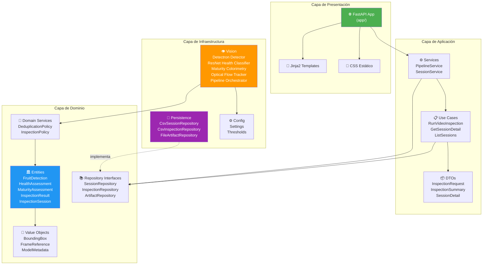

---

## Estructura de Directorios

```
tomato_monitor/
├── app/                            # Capa de presentación (FastAPI)
│   ├── main.py                     # Punto de entrada de la aplicación
│   ├── dependencies.py             # Inyección de dependencias
│   ├── routes/
│   │   ├── ui.py                   # Ruta principal (GET /)
│   │   ├── pipeline.py             # Ruta para ejecutar pipeline (POST /pipeline/run)
│   │   └── sessions.py             # Rutas de sesiones (consulta, eliminación + snapshots)
│   ├── templates/
│   │   ├── base.html               # Template base con header
│   │   ├── index.html              # Página principal con formulario
│   │   └── session_detail.html     # Detalle de sesión con métricas y snapshots
│   └── static/
│       └── styles.css              # Estilos de la interfaz
│
├── src/                            # Código fuente principal (Clean Architecture)
│   ├── domain/                     # Capa de dominio
│   │   ├── entities/               # Entidades del negocio
│   │   │   ├── fruit_detection.py
│   │   │   ├── health_assessment.py
│   │   │   ├── maturity_assessment.py
│   │   │   ├── inspection_result.py
│   │   │   └── inspection_session.py
│   │   ├── value_objects/          # Objetos de valor (inmutables)
│   │   │   ├── bounding_box.py
│   │   │   ├── frame_reference.py
│   │   │   └── model_metadata.py
│   │   ├── services/              # Servicios de dominio (reglas de negocio)
│   │   │   ├── deduplication_policy.py
│   │   │   └── inspection_policy.py
│   │   └── repositories/          # Interfaces de repositorios (puertos)
│   │       ├── session_repository.py
│   │       ├── inspection_repository.py
│   │       └── artifact_repository.py
│   │
│   ├── application/                # Capa de aplicación
│   │   ├── dto/                    # Data Transfer Objects
│   │   │   ├── inspection_request.py
│   │   │   ├── inspection_summary.py
│   │   │   └── session_detail.py
│   │   ├── services/              # Servicios de aplicación
│   │   │   ├── pipeline_service.py
│   │   │   └── session_service.py
│   │   └── use_cases/             # Casos de uso
│   │       ├── run_video_inspection.py
│   │       ├── get_session_detail.py
│   │       └── list_sessions.py
│   │
│   └── infrastructure/            # Capa de infraestructura
│       ├── config/                # Configuración global
│       │   ├── settings.py        # Rutas, device, modelos
│       │   └── thresholds.py      # Umbrales de detección y análisis
│       ├── persistence/           # Implementaciones de repositorios
│       │   ├── local/             # Persistencia local (CSV + archivos)
│       │   │   ├── csv_session_repository.py
│       │   │   ├── csv_inspection_repository.py
│       │   │   ├── file_artifact_repository.py
│       │   │   └── file_utils.py
│       │   └── cloud/             # Persistencia cloud futura (estructura preparada, no activa aún)
│       │       └── postgres_session_repository.py
│       └── vision/                # Motor de visión por computador
│           ├── detectron_detector.py       # Detector con Detectron2
│           ├── resnet_health_classifier.py # Clasificador de sanidad
│           ├── maturity_estimator.py       # Estimador de madurez
│           ├── maturity_colorimetry.py     # Colorimetría CIELab/HSV
│           ├── tracker_adapter.py          # Tracker multi-objeto
│           ├── visual_tracker.py           # Optical Flow (Lucas-Kanade)
│           ├── capture_gate.py             # Scene Gate (ORB + histograma)
│           ├── cropper.py                  # Recorte y validación de crops
│           ├── pipeline_orchestrator.py    # Orquestador del pipeline
│           └── video_inspection_runner.py  # Runner principal del video
│
├── legacy/                         # Código legacy (versión anterior)
│   ├── config/
│   ├── pipeline_core/
│   └── storage/
│
├── scripts/                        # Scripts de prueba / smoke tests
│   ├── compare_video_strategies.py
│   ├── smoke_test_capture.py
│   ├── smoke_test_detector.py
│   ├── smoke_test_health.py
│   └── smoke_test_maturity.py
│
├── models/                         # Modelos entrenados (.pth)
│   ├── health_model/
│   │   └── model.pth               # ResNet-18 para clasificación de sanidad
│   └── modelo_d2/
│       └── model.pth               # Modelo Detectron2 para detección de tomates
│
├── data/                           # Datos de entrada
│   ├── images/                     # Imágenes de referencia
│   └── videos/                     # Videos a procesar
│
├── outputs/                        # Resultados generados
│   ├── experiments/                # Sesiones de experimentos
│   │   └── <session_name>/
│   │       ├── reports/            # CSVs de reportes
│   │       ├── detection_snapshots/
│   │       │   ├── raw_frames/
│   │       │   ├── annotated_frames/
│   │       │   └── crops/
│   │       └── annotated_video/
│   └── meta/
│       └── sessions.csv            # Registro de sesiones
│
├── requirements.txt                # Dependencias de Python
└── .gitignore
```

---

## Pipeline de Procesamiento

El pipeline procesa cada frame del video a través de múltiples etapas:

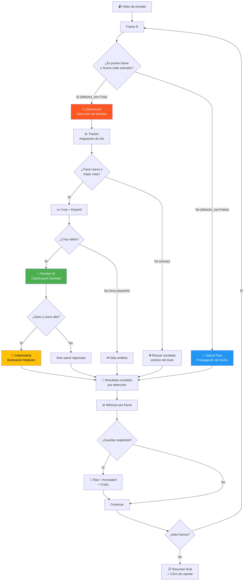

---

## Modelo de Dominio

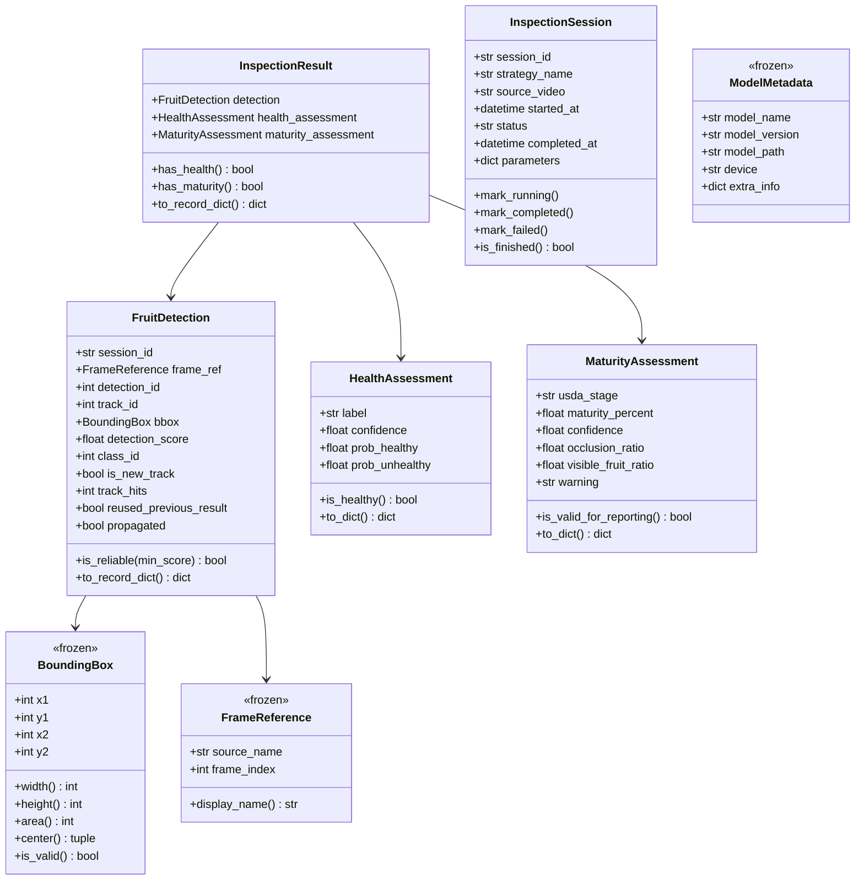

---

## Capa de Aplicación

### Casos de Uso

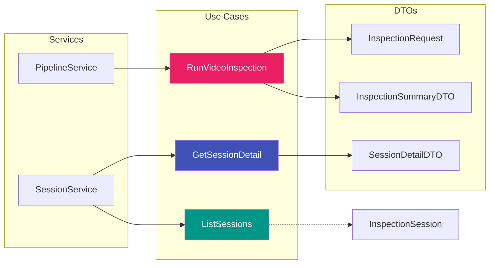

| Caso de Uso | Responsabilidad |
|---|---|
| `RunVideoInspection` | Ejecuta el pipeline completo de inspección de video y genera artefactos |
| `GetSessionDetail` | Obtiene el detalle completo de una sesión existente con sus métricas |
| `ListSessions` | Lista las sesiones más recientes ordenadas por fecha |

### DTOs

| DTO | Campos principales |
|---|---|
| `InspectionRequest` | `strategy_name`, `video_index`, `min_frames_between_detections`, `max_frames_without_detection`, `use_scene_gate`, opciones de guardado |
| `InspectionSummaryDTO` | `total_frames`, `detector_runs`, `effective_fps`, `unique_tracks_detected`, conteos de health/maturity, razones de captura |
| `SessionDetailDTO` | `session_name`, `summary`, rutas de archivos, `snapshot_files`, `annotated_videos` |

---

## Capa de Infraestructura

### Componentes de Visión

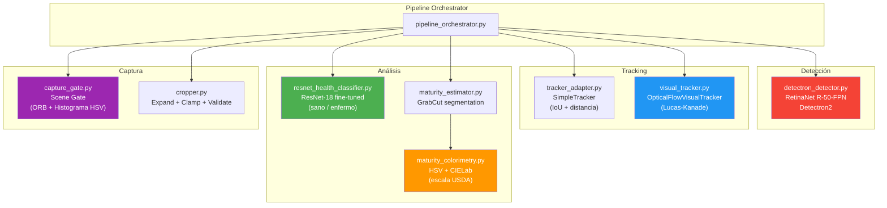

### Scene Gate — Decisión de Captura

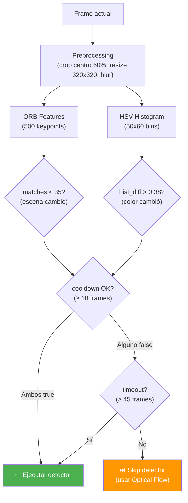

### Estimación de Madurez — Escala USDA

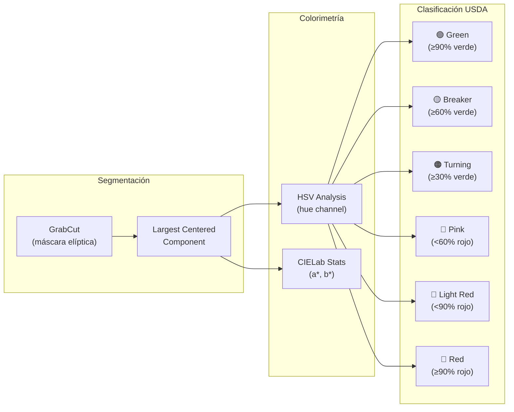

### Políticas de Dominio

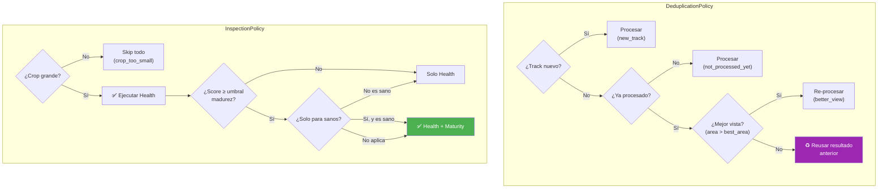

---

## Interfaz Web (FastAPI)

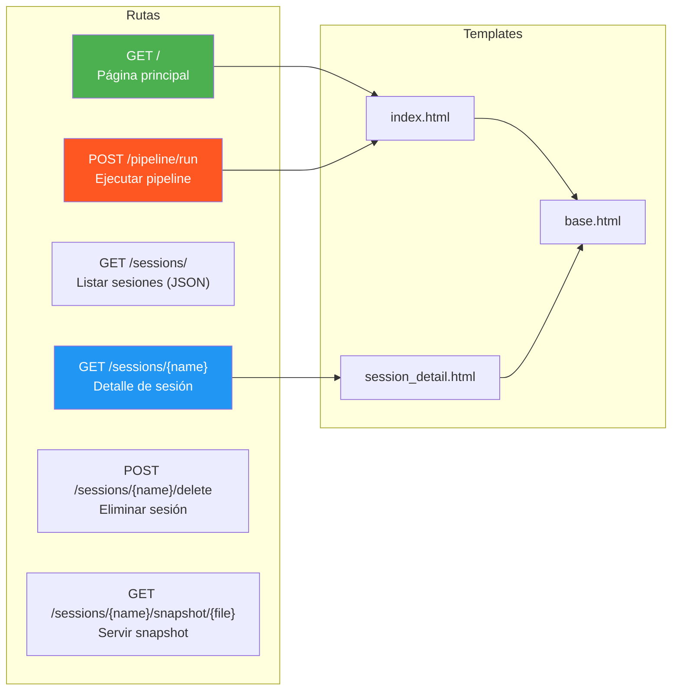

---

## Flujo de Datos

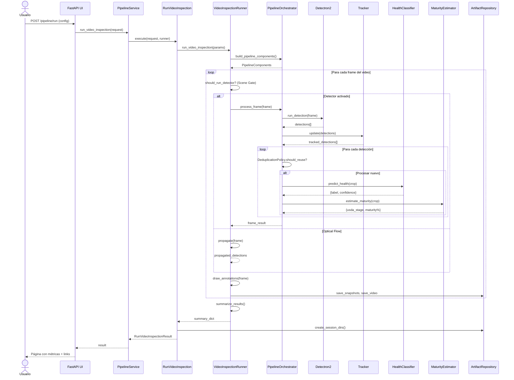

---

## Tecnologías Utilizadas

| Categoría | Tecnología | Uso |
|---|---|---|
| **Framework Web** | FastAPI + Uvicorn | API REST y servidor de la aplicación web |
| **Templates** | Jinja2 | Renderizado de vistas HTML |
| **Deep Learning** | PyTorch + TorchVision | Modelo ResNet-18 para clasificación de sanidad |
| **Detección de Objetos** | Detectron2 | RetinaNet R-50-FPN para detección de tomates |
| **Visión por Computador** | OpenCV + NumPy | Procesamiento de video, Optical Flow, GrabCut, ORB, histogramas y operaciones numéricas |
| **Persistencia** | CSV + Sistema de archivos | Almacenamiento de sesiones, reportes y artefactos |
| **Lenguaje** | Python 3.10+ | Todo el proyecto |

---

## Instalación y Configuración

### Requisitos Previos

- **Python 3.10** o superior
- **pip** para gestión de paquetes
- (Opcional) Entorno virtual (`venv`)

### Pasos

1. **Clonar el repositorio:**

```bash
git clone https://github.com/Sxl07/tomato_monitor.git
cd tomato_monitor
```

2. **Crear y activar un entorno virtual:**

```bash
python -m venv .venv
source .venv/bin/activate    # Linux/macOS
# .venv\Scripts\activate     # Windows
```

3. **Instalar dependencias:**

```bash
pip install -r requirements.txt
```

4. **Verificar los modelos:**

Asegúrate de que los archivos de modelos existen:

```
models/health_model/model.pth    # Modelo ResNet-18 de sanidad
models/modelo_d2/model.pth       # Modelo Detectron2 de detección (no incluido por defecto)
```

5. **Colocar videos de entrada:**

```
data/videos/video_02.mp4         # Video(s) de cultivo de tomate cherry
```
### Nota sobre dispositivo de ejecución

En el estado actual del proyecto, la ejecución se recomienda en **CPU** para mantener estabilidad y coherencia con el entorno objetivo en **Raspberry Pi**. Aunque la infraestructura permite configuración de dispositivo, la validación principal del sistema se está realizando en CPU.

---

## Uso

### Iniciar el servidor

```bash
uvicorn app.main:app --reload --host 0.0.0.0 --port 8000
```

Acceder a: `http://localhost:8000`

### Desde la interfaz web

1. Abrir el navegador en `http://localhost:8000`
2. Configurar los parámetros del pipeline en el formulario
3. Hacer clic en **"Ejecutar pipeline"**
4. Ver los resultados: métricas de resumen, archivos generados
5. Navegar a las sesiones individuales para ver snapshots anotados y videos

---

## Endpoints de la API

| Método | Ruta | Descripción |
|---|---|---|
| `GET` | `/` | Página principal con formulario de configuración |
| `POST` | `/pipeline/run` | Ejecutar el pipeline con los parámetros dados |
| `GET` | `/sessions/` | Lista de sesiones recientes (JSON) |
| `GET` | `/sessions/{name}` | Detalle de una sesión con métricas y snapshots |
| `POST` | `/sessions/{name}/delete` | Eliminar una sesión y sus artefactos |
| `GET` | `/sessions/{name}/snapshot/{file}` | Servir imagen de snapshot anotado |

---

## Configuración de Umbrales

Los umbrales son configurables en `src/infrastructure/config/thresholds.py`:

| Parámetro | Valor | Descripción |
|---|---|---|
| `DETECTION_SCORE_THRESHOLD` | 0.80 | Umbral mínimo de confianza para detección |
| `HEALTH_B_THRESHOLD` | 0.70 | Umbral para clasificar como "unhealthy" |
| `HEALTH_IMAGE_SIZE` | 224 | Tamaño de imagen para el modelo de sanidad |
| `CROP_EXPAND_RATIO` | 0.08 | Ratio de expansión del bounding box |
| `MIN_CROP_WIDTH` / `MIN_CROP_HEIGHT` | 20 | Tamaño mínimo de crop para análisis |
| `MATURITY_MIN_DET_SCORE` | 0.80 | Score mínimo para ejecutar estimación de madurez |
| `MIN_FRAMES_BETWEEN_CAPTURES` | 18 | Cooldown mínimo entre ejecuciones del detector |
| `MAX_FRAMES_WITHOUT_CAPTURE` | 45 | Forzar detección si no se ha ejecutado en N frames |
| `ORB_MIN_MATCH_COUNT` | 35 | Umbral de features ORB para detectar cambio de escena |
| `HSV_HIST_DIFF_THRESHOLD` | 0.38 | Umbral de diferencia de histograma HSV |

---

## Código Legacy

El directorio `legacy/` contiene la **versión anterior** del pipeline antes de la migración a Clean Architecture. Se mantiene como referencia y para compatibilidad:

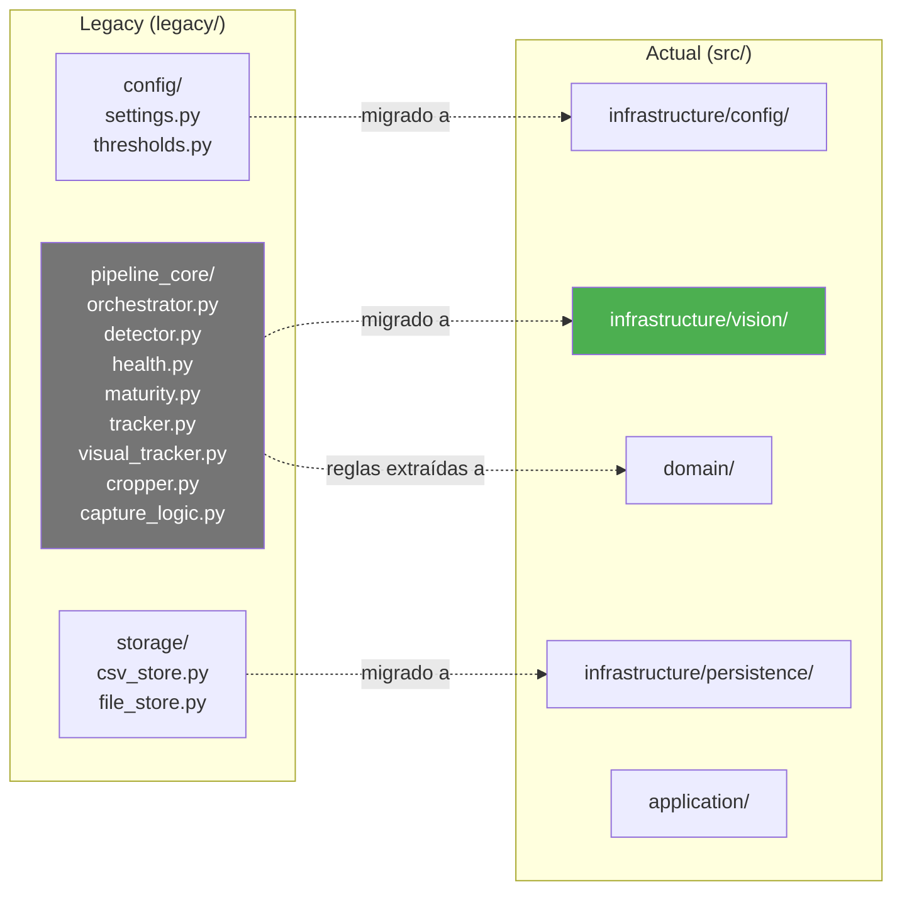

---

## Scripts de Prueba

En el directorio `scripts/` se encuentran smoke tests para validar componentes individuales:

| Script | Propósito |
|---|---|
| `smoke_test_detector.py` | Prueba rápida del detector Detectron2 |
| `smoke_test_health.py` | Prueba del clasificador de sanidad ResNet-18 |
| `smoke_test_maturity.py` | Prueba del estimador de madurez |
| `smoke_test_capture.py` | Prueba del Scene Gate (ORB + histograma) |
| `compare_video_strategies.py` | Comparación de diferentes estrategias de procesamiento |

---

## Licencia

Este proyecto es de uso académico / personal. Consulta con los autores para más información.
